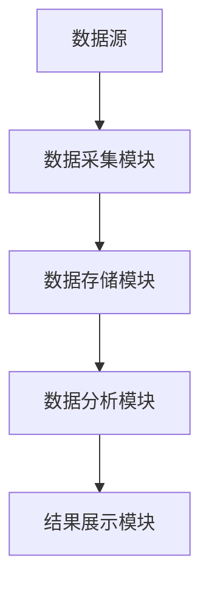
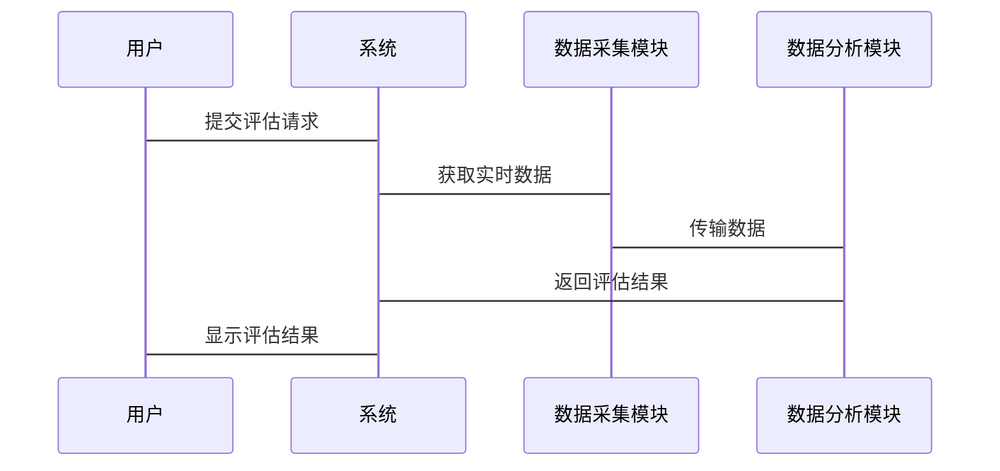

                 

# 股市估值在跨境数字资产评估中的应用

## 关键词：股市估值、数字资产评估、跨境评估、机器学习、数学模型、系统架构

## 摘要：  
随着全球经济一体化的深入和数字资产的崛起，股市估值方法在跨境数字资产评估中的应用变得越来越重要。本文系统地探讨了如何将传统股市估值方法与现代数字资产评估相结合，重点分析了数字资产的特性、估值模型的构建、算法优化以及跨境评估中的挑战。通过详细讲解背景、核心概念、算法原理和实际案例，本文为读者提供了一套完整的数字资产评估框架，帮助投资者在复杂多变的数字资产市场中做出明智决策。

---

# 第1章: 数字资产评估的背景与挑战

## 1.1 数字资产评估的背景介绍

### 1.1.1 传统资产评估方法的局限性
传统资产评估方法（如市盈率、市净率等）在应对数字资产时显得力不从心，因为数字资产具有去中心化、透明性和全球流动性等特性。  
例如，比特币和以太坊等数字资产的价值波动剧烈，传统估值模型难以捕捉其动态变化。

### 1.1.2 数字资产的定义与特点
数字资产是指以区块链技术为基础的虚拟资产，具有以下特点：
- **去中心化**：不受单一机构控制。
- **透明性**：区块链记录公开可查。
- **全球流动性**：可以在全球范围内自由交易。
- **技术驱动**：价值与技术创新密切相关。

### 1.1.3 跨境数字资产评估的复杂性
跨境评估需要考虑汇率波动、法律差异和市场分割等因素。例如，比特币在不同国家的交易价格可能因监管政策而异。

## 1.2 股市估值方法的演变

### 1.2.1 传统股市估值方法概述
传统股市估值方法主要包括基本面分析和技术分析。基本面分析关注企业的财务数据（如收入、利润），技术分析关注价格走势和交易量。

### 1.2.2 数字经济时代估值方法的创新
数字资产的兴起催生了新的估值方法，如基于区块链网络效应的估值模型和基于机器学习的时间序列分析。

### 1.2.3 股市估值在数字资产评估中的应用前景
数字资产的估值需要结合技术和市场因素，股市估值方法提供了重要的参考框架。

## 1.3 本章小结
本章介绍了数字资产评估的背景、特点以及股市估值方法的演变，为后续分析奠定了基础。

---

# 第2章: 股市估值的核心概念与数学模型

## 2.1 股市估值的核心概念

### 2.1.1 股票内在价值的定义
股票的内在价值是其未来现金流的现值。例如，使用现金流折现模型（DCF）评估股票价值。

### 2.1.2 市场价值与内在价值的关系
市场价值受情绪和外部因素影响，而内在价值反映企业的实际盈利能力。

### 2.1.3 股市估值的关键影响因素
包括宏观经济环境、行业趋势、公司基本面和技术指标等。

## 2.2 股市估值的数学模型

### 2.2.1 市盈率（P/E）模型
$$ P/E = \frac{Price}{Earnings} $$
市盈率反映了股票价格与每股收益的比率，用于衡量股票的估值水平。

### 2.2.2 市净率（P/B）模型
$$ P/B = \frac{Price}{Book\ Value} $$
市净率适用于评估资产-heavy的公司，如银行和房地产公司。

### 2.2.3 现金流折现模型（DCF）
$$ V = \sum_{t=1}^{n} \frac{CF_t}{(1+r)^t} + \frac{TV}{(1+r)^n} $$
DCF模型通过将未来现金流折现，计算出股票的内在价值。

## 2.3 数字资产评估的特殊性

### 2.3.1 数字资产的价值驱动因素
数字资产的价值受技术发展、市场需求和监管政策影响。

### 2.3.2 数字资产评估中的技术依赖性
数字资产的估值需要结合区块链技术、智能合约和网络效应等技术因素。

### 2.3.3 跨境评估中的法律与监管因素
不同国家对数字资产的监管政策差异影响其估值。

## 2.4 本章小结
本章详细介绍了股市估值的核心概念和数学模型，并分析了数字资产评估的特殊性。

---

# 第3章: 股市估值在数字资产评估中的应用

## 3.1 数字资产的分类与特性

### 3.1.1 数字货币（如比特币、以太坊）
比特币和以太坊是最常见的数字货币，具有去中心化和可编程性特点。

### 3.1.2 数字股权（如STO）
数字股权是以区块链为基础的证券化资产，具有透明性和高效性。

### 3.1.3 数字收藏品（如NFT）
NFT（非同质化代币）用于表示数字艺术品、音乐和视频等收藏品的所有权。

## 3.2 股市估值方法的适用性分析

### 3.2.1 基于历史数据分析的估值
通过分析数字资产的历史价格和交易量，预测未来价格走势。

### 3.2.2 基于市场情绪的估值
利用市场情绪指标（如社交媒体 sentiment）辅助估值。

### 3.2.3 基于技术指标的估值
使用相对强弱指数（RSI）和移动平均收敛散度（MACD）等技术指标进行估值。

## 3.3 跨境评估中的汇率与市场差异

### 3.3.1 汇率波动对数字资产评估的影响
数字资产价格受汇率波动影响，需结合汇率进行跨市场估值。

### 3.3.2 不同市场的估值差异
不同市场的监管政策和交易活跃度导致数字资产评估差异。

### 3.3.3 跨境交易中的风险对冲策略
通过套期保值和分散投资降低跨境评估中的风险。

## 3.4 本章小结
本章分析了数字资产的分类、股市估值方法的适用性以及跨境评估中的挑战。

---

# 第4章: 数字资产评估的算法与模型

## 4.1 基于机器学习的数字资产评估

### 4.1.1 机器学习在股市估值中的应用
机器学习算法（如随机森林、神经网络）可以用于预测数字资产价格。

### 4.1.2 常见算法
- **线性回归**：用于简单线性关系建模。
- **随机森林**：用于特征重要性分析和非线性关系建模。
- **神经网络**：用于复杂时间序列预测。

### 4.1.3 深度学习模型
深度学习模型（如LSTM）擅长处理时间序列数据，适合数字资产价格预测。

## 4.2 数字资产评估的数学模型

### 4.2.1 时间序列分析模型
$$ ARIMA(p, d, q) $$
ARIMA模型用于分析和预测数字资产价格的时间序列。

### 4.2.2 矩阵分解模型（如主成分分析）
主成分分析（PCA）用于降维和特征提取。

### 4.2.3 聚类分析模型
聚类分析用于将相似的数字资产分为同一类别，便于批量评估。

## 4.3 算法实现与优化

### 4.3.1 算法实现步骤
1. 数据预处理：清洗和归一化数据。
2. 特征提取：选择关键特征。
3. 模型训练：训练机器学习模型。
4. 模型评估：验证模型准确性和稳定性。

### 4.3.2 算法优化与调参
通过网格搜索和交叉验证优化模型参数。

### 4.3.3 算法效果评估
使用均方误差（MSE）和R平方值评估模型性能。

## 4.4 本章小结
本章介绍了基于机器学习的数字资产评估算法，并详细讲解了实现步骤和优化方法。

---

# 第5章: 数字资产评估系统的架构与实现

## 5.1 系统架构设计

### 5.1.1 系统功能设计
- 数据采集模块：收集数字资产价格和市场数据。
- 数据分析模块：应用机器学习算法进行估值。
- 结果展示模块：可视化评估结果。

### 5.1.2 系统架构图

### 5.1.3 系统接口设计
- 数据接口：与交易所API对接。
- 用户接口：提供交互式评估结果展示。

## 5.2 系统实现细节

### 5.2.1 数据采集模块
使用API接口实时采集比特币、以太坊等数字资产价格数据。

### 5.2.2 数据分析模块
应用LSTM模型进行时间序列预测，生成评估结果。

### 5.2.3 系统交互流程

## 5.3 本章小结
本章详细设计了数字资产评估系统的架构，并展示了其实现细节。

---

# 第6章: 项目实战与案例分析

## 6.1 案例分析：比特币的估值

### 6.1.1 数据准备
收集比特币过去5年的价格数据和市场指标。

### 6.1.2 模型训练
使用ARIMA模型进行价格预测。

### 6.1.3 结果分析
对比预测结果与实际价格，验证模型的有效性。

## 6.2 实际应用中的注意事项

### 6.2.1 数据质量的重要性
确保数据准确性和完整性。

### 6.2.2 模型的可解释性
选择可解释的模型以提高评估结果的可信度。

### 6.2.3 风险管理
结合市场波动和模型预测结果制定投资策略。

## 6.3 本章小结
本章通过比特币的案例分析，展示了数字资产评估的实际应用。

---

# 第7章: 总结与最佳实践

## 7.1 本章总结
本文系统地探讨了股市估值在跨境数字资产评估中的应用，分析了数字资产的特性、估值模型的构建以及系统的实现。

## 7.2 最佳实践 tips

### 7.2.1 数据驱动决策
重视数据质量和多样性。

### 7.2.2 技术与业务结合
将技术分析与基本面分析相结合。

### 7.2.3 风险管理
建立有效的风险对冲机制。

## 7.3 未来研究方向
- 更复杂的机器学习模型。
- 跨境评估中的多因素模型。
- 区块链技术的进一步创新。

## 7.4 本章小结
本文总结了主要观点，并提出了未来的研究方向。

---

# 结语

股市估值在跨境数字资产评估中的应用是一个充满挑战但也充满机遇的领域。通过结合传统估值方法和现代技术手段，我们可以更准确地评估数字资产的价值。希望本文能为读者提供有价值的参考，帮助他们在数字资产市场中取得成功。

--- 

**关键词：股市估值、数字资产评估、跨境评估、机器学习、数学模型、系统架构**

