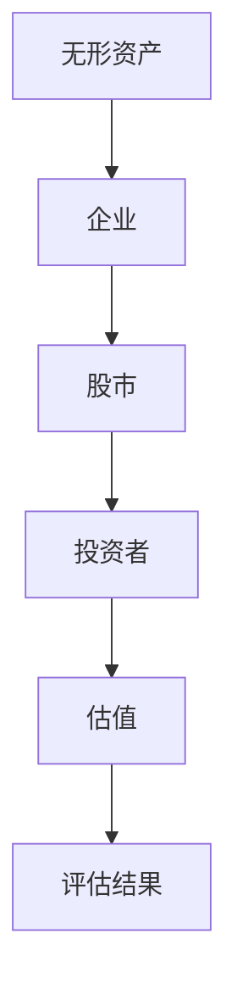
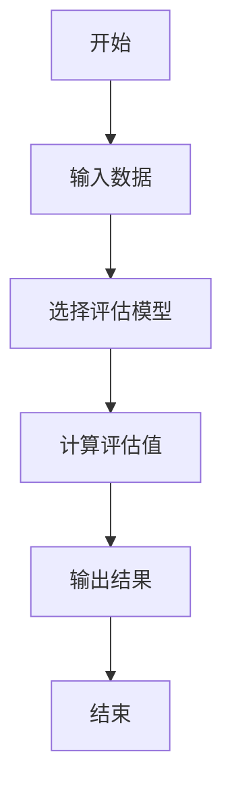
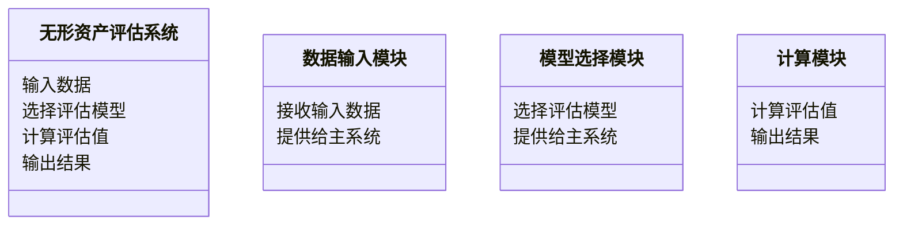
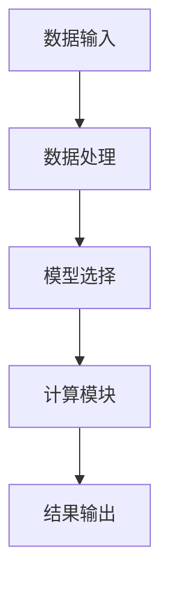
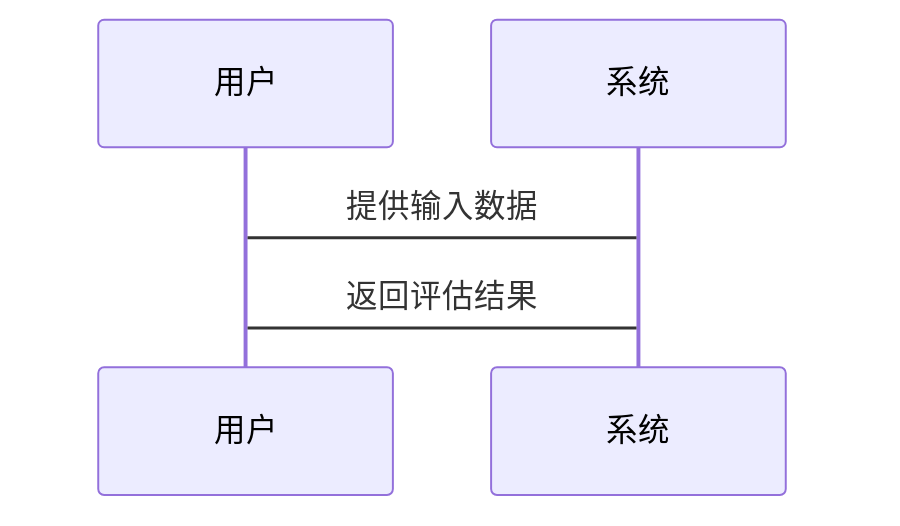

                 


# 股市估值在跨境无形资产评估中的应用

## 关键词：股市估值、无形资产评估、跨境、资产评估、DCF模型、EV/EBITDA模型

## 摘要：本文探讨了股市估值在跨境无形资产评估中的应用，分析了无形资产的核心要素、评估模型及其在股市中的影响。通过实际案例，展示了如何利用数学模型和系统设计进行无形资产评估，帮助投资者和企业更好地进行跨境资产管理和决策。

---

# 第一部分: 股市估值在跨境无形资产评估中的应用概述

# 第1章: 股市估值与跨境无形资产评估的背景介绍

## 1.1 问题背景与问题描述

### 1.1.1 股市估值的基本概念
股市估值是对企业未来现金流的预测和贴现，通常用于评估企业的内在价值。常见的估值方法包括DCF模型和EV/EBITDA模型。

### 1.1.2 无形资产的定义与特征
无形资产是指没有物理形态的资产，如专利、商标、版权等。其价值通常难以直接量化，需要通过专业方法进行评估。

### 1.1.3 跨境无形资产评估的复杂性
跨境无形资产评估涉及多个国家的法律、税务和市场环境，增加了评估的复杂性。

## 1.2 股市估值与无形资产评估的联系
### 1.2.1 股市估值在无形资产评估中的作用
股市估值帮助投资者判断企业无形资产的价值，影响企业的市场表现。

### 1.2.2 无形资产对股市估值的影响
无形资产是企业价值的重要组成部分，影响企业的市值和投资者的决策。

### 1.2.3 跨境背景下无形资产评估的独特性
跨境评估需要考虑汇率、税收等因素，增加了评估的复杂性。

## 1.3 无形资产评估的核心要素与概念结构
### 1.3.1 无形资产的核心要素分析
包括法律权属、市场价值、技术先进性等。

### 1.3.2 无形资产评估的边界与外延
明确评估的范围和限制，避免遗漏或过度评估。

### 1.3.3 概念结构与核心要素的对比分析
通过对比分析，明确无形资产评估的关键因素。

## 1.4 本章小结
本章介绍了股市估值和无形资产评估的基本概念，分析了它们的联系和跨境评估的复杂性。

---

# 第2章: 股市估值与无形资产评估的核心概念与联系

## 2.1 核心概念原理

### 2.1.1 无形资产评估的基本原理
基于DCF模型和市场比较法，评估无形资产的未来收益。

### 2.1.2 股市估值的数学模型
DCF模型和EV/EBITDA模型是常用的估值工具。

### 2.1.3 无形资产评估的经济学基础
包括机会成本、市场供需等经济学原理。

## 2.2 核心概念属性特征对比分析
### 2.2.1 股市估值与无形资产评估的属性对比
从模型、数据来源、评估周期等方面进行对比。

### 2.2.2 无形资产评估的核心特征
包括不确定性、依赖性、时间敏感性。

### 2.2.3 概念结构与核心要素的对比分析
通过对比分析，明确无形资产评估的关键因素。

## 2.3 实体关系图（ER图）架构


## 2.4 本章小结
本章详细分析了股市估值与无形资产评估的核心概念及其联系，通过ER图展示了它们的关系。

---

# 第3章: 无形资产评估的算法原理与数学模型

## 3.1 无形资产评估的主要算法

### 3.1.1 基于DCF模型的评估算法
通过预测未来现金流并贴现，评估企业价值。

### 3.1.2 基于EV/EBITDA模型的评估算法
通过比较可比公司的EV/EBITDA倍数，估算企业价值。

### 3.1.3 基于市场比较法的评估算法
通过比较市场交易案例，评估资产价值。

## 3.2 算法原理的数学模型与公式

### 3.2.1 DCF模型的数学公式
$$DCF = \sum_{t=1}^{n} \frac{CF_t}{(1 + r)^t} + \frac{TV}{(1 + r)^n}$$

### 3.2.2 EV/EBITDA模型的数学公式
$$EV = \frac{EBITDA \times TV}{N}$$

### 3.2.3 市场比较法的数学公式
$$V = \frac{\sum_{i=1}^{n} V_i}{n}$$

## 3.3 算法流程图


## 3.4 本章小结
本章介绍了常用的无形资产评估算法及其数学模型，通过流程图展示了评估过程。

---

# 第4章: 系统分析与架构设计方案

## 4.1 项目背景与目标

### 4.1.1 项目背景介绍
随着全球化的发展，跨境无形资产评估的需求日益增加。

### 4.1.2 项目目标与范围
开发一个基于股市估值的无形资产评估系统，支持跨境评估。

## 4.2 系统功能设计

### 4.2.1 领域模型类图


### 4.2.2 系统架构图


### 4.2.3 系统接口设计
API接口用于数据输入、模型选择和结果输出。

### 4.2.4 系统交互流程


## 4.3 本章小结
本章设计了一个基于股市估值的无形资产评估系统，展示了系统的功能模块和架构设计。

---

# 第5章: 项目实战

## 5.1 环境安装

### 5.1.1 安装Python
```bash
python --version
pip install numpy pandas
```

## 5.2 系统核心实现源代码

### 5.2.1 DCF模型实现
```python
import numpy as np
def calculate_dcf(cash_flows, discount_rate, terminal_value):
    n = len(cash_flows)
    dcf = 0
    for t in range(n):
        dcf += cash_flows[t] / (1 + discount_rate)**t
    dcf += terminal_value / (1 + discount_rate)**n
    return dcf
```

### 5.2.2 EV/EBITDA模型实现
```python
def calculate_ev_ebitda(ebitda, tv, n):
    ev = (ebitda * tv) / n
    return ev
```

## 5.3 代码应用解读与分析

### 5.3.1 DCF模型应用
```python
cash_flows = [100, 150, 200, 250]
discount_rate = 0.1
terminal_value = 500
dcf_value = calculate_dcf(cash_flows, discount_rate, terminal_value)
print("DCF Value:", dcf_value)
```

### 5.3.2 EV/EBITDA模型应用
```python
ebitda = 100
tv = 200
n = 5
ev_value = calculate_ev_ebitda(ebitda, tv, n)
print("EV Value:", ev_value)
```

## 5.4 实际案例分析与详细讲解剖析

### 5.4.1 案例介绍
以一家跨国科技公司为例，评估其专利价值。

### 5.4.2 数据收集与处理
收集公司的财务数据和市场数据。

### 5.4.3 模型应用与结果分析
应用DCF和EV/EBITDA模型，计算无形资产价值。

## 5.5 项目小结
通过实际案例展示了如何应用DCF和EV/EBITDA模型进行无形资产评估。

---

# 第6章: 总结与最佳实践

## 6.1 总结

### 6.1.1 核心内容回顾
股市估值在跨境无形资产评估中的应用，涉及多个方面的知识和技能。

### 6.1.2 重要性与价值
正确评估无形资产，有助于企业决策和投资者判断。

## 6.2 最佳实践

### 6.2.1 选择合适的模型
根据具体情况选择合适的评估模型。

### 6.2.2 数据的准确性和完整性
确保数据的准确性和完整性，避免评估误差。

### 6.2.3 结合实际背景
考虑跨境评估的法律和税务因素。

## 6.3 小结
正确应用股市估值方法，可以有效评估无形资产，提升企业价值。

---

# 附录: 拓展阅读与工具推荐

## 附录A: 相关文献推荐
推荐几本关于资产评估和股市估值的经典书籍和论文。

## 附录B: 工具推荐
推荐一些常用的财务分析和资产评估工具，如Excel、Python库等。

---

# 结语

股市估值在跨境无形资产评估中的应用是一个复杂但重要的领域，通过系统的分析和实践，可以帮助企业和投资者更好地进行资产管理和决策。希望本文能为读者提供有价值的信息和指导。

