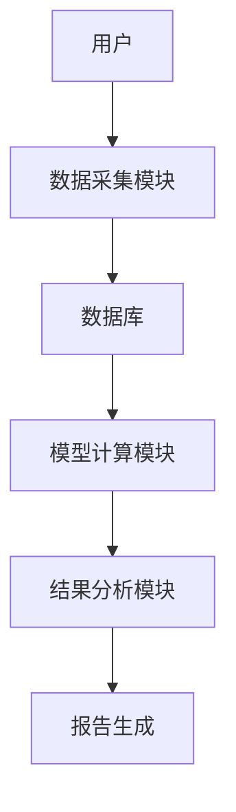

                 


# 股市估值在跨境无形资产转让定价中的应用

> 关键词：股市估值，跨境无形资产，转让定价，DCF模型，相对估值法

> 摘要：本文探讨了股市估值在跨境无形资产转让定价中的应用，分析了无形资产的估值方法，结合市场数据和数学模型，详细讲解了如何利用股市估值进行定价，并通过实际案例展示其应用。

---

## 第一部分：背景介绍

### 第1章：股市估值与跨境无形资产转让定价概述

#### 1.1 无形资产的定义与分类
- **无形资产**：包括商标、专利、版权、商誉等。
- **分类**：可分为可确指无形资产（如专利）和不可确指无形资产（如商誉）。

#### 1.2 股市估值的基本概念
- **股市估值**：通过市场数据评估公司或资产价值的方法，常用市盈率（P/E）、市净率（P/B）等指标。
- **作用**：帮助确定资产的市场价值，指导投资决策。

#### 1.3 跨境无形资产转让定价的背景与意义
- **背景**：跨国公司在全球范围内配置资产，需合理定价以符合税务和法规要求。
- **意义**：确保定价的公允性，避免双重征税，提升企业价值。

### 第2章：问题背景与问题描述

#### 2.1 无形资产转让定价的核心问题
- 如何确定公允价值？
- 如何应对不同国家的税务政策？

#### 2.2 股市估值在其中的作用与挑战
- **作用**：提供市场参考，帮助确定合理价格。
- **挑战**：市场波动、数据获取难度、跨国法规差异。

---

## 第二部分：核心概念与联系

### 第3章：核心概念原理

#### 3.1 股市估值模型
- **相对估值法**：比较可比公司，计算比率（如EV/EBITDA）。
- **绝对估值法**：DCF模型，计算未来现金流的现值。

#### 3.2 无形资产价值评估模型
- **DCF模型**：预测未来现金流，折现计算现值。
- **可比公司法**：通过相似公司的交易价格进行对比。

#### 3.3 股市估值与无形资产定价的结合
- **市场数据应用**：利用股市数据调整估值模型。
- **市场反映**：无形资产的市场表现影响其定价。

---

## 第三部分：算法原理讲解

### 第4章：DCF模型应用

#### 4.1 DCF模型公式
$$\text{企业价值} = \sum_{t=1}^{n} \frac{\text{现金流}_t}{(1 + r)^t} + \frac{\text{残值}}{(1 + r)^n}$$

#### 4.2 实例分析
假设某公司未来5年现金流分别为100万、120万、150万、180万、200万，折现率r=10%。

计算各年的现值：
- 第1年：100万 / 1.1 ≈ 90.91万
- 第2年：120万 / 1.21 ≈ 99.17万
- 第3年：150万 / 1.331 ≈ 112.72万
- 第4年：180万 / 1.4641 ≈ 122.85万
- 第5年：200万 / 1.6105 ≈ 124.19万

总现值 = 90.91 + 99.17 + 112.72 + 122.85 + 124.19 ≈ 550.84万

---

## 第四部分：系统分析与架构设计

### 第5章：系统架构设计

#### 5.1 系统功能模块
- 数据采集模块：收集市场数据和资产信息。
- 模型计算模块：应用DCF模型计算价值。
- 结果分析模块：生成报告和建议。

#### 5.2 系统架构图



---

## 第五部分：项目实战

### 第6章：项目实战分析

#### 6.1 环境安装
- 安装Python和相关库（Pandas, NumPy, Scipy）。
- 数据来源：股票市场数据，如Yahoo Finance。

#### 6.2 核心代码实现
```python
import pandas as pd
import numpy as np

# 示例数据
cash_flows = [100, 120, 150, 180, 200]
discount_rate = 0.1

# 计算现值
pv = []
for i in range(len(cash_flows)):
    cf = cash_flows[i]
    pv.append(cf / (1 + discount_rate)**(i+1))

total_pv = sum(pv)
print("企业价值现值：", total_pv)
```

#### 6.3 案例分析
某跨国公司将一项专利技术转让给子公司，使用DCF模型评估其价值，确保定价符合市场标准。

---

## 第六部分：小结与展望

### 第7章：小结与展望

#### 7.1 全文小结
- 结合股市估值和无形资产定价，利用数学模型和市场数据，确保定价合理公允。
- 系统架构和代码实现为实际应用提供了技术支持。

#### 7.2 展望
- 结合AI技术优化估值模型。
- 进一步研究跨国法规对定价的影响。

---

通过以上步骤，我们可以系统地理解股市估值在跨境无形资产转让定价中的应用，从理论到实践，确保定价的合理性和合规性。

