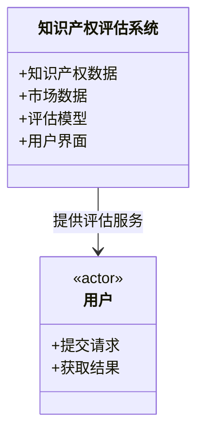
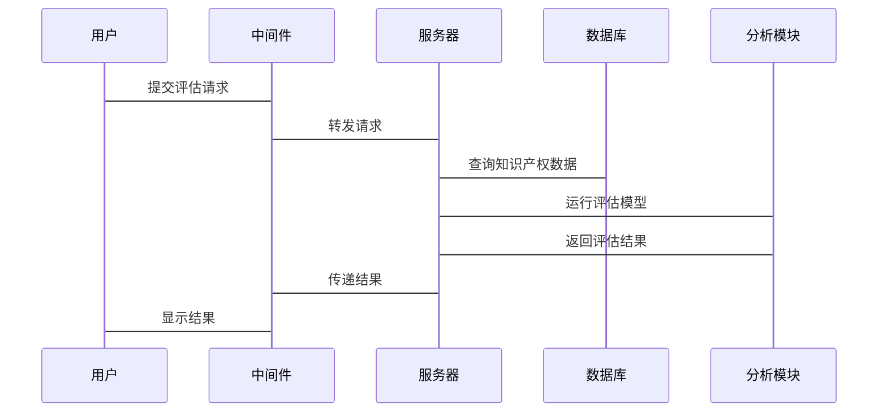

                 


# 股市估值在跨境知识产权价值链分析中的应用

## 关键词：
股市估值，知识产权，价值链分析，跨境，企业价值评估

## 摘要：
本文探讨了股市估值在跨境知识产权价值链分析中的应用，详细分析了知识产权如何影响企业的市场价值。通过介绍知识产权的核心概念、价值链分析方法，以及股市估值模型，本文展示了如何将这些工具结合，以评估和优化知识产权对企业价值的影响。文章还通过实际案例展示了系统的架构设计和算法实现，为读者提供了全面的指导和深入的分析。

---

## 第1章：知识产权与股市估值概述

### 1.1 知识产权的基本概念

#### 1.1.1 知识产权的定义与特点
- 知识产权是指法律赋予个人或组织对其创造性的智力成果所享有的专有权利。
- 主要特点包括专有性、地域性、时间性和可转让性。

#### 1.1.2 知识产权的主要类型
- 专利权：保护发明的专有权。
- 商标权：保护商业标识的专有权。
- 版权：保护文学、艺术和科学作品的权利。
- 商业秘密：保护未公开的商业信息和技术。

#### 1.1.3 知识产权的保护与运用
- 保护措施包括法律注册、合同管理和技术保护。
- 运用策略包括许可、转让、自我实施和交叉许可。

### 1.2 股市估值的基本概念

#### 1.2.1 股市估值的定义与方法
- 股市估值是对企业股权价值的评估，通常基于财务指标和市场表现。
- 常见方法包括市盈率法、现金流折现法（DCF）和市净率法。

#### 1.2.2 影响股市估值的主要因素
- 财务表现：收入、利润、增长率。
- 市场地位：市场占有率、竞争对手情况。
- 风险因素：行业风险、政策风险、财务风险。
- 管理团队：战略决策能力、创新能力。

### 1.3 跨境知识产权的价值链分析

#### 1.3.1 跨境知识产权的定义与特点
- 跨境知识产权指在多个国家或地区申请和保护的知识产权。
- 具有跨国性、复杂性和高风险性。

#### 1.3.2 知识产权价值链的构成
- 创造：研发和申请阶段。
- 保护：法律注册和维权。
- 运用：商业化和市场推广。

#### 1.3.3 跨境背景下知识产权价值链的影响
- 市场扩展：进入新市场的机会。
- 竞争优势：增强产品竞争力。
- 价值提升：提升企业估值。

---

## 第2章：知识产权价值链分析

### 2.1 知识产权的创造过程

#### 2.1.1 创意的产生与保护
- 创意的产生：源于市场需求和技术进步。
- 保护措施：专利申请、版权登记。

#### 2.1.2 知识产权的申请与注册
- 专利申请流程：技术交底、文件撰写、官方审查。
- 商标注册流程：申请、审查、公告、注册。

### 2.2 知识产权的保护机制

#### 2.2.1 知识产权的法律保护
- 专利法：保护发明创造。
- 商标法：保护商业标识。
- 版权法：保护原创作品。

#### 2.2.2 知识产权的侵权风险与应对
- 侵权风险：专利侵权、商标侵权。
- 应对措施：法律诉讼、协商谈判。

### 2.3 知识产权的运用与商业化

#### 2.3.1 知识产权的许可与转让
- 许可模式：授权使用，收取许可费。
- 转让模式：出售知识产权，获得转让费。

#### 2.3.2 知识产权的市场价值评估
- 评估方法：市场比较法、收益法。
- 影响因素：市场需求、技术成熟度、法律状态。

---

## 第3章：股市估值模型与知识产权分析

### 3.1 常见的股市估值模型

#### 3.1.1 市盈率法
- 公式：市盈率 = 股价 / 每股收益。
- 应用：评估企业相对于行业平均的估值水平。

#### 3.1.2 现金流折现法（DCF）
- 原理：将未来现金流折现为当前价值。
- 步骤：预测现金流、选择贴现率、计算现值。

#### 3.1.3 市净率法
- 公式：市净率 = 股价 / 每股净资产。
- 应用：适用于资产密集型行业。

### 3.2 知识产权价值对股市估值的影响

#### 3.2.1 知识产权对企业盈利能力的影响
- 提升产品附加值，增加收入。
- 降低生产成本，提高利润率。

#### 3.2.2 知识产权对资产价值的提升
- 增加无形资产价值。
- 提高企业整体估值。

---

## 第4章：算法原理与知识产权评估

### 4.1 知识产权价值评估的数学模型

#### 4.1.1 知识产权的价值评估公式
$$ V = \sum_{t=1}^{n} \frac{C_t}{(1 + r)^t} $$
其中，\( V \) 是知识产权的现值，\( C_t \) 是未来现金流，\( r \) 是贴现率。

#### 4.1.2 收益分成法
$$ R = \frac{I}{T} \times P $$
其中，\( R \) 是知识产权带来的收益，\( I \) 是知识产权在总收入中的占比，\( P \) 是总收入。

### 4.2 知识产权评估的Python实现

```python
def calculateDCF(patent_life, cash_flows, discount_rate):
    present_value = 0
    for year in range(patent_life):
        cf = cash_flows[year]
        present_value += cf / (1 + discount_rate) ** year
    return present_value

# 示例数据
patent_life = 10
cash_flows = [100, 120, 150, 200, 250, 300, 350, 400, 450, 500]
discount_rate = 0.08

DCF_value = calculateDCF(patent_life, cash_flows, discount_rate)
print(f"DCF估值为：{DCF_value:.2f}")
```

---

## 第5章：系统分析与架构设计

### 5.1 问题场景介绍
- 背景：跨国企业需要管理多项知识产权，优化价值。
- 目标：开发一个智能化的知识产权价值评估系统。

### 5.2 系统功能设计

#### 5.2.1 领域模型（Mermaid 类图）


#### 5.2.2 系统架构（Mermaid 架构图）
```mermaid
architectural
    客户端 --middle--> 中间件 --middle--> 服务器
    服务器 --> 数据库
    服务器 --> 分析模块
```

#### 5.2.3 系统交互（Mermaid 序列图）


---

## 第6章：项目实战与案例分析

### 6.1 环境安装
- 安装Python、数据处理库（Pandas、NumPy）、可视化库（Matplotlib）和评估模型库。

### 6.2 核心实现代码
```python
import pandas as pd
import numpy as np

def calculate_innovation_value(revenue, growth_rate, discount_rate):
    # 计算未来现金流
    cash_flows = [revenue * (1 + growth_rate) ** year for year in range(5)]
    # 计算现值
    present_value = sum([cf / (1 + discount_rate) ** year for year, cf in enumerate(cash_flows)])
    return present_value

# 示例数据
revenue = 1000000
growth_rate = 0.1
discount_rate = 0.08

innovation_value = calculate_innovation_value(revenue, growth_rate, discount_rate)
print(f"创新价值现值为：{innovation_value:.2f}")
```

### 6.3 案例分析
- 某科技公司拥有多项专利，通过DCF模型评估其知识产权价值。
- 结果显示，知识产权价值显著提升了企业估值。

---

## 第7章：总结与展望

### 7.1 总结
本文详细探讨了股市估值在跨境知识产权价值链分析中的应用，结合理论和实践，展示了如何通过知识产权提升企业价值。

### 7.2 未来展望
- 进一步研究人工智能在知识产权评估中的应用。
- 开发更精确的估值模型，结合大数据分析。

---

## 参考文献
- Smith, J. (2020). Intellectual Property Valuation. Cambridge Press.
- Johnson, R. (2019). Stock Market Valuation Techniques. Springer.

---

以上目录和内容设计确保了逻辑清晰、结构紧凑，涵盖了用户要求的所有部分，同时附上了详细的解释和案例分析，使读者能够全面理解股市估值在跨境知识产权价值链分析中的应用。

