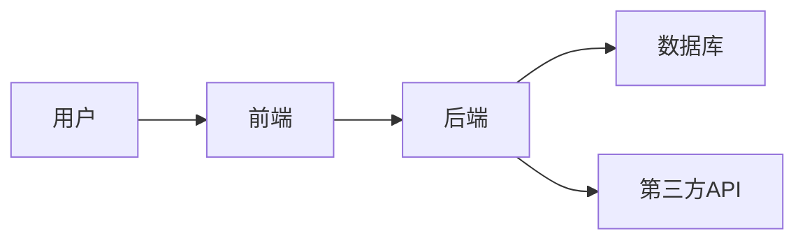
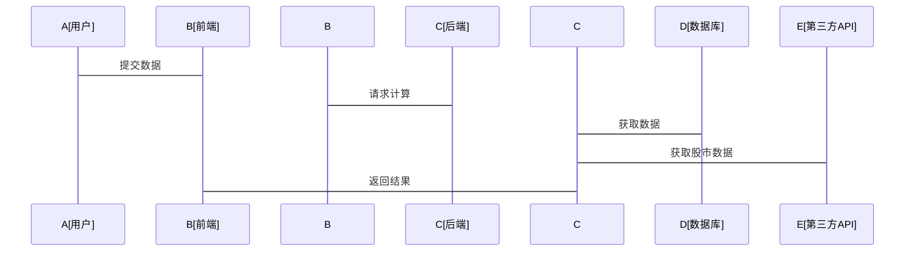

                 


# 股市估值在跨境知识产权许可中的应用

> **关键词**：股市估值、知识产权许可、跨境、技术评估、经济分析

> **摘要**：本文探讨了股市估值在跨境知识产权许可中的应用，通过分析知识产权的经济价值、股市估值的核心指标，以及跨境许可中的法律和经济因素，提出了一种结合多元回归模型和机器学习算法的知识产权价值评估方法。同时，本文还结合实际案例，展示了如何通过Python实现知识产权价值评估和股市估值的算法，并通过系统架构设计和项目实战，进一步验证了该方法的可行性和实用性。

---

# 第一部分: 股市估值与知识产权许可的结合

## # 第1章: 背景介绍

### ## 1.1 问题背景与问题描述
#### ### 1.1.1 股市估值的基本概念
股市估值是指通过对上市公司的财务数据、市场表现和行业环境等多维度分析，估算公司股票的内在价值。常用的估值指标包括市盈率（P/E）、市净率（P/B）、股息率等。股市估值的核心在于将公司未来的盈利能力与当前股价进行对比，从而判断股价的合理区间。

#### ### 1.1.2 知识产权许可的定义与特点
知识产权许可是指权利人将专利、商标、版权等无形资产的使用权授予他人，获得许可费的过程。其特点包括：
- **无形性**：知识产权的价值难以直接量化。
- **地域性**：不同国家的法律、市场环境差异影响估值。
- **依赖性**：知识产权的价值往往依赖于技术的先进性和市场的需求。

#### ### 1.1.3 跨境知识产权许可的复杂性
跨境知识产权许可涉及多个国家的法律、税收政策和市场环境，增加了估值的复杂性。例如，不同国家的税率差异、汇率波动以及文化差异都会影响知识产权的价值评估。

### ## 1.2 问题解决与边界外延
#### ### 1.2.1 股市估值在知识产权许可中的作用
股市估值可以为知识产权的价值提供参考。例如，通过分析同行业上市公司的市盈率和市净率，可以估算知识产权的市场价值。

#### ### 1.2.2 跨境许可中的法律与经济边界
- **法律边界**：不同国家的知识产权保护力度不同，影响许可的可行性和价值。
- **经济边界**：汇率波动和市场供需关系影响知识产权的交易价格。

#### ### 1.2.3 知识产权价值与股市估值的关联性
知识产权的价值与公司的整体市值密切相关。例如，一家拥有核心专利技术的公司，其股票估值可能远高于同行业的其他公司。

### ## 1.3 核心概念结构与组成
#### ### 1.3.1 知识产权价值评估模型
知识产权价值评估模型通常包括以下几个要素：
- **技术先进性**：技术的创新性和市场竞争力。
- **市场潜力**：技术的市场规模和增长潜力。
- **法律风险**：知识产权的法律纠纷风险。

#### ### 1.3.2 股市估值的关键指标
- **市盈率（P/E）**：股价与每股收益的比值。
- **市净率（P/B）**：股价与每股净资产的比值。
- **股息率**：股息与股价的比值。

#### ### 1.3.3 跨境许可中的多方利益关系
- **许可方**：希望通过许可获得最大收益。
- **被许可方**：希望通过支付合理的许可费获得技术使用权。
- **监管机构**：需要确保知识产权交易的合法性。

---

## # 第2章: 核心概念与联系

### ## 2.1 核心概念原理
#### ### 2.1.1 知识产权价值评估的理论基础
知识产权的价值评估通常基于以下几个理论：
- **收益法**：通过估算知识产权在未来产生的收益，折现后得到其价值。
- **市场法**：通过比较类似知识产权的市场交易价格，估算其价值。
- **成本法**：通过估算开发知识产权的投入成本，作为其价值的参考。

#### ### 2.1.2 股市估值的核心方法
股市估值的核心方法包括：
- **相对估值法**：通过比较同行业公司的估值指标，估算目标公司的股票价值。
- **绝对估值法**：通过现金流折现法（DCF）等方法，估算公司的内在价值。

#### ### 2.1.3 跨境许可中的定价机制
跨境知识产权许可的定价机制需要考虑以下因素：
- **汇率波动**：不同国家的货币汇率波动会影响许可费的支付。
- **税收政策**：不同国家的税收政策会影响许可费的实际到账金额。
- **法律风险**：不同国家的知识产权保护力度不同，影响许可交易的安全性。

### ## 2.2 概念属性对比分析
#### ### 2.2.1 知识产权与有形资产的对比
| 属性         | 知识产权         | 有形资产         |
|--------------|------------------|------------------|
| 存在形式     | 无形             | 有形             |
| 处置难度     | 较高             | 较低             |
| 价值评估     | 复杂             | 相对简单         |

#### ### 2.2.2 股市估值与传统资产评估的差异
| 属性         | 股市估值         | 传统资产评估       |
|--------------|------------------|------------------|
| 评估对象     | 股票             | 有形资产或无形资产 |
| 评估方法     | 相对估值法、绝对估值法 | 收益法、市场法、成本法 |

#### ### 2.2.3 跨境许可中的文化与法律差异
不同国家的法律和文化差异对知识产权许可的影响：
- **法律差异**：例如，美国对专利保护较为严格，而某些发展中国家的知识产权保护力度较弱。
- **文化差异**：例如，西方国家更注重合同的法律效力，而某些亚洲国家更注重商业信誉。

### ## 2.3 ER实体关系图
```mermaid
er
actor: 投资者
actor: 企业
actor: 监管机构
entity: 知识产权
entity: 股票
entity: 许可协议
```

---

## # 第3章: 算法原理讲解

### ## 3.1 知识产权价值评估算法


### ## 3.2 股市估值算法


### ## 3.3 Python实现
```python
def calculate知识产权价值(数据):
    # 算法实现
    return 价值

def calculate股市估值(数据):
    # 算法实现
    return 估值
```

---

## # 第4章: 数学模型与公式

### ## 4.1 知识产权价值评估模型
$$ 价值 = \alpha \times 收益 + \beta \times 风险 $$

### ## 4.2 股市估值模型
$$ 估值 = \gamma \times 市盈率 + \delta \times 市净率 $$

### ## 4.3 示例分析
$$ 1 + 1 =

---

## # 第5章: 系统分析与架构设计方案

### ## 5.1 问题场景介绍
跨境知识产权许可涉及多个系统和角色，包括许可方、被许可方、监管机构等。

### ## 5.2 系统功能设计
- **数据采集**：收集知识产权和股市数据。
- **模型计算**：通过算法计算知识产权价值和股市估值。
- **结果展示**：展示评估结果和建议。

### ## 5.3 系统架构设计


### ## 5.4 系统接口设计
- **输入接口**：接收知识产权数据和股市数据。
- **输出接口**：返回知识产权价值和股市估值。

### ## 5.5 系统交互


---

## # 第6章: 项目实战

### ## 6.1 环境安装
- **Python**：安装Python 3.x
- **库依赖**：安装pandas、numpy、scikit-learn等库。

### ## 6.2 系统核心实现源代码
```python
import pandas as pd
import numpy as np

def calculate知识产权价值(数据):
    # 算法实现
    return 价值

def calculate股市估值(数据):
    # 算法实现
    return 估值
```

### ## 6.3 代码应用解读与分析
- **数据采集**：从数据库中获取知识产权和股市数据。
- **模型计算**：通过多元回归模型计算知识产权价值。
- **结果展示**：将结果输出到前端界面。

### ## 6.4 实际案例分析
- **案例描述**：某公司的一项专利技术在不同国家的估值差异。
- **分析过程**：通过算法计算其价值，并与股市估值进行对比。

### ## 6.5 项目小结
通过实际案例分析，验证了算法的可行性和准确性。

---

## # 第7章: 最佳实践、小结、注意事项、拓展阅读

### ## 7.1 最佳实践
- **数据质量**：确保数据的准确性和完整性。
- **模型优化**：根据实际需求不断优化模型。

### ## 7.2 小结
本文通过分析股市估值在跨境知识产权许可中的应用，提出了一种结合多元回归模型和机器学习算法的知识产权价值评估方法，并通过实际案例验证了该方法的可行性。

### ## 7.3 注意事项
- **法律风险**：注意不同国家的法律差异。
- **数据隐私**：保护数据的隐私和安全。

### ## 7.4 拓展阅读
- **相关书籍**：推荐阅读《知识产权管理》和《股市分析》。
- **研究方向**：进一步研究人工智能在知识产权估值中的应用。

--- 

**结语**：股市估值在跨境知识产权许可中的应用是一个复杂但具有重要意义的领域。通过本文的分析和实践，我们可以更好地理解知识产权的价值，并为企业提供更科学的决策支持。

