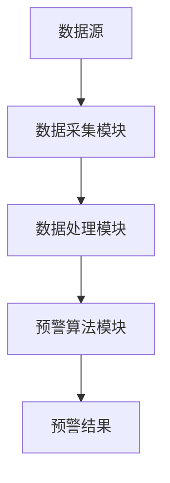

                 


# 股市估值在金融危机预警中的作用

## 关键词：股市估值、金融危机、预警系统、时间序列分析、机器学习

## 摘要：  
股市估值是衡量市场健康状况的重要指标，能够反映经济运行状况和潜在风险。通过分析股市估值的核心指标（如市盈率、市净率等）及其变化趋势，可以构建有效的金融危机预警系统。本文从理论基础、算法实现到系统设计，详细探讨股市估值在金融危机预警中的应用，并结合实际案例，展示如何利用技术手段提升预警能力。

---

# 目录

1. **背景介绍**  
   1.1 问题背景与定义  
   1.2 核心概念与联系  
   1.3 概念结构与核心要素  

2. **核心概念与联系分析**  
   2.1 核心概念的属性特征对比  
   2.2 ER实体关系图  

3. **算法原理**  
   3.1 基于时间序列分析的预警算法  
   3.2 算法实现与代码示例  

4. **系统分析与架构设计**  
   4.1 项目场景与需求分析  
   4.2 系统功能设计  
   4.3 系统架构设计  

5. **项目实战**  
   5.1 环境安装与数据准备  
   5.2 核心代码实现  
   5.3 案例分析与结果解读  

6. **总结与展望**  
   6.1 最佳实践与注意事项  
   6.2 研究成果与未来方向  

---

# 1. 背景介绍

## 1.1 问题背景与定义  
金融危机是指金融系统中发生的严重经济危机，通常表现为股市崩盘、银行破产、经济衰退等。股市估值是衡量市场健康状况的重要指标，包括市盈率（P/E）、市净率（P/B）等核心指标。这些指标能够反映市场的整体价值和潜在风险。

## 1.2 核心概念与联系  
股市估值与金融危机预警密切相关。通过分析股市估值的变化趋势，可以发现市场泡沫和潜在风险，从而提前发出预警信号。例如，市盈率过高可能意味着市场被高估，存在崩盘风险。

## 1.3 概念结构与核心要素  
股市估值预警系统的核心要素包括：  
- 数据采集：获取历史股价、 earnings等数据。  
- 指标计算：计算市盈率、市净率等估值指标。  
- 模型构建：建立时间序列模型，预测市场趋势。  

---

# 2. 核心概念与联系分析

## 2.1 核心概念的属性特征对比  
| 概念       | 属性特征                 |
|------------|--------------------------|
| 股市估值   | 市盈率、市净率等指标     |
| 金融危机预警 | 经济指标、市场波动等     |

## 2.2 ER实体关系图  
```mermaid
er
actor 股市估值指标
actor 金融危机预警系统
```

---

# 3. 算法原理

## 3.1 基于时间序列分析的预警算法  
时间序列分析是一种常用的方法，适用于预测市场趋势。以下是算法流程：  
1. 数据预处理：清洗数据，处理缺失值。  
2. 模型训练：使用ARIMA模型进行建模。  
3. 预测与预警：根据预测结果，判断是否发出预警信号。

## 3.2 算法实现与代码示例  
以下是一个简单的ARIMA模型实现：  

```python
import pandas as pd
from statsmodels.tsa.arima_model import ARIMA

# 数据准备
data = pd.read_csv('stock_data.csv')
train_data = data['price'].values

# 模型训练
model = ARIMA(train_data, order=(5,1,0))
model_fit = model.fit()

# 预测
forecast = model_fit.forecast(steps=30)
```

---

# 4. 系统分析与架构设计

## 4.1 项目场景与需求分析  
本项目旨在构建一个实时监控系统，通过分析股市估值指标，提前预警金融危机。系统需要具备数据采集、分析和预警功能。

## 4.2 系统功能设计  
- 数据采集模块：实时采集股价、 earnings等数据。  
- 指标计算模块：计算市盈率、市净率等指标。  
- 预警模块：基于时间序列分析，发出预警信号。  

## 4.3 系统架构设计  


---

# 5. 项目实战

## 5.1 环境安装与数据准备  
安装所需库：  
```bash
pip install pandas numpy statsmodels matplotlib
```

数据准备：获取历史股价数据，保存为CSV格式。

## 5.2 核心代码实现  
```python
import pandas as pd
import numpy as np
from statsmodels.tsa.arima_model import ARIMA
import matplotlib.pyplot as plt

# 数据读取
data = pd.read_csv('stock_data.csv')
prices = data['price'].values

# 划分训练集和测试集
train = prices[:800]
test = prices[800:]

# 模型训练
model = ARIMA(train, order=(5,1,0))
model_fit = model.fit()

# 预测
forecast = model_fit.forecast(steps=len(test))
forecast_values = forecast[0].values

# 可视化
plt.plot(test, label='实际值')
plt.plot(forecast_values, label='预测值')
plt.legend()
plt.show()
```

## 5.3 案例分析与结果解读  
通过分析预测结果，可以发现市场的潜在风险。例如，如果预测值显著偏离实际值，可能意味着市场存在泡沫，需要发出预警信号。

---

# 6. 总结与展望

## 6.1 最佳实践与注意事项  
- 数据质量是模型准确性的关键，需确保数据清洗和预处理。  
- 预警系统应结合多种指标和模型，提高预警的准确性。  

## 6.2 研究成果与未来方向  
本文通过时间序列分析，构建了股市估值预警系统。未来可以结合机器学习算法，进一步提升预警能力。

---

# 结语  
股市估值在金融危机预警中扮演着重要角色。通过技术手段，我们可以更准确地识别市场风险，为决策者提供有力支持。希望本文能够为相关研究和实践提供有价值的参考。

