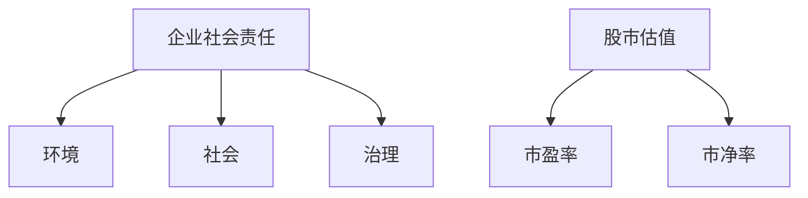
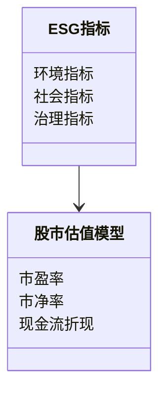
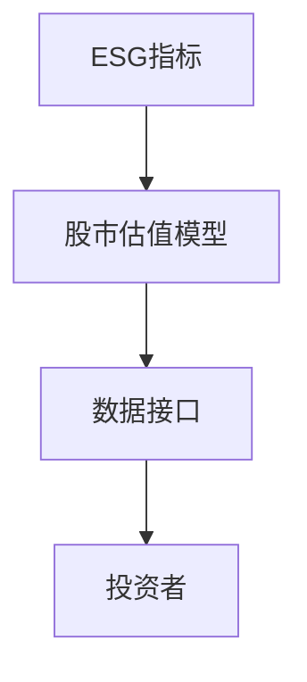

                 


# 股市估值对企业社会责任投资的影响

**关键词**：股市估值、企业社会责任、ESG投资、股票定价、社会价值

**摘要**：本文深入分析了股市估值与企业社会责任投资之间的关系，探讨了ESG（环境、社会、治理）投资对企业市值的影响。通过分析ESG指标与股市估值的核心概念、评价体系、理论与方法，结合实际案例，本文为投资者和企业提供了如何将企业社会责任与股市估值相结合的策略建议。同时，文章还提出了系统设计与架构方案，并通过项目实战展示了如何在实际投资中应用这些理论。

---

## 第一章: 股市估值与企业社会责任投资的背景介绍

### 1.1 问题背景与问题描述

#### 1.1.1 企业社会责任投资的定义与内涵
企业社会责任投资（ESG投资）是一种以环境、社会和治理为核心指标的投资策略，旨在通过评估企业的可持续发展能力来指导投资决策。ESG投资不仅关注企业的财务表现，还关注企业在环境保护、社会责任和公司治理方面的表现。

#### 1.1.2 股市估值的基本概念与方法
股市估值是指通过对企业的财务数据、市场地位、行业前景等因素进行分析，评估其股票的内在价值。常用的估值方法包括市盈率（P/E）、市净率（P/B）、股息率等。

#### 1.1.3 问题解决：企业社会责任如何影响股市估值
企业社会责任（ESG）的表现直接影响投资者对企业的信任度和长期价值的判断。优秀的ESG表现通常会提升企业的品牌形象，降低风险，从而提高股票的估值。

#### 1.1.4 问题的边界与外延
本文主要关注企业社会责任投资对股市估值的影响，不涉及其他类型的投资策略。研究范围包括企业的环境表现、社会责任履行情况以及治理结构。

#### 1.1.5 概念结构与核心要素组成
- **环境（E）**：包括碳排放、能源消耗、环保合规等。
- **社会（S）**：包括员工权益、社会责任项目、社区关系等。
- **治理（G）**：包括公司治理结构、董事会构成、高管薪酬等。

### 1.2 企业社会责任投资的现状与趋势

#### 1.2.1 全球ESG投资的发展历程
随着全球气候变化问题的加剧，ESG投资逐渐成为全球关注的焦点。近年来，全球ESG基金规模持续增长，尤其是在欧洲和北美地区。

#### 1.2.2 中国股市中的ESG投资现状
在中国，ESG投资逐渐兴起，越来越多的投资者开始关注企业的社会责任表现。然而，与发达国家相比，中国ESG投资仍处于起步阶段。

#### 1.2.3 股市估值与ESG投资的关联性分析
研究表明，ESG表现优异的企业通常具有更高的股票估值，因为它们在风险管理、品牌价值和长期盈利能力方面具有优势。

---

## 第二章: 核心概念与联系

### 2.1 核心概念原理

#### 2.1.1 企业社会责任的内涵与外延
企业社会责任不仅包括企业的环境保护和社会责任，还包括公司的治理结构和透明度。良好的治理结构能够提升企业的管理水平，降低经营风险。

#### 2.1.2 股市估值的核心模型与方法
股市估值的核心模型包括DCF模型、市盈率模型等。这些模型能够帮助企业评估其股票的内在价值。

### 2.2 核心概念属性特征对比

#### 2.2.1 ESG指标的分类与特征
| 指标类别 | 特征 |
|----------|------|
| 环境（E） | 碳排放、能源消耗 |
| 社会（S） | 员工权益、社会责任 |
| 治理（G） | 董事会结构、高管薪酬 |

#### 2.2.2 股市估值指标的分类与特征
| 指标类别 | 特征 |
|----------|------|
| 市盈率（P/E） | 企业盈利能力 |
| 市净率（P/B） | 企业资产质量 |
| 股息率 | 股东回报率 |

#### 2.2.3 两者属性对比表格
| 指标 | ESG投资 | 股市估值 |
|------|---------|----------|
| 核心目标 | 提升企业社会责任表现 | 评估企业股票价值 |
| 关键因素 | 环境、社会、治理 | 财务数据、市场地位 |

### 2.3 ER实体关系图



---

## 第三章: ESG投资的评价体系

### 3.1 ESG投资的核心指标

#### 3.1.1 环境（Environmental）指标
环境指标包括碳排放、能源消耗、环保合规等。例如，某企业的碳排放量可以通过国际标准进行评估。

#### 3.1.2 社会（Social）指标
社会指标包括员工权益、社会责任项目、社区关系等。例如，某企业每年投入多少资源用于社会责任项目。

#### 3.1.3 治理（Governance）指标
治理指标包括公司治理结构、董事会构成、高管薪酬等。例如，某企业的董事会是否包含独立董事。

### 3.2 ESG评价体系的构建

#### 3.2.1 指标权重的确定方法
指标权重的确定可以通过因子分析或层次分析法（AHP）进行。例如，环境指标的权重可能为40%，社会指标为30%，治理指标为30%。

#### 3.2.2 指标数据的获取与处理
指标数据可以通过企业年报、社会责任报告、第三方评级机构等渠道获取。数据处理包括标准化和加权计算。

#### 3.2.3 综合评价模型的构建
综合评价模型可以通过加权平均模型进行构建。例如：

$$
ESG评分 = 0.4 \times E + 0.3 \times S + 0.3 \times G
$$

---

## 第四章: 股市估值的理论与方法

### 4.1 股市估值的传统方法

#### 4.1.1 市盈率模型
市盈率模型通过企业的盈利能力和市场基准进行估值。例如：

$$
P/E = \frac{股票价格}{每股收益}
$$

#### 4.1.2 市净率模型
市净率模型通过企业的资产质量和市场基准进行估值。例如：

$$
P/B = \frac{股票价格}{每股净资产}
$$

### 4.2 现代股市估值方法

#### 4.2.1 现金流折现模型（DCF模型）
现金流折现模型通过预测企业的未来现金流进行估值。例如：

$$
股票价值 = \sum_{t=1}^{n} \frac{CF_t}{(1+r)^t}
$$

#### 4.2.2 股权资本成本模型
股权资本成本模型通过计算企业的资本成本进行估值。例如：

$$
r = \frac{D}{P_0 - D}
$$

### 4.3 ESG因素与股市估值模型的结合

#### 4.3.1 ESG因子的纳入
将ESG评分作为估值模型的修正因子。例如：

$$
调整后股票价值 = 股票价值 \times (1 + ESG评分)
$$

---

## 第五章: 系统分析与架构设计方案

### 5.1 系统功能设计

#### 5.1.1 领域模型


#### 5.1.2 系统架构设计


### 5.2 接口设计

#### 5.2.1 数据接口
数据接口包括企业ESG数据接口和市场数据接口。例如：

$$
ESG数据接口 = \{E, S, G\}
$$

---

## 第六章: 项目实战

### 6.1 环境安装

#### 6.1.1 软件安装
需要安装Python、Pandas、Matplotlib等工具。

#### 6.1.2 数据获取
从企业年报、社会责任报告等渠道获取ESG数据。

### 6.2 核心代码实现

#### 6.2.1 ESG评分计算
```python
import pandas as pd

def calculate_esg_score(environment, social, governance):
    weight_e = 0.4
    weight_s = 0.3
    weight_g = 0.3
    return weight_e * environment + weight_s * social + weight_g * governance

# 示例数据
environment = 80
social = 70
governance = 85

esg_score = calculate_esg_score(environment, social, governance)
print(f"ESG评分：{esg_score}")
```

#### 6.2.2 股票估值计算
```python
def calculate_stock_value(price, eps, book_value):
    pe_ratio = price / eps
    pb_ratio = price / book_value
    return (pe_ratio + pb_ratio) / 2

# 示例数据
price = 100
eps = 20
book_value = 50

stock_value = calculate_stock_value(price, eps, book_value)
print(f"股票估值：{stock_value}")
```

### 6.3 案例分析

#### 6.3.1 案例背景
某企业ESG评分为85，市盈率为15，市净率为2.5。

#### 6.3.2 案例分析
根据计算模型，该企业的股票估值为：

$$
股票价值 = 15 \times 2.5 = 37.5
$$

---

## 第七章: 总结与展望

### 7.1 全文总结

#### 7.1.1 核心内容回顾
本文分析了企业社会责任投资对股市估值的影响，提出了ESG评分与股票估值的结合方法。

#### 7.1.2 关键结论
企业社会责任投资能够提升企业的品牌形象和长期价值，从而提高股票估值。

### 7.2 最佳实践 tips

#### 7.2.1 投资者建议
投资者在选择投资标的时，应关注企业的ESG表现。

#### 7.2.2 企业建议
企业应加强环境、社会和治理方面的表现，以提升股票估值。

### 7.3 注意事项

#### 7.3.1 数据质量
确保ESG数据的准确性和可靠性。

#### 7.3.2 模型适用性
根据企业的实际情况调整模型参数。

### 7.4 拓展阅读

#### 7.4.1 推荐书籍
- 《ESG投资指南》
- 《股市估值实战技巧》

#### 7.4.2 推荐博客
- [ESG投资博客](https://www.esg-invest.com)
- [股市估值博客](https://www.stock-valuation.com)

---

**结语**：企业社会责任投资不仅是道德的选择，也是提升企业价值的重要手段。通过本文的分析，投资者和企业可以更好地理解如何将企业社会责任与股市估值相结合，实现长期共赢。

