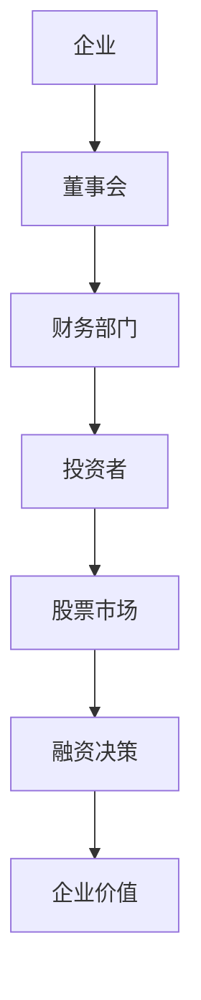

                 


# 股市估值对企业融资决策的影响

## 关键词
股市估值, 企业融资, 财务决策, 投资分析, 股票定价

## 摘要
股市估值是企业在制定融资决策时的重要参考因素。本文详细分析了股市估值的不同方法及其对企业融资决策的影响，包括债务融资和股权融资的选择、融资成本的变化以及融资规模的调整。通过实际案例和系统架构设计，文章展示了如何将股市估值与企业融资策略相结合，帮助企业在不同市场环境下做出最优融资决策。

---

## 第一章: 股市估值的核心概念

### 1.1 股市估值的定义与背景
#### 1.1.1 股市估值的基本定义
股市估值是指通过一定的方法和模型，对上市公司股票的价值进行评估的过程。它反映了市场对企业的整体价值和未来潜力的判断。

#### 1.1.2 股市估值的重要性
股市估值是投资者和企业管理者评估企业价值的重要工具。高估值意味着市场对企业前景看好，低估值则可能暗示存在潜在的投资机会。

#### 1.1.3 企业融资决策的基本概念
企业融资决策是指企业在筹集资金时，选择合适的融资方式、时间和规模的过程。常见的融资方式包括债务融资和股权融资。

### 1.2 股市估值与企业融资的关系
#### 1.2.1 股市估值对企业融资的影响
高估值企业通常更容易吸引投资者，从而在股权融资中获得更高的估值；低估值企业可能选择债务融资，以降低融资成本。

#### 1.2.2 融资决策对股市估值的反向影响
企业的融资行为会影响市场对其未来盈利能力和成长性的预期，从而影响其股票估值。

#### 1.2.3 两者的相互作用机制
股市估值影响企业的融资成本和方式选择，而融资决策又反过来影响企业的市场价值和成长潜力。

### 1.3 核心概念与边界
#### 1.3.1 股市估值的核心要素
- 市盈率
- 市净率
- 现金流

#### 1.3.2 融资决策的关键因素
- 资本成本
- 股权稀释
- 债务负担

#### 1.3.3 问题背景与外延
本文仅讨论公开上市公司的融资决策，不涉及未上市企业的内部融资问题。

---

## 第二章: 股市估值的计算与分析方法

### 2.1 市盈率法
#### 2.1.1 市盈率的定义与计算公式
市盈率（P/E）= 股价 / 每股净利润

#### 2.1.2 市盈率的应用场景
适用于净利润稳定的公司，特别适合科技类企业。

#### 2.1.3 市盈率的优缺点
- 优点：简单直观，便于比较。
- 缺点：不适用于亏损企业。

### 2.2 市净率法
#### 2.2.1 市净率的定义与计算公式
市净率（P/B）= 股价 / 每股净资产

#### 2.2.2 市净率的应用场景
适用于净资产较多的公司，如金融和制造行业。

#### 2.2.3 市净率的优缺点
- 优点：反映资产质量。
- 缺点：不考虑盈利能力。

### 2.3 现金流折现法
#### 2.3.1 现金流折现法的定义与计算公式
自由现金流折现模型（DCF）= 未来现金流的现值

#### 2.3.2 现金流折现法的应用场景
适用于成长型企业，尤其是科技和互联网行业。

#### 2.3.3 现金流折现法的优缺点
- 优点：考虑未来现金流。
- 缺点：依赖未来预测的准确性。

### 2.4 其他估值方法
#### 2.4.1 市销率法
市销率（P/S）= 股价 / 每股收入

#### 2.4.2 企业价值倍数法
企业价值倍数（EV/EBITDA）= 企业价值 / 息税折旧及摊销前利润

#### 2.4.3 综合评分法
结合多种估值方法，综合评估企业价值。

---

## 第三章: 企业融资决策的类型

### 3.1 内部融资与外部融资
#### 3.1.1 内部融资的定义与特点
利用企业留存收益进行融资，成本低但可能限制发展。

#### 3.1.2 外部融资的定义与特点
通过发行债券或股票筹集资金，速度快但成本较高。

### 3.2 债务融资与股权融资
#### 3.2.1 债务融资的定义与特点
需定期还本付息，适合现金流稳定的公司。

#### 3.2.2 股权融资的定义与特点
稀释股东权益，适合高成长性公司。

#### 3.2.3 两者的优缺点对比
- 债务融资：低风险，高杠杆。
- 股权融资：高风险，高回报。

### 3.3 混合融资与创新融资方式
#### 3.3.1 混合融资的定义与特点
结合债务和股权融资，平衡风险和收益。

#### 3.3.2 创新融资方式的定义与特点
如可转换债券、认股权证等，灵活性高但复杂性也强。

---

## 第四章: 股市估值对融资决策的影响

### 4.1 股市估值对企业融资成本的影响
#### 4.1.1 股价与融资成本的关系
高估值企业股权融资成本低，低估值企业债务融资成本高。

#### 4.1.2 股市估值对债务融资成本的影响
市场估值高时，债券利率可能更低。

#### 4.1.3 股市估值对股权融资成本的影响
高估值企业可能面临更高的发行溢价。

### 4.2 股市估值对企业融资方式的选择
#### 4.2.1 高估值企业更倾向于股权融资
因为市场对其价值认可，容易吸引投资者。

#### 4.2.2 低估值企业更倾向于债务融资
减少股权稀释，降低财务风险。

#### 4.2.3 综合融资策略的制定
根据市场估值动态调整融资方式。

### 4.3 股市估值对融资规模的影响
#### 4.3.1 股市估值与融资规模的正相关性
高估值企业更容易获得大规模融资。

#### 4.3.2 高估值企业更容易获得大规模融资
因为市场对其前景看好。

#### 4.3.3 低估值企业融资规模受限的原因
投资者可能对企业前景持怀疑态度。

---

## 第五章: 数学模型与算法原理

### 5.1 市盈率模型
$$ P = E \times PE $$
其中，P为股票价格，E为每股收益，PE为市盈率。

### 5.2 现金流折现模型
$$ V = \sum_{t=1}^{n} \frac{CF_t}{(1 + r)^t} $$
其中，V为企业价值，CF_t为第t年的现金流，r为折现率。

---

## 第六章: 系统架构与项目实战

### 6.1 系统架构设计


### 6.2 项目实战
#### 6.2.1 环境安装
- Python 3.9+
- NumPy, Pandas, Matplotlib

#### 6.2.2 核心实现
```python
import numpy as np

def calculate_pe(stock_price, eps):
    return stock_price / eps

def calculate_pb(stock_price, book_value_per_share):
    return stock_price / book_value_per_share

# 示例数据
stock_price = 100
eps = 2.5
book_value_per_share = 5

pe = calculate_pe(stock_price, eps)
pb = calculate_pb(stock_price, book_value_per_share)

print(f"市盈率: {pe}, 市净率: {pb}")
```

#### 6.2.3 案例分析
某科技公司股票价格为100元，每股收益2.5元，每股净资产5元。市盈率为40，市净率为20，属于高估值企业，适合选择股权融资。

---

## 第七章: 最佳实践与小结

### 7.1 最佳实践
- 定期评估股市估值，动态调整融资策略。
- 结合企业实际情况，选择合适的融资方式。
- 建立完善的财务模型，辅助决策。

### 7.2 小结
股市估值是企业融资决策的重要影响因素，企业需根据市场估值和自身情况，制定最优的融资策略。

### 7.3 注意事项
- 融资决策需考虑市场环境和企业自身条件。
- 高估值企业需警惕过度杠杆化风险。
- 低估值企业需关注潜在的市场反弹机会。

### 7.4 拓展阅读
- 《投资学》
- 《企业融资与资本结构》

---

通过以上分析，企业可以更好地理解股市估值与融资决策之间的关系，做出更明智的融资选择。

