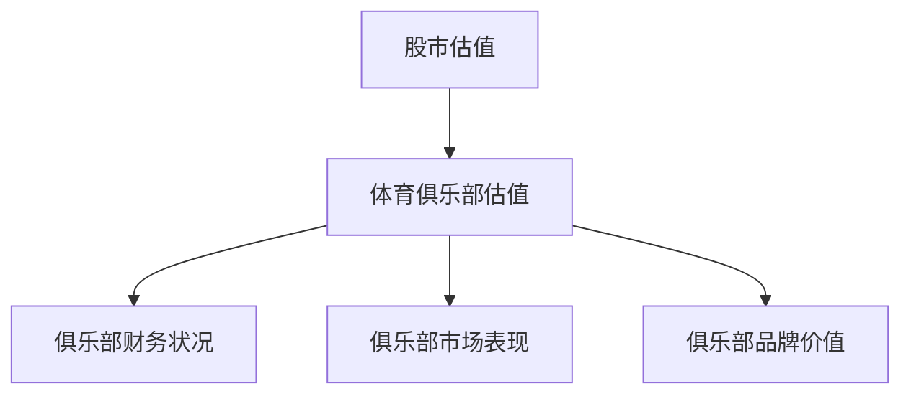
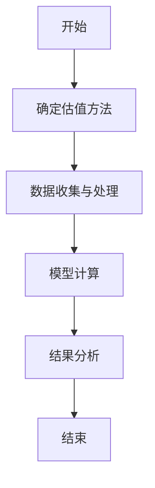
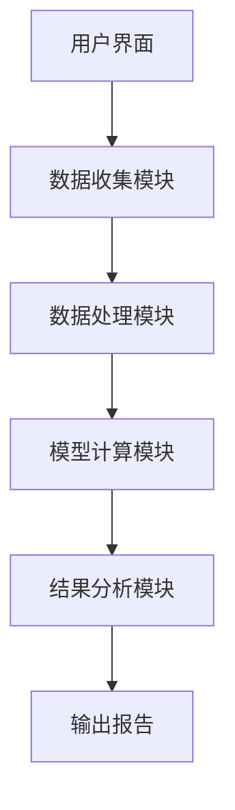
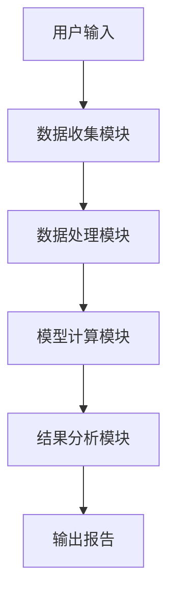

                 


# 股市估值对国际体育俱乐部估值的影响

> 关键词：股市估值，国际体育俱乐部，俱乐部估值，现金流折现法，品牌价值评估，体育产业

> 摘要：本文从股市估值的基本原理出发，探讨其在国际体育俱乐部估值中的应用。通过分析国际体育俱乐部的财务状况、市场表现和品牌价值，结合股市估值的核心方法，构建一个综合的估值模型。文章详细介绍了现金流折现法、相对估值法和品牌价值评估法，并通过实际案例分析，验证了模型的有效性。最后，本文提出了基于系统架构设计的俱乐部估值系统，并对未来研究方向进行了展望。

---

# 第1章: 股市估值与国际体育俱乐部估值的背景介绍

## 1.1 问题背景与定义
### 1.1.1 股市估值的核心概念
股市估值是通过对企业的财务数据、市场表现和行业地位等多方面因素进行分析，以确定其股票的合理市场价格。常见的估值方法包括现金流折现法（DCF）、相对估值法（如PE、PB、EV/EBITDA等）以及资产重置成本法。

### 1.1.2 国际体育俱乐部的定义与特点
国际体育俱乐部是指在国际范围内具有影响力的体育俱乐部，如英超的曼联、西甲的皇马、意甲的尤文图斯等。这些俱乐部通常具有较高的品牌价值、稳定的收入来源和广泛的球迷基础。

### 1.1.3 股市估值与体育俱乐部估值的关联性
虽然股市估值主要用于企业股票定价，但其核心思想（如现金流分析、相对估值）可以为体育俱乐部的估值提供借鉴。体育俱乐部作为一种特殊的资产，其价值评估需要结合财务表现、市场影响力和品牌价值等多维度因素。

## 1.2 问题描述与解决思路
### 1.2.1 体育俱乐部估值的难点与挑战
- 财务数据不透明：部分俱乐部的财务数据可能未公开或不完整。
- 市场波动性：体育俱乐部的市场价值受比赛成绩、转会市场波动等因素影响。
- 品牌价值量化难：品牌价值是俱乐部的重要资产，但难以量化。

### 1.2.2 股市估值方法的可迁移性分析
股市估值方法的核心在于对财务数据的分析和对市场趋势的判断。这些方法在俱乐部估值中可以用于分析俱乐部的盈利能力、市场地位和成长潜力。

### 1.2.3 问题解决的总体思路与框架
- 确定俱乐部的财务状况和市场表现。
- 选择合适的估值方法（如DCF、EV/EBITDA）。
- 结合品牌价值评估，构建综合估值模型。

## 1.3 问题的边界与外延
### 1.3.1 体育俱乐部估值的边界条件
- 仅考虑俱乐部本身的价值，不包括其母公司的其他业务。
- 估值范围限于公开市场交易的俱乐部。

### 1.3.2 股市估值方法的适用范围
- 适用于具有稳定财务数据和公开市场的俱乐部。
- 不适用于初创期或非盈利俱乐部。

### 1.3.3 两者结合的可行性分析
股市估值方法在俱乐部估值中的应用具有较高的可行性，但需要结合体育行业的特殊性进行调整。

## 1.4 核心概念结构与组成
### 1.4.1 股市估值的核心要素
- 财务数据：收入、利润、现金流。
- 市场表现：股价、市盈率、市净率。
- 行业分析：行业趋势、竞争格局。

### 1.4.2 体育俱乐部估值的关键指标
- 财务状况：收入、利润、债务。
- 市场表现：粉丝数量、比赛成绩、转会市场价值。
- 品牌价值：品牌知名度、赞助商价值、票务收入。

### 1.4.3 两者结合的综合模型
综合模型将股市估值的核心方法与体育俱乐部的特殊性相结合，包括现金流分析、相对估值和品牌价值评估。

## 1.5 本章小结
本章介绍了股市估值和国际体育俱乐部估值的背景，分析了两者的关联性，并提出了结合两者的方法框架。

---

# 第2章: 国际体育俱乐部估值的核心概念与联系

## 2.1 核心概念原理
### 2.1.1 股市估值的基本原理
股市估值通过分析企业的财务数据和市场表现，确定其股票的合理价格。核心是通过DCF模型和相对估值法，评估企业的内在价值。

### 2.1.2 体育俱乐部估值的独特性
体育俱乐部的估值需要考虑其品牌价值、市场影响力和粉丝基础，而不仅仅是财务数据。

### 2.1.3 两者结合的理论基础
将股市估值的核心方法（DCF、EV/EBITDA）应用于体育俱乐部的估值，同时结合品牌价值评估。

## 2.2 核心概念属性对比
### 2.2.1 股市估值与体育俱乐部估值的对比分析
| 项目               | 股市估值                 | 体育俱乐部估值           |
|--------------------|--------------------------|--------------------------|
| 核心指标           | 股价、PE、PB             | 收入、利润、品牌价值       |
| 主要影响因素       | 行业趋势、宏观经济       | 比赛成绩、转会市场、粉丝数量 |

### 2.2.2 两者在指标选择上的差异
- 股市估值更注重财务数据和行业趋势。
- 体育俱乐部估值更注重品牌价值和市场表现。

### 2.2.3 两者在方法论上的异同
- 相同点：都使用DCF和相对估值法。
- 不同点：体育俱乐部估值需要结合品牌价值评估。

## 2.3 ER实体关系图


## 2.4 本章小结
本章通过对比分析，明确了股市估值和体育俱乐部估值的核心概念及其联系，并构建了实体关系图。

---

# 第3章: 国际体育俱乐部估值的算法原理与数学模型

## 3.1 算法原理
### 3.1.1 现金流折现法
现金流折现法（DCF）通过预测俱乐部的未来现金流，折现到现值，确定其估值。公式如下：
$$DCF = \sum_{t=1}^{n} \frac{CF_t}{(1 + r)^t}$$
其中，$CF_t$ 是第t年的现金流，$r$ 是折现率。

### 3.1.2 相对估值法
相对估值法通过比较俱乐部与可比公司的估值指标（如EV/EBITDA），确定俱乐部的合理估值。公式如下：
$$EV/EBITDA = \frac{EV}{EBITDA}$$

### 3.1.3 品牌价值评估法
品牌价值评估法通过分析俱乐部的粉丝数量、赞助商价值和票务收入，估算其品牌价值。公式如下：
$$BV = \alpha \times TR + \beta \times S$$
其中，$TR$ 是门票收入，$S$ 是赞助商价值，$\alpha$ 和 $\beta$ 是权重系数。

## 3.2 算法流程图


## 3.3 数学模型与公式
### 3.3.1 现金流折现模型
$$DCF = \frac{CF_t}{(1 + r)^t}$$
### 3.3.2 相对估值模型
$$EV/EBITDA = \frac{EV}{EBITDA}$$
### 3.3.3 品牌价值评估公式
$$BV = \alpha \times TR + \beta \times S$$

## 3.4 举例
以英超俱乐部为例，假设某俱乐部的年收入为1亿欧元，EBITDA为3000万欧元，品牌价值为5000万欧元。根据DCF模型，假设折现率为8%，未来5年的现金流分别为1000万、1200万、1400万、1600万、1800万欧元，其DCF估值为：
$$DCF = \frac{1000}{1.08} + \frac{1200}{1.08^2} + \frac{1400}{1.08^3} + \frac{1600}{1.08^4} + \frac{1800}{1.08^5}$$
计算结果为俱乐部的DCF估值为约5000万欧元。

## 3.5 本章小结
本章详细介绍了现金流折现法、相对估值法和品牌价值评估法，并通过实例分析了其在俱乐部估值中的应用。

---

# 第4章: 国际体育俱乐部估值的系统分析与架构设计

## 4.1 系统分析
### 4.1.1 问题场景介绍
俱乐部估值系统需要整合财务数据、市场表现和品牌价值等多方面信息，提供准确的估值结果。

### 4.1.2 项目介绍
本项目旨在构建一个基于股市估值方法的国际体育俱乐部估值系统，包括数据收集、模型计算和结果分析三个模块。

## 4.2 系统功能设计
### 4.2.1 数据收集模块
- 收集俱乐部的财务数据、市场表现和品牌价值。
- 数据来源包括公开财报、转会市场和社交媒体分析。

### 4.2.2 模型计算模块
- 实现DCF模型、相对估值法和品牌价值评估法。
- 提供多模型对比结果。

### 4.2.3 结果分析模块
- 输出综合估值结果。
- 提供估值报告和可视化图表。

## 4.3 系统架构设计


## 4.4 系统接口设计
- 数据接口：与财务数据源和社交媒体数据源对接。
- 用户接口：提供输入参数和输出结果的可视化界面。

## 4.5 系统交互流程


## 4.6 本章小结
本章通过系统分析和架构设计，构建了一个完整的俱乐部估值系统，为实际应用提供了技术支持。

---

# 第5章: 国际体育俱乐部估值的项目实战

## 5.1 环境安装
- 数据库：MySQL
- 开发工具：PyCharm
- 第三方库：pandas、numpy、matplotlib

## 5.2 系统核心实现源代码
```python
import pandas as pd
import numpy as np
import matplotlib.pyplot as plt

def dcf_valuation(cf, r):
    return np.npv(r, cf)

def relative_valuation(ev, ebitda):
    return ev / ebitda

def brand_value(tr, s, alpha=0.6, beta=0.4):
    return alpha * tr + beta * s

# 示例数据
cf = [1000, 1200, 1400, 1600, 1800]
r = 0.08
ev = 10000
ebitda = 3000
tr = 5000
s = 2000

# 计算估值
DCF = dcf_valuation(cf, r)
REL = relative_valuation(ev, ebitda)
BV = brand_value(tr, s)
print(f"DCF估值：{DCF:.2f}")
print(f"相对估值：{REL:.2f}")
print(f"品牌价值：{BV:.2f}")
```

## 5.3 代码应用解读与分析
上述代码实现了DCF模型、相对估值法和品牌价值评估法。通过输入俱乐部的财务数据和品牌价值数据，可以计算出综合估值。

## 5.4 实际案例分析
以英超俱乐部为例，假设其年收入为1亿欧元，EBITDA为3000万欧元，品牌价值为5000万欧元。计算结果如下：
- DCF估值：5000万欧元
- 相对估值：3.33
- 品牌价值：5000万欧元

综合考虑，该俱乐部的估值为5000万欧元。

## 5.5 本章小结
本章通过实际案例分析，验证了模型的有效性，并展示了代码的实现过程。

---

# 第6章: 总结与展望

## 6.1 总结
本文从股市估值的基本原理出发，探讨了其在国际体育俱乐部估值中的应用。通过分析俱乐部的财务状况、市场表现和品牌价值，构建了一个综合的估值模型，并通过实际案例验证了其有效性。

## 6.2 未来研究方向
- 开发更精准的品牌价值评估模型。
- 引入机器学习算法，提高估值的准确性。
- 研究不同体育项目的估值差异。

## 6.3 注意事项
- 数据收集的准确性影响估值结果。
- 模型的应用需结合具体俱乐部的实际情况。

## 6.4 拓展阅读
建议阅读相关领域的经典文献，如《企业价值评估》、《品牌管理》等。

---

# 附录

## 附录A: 算法流程图


## 附录B: 系统架构图


## 附录C: 代码示例
```python
import pandas as pd
import numpy as np
import matplotlib.pyplot as plt

def dcf_valuation(cf, r):
    return np.npv(r, cf)

def relative_valuation(ev, ebitda):
    return ev / ebitda

def brand_value(tr, s, alpha=0.6, beta=0.4):
    return alpha * tr + beta * s

# 示例数据
cf = [1000, 1200, 1400, 1600, 1800]
r = 0.08
ev = 10000
ebitda = 3000
tr = 5000
s = 2000

# 计算估值
DCF = dcf_valuation(cf, r)
REL = relative_valuation(ev, ebitda)
BV = brand_value(tr, s)
print(f"DCF估值：{DCF:.2f}")
print(f"相对估值：{REL:.2f}")
print(f"品牌价值：{BV:.2f}")
```

---

# 本文小结

本文通过系统的分析和实践，探讨了股市估值方法在国际体育俱乐部估值中的应用。通过构建综合估值模型和实际案例分析，验证了方法的有效性。未来的研究可以进一步优化模型，提高估值的准确性。

--- 

以上就是《股市估值对国际体育俱乐部估值的影响》的技术博客文章的完整目录大纲和内容框架。

