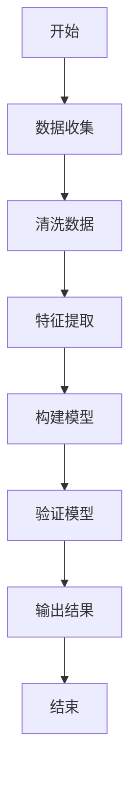
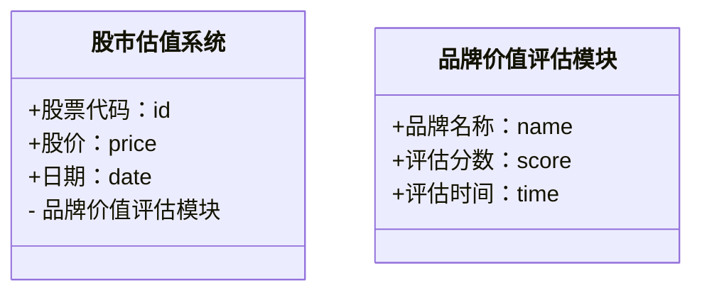

                 


# 股市估值对国际体育俱乐部品牌价值的影响

## 关键词：股市估值，品牌价值，体育俱乐部，金融市场，数据分析

## 摘要：本文系统地分析了股市估值对国际体育俱乐部品牌价值的影响。通过理论分析、算法设计和案例研究，探讨了品牌价值在企业整体估值中的作用，以及如何通过金融市场数据量化品牌价值对股价的影响。文章从核心概念、算法原理、系统架构到项目实战，全面阐述了如何利用技术手段评估和优化体育俱乐部的品牌价值，为投资者和管理层提供了理论依据和实践指导。

---

# 第一部分：背景介绍

## 第1章：股市估值与品牌价值的概述

### 1.1 问题背景
- **品牌价值在企业估值中的重要性**：品牌价值是企业核心资产之一，影响企业的整体估值。
- **体育俱乐部的特殊性**：体育俱乐部作为品牌化程度高、粉丝基础庞大的特殊企业，其品牌价值对整体估值的影响尤为显著。
- **股市估值与品牌价值的关系**：股市估值是市场对品牌价值的反映，而品牌价值的变化也会反过来影响股市估值。

### 1.2 问题描述
- **品牌价值对体育俱乐部整体估值的影响**：品牌价值如何影响体育俱乐部的市场价值？
- **股市估值与品牌价值之间的关系**：如何量化品牌价值对股价的影响？
- **体育俱乐部品牌价值的多维度评估**：品牌知名度、粉丝忠诚度、市场影响力等维度如何影响品牌价值。

### 1.3 问题解决
- **引入品牌价值评估模型**：通过回归分析等方法，量化品牌价值对股市估值的影响。
- **投资者决策的影响**：品牌价值如何影响投资者对体育俱乐部的投资决策。
- **构建综合评估体系**：结合财务数据和品牌价值，构建全面的企业估值模型。

### 1.4 边界与外延
- **品牌价值评估的边界条件**：仅考虑品牌相关的无形资产，不包括球员转会、 stadium 等其他资产。
- **与其他资产的关系**：品牌价值与其他资产（如球员、 stadium）如何协同作用。
- **品牌价值的外延与扩展**：从体育俱乐部扩展到其他类型的企业品牌价值评估。

### 1.5 概念结构与核心要素
- **品牌价值的核心要素**：知名度（Reach）、忠诚度（Loyalty）、市场影响力（Market Influence）。
- **股市估值的核心要素**：资产（Assets）、收益（Revenue）、市场价值（Market Value）。
- **两者的关系模型**：品牌价值通过影响收益和市场价值间接影响股市估值。

---

# 第二部分：核心概念与联系

## 第2章：品牌价值与股市估值的核心概念

### 2.1 品牌价值的定义与属性
- **品牌价值的定义**：品牌价值是品牌在市场中的商业价值，反映品牌对消费者和企业的影响力。
- **品牌价值的属性对比表格**：
  | 属性       | 描述                                         |
  |------------|----------------------------------------------|
  | 知名度     | 品牌的市场覆盖范围和消费者认知度             |
  | 忠诚度     | 消费者对品牌的忠诚度和复购率                 |
  | 市场影响力 | 品牌在市场中的竞争力和影响力                 |

### 2.2 股市估值的定义与属性
- **股市估值的定义**：股市估值是市场对企业的整体价值评估，反映企业在二级市场的表现。
- **品牌价值对股市估值的影响**：品牌价值的提升会增加企业的市场价值，从而影响股市估值。

### 2.3 品牌价值与股市估值的关系
- **品牌价值对股市估值的影响机制**：品牌价值通过影响企业收益和市场影响力间接影响股市估值。
- **股市估值对品牌价值的反馈作用**：股市估值的变化反映了市场对品牌价值的认可程度。

### 2.4 ER实体关系图
```mermaid
er
    entity 股市估值 {
        id 股票代码
        string 股价
        date 日期
    }
    entity 品牌价值 {
        id 品牌名称
        integer 品牌价值评估分数
        date 评估时间
    }
    relation 股市估值与品牌价值的关系 {
        foreign 股票代码 --> 品牌名称
        股市估值影响品牌价值
    }
```

---

# 第三部分：算法原理讲解

## 第3章：品牌价值

### 3.1 品牌价值评估模型
- **回归分析模型**：通过回归分析，量化品牌价值对股价的影响。
- **多元统计模型**：结合品牌知名度、忠诚度等多维度数据，构建综合评估模型。

### 3.2 算法流程图


### 3.3 算法实现
```python
import pandas as pd
from sklearn.linear_model import LinearRegression

# 数据收集与清洗
data = pd.read_csv('sports_club_data.csv')
data = data.dropna()

# 特征提取
features = ['brand_reach', 'loyalty_score', 'market_influence']
target = 'stock_value'

# 构建模型
model = LinearRegression()
model.fit(data[features], data[target])

# 验证模型
print(model.score(data[features], data[target]))
```

### 3.4 数学模型
- **品牌价值计算公式**：
  $$ \text{品牌价值} = \alpha \times \text{品牌知名度} + \beta \times \text{品牌忠诚度} + \gamma \times \text{市场影响力} $$
- **回归分析模型**：
  $$ \text{股价} = \beta_0 + \beta_1 \times \text{品牌价值} + \epsilon $$

---

## 第4章：股市估值

### 4.1 股市估值计算模型
- **市场价值计算公式**：
  $$ \text{市场价值} = \text{资产} + \text{收益} \times \text{市盈率} $$
- **市盈率与品牌价值的关系**：
  $$ \text{市盈率} = \frac{\text{股价}}{\text{每股收益}} $$

### 4.2 股市估值与品牌价值的交互影响
- **品牌价值对市盈率的影响**：品牌价值的提升会增加市盈率。
- **市盈率对股价的影响**：市盈率的变化直接影响股价。

---

# 第四部分：系统分析与架构设计

## 第5章：系统分析

### 5.1 问题场景
- **数据来源**：股票价格、品牌价值评估数据。
- **目标**：构建一个能够量化品牌价值对股价影响的系统。

### 5.2 系统功能设计


### 5.3 系统架构设计


### 5.4 系统接口设计
- **输入接口**：股票代码、品牌名称。
- **输出接口**：品牌价值评估报告、股价预测结果。

---

## 第6章：项目实战

### 6.1 环境安装
- **工具**：Python、Pandas、Scikit-learn、Mermaid。

### 6.2 核心实现
```python
import pandas as pd
from sklearn.linear_model import LinearRegression
import matplotlib.pyplot as plt

# 数据加载与预处理
data = pd.read_csv('sports_club_data.csv')
data = data.dropna()

# 特征提取与模型构建
features = ['brand_reach', 'loyalty_score', 'market_influence']
target = 'stock_value'
model = LinearRegression()
model.fit(data[features], data[target])

# 可视化结果
plt.scatter(data[target], model.predict(data[features]))
plt.xlabel('实际股价')
plt.ylabel('预测股价')
plt.title('股价预测结果')
plt.show()
```

### 6.3 案例分析
- **案例选择**：以英超俱乐部为例，分析品牌价值对股价的影响。
- **数据来源**：英超俱乐部的历史股价数据和品牌价值评估数据。

### 6.4 结果分析
- **模型评估**：计算回归模型的R²值，验证模型的准确性。
- **结果解读**：品牌价值对股价的贡献度分析。

---

## 第7章：总结与展望

### 7.1 总结
- **核心观点**：品牌价值是影响股市估值的重要因素，尤其是在体育俱乐部这样的品牌化企业中。
- **技术总结**：通过回归分析和多元统计模型，可以量化品牌价值对股价的影响。

### 7.2 展望
- **未来研究方向**：引入机器学习算法，提高品牌价值评估的准确性。
- **实际应用建议**：投资者可以根据品牌价值评估结果，优化投资决策。

### 7.3 注意事项
- **数据质量**：确保数据的完整性和准确性。
- **模型适用性**：根据具体情况调整模型参数。

### 7.4 拓展阅读
- **相关文献**：建议阅读关于品牌价值评估和股市估值的经典文献。
- **工具推荐**：推荐使用Python和相关库进行数据分析和建模。

---

通过以上分析，我们可以看到，股市估值与品牌价值之间存在密切的联系，尤其是在国际体育俱乐部这样的品牌化企业中。通过技术手段，我们可以量化品牌价值对股价的影响，为投资者和管理层提供科学的决策依据。

