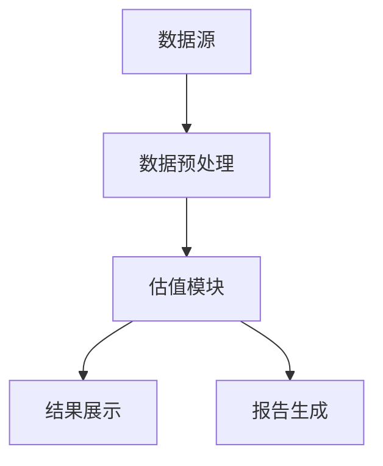

                 


# 股市估值对国际体育俱乐部并购定价的影响

> **关键词**：股市估值、国际体育俱乐部、并购定价、金融模型、体育产业分析  
> **摘要**：本文探讨了股市估值在国际体育俱乐部并购定价中的作用，分析了多种估值模型及其在体育产业中的应用，结合实际案例，提出了系统化的解决方案和最佳实践。

---

## 第一部分：背景介绍

### 第1章：问题背景与问题描述

#### 1.1 问题背景
- **体育俱乐部并购的兴起**：随着全球化和资本化的推进，体育俱乐部成为投资者的重要标的，尤其是英超、西甲等顶级联赛的俱乐部备受关注。
- **股市估值在企业并购中的作用**：在企业并购中，股市估值是评估企业价值的重要工具，但体育俱乐部的特殊性使其估值更具挑战性。
- **体育产业的特殊性与挑战**：体育俱乐部的无形资产（如品牌价值、球迷基础）和盈利能力波动性大，影响其估值。

#### 1.2 问题描述
- **体育俱乐部并购的定义与特点**：并购涉及俱乐部的所有权转移，通常涉及高金额，且受品牌、粉丝基础等因素影响。
- **股市估值对并购定价的影响**：股市估值模型如何应用于体育俱乐部的定价，以及其在并购中的实际作用。
- **当前研究的空白与不足**：现有研究多集中于企业并购，少有针对体育俱乐部的专门分析。

#### 1.3 问题解决
- **股市估值模型的引入**：将企业估值模型（如DCF、相对估值）应用于体育俱乐部。
- **并购定价的影响因素**：分析收入、利润、品牌价值等对定价的影响。
- **研究方法的选择**：采用定量分析（估值模型）与定性分析（行业特点）结合。

#### 1.4 边界与外延
- **研究范围的界定**：聚焦于国际顶级体育俱乐部，主要分析足球俱乐部。
- **相关概念的区分**：明确并购与赞助、投资的区别。
- **研究的局限性**：未考虑俱乐部债务、税务影响等复杂因素。

#### 1.5 概念结构与核心要素
- **核心概念的组成**：包括俱乐部价值、股市估值、并购定价。
- **核心要素的分析**：财务表现、品牌价值、市场地位。
- **概念结构图**：展示各要素之间的关系。

---

## 第二部分：核心概念与联系

### 第2章：核心概念原理

#### 2.1 体育俱乐部的估值方法
- **市盈率法**：以俱乐部收入为基础，计算合理市盈率。
- **市净率法**：以俱乐部资产为基础，评估其合理性。
- **现金流折现法**：预测未来现金流，计算现值。

#### 2.2 股市估值模型
- **DCF模型**：通过现金流折现计算企业价值。
- **相对估值法**：比较类似企业的市盈率、市净率。
- **股权自由现金流模型**：评估股东权益价值。

#### 2.3 核心概念的联系
- **体育俱乐部估值与股市估值的异同**：体育俱乐部的无形资产和波动性是区别，但估值方法有相似性。
- **并购定价中的关键因素**：品牌价值、财务表现、市场潜力。

---

### 第2章：概念属性特征对比表格

| 概念       | 定义                                                                 | 优点                                                                 | 缺点                                                                 |
|------------|----------------------------------------------------------------------|-------------------------------------------------------------------|-------------------------------------------------------------------|
| 市盈率法   | 以俱乐部收入为基础，计算合理市盈率。                           | 简单易懂，适用于收入稳定的俱乐部。                                 | 未考虑资产和未来现金流。                                           |
| 市净率法   | 以俱乐部资产为基础，评估其合理性。                             | 考虑了资产价值，适用于资产密集型俱乐部。                           | 未反映盈利能力。                                                   |
| 现金流折现法| 预测未来现金流，计算现值。                                       | 考虑了未来盈利能力，较为全面。                                     | 预测难度大，受假设影响。                                           |

---

## 第三部分：算法原理讲解

### 第3章：DCF模型的实现

#### 3.1 DCF模型原理
- **定义**：通过预测未来现金流，将其折现为现值，评估企业价值。
- **公式**：
  $$ \text{企业价值} = \sum_{t=1}^{n} \frac{\text{现金流}_t}{(1 + r)^t} + \frac{\text{残值}}{(1 + r)^n} $$
  其中，\( r \) 为折现率，\( n \) 为预测期限。

#### 3.2 实现步骤
1. **预测现金流**：基于俱乐部历史收入和利润，预测未来现金流。
2. **确定折现率**：使用行业平均或资本资产定价模型（CAPM）计算。
3. **计算现值**：将各期现金流折现求和，得到企业价值。

#### 3.3 代码实现
```python
def discounted_cash_flow(cash_flows, discount_rate, period):
    present_value = 0
    for t in range(period):
        if t == 0:
            discount_factor = 1
        else:
            discount_factor = (1 + discount_rate) ** t
        present_value += cash_flows[t] / discount_factor
    return present_value

# 示例数据
cash_flows = [100, 150, 200, 250]
discount_rate = 0.08
period = 4

value = discounted_cash_flow(cash_flows, discount_rate, period)
print(f"DCF模型计算的企业价值为：{value}")
```

---

## 第四部分：系统分析与架构设计

### 第4章：系统架构设计

#### 4.1 系统功能模块
- 数据采集：收集俱乐部财务数据、市场数据。
- 估值计算：应用DCF模型和相对估值法。
- 结果展示：生成可视化报告。

#### 4.2 系统架构图


---

## 第五部分：项目实战

### 第5章：案例分析

#### 5.1 案例选择
- **案例背景**：英超俱乐部A的并购案例。
- **数据收集**：收入、利润、品牌价值。
- **模型应用**：使用DCF模型和相对估值法计算目标价。

#### 5.2 分析过程
1. **数据预处理**：清洗和整理财务数据。
2. **模型计算**：分别应用两种模型，比较结果。
3. **结果分析**：结合行业情况，确定最终估值。

---

## 第六部分：最佳实践

### 第6章：小结与建议

#### 6.1 小结
- 股市估值模型在体育俱乐部并购中的有效性。
- 不同模型的适用场景和优缺点。

#### 6.2 注意事项
- 数据质量：确保数据的准确性和完整性。
- 模型选择：根据俱乐部特点选择合适的估值方法。
- 结果验证：结合市场反馈调整估值。

#### 6.3 拓展阅读
- 推荐相关书籍和论文，深入学习估值方法。

---

## 结语

股市估值为国际体育俱乐部并购提供了科学的定价依据，但其应用需结合行业特点和俱乐部的特殊性。通过系统化的分析和实战案例，我们可以更准确地评估俱乐部价值，为并购决策提供支持。

--- 

**感谢您的耐心阅读，希望本文对您理解股市估值在国际体育俱乐部并购中的作用有所帮助！**

