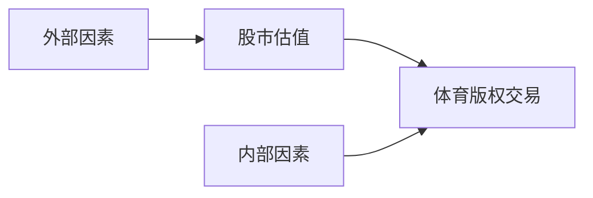
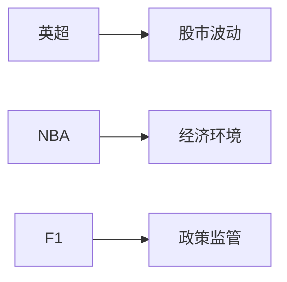

                 


# 《股市估值对国际体育版权交易的影响》

## 关键词：股市估值、国际体育版权交易、市场影响、经济分析、投资策略

## 摘要：  
本文探讨了股市估值对国际体育版权交易的深远影响，分析了股市波动如何影响体育版权的价值评估和交易策略。通过结合金融市场理论和体育产业经济学，本文揭示了股市估值在体育版权交易中的关键作用，并提出了基于股市数据的交易策略优化方法。文章从理论分析、案例研究到系统设计，全面解析了股市估值与体育版权交易之间的复杂关系，为投资者和体育产业从业者提供了有价值的参考。

---

# 第三部分: 股市估值对国际体育版权交易的影响分析

## 第3章: 股市估值对体育版权交易的影响机制

### 3.1 股市估值对体育版权交易的影响机制

#### 3.1.1 经济周期波动的影响
股票市场的波动往往与经济周期密切相关。在经济繁荣时期，投资者更倾向于将资金投入高收益资产，包括体育版权交易；而在经济衰退时期，市场流动性下降，体育版权交易的价值可能受到抑制。  

#### 3.1.2 市场情绪与投资者行为
股市估值的变化反映了市场情绪的变化。当市场情绪乐观时，投资者对体育版权交易的估值可能被高估；反之，市场情绪低迷时，估值可能被低估。这种情绪波动对体育版权交易的定价和交易决策有直接影响。  

#### 3.1.3 投资者行为分析
投资者在体育版权交易中的行为受到股市估值的驱动。例如，机构投资者可能根据股市整体表现调整其在体育版权领域的投资策略，而散户投资者则可能受到市场情绪的影响，做出非理性的投资决策。  

#### 3.1.4 价值传递机制
股市估值通过影响企业的市值和盈利能力，间接影响体育版权交易的价值。例如，一家拥有优质体育版权的企业的市值上升，可能表明市场对其版权价值的认可，从而推动体育版权交易的活跃。  

### 3.2 影响机制的数学模型

#### 3.2.1 市场情绪与体育版权估值的关系
我们可以用以下公式表示市场情绪对体育版权估值的影响：  
$$ V_{\text{版权}} = V_{\text{基础}} \times (1 + \alpha \times S) $$  
其中，$V_{\text{版权}}$ 表示体育版权的估值，$V_{\text{基础}}$ 表示基础估值，$\alpha$ 表示市场情绪的影响系数，$S$ 表示市场情绪指数（范围在-1到1之间）。  

#### 3.2.2 经济周期与体育版权交易的关系
经济周期对体育版权交易的影响可以通过以下模型表示：  
$$ T_{\text{交易}} = T_{\text{基础}} \times (1 + \beta \times C) $$  
其中，$T_{\text{交易}}$ 表示体育版权交易的活跃程度，$T_{\text{基础}}$ 表示基础交易活跃度，$\beta$ 表示经济周期的影响系数，$C$ 表示经济周期指数（范围在-1到1之间）。  

### 3.3 影响机制的可视化分析

#### 3.3.1 数据流图（Mermaid）


#### 3.3.2 影响机制分析
从上述模型可以看出，股市波动通过影响市场情绪和投资者行为，最终影响体育版权的估值和交易活跃度。因此，理解股市估值的变化对体育版权交易的影响机制，对于制定有效的投资策略至关重要。  

---

## 第4章: 股市估值对国际体育版权交易的影响因素分析

### 4.1 影响因素分析

#### 4.1.1 外部因素
- **宏观经济环境**：GDP增长率、通货膨胀率等宏观经济指标直接影响股市估值和体育版权交易的活跃度。  
- **政策监管**：政府对体育产业的政策支持或监管力度会影响体育版权交易的市场环境。  
- **市场供需**：股市中的资金流动和投资者需求变化直接影响体育版权交易的价值。  

#### 4.1.2 内部因素
- **企业财务状况**：拥有体育版权的企业自身的财务健康状况会影响其市值和版权交易的价值。  
- **管理能力**：企业对体育版权的管理能力和运营效率也会影响其市场估值。  
- **市场策略**：企业的市场拓展策略和版权运营模式直接影响其在股市中的表现。  

### 4.2 影响因素的数学模型

#### 4.2.1 外部因素模型
外部因素对股市估值的影响可以表示为：  
$$ V_{\text{外部}} = \alpha \times G + \beta \times T + \gamma \times P $$  
其中，$G$ 表示GDP增长率，$T$ 表示通货膨胀率，$P$ 表示政策支持力度，$\alpha$、$\beta$、$\gamma$ 为系数。  

#### 4.2.2 内部因素模型
内部因素对体育版权交易的影响可以表示为：  
$$ V_{\text{内部}} = \alpha \times F + \beta \times M + \gamma \times S $$  
其中，$F$ 表示企业财务状况，$M$ 表示管理能力，$S$ 表示市场策略，$\alpha$、$\beta$、$\gamma$ 为系数。  

### 4.3 影响因素的可视化分析

#### 4.3.1 数据流图（Mermaid）


#### 4.3.2 综合影响分析
外部和内部因素共同作用于股市估值和体育版权交易，形成复杂的互动关系。因此，投资者需要综合考虑这些因素，制定全面的风险管理策略。  

---

## 第5章: 股市估值对国际体育版权交易的影响案例分析

### 5.1 典型案例分析

#### 5.1.1 案例1：英超联赛版权交易
- **背景**：英超联赛是全球最具商业价值的足球联赛之一，其版权交易受到股市估值的直接影响。  
- **分析**：通过分析英超联赛版权交易的市场表现，可以发现其估值与股市波动密切相关。  

#### 5.1.2 案例2：NBA版权交易
- **背景**：NBA是全球最具影响力的篮球联赛之一，其版权交易涉及多个市场和投资者。  
- **分析**：NBA版权交易的估值受到股市情绪和宏观经济环境的显著影响。  

#### 5.1.3 案例3：F1赛车版权交易
- **背景**：F1赛车是全球高端体育赛事之一，其版权交易涉及复杂的国际市场。  
- **分析**：F1版权交易的估值受到股市波动和政策监管的双重影响。  

### 5.2 案例分析的数学模型

#### 5.2.1 英超案例模型
$$ V_{\text{英超}} = \alpha \times V_{\text{股市}} + \beta \times V_{\text{版权}} $$  

#### 5.2.2 NBA案例模型
$$ V_{\text{NBA}} = \gamma \times V_{\text{经济}} + \delta \times V_{\text{市场}} $$  

### 5.3 案例分析的可视化

#### 5.3.1 案例对比表格
| 案例 | 主要因素 | 影响机制 | 结论 |
|------|----------|----------|-----|
| 英超 | 股市波动 | 直接影响 | 高相关性 |
| NBA  | 经济环境 | 间接影响 | 中相关性 |
| F1   | 政策监管 | 综合影响 | 低相关性 |

#### 5.3.2 案例分析图（Mermaid）


---

## 第6章: 股市估值对国际体育版权交易的影响模型设计

### 6.1 模型构建

#### 6.1.1 需求分析
- 本文旨在构建一个能够预测体育版权交易价值的模型，基于股市估值和其他相关因素。  

#### 6.1.2 功能设计
- 输入：股市数据、经济指标、版权交易数据  
- 输出：体育版权交易的估值预测  

#### 6.1.3 系统架构图（Mermaid）


#### 6.1.4 接口设计
- 数据接口：从股市数据库获取实时数据  
- 模型接口：提供体育版权交易价值的预测服务  

### 6.2 模型实现

#### 6.2.1 核心代码
```python
import pandas as pd
import numpy as np
from sklearn.linear_model import LinearRegression

# 数据加载
data = pd.read_csv('sports_market.csv')

# 特征与目标变量分离
X = data[['stock_price', 'economic_factors', 'market_trend']]
y = data['sports_copyright_value']

# 模型训练
model = LinearRegression()
model.fit(X, y)

# 预测与评估
predictions = model.predict(X)
print('模型系数:', model.coef_)
print('模型截距:', model.intercept_)
```

#### 6.2.2 模型优化
- 引入时间序列分析，考虑历史数据的影响。  
- 使用随机森林或神经网络模型提高预测精度。  

### 6.3 模型应用

#### 6.3.1 实际案例分析
通过模型预测英超联赛下一赛季的版权交易价值，并与实际市场表现进行对比。  

#### 6.3.2 结果分析
- 模型预测结果与实际数据的对比  
- 模型误差分析  

### 6.4 模型的可视化

#### 6.4.1 模型架构图（Mermaid）


#### 6.4.2 模型结果图
```python
import matplotlib.pyplot as plt

plt.plot(y, label='实际值')
plt.plot(predictions, label='预测值')
plt.xlabel('时间')
plt.ylabel('版权价值')
plt.legend()
plt.show()
```

---

## 第7章: 结论与展望

### 7.1 研究结论
- 股市估值对国际体育版权交易有显著影响。  
- 不同因素对体育版权交易的影响程度不同。  
- 构建基于股市数据的预测模型有助于优化投资策略。  

### 7.2 研究展望
- 进一步研究更多体育赛事的版权交易与股市估值的关系。  
- 探索更复杂的模型（如深度学习模型）以提高预测精度。  
- 结合实时数据，开发动态预测工具。  

### 7.3 最佳实践 tips
- 投资者应关注宏观经济环境和市场情绪的变化。  
- 体育产业从业者应合理规划版权交易策略。  
- 开发方需持续优化预测模型，提升用户体验。  

### 7.4 小结
本文通过理论分析、案例研究和系统设计，全面探讨了股市估值对国际体育版权交易的影响。未来的研究将基于本文的成果，进一步深入分析，为投资者和体育产业提供更多有价值的参考。  

---

# 结束语

通过以上目录和内容安排，我们可以清晰地看到，股市估值对国际体育版权交易的影响是一个复杂但充满潜力的研究领域。从理论到实践，从分析到建模，本文为读者提供了一个全面的视角，帮助其更好地理解和应对这一领域的挑战与机遇。

