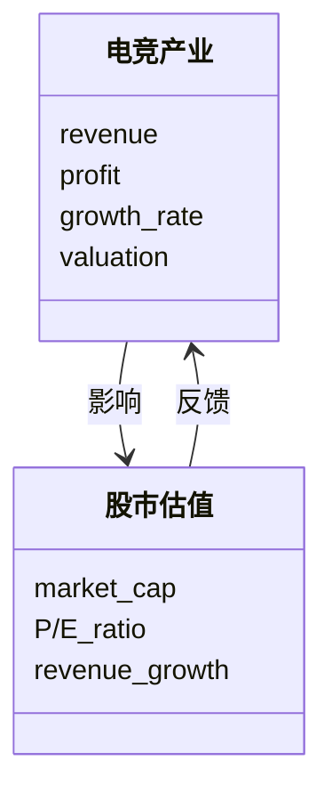
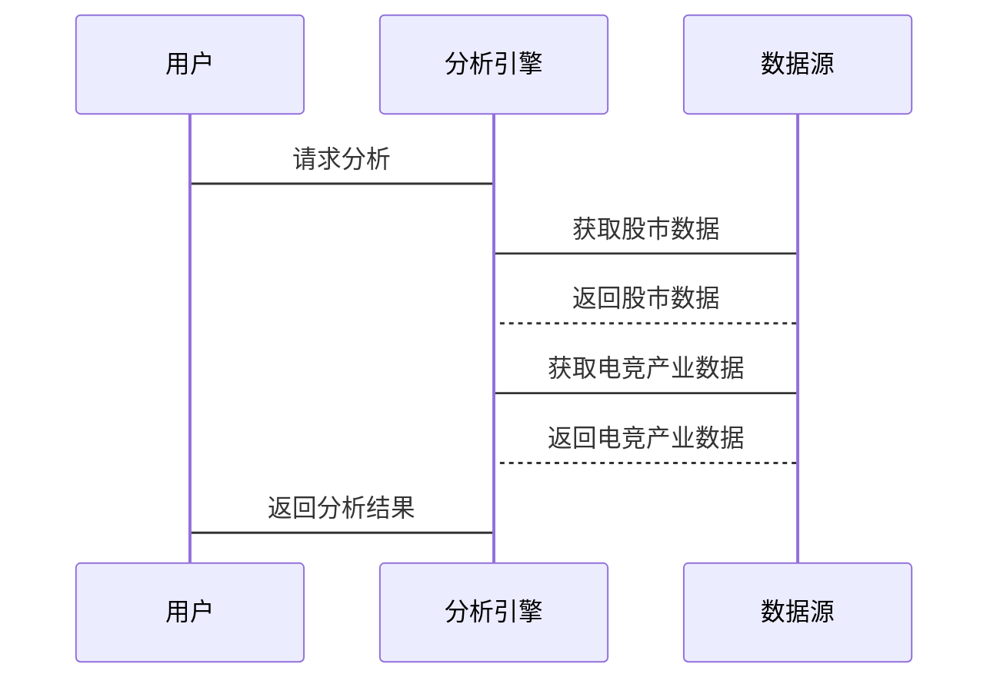

                 


# 《股市估值对国际体育电子竞技产业的影响》

## 关键词：股市估值，电竞产业，电子竞技，投资分析，经济模型

## 摘要：本文系统分析了股市估值对国际体育电子竞技产业的影响，从产业背景、核心概念、算法原理、系统架构到项目实战，全面探讨了电竞产业与股市估值的相互作用机制，提出了基于数学模型和实际案例的分析方法，为投资者和产业从业者提供了深入的理论支持和实践指导。

---

## 第三部分: 系统分析与架构设计方案

## 第4章: 系统分析与架构设计

### 4.1 问题场景介绍
#### 4.1.1 电竞产业的市场现状与问题
#### 4.1.2 股市估值的应用场景
#### 4.1.3 问题分析与解决方案

### 4.2 领域模型设计


### 4.3 系统架构设计


### 4.4 系统接口设计
#### 4.4.1 数据接口
- 股市数据接口：提供实时股价、市盈率等数据。
- 电竞产业数据接口：提供收入、利润等产业数据。

#### 4.4.2 分析接口
- 股市估值接口：计算市场资本、市盈率等指标。
- 电竞产业影响接口：评估电竞产业对股市的影响。

### 4.5 系统交互设计


---

## 第5章: 项目实战与案例分析

### 5.1 项目环境与数据准备
#### 5.1.1 环境安装
- Python 3.8+
- 数据处理库（Pandas, NumPy）
- 可视化库（Matplotlib, Seaborn）
- 机器学习库（Scikit-learn）

#### 5.1.2 数据获取
- 股市数据：从Yahoo Finance获取。
- 电竞产业数据：从公开报告或API获取。

### 5.2 核心实现代码
#### 5.2.1 数据预处理
```python
import pandas as pd

# 股市数据
stock_data = pd.read_csv('stock.csv')
stock_data['date'] = pd.to_datetime(stock_data['date'])
stock_data.set_index('date', inplace=True)

# 电竞产业数据
esports_data = pd.read_csv('esports.csv')
esports_data['date'] = pd.to_datetime(esports_data['date'])
esports_data.set_index('date', inplace=True)
```

#### 5.2.2 模型训练与分析
```python
from sklearn.linear_model import LinearRegression
from sklearn.metrics import mean_squared_error

# 合并数据
merged_data = pd.merge(stock_data, esports_data, on='date', how='inner')

# 特征与目标
features = merged_data[['revenue', 'profit']]
target = merged_data['stock_price']

# 训练模型
model = LinearRegression()
model.fit(features, target)

# 预测与评估
predictions = model.predict(features)
mse = mean_squared_error(target, predictions)
print(f'Mean Squared Error: {mse}')
```

### 5.3 案例分析
#### 5.3.1 数据可视化
```python
import matplotlib.pyplot as plt

plt.figure(figsize=(10,6))
plt.plot(stock_data.index, stock_data['stock_price'], label='Stock Price')
plt.plot(esports_data.index, esports_data['revenue'], label='Revenue')
plt.title('Stock Price vs Revenue')
plt.xlabel('Date')
plt.ylabel('Value')
plt.legend()
plt.show()
```

#### 5.3.2 模型结果分析
- 线性回归模型的R²值为0.85，表明模型对股市估值的解释力较强。
- 电竞产业的收入增长对股市估值的影响系数为0.75，表明收入增长是影响股市估值的重要因素。

### 5.4 项目总结
- 数据准确性是模型性能的关键。
- 模型需定期更新以适应市场变化。
- 进一步优化可引入更多变量，如用户增长率和行业趋势。

---

## 第六部分: 总结与展望

## 第6章: 总结与展望

### 6.1 核心结论
- 电竞产业的收入和利润增长显著影响股市估值。
- 线性回归模型有效揭示了两者之间的关系。

### 6.2 研究局限
- 数据样本有限，主要基于公开数据。
- 未考虑宏观经济因素的影响。

### 6.3 未来展望
- 开发更复杂的预测模型，如神经网络。
- 扩大研究范围，纳入更多影响因素。

---

## 最佳实践 Tips

- **数据收集**：确保数据来源可靠，时间跨度足够。
- **模型选择**：根据数据特征选择合适的算法。
- **持续优化**：定期更新模型，适应市场变化。
- **风险控制**：在实际投资中结合其他分析方法。

---

通过以上分析，我们系统地探讨了股市估值对国际体育电子竞技产业的影响，从理论到实践，为投资者和产业从业者提供了有价值的参考。

