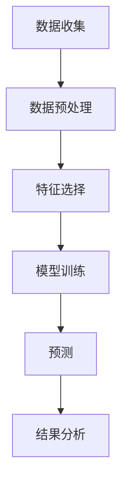
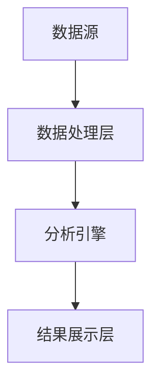

                 


# 股市估值对国际体育赛事虚拟观赛的影响

> 关键词：股市估值、国际体育赛事、虚拟观赛、技术影响、经济分析

> 摘要：本文探讨了股市估值与国际体育赛事虚拟观赛之间的关系，分析了虚拟观赛技术如何影响观众行为和企业市值，并提出了基于数据驱动的预测模型，以帮助企业更好地理解市场变化。

---

# 目录

1. [背景介绍](#背景介绍)
2. [核心概念与联系](#核心概念与联系)
3. [算法原理](#算法原理)
4. [系统分析与架构设计](#系统分析与架构设计)
5. [项目实战](#项目实战)
6. [总结与展望](#总结与展望)

---

## 1. 背景介绍

### 1.1 股市估值的基本概念
股市估值是评估企业市值的关键方法，常用的指标包括市盈率（P/E）、市净率（P/B）和股东权益收益率（ROE）。这些指标反映了企业的财务健康状况和市场表现。

### 1.2 国际体育赛事虚拟观赛的定义与特点
虚拟观赛利用VR和流媒体技术，提供沉浸式体验，打破了时间和空间的限制，提高了观众的参与度。与传统观赛相比，虚拟观赛具有更高的互动性和便捷性。

### 1.3 股市估值与虚拟观赛的关联性分析
虚拟观赛的普及可能影响观众数量和企业收入，进而影响股市估值。同时，股市波动也会反馈到虚拟观赛市场的投资和运营决策。

---

## 2. 核心概念与联系

### 2.1 股市估值的核心影响因素
- **企业财务表现**：如收入、利润和增长率直接影响股价。
- **市场情绪**：投资者情绪波动会影响短期股价。
- **宏观经济环境**：如利率和通货膨胀影响股市整体表现。

### 2.2 虚拟观赛的市场价值
- **商业模式**：通过门票、广告和订阅盈利。
- **IP价值**：虚拟观赛增强了体育赛事的影响力和品牌价值。
- **观众参与度**：提高了观众的参与度和忠诚度。

### 2.3 ER实体关系图
以下是一个简化的ER图，展示股市估值和虚拟观赛的核心关系：

```mermaid
er
  actor(投资者)
  company(企业)
  event(体育赛事)
  virtual_viewing(虚拟观赛)
  stock_price(股价)
  
  投资者 --> company: 持股
  company --> event: 参与
  event --> virtual_viewing: 举办
  virtual_viewing --> stock_price: 影响
```

---

## 3. 算法原理

### 3.1 算法概述
我们使用回归分析和时间序列分析来预测虚拟观赛对股市的影响。以下是算法的步骤：



### 3.2 数学模型
回归分析模型如下：

$$
y = \beta_0 + \beta_1x_1 + \beta_2x_2 + \epsilon
$$

其中，$y$是股价，$x_1$和$x_2$是虚拟观赛相关的特征变量。

### 3.3 Python代码实现
以下是回归分析的Python代码示例：

```python
import pandas as pd
import numpy as np
from sklearn.linear_model import LinearRegression

# 数据加载
data = pd.read_csv('virtual_viewing.csv')

# 特征与目标变量
X = data[['viewership', 'engagement']]
y = data['stock_price']

# 模型训练
model = LinearRegression()
model.fit(X, y)

# 预测
predictions = model.predict(X)
print('系数:', model.coef_)
print('截距:', model.intercept_)
```

---

## 4. 系统分析与架构设计

### 4.1 系统功能设计
系统将收集虚拟观赛数据，分析其对股市的影响，并生成预测报告。

### 4.2 系统架构图
以下是一个简化的系统架构图：



---

## 5. 项目实战

### 5.1 案例分析
以一家体育公司为例，分析虚拟观赛对其股价的影响。假设该公司在虚拟观赛技术上投资，观察其股价变化。

### 5.2 代码实现
以下是数据处理和建模的代码：

```python
import pandas as pd
import matplotlib.pyplot as plt

# 数据加载与预处理
data = pd.read_csv('example.csv')
data['date'] = pd.to_datetime(data['date'])
data.set_index('date', inplace=True)

# 数据可视化
data['stock_price'].plot(title='股价走势', ylabel='股价')
plt.show()
```

---

## 6. 总结与展望

### 6.1 最佳实践 Tips
- 定期更新模型，以反映市场变化。
- 结合多种数据源，提高预测准确性。

### 6.2 小结
本文分析了股市估值与虚拟观赛的关系，提出了数据驱动的预测模型，为企业提供了新的视角来理解市场变化。

### 6.3 注意事项
- 数据质量和完整性对模型准确性至关重要。
- 需要考虑宏观经济因素的复杂性。

### 6.4 拓展阅读
- 深入研究大数据和人工智能在金融领域的应用。
- 探索虚拟现实技术在其他行业的潜力。

---

通过以上分析，我们深入探讨了股市估值与国际体育赛事虚拟观赛之间的关系，并提出了数据驱动的解决方案。未来的研究可以进一步结合更多数据源和复杂模型，以提供更精准的预测。

