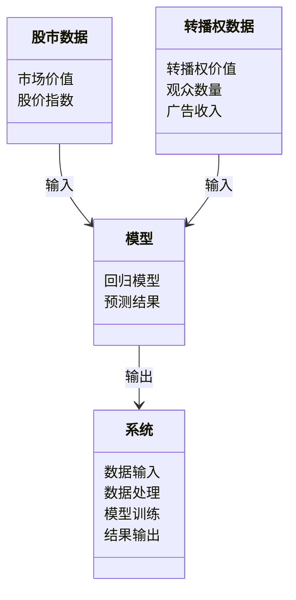
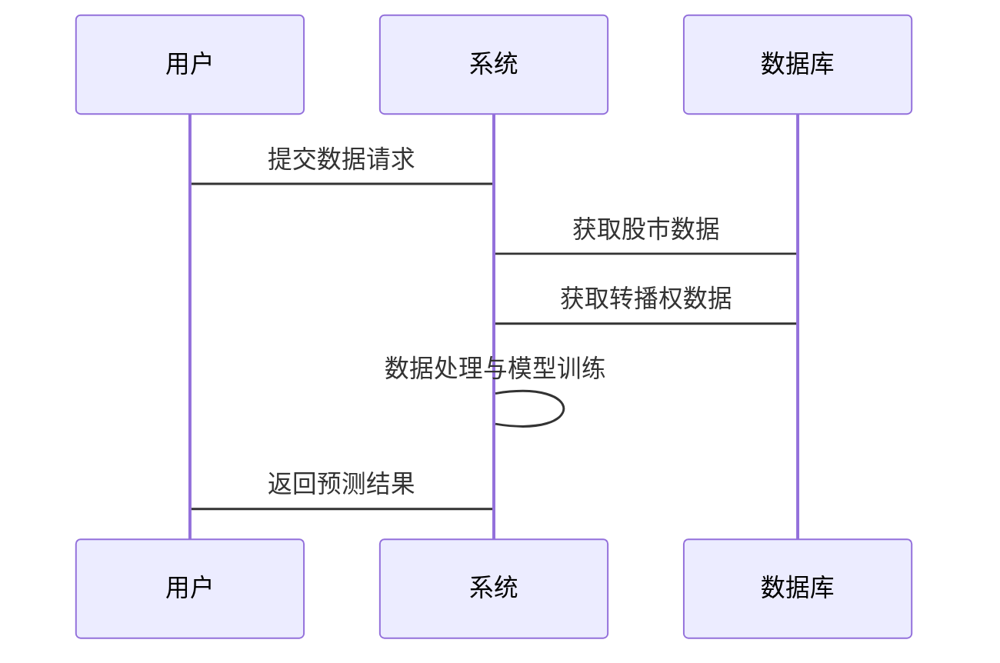

                 


# 股市估值对国际体育赛事转播权估值的影响

> 关键词：股市估值，转播权估值，国际体育赛事，经济影响，数据分析

> 摘要：本文通过分析股市估值与国际体育赛事转播权估值之间的关系，探讨股市波动如何影响转播权的价值评估。结合实际案例和数学模型，本文详细阐述了转播权估值的核心驱动因素，并提出了一种基于多元回归模型的估值方法。同时，本文还分析了系统架构设计与实际应用，为相关领域的研究和实践提供了参考。

---

## 第一部分: 背景介绍

### 第1章: 股市估值与国际体育赛事转播权估值的背景

#### 1.1 问题背景

##### 1.1.1 股市估值的基本概念
股市估值是通过对企业的财务状况、市场表现和行业前景等多方面因素进行评估，以确定企业股票的合理价格。常用的方法包括市盈率（P/E）、市净率（P/B）等。

##### 1.1.2 转播权估值的基本概念
转播权估值是指对体育赛事在电视台或其他媒体平台播放的权益进行价值评估。转播权的价值通常与观众数量、广告收入和市场影响力等因素密切相关。

##### 1.1.3 股市估值与转播权估值的关联性
股市估值反映了企业的整体市场价值，而转播权估值则是企业资产的一部分。两者在一定程度上受到市场波动、企业财务状况和行业趋势的影响。

#### 1.2 问题描述

##### 1.2.1 股市波动对转播权价值的影响
股市波动可能导致企业市值的变化，进而影响其对转播权的购买能力或转播权的市场价值。

##### 1.2.2 国际体育赛事的经济价值分析
国际体育赛事具有巨大的市场影响力，其转播权价值通常与赛事的知名度、观众规模和商业价值成正比。

##### 1.2.3 转播权市场的现状与挑战
转播权市场受到技术发展、观众习惯变化和经济环境的影响，面临着如何准确评估其价值的挑战。

#### 1.3 问题解决

##### 1.3.1 股市估值对转播权估值的影响路径
股市估值通过影响企业的财务状况和市场信心，间接影响转播权的购买能力和转播权的市场价值。

##### 1.3.2 转播权估值的核心驱动因素
转播权估值的核心驱动因素包括观众数量、广告收入、赛事影响力和市场趋势等。

##### 1.3.3 如何量化股市波动对转播权价值的影响
通过建立数学模型，将股市波动率与转播权价值的变化进行量化分析，从而确定两者之间的关系。

#### 1.4 边界与外延

##### 1.4.1 股市估值的适用范围
股市估值适用于对企业整体价值的评估，但需注意其局限性，如市场波动和信息不对称的影响。

##### 1.4.2 转播权估值的适用范围
转播权估值适用于对媒体资产的评估，需结合具体赛事的市场环境和商业价值进行分析。

##### 1.4.3 股市与转播权估值的边界条件
股市与转播权估值的边界条件包括企业的财务状况、市场环境和转播权的使用期限等。

#### 1.5 概念结构与核心要素

##### 1.5.1 股市估值的核心要素
- 企业的财务状况
- 市场供需关系
- 宏观经济环境

##### 1.5.2 转播权估值的核心要素
- 观众数量
- 赛事影响力
- 广告收入

##### 1.5.3 两者的相互关系
股市估值通过影响企业的市场价值，间接影响转播权的购买能力和转播权的市场价值。

### 第2章: 核心概念与联系

#### 2.1 核心概念原理

##### 2.1.1 股市估值的原理
股市估值通过分析企业的财务数据和市场环境，确定股票的合理价格。

##### 2.1.2 转播权估值的原理
转播权估值通过分析赛事的市场影响力和商业价值，确定转播权的合理价格。

##### 2.1.3 两者之间的相互作用
股市波动可能影响企业的市场价值，进而影响其对转播权的购买能力；而转播权的价值变化也可能影响企业的资产价值。

#### 2.2 概念属性特征对比

| 属性 | 股市估值 | 转播权估值 |
|------|----------|------------|
| 评估对象 | 企业股票 | 转播权资产 |
| 评估方法 | 市盈率、市净率 | 收益法、市场法 |
| 受影响因素 | 宏观经济、行业趋势 | 观众数量、广告收入 |
| 评估目的 | 确定股票价格 | 确定转播权价值 |

#### 2.3 ER实体关系图

```mermaid
erd
  actor 股市
  actor 转播权
  actor 市场
  actor 公司
  actor 电视台

  股市 --> 转播权: 影响
  转播权 --> 市场: 反映
  公司 --> 转播权: 拥有
  电视台 --> 转播权: 购买
```

---

## 第二部分: 核心概念与联系

### 第3章: 算法原理讲解

#### 3.1 算法原理

##### 3.1.1 算法流程
1. 数据收集：收集相关股票的市值数据和转播权价值数据。
2. 数据预处理：清洗数据，处理缺失值和异常值。
3. 模型建立：建立多元回归模型，将股市波动率作为自变量，转播权价值作为因变量。
4. 模型训练：使用历史数据训练模型。
5. 模型验证：通过交叉验证评估模型的准确性。
6. 模型应用：使用模型预测转播权价值。

##### 3.1.2 算法实现

```python
import pandas as pd
import numpy as np
from sklearn.linear_model import LinearRegression
from sklearn.model_selection import train_test_split
from sklearn.metrics import mean_squared_error

# 数据加载
data = pd.read_csv('transmission_rights.csv')

# 数据预处理
X = data[['market_value', 'revenue', 'viewer_count']]
y = data['transmission_rights_value']

# 划分训练集和测试集
X_train, X_test, y_train, y_test = train_test_split(X, y, test_size=0.2, random_state=42)

# 建立模型
model = LinearRegression()
model.fit(X_train, y_train)

# 预测与评估
y_pred = model.predict(X_test)
mse = mean_squared_error(y_test, y_pred)
print(f"均方误差：{mse}")
print(f"回归系数：{model.coef_}")
print(f"回归截距：{model.intercept_}")
```

#### 3.2 数学模型

##### 3.2.1 模型公式
$$ \text{转播权价值} = \beta_0 + \beta_1 \times \text{市场价值} + \beta_2 \times \text{收入} + \beta_3 \times \text{观众数量} $$

##### 3.2.2 模型解释
- $\beta_0$：回归截距，表示其他变量为零时的转播权价值。
- $\beta_1$：市场价值对转播权价值的回归系数，表示市场价值每增加1单位，转播权价值的变化。
- $\beta_2$：收入对转播权价值的回归系数。
- $\beta_3$：观众数量对转播权价值的回归系数。

#### 3.3 代码实现与解读

##### 3.3.1 代码实现
```python
# 训练模型
model.fit(X_train, y_train)

# 输出回归系数
print(f"回归系数：{model.coef_}")
print(f"回归截距：{model.intercept_}")
```

##### 3.3.2 代码解读
- 使用`LinearRegression`模型进行训练，得到回归系数和截距。
- 回归系数表示各变量对转播权价值的影响程度，截距表示基准转播权价值。

#### 3.4 模型评估

##### 3.4.1 评估指标
- 均方误差（MSE）：衡量预测值与实际值之间的差距。
- 决定系数（$R^2$）：衡量模型解释变量的能力。

##### 3.4.2 模型局限性
- 线性假设可能无法完全捕捉复杂的市场关系。
- 数据样本不足可能导致模型泛化能力差。

---

## 第三部分: 系统分析与架构设计

### 第4章: 系统分析与架构设计

#### 4.1 问题场景介绍
我们希望通过系统分析，构建一个能够量化股市波动对转播权估值影响的模型，并将其应用于实际的转播权价值评估。

#### 4.2 系统功能设计

##### 4.2.1 领域模型（类图）



#### 4.3 系统架构设计

##### 4.3.1 系统架构（架构图）

```mermaid
container 系统架构 {
    数据采集模块
    数据处理模块
    模型训练模块
    结果展示模块
}
```

##### 4.3.2 接口设计
- 数据接口：与数据库或外部数据源对接，获取股市和转播权数据。
- 模型接口：接受数据输入，输出预测结果。

##### 4.3.3 交互设计（序列图）



---

## 第四部分: 项目实战

### 第5章: 项目实战

#### 5.1 环境安装
- 安装Python和必要的库（如Pandas、NumPy、Scikit-learn）。

#### 5.2 核心实现代码

##### 5.2.1 数据处理代码

```python
import pandas as pd
import numpy as np

# 数据加载
data = pd.read_csv('transmission_rights.csv')

# 数据预处理
X = data[['market_value', 'revenue', 'viewer_count']]
y = data['transmission_rights_value']

# 划分训练集和测试集
X_train, X_test, y_train, y_test = train_test_split(X, y, test_size=0.2, random_state=42)
```

##### 5.2.2 模型训练代码

```python
from sklearn.linear_model import LinearRegression
from sklearn.metrics import mean_squared_error

# 建立模型
model = LinearRegression()
model.fit(X_train, y_train)

# 预测与评估
y_pred = model.predict(X_test)
mse = mean_squared_error(y_test, y_pred)
print(f"均方误差：{mse}")
```

#### 5.3 代码解读与分析

##### 5.3.1 数据处理
- 使用Pandas加载数据，并进行必要的清洗和转换。

##### 5.3.2 模型训练
- 使用Scikit-learn的LinearRegression模型进行训练，得到回归系数和截距。

##### 5.3.3 模型评估
- 通过均方误差评估模型的预测精度，分析模型的优缺点。

#### 5.4 实际案例分析

##### 5.4.1 数据来源
- 数据来源包括公开的股市数据和转播权交易数据。

##### 5.4.2 案例分析
以英超联赛的转播权为例，分析股市波动对转播权价值的具体影响。

##### 5.4.3 结果解读
- 预测结果与实际转播权价值进行对比，评估模型的准确性。

#### 5.5 项目小结
通过实际案例分析，验证了模型的有效性，并总结了模型在实际应用中的优势和局限性。

---

## 第五部分: 最佳实践与小结

### 第6章: 最佳实践

#### 6.1 数据收集与处理
- 数据收集：确保数据的准确性和完整性。
- 数据处理：清洗数据，处理缺失值和异常值。

#### 6.2 模型选择与优化
- 选择合适的模型：根据数据特点选择回归模型或其他方法。
- 模型优化：通过交叉验证和参数调整提高模型性能。

#### 6.3 模型应用与解读
- 应用模型进行转播权价值预测。
- 解读模型结果，分析各变量对转播权价值的影响。

#### 6.4 注意事项
- 数据的代表性和时效性。
- 模型的局限性：线性假设可能无法完全捕捉市场波动。

### 第7章: 小结

#### 7.1 核心内容总结
本文通过分析股市估值与转播权估值的关系，提出了基于多元回归模型的转播权价值评估方法，并通过实际案例验证了模型的有效性。

#### 7.2 未来研究方向
- 探索更复杂的模型，如随机森林或神经网络，以提高预测精度。
- 结合更多变量，如社交媒体影响力和观众情绪，进行更全面的分析。

#### 7.3 总结
股市估值与转播权估值的结合为体育产业的经济分析提供了新的视角，未来的研究将进一步深化两者的关联性，为实际应用提供更有力的支持。

---

# 结语
通过本文的分析与实践，我们深入探讨了股市估值对国际体育赛事转播权估值的影响，为相关领域的研究和实践提供了有益的参考。希望本文能够引发更多关于体育经济与金融市场关系的思考与研究。

