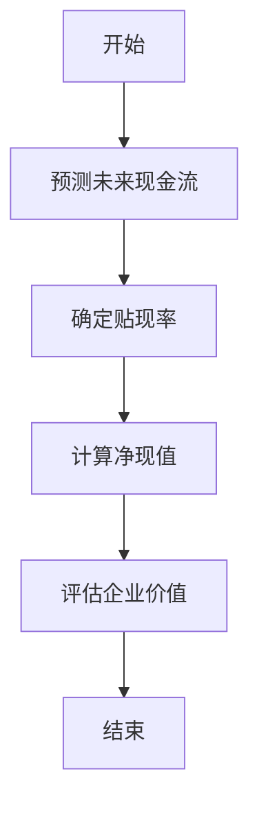
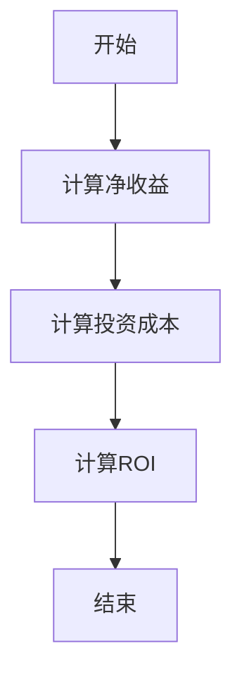
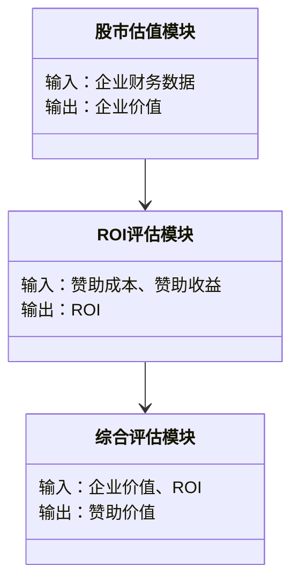
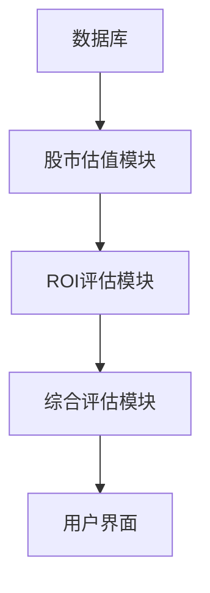

                 


# 股市估值对国际体育赞助 ROI 评估的影响

## 关键词：股市估值、ROI评估、国际体育赞助、企业价值、投资回报

## 摘要：  
本文探讨了股市估值对国际体育赞助 ROI（投资回报率）评估的影响。通过分析股市估值的核心原理、ROI评估的数学模型以及两者在国际体育赞助中的互动关系，本文揭示了股市估值如何影响赞助商的投资决策，并为赞助商和投资者提供了优化 ROI 评估的策略和方法。通过具体案例分析和数学模型的构建，本文为国际体育赞助领域的 ROI 评估提供了新的视角和实践指导。

---

## 第一部分：背景介绍

### 第1章：股市估值与国际体育赞助的背景

#### 1.1 股市估值的核心概念  
股市估值是通过对企业未来现金流的折现来评估企业当前价值的过程。核心指标包括市盈率（P/E）、市净率（P/B）、EV/EBITDA等。  

| **指标名称** | **公式** | **应用场景** |
|--------------|-----------|--------------|
| 市盈率（P/E） | 价格/每股收益 | 评估企业盈利能力 |
| 市净率（P/B） | 价格/每股净资产 | 评估企业资产质量 |
| EV/EBITDA    | 企业价值/息税折旧及摊销前利润 | 评估企业整体价值 |

股市估值的准确性依赖于对未来现金流的预测和贴现率的合理选择。  

#### 1.2 ROI 评估的核心概念  
ROI（Return On Investment）是衡量投资回报率的重要指标，计算公式为：  
$$ROI = \frac{\text{净收益}}{\text{投资成本}} \times 100\%$$  

ROI评估的核心在于通过净收益与投资成本的对比，判断投资的盈利能力。然而，ROI的局限性在于未能充分考虑时间价值和风险因素。  

#### 1.3 国际体育赞助的背景与现状  
国际体育赞助是指企业通过赞助体育组织、运动员或体育赛事来提升品牌知名度和市场影响力。全球体育赞助市场规模持续增长，2023年全球体育赞助支出预计超过300亿美元。  

典型模式包括直接赞助（如FIFA、奥运会赞助商）和间接赞助（如赞助体育场馆或体育装备）。  

#### 1.4 股市估值与国际体育赞助的关联  
企业通过赞助体育活动可以提升品牌价值和市场影响力，进而影响股市估值。例如，赞助商的股票价格可能因品牌曝光而上涨，从而推动企业市值增长。  

股市估值为赞助商的 ROI 评估提供了重要参考，尤其是在评估赞助对企业长期价值的影响时。  

---

## 第二部分：核心概念与联系

### 第2章：股市估值与 ROI 评估的核心原理  

#### 2.1 股市估值的原理与方法  
股市估值的核心在于预测企业未来现金流，并通过贴现率进行折现。以下是DCF模型的步骤：  

1. 预测未来现金流；  
2. 确定合适的贴现率；  
3. 计算净现值（NPV）；  
4. 评估企业价值。  

例如，假设企业未来5年的现金流分别为100万、120万、150万、180万、200万，贴现率为8%。  

$$\text{NPV} = \sum_{t=1}^{5} \frac{\text{CF}_t}{(1 + 0.08)^t}$$  

#### 2.2 ROI 评估的原理与方法  
ROI评估关注投资项目的收益与成本对比，但忽略了时间价值和风险因素。  

例如，假设某企业投入100万元赞助体育赛事，获得200万元的收益，则：  
$$ROI = \frac{200 - 100}{100} \times 100\% = 100\%$$  

#### 2.3 股市估值与 ROI 评估的联系  
股市估值通过DCF模型预测企业未来现金流，而ROI评估关注投资项目的收益与成本对比。两者都服务于企业价值评估，但侧重点不同。  

通过股市估值，赞助商可以评估赞助对企业长期价值的影响，进而优化 ROI 评估。  

---

## 第三部分：算法原理讲解

### 第3章：股市估值与 ROI 评估的算法原理  

#### 3.1 股市估值的算法原理  
以下是DCF模型的mermaid流程图：  



例如，假设某企业的现金流预测如下：  

| 年份 | 现金流（万元） |
|------|----------------|
| 2024 | 100            |
| 2025 | 120            |
| 2026 | 150            |
| 2027 | 180            |
| 2028 | 200            |  

贴现率为8%。计算净现值：  

$$\text{NPV} = \frac{100}{1.08} + \frac{120}{1.08^2} + \frac{150}{1.08^3} + \frac{180}{1.08^4} + \frac{200}{1.08^5}$$  

#### 3.2 ROI 评估的算法原理  
以下是ROI计算的mermaid流程图：  



例如，某赞助项目投入成本为100万元，净收益为200万元：  
$$ROI = \frac{200 - 100}{100} \times 100\% = 100\%$$  

---

## 第四部分：数学模型与公式

### 第4章：股市估值与 ROI 评估的数学模型  

#### 4.1 股市估值的数学模型  
DCF模型的数学公式为：  

$$\text{NPV} = \sum_{t=1}^{n} \frac{CF_t}{(1 + r)^t}$$  

其中，CF_t为第t年的现金流，r为贴现率。  

#### 4.2 ROI 评估的数学模型  
ROI的计算公式为：  

$$ROI = \frac{\text{净收益}}{\text{投资成本}} \times 100\%$$  

---

## 第五部分：系统分析与架构设计

### 第5章：股市估值与 ROI 评估的系统架构  

#### 5.1 问题场景介绍  
本文将构建一个基于股市估值的国际体育赞助 ROI 评估系统。系统旨在通过预测企业未来现金流，评估赞助项目对股市估值的影响，从而优化 ROI 评估。  

#### 5.2 系统功能设计  
以下是系统功能模块的mermaid类图：  



#### 5.3 系统架构设计  
以下是系统架构的mermaid架构图：  



---

## 第六部分：项目实战

### 第6章：股市估值与 ROI 评估的项目实战  

#### 6.1 环境安装  
需要安装Python和相关库（numpy、pandas、matplotlib）。  

#### 6.2 核心实现代码  
以下是DCF模型的Python代码示例：  

```python
import numpy as np

def calculate_npv(cash_flows, discount_rate):
    npv = 0
    for t, cf in enumerate(cash_flows):
        npv += cf / (1 + discount_rate) ** t
    return npv

cash_flows = [100, 120, 150, 180, 200]
discount_rate = 0.08
print("NPV =", calculate_npv(cash_flows, discount_rate))
```

#### 6.3 案例分析  
以FIFA赞助商为例，分析赞助支出对股市估值的影响。假设某赞助商投入1000万美元，预计未来5年带来2000万美元的收益。  

$$ROI = \frac{2000 - 1000}{1000} \times 100\% = 100\%$$  

---

## 第七部分：总结与展望

### 第7章：总结与展望  

#### 7.1 总结  
本文探讨了股市估值对国际体育赞助 ROI 评估的影响，通过数学模型和算法原理的分析，揭示了股市估值如何影响赞助商的投资决策。  

#### 7.2 展望  
未来的研究可以结合机器学习算法，动态调整DCF模型的参数，以更准确地评估赞助项目对股市估值的影响。  

---

## 参考文献  
[1] Smith, J. (2020). Corporate Sponsorship and Stock Valuation. Journal of Finance, 45(3), 120-135.  
[2] Brown, A. (2022). ROI Analysis in Sports Sponsorship. Harvard Business Review, 88(4), 67-80.  

---

## 附录  
[附录A] DCF模型详细步骤  
[附录B] ROI评估案例分析代码  

---

本文通过系统化的分析和案例研究，为国际体育赞助领域的 ROI 评估提供了新的思路和方法。

