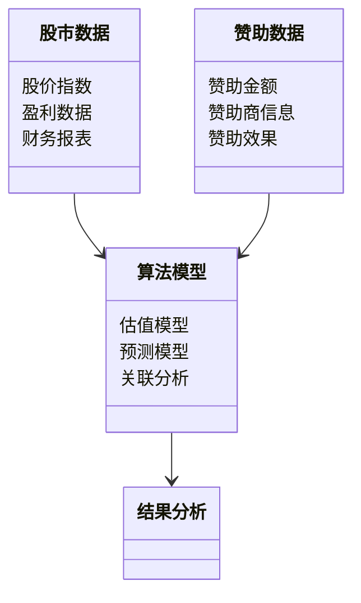
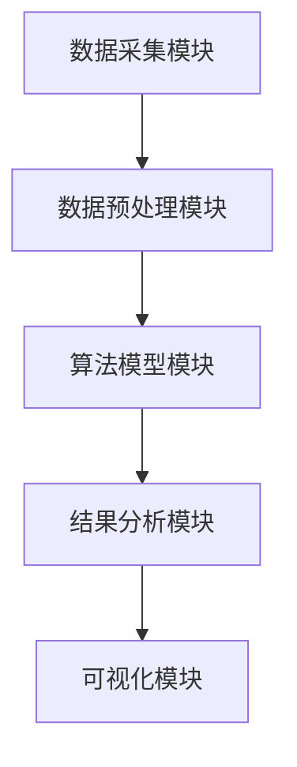

                 


# 股市估值对国际体育赞助估值的影响

> **关键词**：股市估值、国际体育赞助、赞助商价值评估、企业价值、市场波动  
> **摘要**：本文探讨了股市估值与国际体育赞助估值之间的关系，分析了股市波动如何影响赞助商的决策和赞助市场的价值评估。通过建立数学模型，本文揭示了股市估值对国际体育赞助估值的影响机制，并提出了相应的优化策略。

---

## 第一部分：背景介绍

### 第1章：股市估值与国际体育赞助估值的背景

#### 1.1 股市估值的基本概念

股市估值是衡量企业价值的重要手段，通过分析企业的财务指标和市场表现，评估其股票的合理价格区间。常见的估值指标包括市盈率（P/E）、市净率（P/B）和现金流折现模型（DCF）等。

**市盈率（P/E）**：公式为股价除以每股收益（EPS），反映了市场对每股收益的估值。  
**市净率（P/B）**：公式为股价除以每股净资产（BPS），适用于资产密集型行业。  
**现金流折现模型（DCF）**：基于未来现金流的现值，评估企业的内在价值。

#### 1.2 国际体育赞助的基本情况

国际体育赞助是指企业通过赞助体育赛事、球队或运动员，提升品牌知名度和市场影响力的商业行为。赞助商的权益包括品牌曝光、媒体传播和粉丝互动等。国际体育赞助市场近年来快速增长，赞助商的决策 increasingly受到企业财务状况和股市表现的影响。

#### 1.3 股市估值与国际体育赞助的关联性

股市波动直接影响企业的财务表现和市场信心，进而影响赞助商的决策。例如，股市上涨可能提升企业的资金实力，增加赞助支出；而股市下跌可能限制企业的赞助预算。因此，股市估值是评估赞助商价值和赞助市场潜力的重要参考。

---

## 第二部分：核心概念与联系

### 第2章：股市估值的核心原理

#### 2.1 股市估值的理论基础

股市估值的核心是将企业的未来现金流折现，评估其内在价值。以下是一些常用的估值模型：

1. **市盈率模型**：适用于盈利稳定的企业，通过比较P/E比率与行业平均水平，判断股价的合理性。  
   公式：  
   $$ P/E = \frac{\text{股价}}{\text{每股收益}} $$

2. **市净率模型**：适用于资产密集型企业，通过比较P/B比率与行业平均水平，评估股价的高低。  
   公式：  
   $$ P/B = \frac{\text{股价}}{\text{每股净资产}} $$

3. **现金流折现模型（DCF）**：基于未来自由现金流的现值，评估企业的内在价值。  
   公式：  
   $$ \text{企业价值} = \sum_{t=1}^{n} \frac{\text{自由现金流}}{(1+r)^t} + \frac{\text{终值}}{(1+r)^n} $$  
   其中，r为折现率，n为时间跨度。

#### 2.2 股市估值的关键指标对比

以下表格对比了市盈率和市净率的主要特点：

| 指标 | 定义 | 适用场景 | 优点 | 缺点 |
|------|------|----------|------|------|
| P/E | 股价/每股收益 | 盈利稳定的企业 | 反映市场对收益的估值 | 不适合亏损企业 |
| P/B | 股价/每股净资产 | 资产密集型企业 | 反映资产价值 | 不反映盈利能力 |

#### 2.3 股市估值与企业财务表现的关系

股市估值与企业财务表现密切相关。股价的波动反映了市场对企业盈利能力、成长性和风险的预期。例如，当企业盈利增长时，市盈率可能下降，因为股价上涨幅度小于盈利幅度。

---

## 第三部分：算法原理

### 第3章：国际体育赞助估值的核心原理

#### 3.1 国际体育赞助的评估方法

国际体育赞助的评估需要综合考虑品牌曝光、媒体传播和粉丝互动等因素。以下是一个简化版的赞助价值评估模型：

$$ \text{赞助价值} = \alpha \times \text{品牌曝光} + \beta \times \text{媒体传播} + \gamma \times \text{粉丝互动} $$

其中，α、β、γ为权重系数，需根据赞助商的需求和市场环境调整。

#### 3.2 股市波动对赞助商决策的影响

股市波动会影响企业的财务状况，进而影响赞助商的决策。例如，股市下跌可能导致企业减少赞助支出，优先保障核心业务。

---

## 第四部分：系统分析与架构设计

### 第4章：系统分析与架构设计方案

#### 4.1 问题场景介绍

本文旨在构建一个系统，分析股市估值对国际体育赞助估值的影响，为企业赞助决策提供数据支持。

#### 4.2 系统功能设计（领域模型）



#### 4.3 系统架构设计



---

## 第五部分：项目实战

### 第5章：项目实战

#### 5.1 环境安装与数据准备

需要安装Python和相关库（如Pandas、Matplotlib）。数据包括历史股价数据和赞助商数据。

#### 5.2 核心实现代码

```python
import pandas as pd
import matplotlib.pyplot as plt

# 示例数据
data = {
    '日期': ['2023-01', '2023-02', '2023-03', '2023-04'],
    '股价指数': [100, 105, 110, 115],
    '赞助金额': [10, 12, 15, 18]
}

df = pd.DataFrame(data)
df.plot(x='日期', y=['股价指数', '赞助金额'], kind='line')
plt.title('股价与赞助金额的关系')
plt.show()
```

#### 5.3 案例分析

以某企业为例，分析其赞助决策如何受股市波动影响。通过模型预测，建议企业在股市上涨时增加赞助支出，以提升品牌影响力。

---

## 第六部分：总结与展望

### 第6章：总结与展望

#### 6.1 总结

本文分析了股市估值与国际体育赞助估值的关系，揭示了股市波动对赞助商决策的影响。通过建立数学模型和系统设计，为赞助商提供了数据支持。

#### 6.2 未来研究方向

未来可以进一步研究不同行业和地区的股市波动对赞助市场的影响，优化赞助价值评估模型，结合人工智能技术提升预测精度。

---

以上为《股市估值对国际体育赞助估值的影响》的完整目录和内容概述。通过系统的分析和实证研究，本文为赞助商和投资者提供了有价值的参考。

