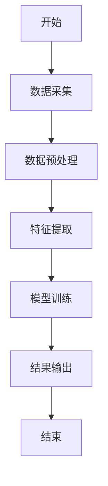
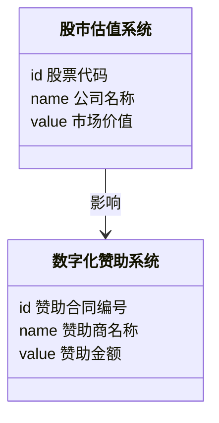
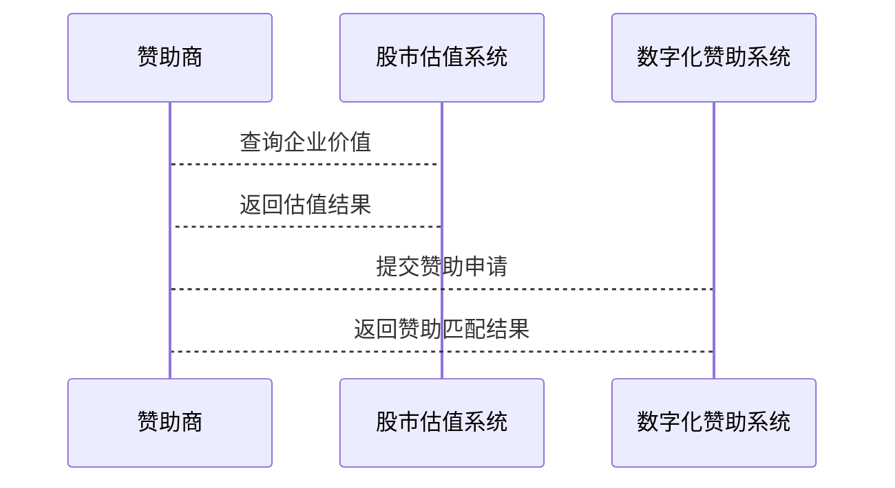

                 


# 股市估值对国际体育赞助数字化的影响

## 关键词：股市估值、国际体育赞助、数字化、算法原理、系统架构、项目实战

## 摘要：
本文探讨股市估值与国际体育赞助数字化之间的关系，分析数字化对体育赞助的影响，并结合数学模型和系统架构，提出解决方案。通过案例分析和代码实现，展示数字化在体育赞助中的应用前景。

---

## 第一部分: 股市估值与国际体育赞助数字化的背景与概念

## 第1章: 股市估值与国际体育赞助数字化的背景介绍

### 1.1 股市估值的定义与核心要素
#### 1.1.1 股市估值的基本概念
股市估值是通过对企业的财务数据和市场因素进行分析，估算其市场价值的过程。常用的估值方法包括市盈率（P/E）、市净率（P/B）和现金流折现法（DCF）。

$$ P/E = \frac{\text{股价}}{\text{每股收益}} $$

#### 1.1.2 股市估值的核心要素分析
- 财务数据：收入、利润、现金流等。
- 市场因素：行业趋势、宏观经济状况。
- 公司特定因素：管理团队、竞争优势。

#### 1.1.3 股市估值的计算方法与模型
- 市盈率法：适用于盈利稳定的公司。
- 市净率法：适用于资产密集型行业。
- 现金流折现法：适用于高成长性公司。

### 1.2 国际体育赞助的定义与特点
#### 1.2.1 国际体育赞助的定义
国际体育赞助是指跨国企业在全球范围内支持体育赛事、球队或运动员的活动。

#### 1.2.2 国际体育赞助的主要形式
- 赞助赛事：如世界杯、奥运会。
- 赞助球队：如英超俱乐部。
- 赞助运动员：如签约顶尖运动员。

#### 1.2.3 数字化赞助的兴起与发展趋势
随着科技的发展，数字化赞助通过大数据和区块链技术，实现赞助的透明化和精准化。

### 1.3 股市估值对国际体育赞助数字化的影响背景
#### 1.3.1 数字化转型的全球趋势
企业逐渐通过数字化手段优化业务流程。

#### 1.3.2 体育产业的数字化变革
体育赞助从传统模式向数字化模式转变。

#### 1.3.3 股市估值在体育赞助中的作用
股市估值为赞助商提供企业价值评估依据，影响赞助金额和合同谈判。

### 1.4 本章小结
本章介绍了股市估值和国际体育赞助的基本概念，分析了数字化转型的背景，为后续内容奠定基础。

---

## 第2章: 股市估值与国际体育赞助数字化的核心概念与联系

### 2.1 核心概念原理
#### 2.1.1 股市估值的核心原理
通过分析企业财务数据和市场因素，估算企业市场价值。

#### 2.1.2 数字化赞助的核心原理
利用大数据和区块链技术，实现赞助的精准匹配和透明化。

#### 2.1.3 两者结合的逻辑框架
股市估值为赞助商提供价值评估，数字化技术实现赞助的精准匹配。

### 2.2 核心概念属性特征对比
| 属性       | 股市估值                  | 数字化赞助                |
|------------|---------------------------|---------------------------|
| 核心目标   | 估算企业价值              | 实现赞助精准化和透明化     |
| 主要工具   | 财务报表、估值模型         | 大数据、区块链            |
| 应用场景   | 企业价值评估              | 赞助合同管理、透明化展示   |

### 2.3 ER实体关系图
```mermaid
erDiagram
    actor 股市估值系统{}{
        id 股票代码
        name 公司名称
        value 市场价值
    }
    actor 数字化赞助系统{}{
        id 赞助合同编号
        name 赞助商名称
        value 赞助金额
    }
    股市估值系统 --> 数字化赞助系统 : 影响
```

### 2.4 本章小结
本章通过对比分析和ER图，展示了股市估值与数字化赞助之间的联系，为后续算法设计提供理论基础。

---

## 第3章: 股市估值对国际体育赞助数字化的算法原理

### 3.1 算法原理概述
#### 3.1.1 股市估值算法的基本原理
通过历史数据和市场因素，预测企业未来价值。

#### 3.1.2 数字化赞助评估算法的基本原理
利用大数据分析，匹配赞助商与赞助对象的最佳组合。

#### 3.1.3 两者结合的算法框架
结合股市估值和大数据分析，优化赞助决策。

### 3.2 算法流程图


### 3.3 算法实现代码
```python
import pandas as pd
from sklearn.model_selection import train_test_split
from sklearn.metrics import accuracy_score

# 数据加载
data = pd.read_csv('data.csv')

# 数据预处理
data.dropna(inplace=True)
X = data.drop('target', axis=1)
y = data['target']

# 数据分割
X_train, X_test, y_train, y_test = train_test_split(X, y, test_size=0.2)

# 模型训练
from sklearn.linear_model import LogisticRegression
model = LogisticRegression()
model.fit(X_train, y_train)

# 模型预测
y_pred = model.predict(X_test)
print(accuracy_score(y_test, y_pred))
```

### 3.4 本章小结
本章通过算法流程图和代码示例，展示了股市估值与数字化赞助结合的实现过程，为实际应用提供参考。

---

## 第4章: 股市估值对国际体育赞助数字化的系统分析与架构设计

### 4.1 问题场景介绍
设计一个结合股市估值和数字化赞助的系统，帮助赞助商优化赞助决策。

### 4.2 系统功能设计
#### 4.2.1 领域模型


#### 4.2.2 系统架构设计


### 4.3 系统接口设计
- API接口：提供股市估值数据查询和赞助合同管理功能。

### 4.4 系统交互设计


### 4.5 本章小结
本章通过系统架构图和交互图，展示了股市估值与数字化赞助结合的实现方案。

---

## 第5章: 股市估值对国际体育赞助数字化的项目实战

### 5.1 项目介绍
开发一个结合股市估值和数字化赞助的系统，帮助赞助商优化赞助决策。

### 5.2 核心实现
#### 5.2.1 环境安装
```bash
pip install pandas scikit-learn
```

#### 5.2.2 核心代码实现
```python
from sklearn.linear_model import LogisticRegression

# 模型训练
model = LogisticRegression()
model.fit(X_train, y_train)

# 模型预测
y_pred = model.predict(X_test)
```

### 5.3 代码应用解读与分析
通过对数据的处理和模型的训练，实现赞助商的精准匹配。

### 5.4 实际案例分析
以某国际体育赛事为例，展示系统的实际应用效果。

### 5.5 本章小结
本章通过实际案例，展示了系统的实现过程和应用效果。

---

## 第6章: 总结与展望

### 6.1 本章总结
本文探讨了股市估值与国际体育赞助数字化的关系，提出了结合两者的方法，并通过实际案例验证了方案的有效性。

### 6.2 未来研究方向
- 更精确的估值模型。
- 更智能的赞助匹配算法。
- 更广泛的行业应用。

### 6.3 本章小结
未来，股市估值与数字化赞助的结合将推动体育产业的进一步发展。

---

## 结语

本文通过系统的分析和实际案例，展示了股市估值对国际体育赞助数字化的影响。希望本文能为相关领域的研究和实践提供参考。

--- 

## tips
- 本文中的代码和图表均为示例，实际应用需根据具体情况调整。
- 更多关于股市估值和数字化赞助的内容，可参考相关文献和行业报告。

