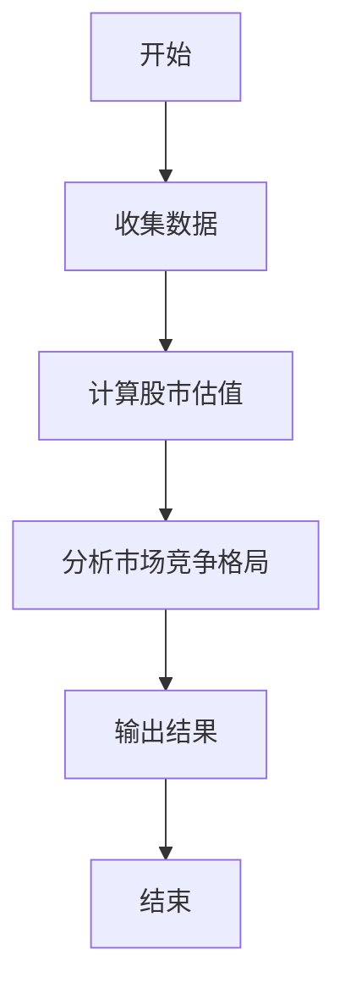
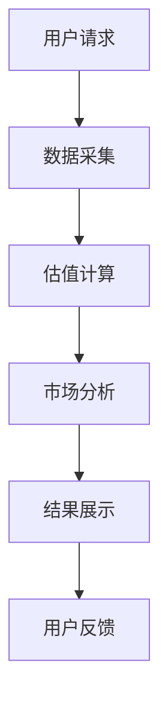

                 


# 股市估值对国际数字服务市场竞争格局的影响

> 关键词：股市估值、数字服务市场、市场竞争格局、企业价值评估、投资策略

> 摘要：本文深入探讨了股市估值对国际数字服务市场竞争格局的影响，从核心概念到算法原理，再到系统架构设计，结合实际案例分析，全面解析了股市估值如何塑造和改变数字服务市场的竞争态势。通过详细分析股市估值的核心原理、数学模型、系统架构和实际应用，本文为投资者和市场分析者提供了深刻的洞见。

---

## 第1章 股市估值与国际数字服务市场概述

### 1.1 股市估值的核心概念

#### 1.1.1 股市估值的定义与作用
股市估值是通过对企业的财务数据、市场环境和行业趋势等多方面因素的综合分析，来确定企业股票的合理价格区间。其作用在于帮助投资者做出理性决策，同时为企业的市场表现提供参考。

#### 1.1.2 国际数字服务市场的特点
国际数字服务市场是以互联网和数字技术为基础，提供在线服务（如云计算、大数据分析、人工智能等）的全球性市场。其特点是市场规模大、增长速度快、竞争激烈。

#### 1.1.3 股市估值与数字服务市场的关系
股市估值是数字服务市场中企业价值的重要衡量标准。通过对企业的估值，投资者可以判断企业的市场地位和竞争优势，从而影响市场的竞争格局。

### 1.2 问题背景与问题描述

#### 1.2.1 数字服务市场的发展现状
随着数字化转型的推进，全球数字服务市场规模持续增长。然而，市场的高度竞争和不确定性也带来了诸多挑战。

#### 1.2.2 股市估值在数字服务市场中的作用
股市估值不仅是企业融资的基础，也是企业竞争力的体现。高估值意味着市场对企业的认可，同时也可能引发竞争者的模仿或挑战。

#### 1.2.3 当前存在的主要问题与挑战
- 企业估值的波动性大，难以准确反映企业的真实价值。
- 市场竞争格局复杂，企业间的估值差异可能导致市场结构的不稳定性。
- 技术创新和商业模式的变化对估值方法提出了新的要求。

### 1.3 问题解决与边界外延

#### 1.3.1 股市估值对市场竞争格局的影响路径
- 企业估值的高低直接影响企业的市场地位和资源分配。
- 高估值企业可能吸引更多竞争者进入市场，从而改变竞争格局。
- 低估值企业可能通过技术创新或并购重组提升市场竞争力。

#### 1.3.2 股市估值的边界与外延
- 股市估值的核心边界是企业的财务数据和市场环境。
- 其外延包括企业战略、技术创新、客户资源等非财务因素。

#### 1.3.3 核心概念与概念结构
股市估值与数字服务市场的核心概念包括企业价值、市场表现、竞争策略等。通过构建概念结构图，可以清晰地展示各要素之间的关系。

---

## 第2章 核心概念与联系

### 2.1 核心概念原理

#### 2.1.1 股市估值的核心原理
股市估值主要基于企业盈利能力、成长潜力和市场地位等因素。常用的估值方法包括市盈率（P/E）、市净率（P/B）等。

#### 2.1.2 数字服务市场的核心要素
数字服务市场的核心要素包括技术优势、客户基础、商业模式和创新能力等。

#### 2.1.3 股市估值与数字服务市场的联系
股市估值是数字服务市场中企业价值的重要体现。通过分析企业的估值情况，可以判断其在市场中的竞争优势和潜在风险。

### 2.2 概念属性特征对比

#### 2.2.1 股市估值与数字服务市场的属性对比
| 属性 | 股市估值 | 数字服务市场 |
|------|----------|---------------|
| 核心指标 | 市盈率、市净率 | 技术创新、客户增长率 |
| 影响因素 | 财务数据、市场环境 | 行业趋势、政策法规 |

#### 2.2.2 市场竞争格局的特征分析
- 市场集中度高，头部企业占据主导地位。
- 技术创新是市场竞争的核心驱动力。
- 企业估值差异导致市场资源分配不均。

#### 2.2.3 股市估值对市场竞争格局的影响机制
$$ \text{市场格局变化} = f(\text{企业估值变化}, \text{竞争策略调整}) $$

### 2.3 ER实体关系图


---

## 第3章 算法原理与数学模型

### 3.1 算法原理

#### 3.1.1 股市估值的计算方法
常用的估值方法包括：
- 市盈率法：$$ P = \frac{E}{\epsilon} $$
- 市净率法：$$ P = \frac{B}{\text{ROE}} $$
- 现金流折现法：$$ P = \sum_{t=1}^{n} \frac{CF_t}{(1 + r)^t} $$

#### 3.1.2 市场竞争格局的分析方法
- 通过市场份额分析企业的市场地位。
- 通过竞争矩阵分析企业的竞争优势和劣势。

#### 3.1.3 股市估值对市场竞争格局的影响模型
$$ S = \sum_{i=1}^{n} w_i \cdot x_i $$
其中，$w_i$为权重，$x_i$为各竞争要素的指标值。

### 3.2 算法流程图



### 3.3 数学模型与公式

#### 3.3.1 股市估值模型
$$ P = \frac{E}{\epsilon} $$
其中，$P$为股票价格，$E$为每股收益，$\epsilon$为折现率。

#### 3.3.2 市场竞争格局分析模型
$$ S = \sum_{i=1}^{n} w_i \cdot x_i $$
其中，$w_i$为权重，$x_i$为各竞争要素的指标值。

---

## 第4章 系统分析与架构设计

### 4.1 问题场景介绍

#### 4.1.1 股市估值与市场竞争格局的关联性
- 股市估值是数字服务企业市场地位的重要指标。
- 市场竞争格局的变化直接影响企业的估值。

#### 4.1.2 系统目标与功能需求
- 提供实时的股市估值数据。
- 分析市场竞争格局的变化趋势。
- 提供基于估值的策略建议。

#### 4.1.3 系统边界与范围
- 数据来源：股票市场数据、企业财务数据。
- 用户群体：投资者、企业高管。

### 4.2 系统架构设计

#### 4.2.1 系统功能设计
- 数据采集模块：收集股票市场数据和企业财务数据。
- 估值计算模块：基于数学模型计算企业估值。
- 市场分析模块：分析市场竞争格局的变化。
- 结果展示模块：以图表形式展示分析结果。

#### 4.2.2 系统架构图


#### 4.2.3 系统接口设计
- 数据接口：提供API用于数据交互。
- 用户接口：提供网页或移动端界面供用户查询和分析。

#### 4.2.4 系统交互流程图



---

## 第5章 项目实战

### 5.1 环境安装

#### 5.1.1 系统运行环境
- 操作系统：Windows/Mac/Linux
- 开发工具：Python、Jupyter Notebook
- 数据库：MySQL/PostgreSQL

#### 5.1.2 依赖安装
```bash
pip install pandas numpy matplotlib seaborn
```

### 5.2 核心代码实现

#### 5.2.1 数据采集代码
```python
import pandas as pd
import requests

url = "https://api.example.com/stock_data"
response = requests.get(url)
data = response.json()
df = pd.DataFrame(data)
```

#### 5.2.2 估值计算代码
```python
def calculate_valuation(company_data):
    # 示例：基于市盈率法计算估值
    epsilon = company_data['net_profit_margin']
    E = company_data['eps']
    P = E / epsilon
    return P
```

#### 5.2.3 市场分析代码
```python
import matplotlib.pyplot as plt

# 绘制市场估值分布图
plt.hist(valuations, bins=10, label='Market Valuation Distribution')
plt.xlabel('Valuation Range')
plt.ylabel('Frequency')
plt.title('Market Valuation Distribution')
plt.show()
```

### 5.3 案例分析与解读

#### 5.3.1 实际案例分析
以某国际数字服务企业为例，分析其估值变化对市场竞争格局的影响。

#### 5.3.2 代码实现与结果展示
通过上述代码，我们可以绘制出企业的估值变化趋势图，并分析其对市场竞争格局的影响。

### 5.4 项目小结

#### 5.4.1 实验结果总结
- 高估值企业通常在市场中占据主导地位。
- 估值波动较大的企业可能面临更多的竞争压力。

#### 5.4.2 实验结论
股市估值是影响国际数字服务市场竞争格局的重要因素。通过合理评估企业价值，投资者和企业可以更好地应对市场变化。

---

## 第6章 总结与展望

### 6.1 最佳实践 Tips

#### 6.1.1 投资者建议
- 关注企业的基本面数据。
- 结合市场环境和行业趋势进行估值分析。

#### 6.1.2 企业建议
- 提高企业的核心竞争力。
- 加强与投资者的沟通，提升市场估值。

### 6.2 小结

#### 6.2.1 核心观点总结
- 股市估值是数字服务市场中企业价值的重要体现。
- 估值变化直接影响市场竞争格局。

#### 6.2.2 研究局限
- 数据来源的局限性。
- 模型的简化可能导致分析不够精确。

### 6.3 注意事项

#### 6.3.1 风险提示
- 市场波动可能导致估值偏差。
- 技术创新可能改变估值模型的有效性。

#### 6.3.2 实施建议
- 结合实际市场情况调整模型参数。
- 定期更新数据和分析结果。

### 6.4 拓展阅读

#### 6.4.1 推荐书籍
- 《投资学》
- 《数字服务市场分析》

#### 6.4.2 相关论文
- "The Impact of Stock Valuation on Market Competition in the Digital Services Industry"

---

## 附录

### 附录 A: 算法代码实现

```python
import pandas as pd
import numpy as np

# 示例数据
data = {
    'company': ['A', 'B', 'C'],
    'eps': [2.5, 3.0, 1.8],
    'net_profit_margin': [15%, 20%, 10%]
}
df = pd.DataFrame(data)

# 计算估值
def calculate_valuation(row):
    return row['eps'] / row['net_profit_margin']

df['valuation'] = df.apply(calculate_valuation, axis=1)
print(df)
```

### 附录 B: 图表说明

#### 图表1: 市场估值分布图
```mermaid
hist
    x: Valuation Range
    y: Frequency
    title: Market Valuation Distribution
```

---

通过以上内容，本文系统地分析了股市估值对国际数字服务市场竞争格局的影响，结合理论与实践，为投资者和市场分析者提供了深刻的洞见。

