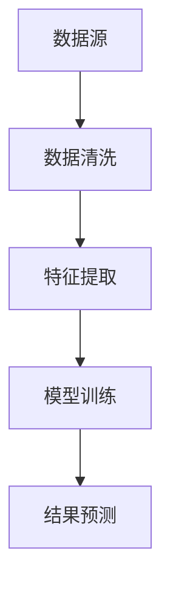

                 


# 股市估值对国际数字服务贸易规则的影响

> 关键词：股市估值、国际数字服务贸易、规则影响、数字经济、跨境服务

> 摘要：本文探讨了股市估值对国际数字服务贸易规则的影响，分析了股市估值的变化如何影响数字服务贸易规则的制定和实施，包括市场信号、资本流动和企业行为的作用机制。通过案例分析和系统设计，本文提出了应对策略和最佳实践，帮助读者理解如何在数字经济中优化数字服务贸易规则。

---

# 引言

## 1.1 背景介绍

随着全球经济一体化和数字技术的快速发展，国际数字服务贸易变得越来越重要。股市估值作为反映市场健康状况的重要指标，对数字服务贸易规则的制定和实施具有深远影响。本文旨在分析股市估值如何影响国际数字服务贸易规则，并探讨其对全球经济的影响。

---

# 第一部分: 背景与概念

## 第1章: 股市估值的基本概念

### 1.1.1 股市估值的定义

股市估值是指通过对公司财务数据和市场因素的分析，确定公司股票的内在价值。常用的估值方法包括市盈率（P/E）、市净率（P/B）和现金流折现模型（DCF）等。

$$\text{市盈率} = \frac{\text{股价}}{\text{每股收益}}$$

### 1.1.2 股市估值的核心要素

1. **公司财务状况**：包括收入、利润、资产负债表等。
2. **市场环境**：如宏观经济状况、利率水平、行业趋势等。
3. **投资者情绪**：市场参与者的预期和信心。

### 1.1.3 股市估值与经济发展的关系

股市估值不仅是企业价值的体现，也是经济发展的重要风向标。股市的波动往往反映了经济的健康状况，进而影响贸易政策的制定。

---

## 第2章: 国际数字服务贸易规则的定义

### 2.1.1 数字服务贸易的定义

数字服务贸易是指通过数字技术提供服务的交易，包括在线教育、云计算、数字支付等。

### 2.1.2 数字服务贸易的主要形式

1. **在线服务**：如电子商务、在线支付。
2. **数字内容**：如音乐、视频 streaming。
3. **技术服务**：如软件开发、数据分析。

### 2.1.3 数字服务贸易与传统贸易的区别

1. **交付方式**：数字服务通过网络进行，传统服务依赖于物理交付。
2. **监管复杂性**：数字服务涉及跨境数据流动和隐私保护，监管更为复杂。

---

# 第二部分: 影响机制

## 第3章: 股市估值对数字服务贸易规则的影响机制

### 3.1.1 通过市场信号影响规则制定

股市估值的变化向市场传递信号，影响政策制定者对数字服务贸易规则的调整。例如，股市的波动可能促使政府出台保护投资者的政策。

### 3.1.2 通过资本流动影响规则实施

股市估值的波动会影响跨境资本流动，进而影响数字服务贸易规则的实施。例如，资本外流可能导致政府加强外汇管制。

### 3.1.3 通过企业行为影响规则调整

企业市值的变化会影响其在国际市场的竞争力，进而推动数字服务贸易规则的调整。例如，企业可能推动更有利于其业务的规则变化。

---

## 第4章: 数字服务贸易规则对股市估值的反馈作用

### 4.1.1 规则变化对股市估值的直接影响

数字服务贸易规则的调整可能直接影响企业的盈利能力，从而影响股市估值。例如，数据隐私法规的加强可能导致科技公司股票估值下降。

### 4.1.2 规则变化对市场预期的间接影响

规则的变化会影响投资者的预期，进而影响股市估值。例如，预期中的数字税可能会影响科技公司的股票价格。

### 4.1.3 规则变化对跨境投资的影响

数字服务贸易规则的变化可能影响跨境投资，从而间接影响股市估值。例如，放宽跨境数据流动限制可能提升相关企业的估值。

---

# 第三部分: 案例分析

## 第5章: 案例分析

### 5.1 案例一：欧盟的GDPR对数字服务贸易规则的影响

1. **GDPR的影响**：通过加强数据隐私保护，影响了跨国公司的运营策略。
2. **股市估值的变化**：GDPR实施后，科技公司的股票估值出现波动。

### 5.2 案例二：美国数字税的讨论

1. **规则变化**：美国考虑对跨国科技公司征收数字税。
2. **股市估值的影响**：可能引发科技股的估值调整。

---

# 第四部分: 系统设计

## 第6章: 系统设计与实现

### 6.1 数据收集与分析工具

1. **数据源**：包括股市数据和数字服务贸易规则的相关政策文本。
2. **分析工具**：使用Python和Pandas进行数据分析，通过机器学习模型预测股市估值的变化。

### 6.2 数据架构设计



### 6.3 系统实现

```python
import pandas as pd
from sklearn.model_selection import train_test_split
from sklearn.linear_model import LinearRegression

# 数据加载
data = pd.read_csv('stock_data.csv')

# 数据预处理
X = data[['市盈率', '市净率']]
y = data['股价']

# 分割数据
X_train, X_test, y_train, y_test = train_test_split(X, y, test_size=0.2)

# 模型训练
model = LinearRegression()
model.fit(X_train, y_train)

# 预测
y_pred = model.predict(X_test)
```

---

# 第五部分: 法律与监管

## 第7章: 法律与监管框架

### 7.1 现有规则的不足

1. **数据隐私**：跨境数据流动的监管不一致。
2. **税收政策**：数字服务的征税问题尚未解决。

### 7.2 未来规则的调整方向

1. **统一数据流动规则**：制定全球或区域性的数据流动标准。
2. **数字税的协调**：建立跨国数字税的征收机制。

---

# 第六部分: 应对策略

## 第8章: 应对策略与最佳实践

### 8.1 政府的应对策略

1. **完善监管框架**：制定适应数字经济的监管政策。
2. **加强国际合作**：参与全球数字贸易规则的制定。

### 8.2 企业的应对策略

1. **优化业务模式**：适应新的数字服务贸易规则。
2. **提升数据治理能力**：确保数据安全和合规。

---

# 第七部分: 项目实战

## 第9章: 项目实战

### 9.1 环境安装

1. **安装Python和相关库**：如Pandas、Scikit-learn。
2. **数据集获取**：从可靠的数据源获取股市和数字服务贸易规则相关数据。

### 9.2 核心实现

```python
import pandas as pd
from sklearn.metrics import mean_squared_error

# 数据加载
data = pd.read_csv('digital_trade.csv')

# 数据清洗
data.dropna(inplace=True)

# 特征选择
X = data[['GDP增长率', '失业率', '通货膨胀率']]
y = data['股价指数']

# 分割数据集
X_train, X_test, y_train, y_test = train_test_split(X, y, test_size=0.2)

# 模型训练
model = LinearRegression()
model.fit(X_train, y_train)

# 模型评估
mse = mean_squared_error(y_test, model.predict(X_test))
print(f"均方误差: {mse}")
```

---

# 第八部分: 结论

## 第10章: 结论与展望

### 10.1 主要结论

股市估值的变化对国际数字服务贸易规则的影响是多方面的，涉及市场信号、资本流动和企业行为等多个层面。政策制定者、企业和投资者需要共同努力，适应不断变化的数字经济环境。

### 10.2 未来研究方向

1. **区域差异分析**：研究不同地区规则变化的具体影响。
2. **技术发展影响**：探讨人工智能等新技术对数字服务贸易规则的影响。

---

通过以上结构，本文系统地分析了股市估值对国际数字服务贸易规则的影响，结合理论分析、案例研究和系统设计，为读者提供了全面的视角和实践指导。

