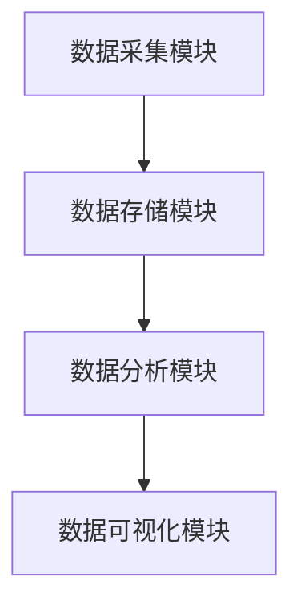

                 


# 股市估值对国际电子竞技产业发展的影响

> 关键词：股市估值、国际电子竞技产业、经济模型、产业链分析、投资策略、市场分析

> 摘要：本文探讨了股市估值对国际电子竞技产业发展的深远影响。通过分析电子竞技产业的经济模型、产业链结构、市场表现及投资者行为，本文揭示了股市估值如何影响产业投资、企业价值和市场风险。文章结合理论分析和实际案例，提出了基于算法的估值方法，为投资者和企业提供了科学的决策支持。

---

## 第一部分：背景介绍与核心概念

### 第1章：电子竞技产业概述

#### 1.1 电子竞技的定义与历史发展

电子竞技（Esports）是指通过电子游戏进行的竞赛活动，参与者通过网络平台进行比赛，观众通过直播或录播观看比赛。电子竞技起源于20世纪90年代，随着互联网技术的发展逐渐成熟。2010年后，电子竞技迎来了爆发式增长，成为一项全球性的文化现象和新兴产业。

- **定义**：电子竞技是以电子游戏为基础，通过网络进行的竞赛活动，结合了游戏、体育、娱乐和互联网技术的多领域特性。
- **历史发展**：从早期的小型比赛到如今的职业联赛和全球性赛事，电子竞技经历了从非正式到专业化的转变。
- **现状**：2023年，全球电子竞技市场规模超过15亿美元，年增长率保持在两位数，成为仅次于传统体育的第二大体育产业。

#### 1.2 股市估值的基本概念

股市估值是指通过对企业的财务数据、市场表现和行业前景进行分析，估算其股票的内在价值。常见的估值方法包括市盈率（P/E）、市净率（P/B）、现金流折现法（DCF）等。股市估值不仅反映了企业的经营状况，也体现了市场对企业的信心和预期。

- **定义**：股市估值是投资者对股票内在价值的估算，用于判断股票是否被高估或低估。
- **主要方法**：包括基本面分析、技术分析和行业分析等。
- **与企业价值的关系**：股市估值是企业价值的市场体现，反映了企业盈利能力、成长潜力和行业地位。

### 第2章：电子竞技产业的经济模型

#### 2.1 电子竞技产业链分析

电子竞技产业链包括游戏开发、赛事组织、内容制作、直播平台和硬件设备等多个环节。每个环节的参与者通过分工合作，形成了一个完整的生态体系。

- **产业链构成**：游戏开发商、赛事主办方、内容制作商、直播平台、硬件厂商等。
- **主要参与者**：游戏公司（如暴雪、 Riot）、赛事组织方（如ESL、BLG）、直播平台（如Twitch、斗鱼）等。
- **价值分布**：赛事收入主要来源于门票、赞助、广告和周边销售，其中广告收入占比较大。

#### 2.2 电子竞技产业的经济特征

电子竞技产业具有高增长、高波动和高依赖性的特点。高增长体现在市场规模的快速扩张，高波动体现在行业政策和市场环境的变化，高依赖性则表现在对游戏内容和赛事内容的依赖。

- **周期性**：电子竞技产业受游戏生命周期影响，具有较强的周期性。
- **市场规模**：近年来，全球电子竞技市场规模持续增长，年增长率超过20%。
- **竞争格局**：行业集中度较高，头部公司占据主要市场份额。

---

## 第二部分：核心概念与联系

### 第3章：电子竞技产业与股市估值的关系

#### 3.1 电子竞技产业对股市估值的影响

电子竞技产业的市场规模、竞争格局和产业链价值直接影响股市估值。例如，一家拥有热门游戏IP的公司，其股票估值可能因赛事热度的提升而上升。

- **产业规模的影响**：市场规模扩大通常会提升企业的估值。
- **竞争格局的影响**：行业集中度高的企业更容易获得更高的估值。
- **产业链价值的影响**：上游企业和下游企业的估值受产业链整合的影响较大。

#### 3.2 股市估值对电子竞技产业的反馈作用

股市估值对电子竞技产业的反馈作用体现在投资者行为、企业融资和市场预期等方面。高估值可能吸引更多投资者进入，但也可能引发市场泡沫。

- **投资者行为**：股市估值影响投资者的买入和卖出决策，进而影响市场的流动性。
- **企业融资**：高估值通常意味着企业更容易获得融资，支持产业扩张。
- **市场预期**：股市估值反映了市场对产业未来发展的预期，影响企业的战略决策。

### 第4章：核心概念的ER实体关系图

#### 4.1 电子竞技产业的实体关系图

```mermaid
er
actor(投资者) -|> 参与者: 投资行为
actor(投资者) -|> 公司: 股票持有
company(公司) -|> 产品: 产品开发
company(公司) -|> 市场: 市场表现
```

#### 4.2 股市估值的实体关系图

```mermaid
er
actor(投资者) -|> 股票: 股票持有
actor(投资者) -|> 市场: 市场参与
market(市场) -|> 公司: 市场表现
market(市场) -|> 分析师: 估值分析
```

---

## 第三部分：算法原理讲解

### 第5章：电子竞技产业的股市估值算法

#### 5.1 算法原理概述

电子竞技产业的股市估值算法基于企业基本面分析和市场情绪分析。通过结合财务数据和市场数据，算法能够预测股票的未来走势。

- **数据采集**：包括财务报表、市场数据、赛事数据等。
- **数据处理**：对数据进行清洗、归一化处理，提取特征。
- **模型建立**：使用回归分析或时间序列分析模型。

#### 5.2 算法实现步骤

以下是Python代码示例：

```python
import pandas as pd
import numpy as np
from sklearn.linear_model import LinearRegression

# 数据处理
data = pd.DataFrame({
    'Revenue': [100, 200, 300, 400],
    'Net Income': [20, 40, 60, 80],
    'Market Value': [500, 600, 700, 800]
})

# 模型训练
model = LinearRegression()
model.fit(data[['Revenue', 'Net Income']], data['Market Value'])

# 预测
new_data = pd.DataFrame({
    'Revenue': [500],
    'Net Income': [100]
})
predicted_value = model.predict(new_data)
print(predicted_value)
```

---

## 第四部分：系统分析与架构设计方案

### 第6章：系统分析与架构设计

#### 6.1 系统功能设计

- **数据采集模块**：负责收集电竞产业和股市的相关数据。
- **数据分析模块**：对数据进行清洗、建模和分析。
- **可视化模块**：将分析结果以图表形式展示。

#### 6.2 系统架构设计



---

## 第五部分：项目实战

### 第7章：项目实战

#### 7.1 环境安装

- 安装Python和相关库（如pandas、numpy、scikit-learn）。

#### 7.2 核心实现代码

```python
import pandas as pd
import numpy as np
from sklearn.linear_model import LinearRegression

# 数据处理
data = pd.DataFrame({
    'Revenue': [100, 200, 300, 400],
    'Net Income': [20, 40, 60, 80],
    'Market Value': [500, 600, 700, 800]
})

# 模型训练
model = LinearRegression()
model.fit(data[['Revenue', 'Net Income']], data['Market Value'])

# 预测
new_data = pd.DataFrame({
    'Revenue': [500],
    'Net Income': [100]
})
predicted_value = model.predict(new_data)
print(predicted_value)
```

---

## 第六部分：总结与展望

### 第8章：总结与展望

#### 8.1 小结

股市估值对国际电子竞技产业的发展具有重要影响。通过分析产业链和市场数据，结合算法模型，可以为投资者和企业提供科学的决策支持。

#### 8.2 注意事项

投资者应关注行业政策变化和市场波动，避免盲目跟风。企业应注重基本面建设，提升核心竞争力。

#### 8.3 拓展阅读

建议读者进一步阅读相关学术论文和行业报告，深入理解股市估值与电子竞技产业的互动关系。

---

通过以上结构和内容，您可以撰写一篇详细的博客文章，深入探讨股市估值对国际电子竞技产业的影响。

