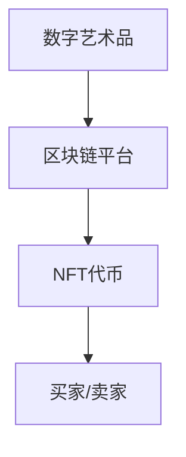
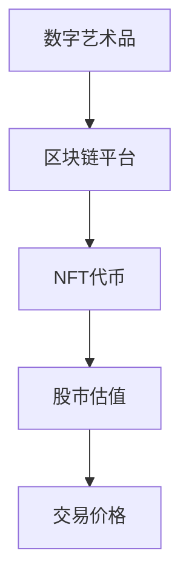
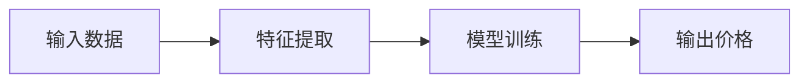
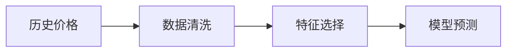
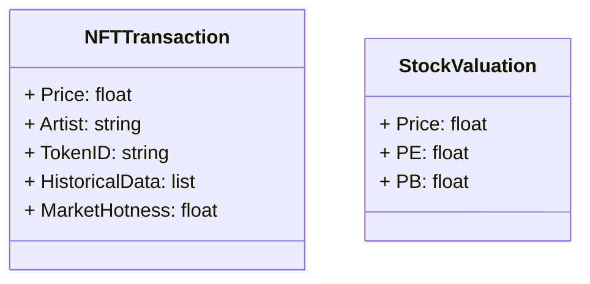
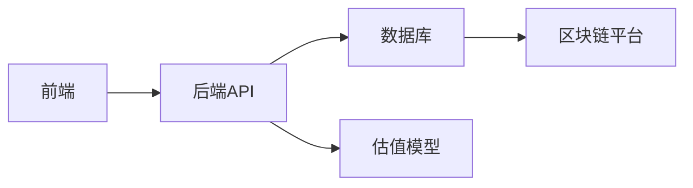
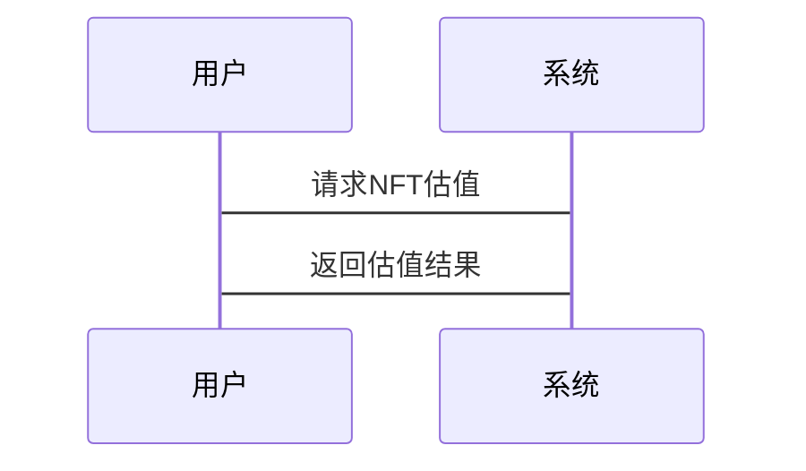
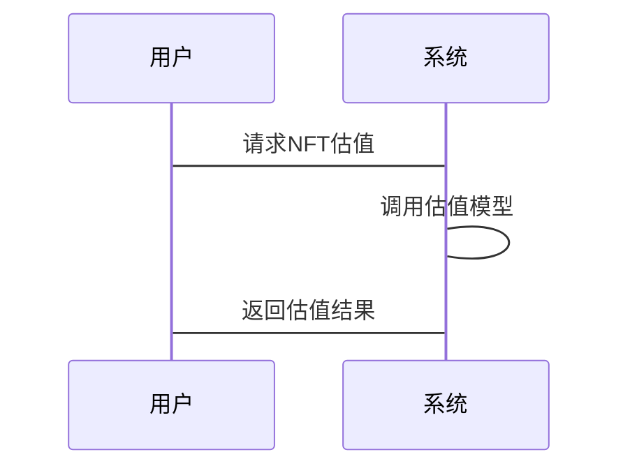

                 


# 股市估值对国际艺术品NFT交易的影响

## 关键词：
- 股市估值
- 国际艺术品
- NFT交易
- 数学模型
- 算法原理

## 摘要：
本文探讨了股市估值对国际艺术品NFT交易的影响，通过分析NFT交易的数学模型、股市估值的核心原理以及两者之间的关系，结合实际案例，详细讲解了如何利用股市估值的方法来优化NFT艺术品的定价和交易策略。文章从背景介绍、核心概念、算法原理、系统架构到项目实战，全面系统地分析了这一复杂问题。

---

# 第1章: 背景介绍

## 1.1 NFT与国际艺术品交易的定义

### 1.1.1 什么是NFT
NFT（Non-Fungible Token，非同质化代币）是一种基于区块链技术的数字证书，用于证明数字资产的唯一性和所有权。NFT可以代表任何形式的数字内容，包括艺术品、音乐、视频、游戏道具等。与比特币等同质化货币不同，NFT具有不可分割、独一无二的特性。

### 1.1.2 NFT在国际艺术品交易中的作用
NFT为数字艺术品提供了一个透明、安全的交易环境。通过区块链技术，NFT确保了艺术品的真实性和所有权的可追溯性。国际艺术品交易中，NFT的出现使得数字艺术品的交易更加便捷，同时也吸引了更多的投资者和收藏家。

### 1.1.3 股市估值的基本概念
股市估值是通过对公司财务数据、市场表现、行业地位等多方面因素的分析，来评估公司股票的内在价值。常用的估值方法包括市盈率（PE）、市净率（PB）、股息率等。这些方法为投资者提供了参考，帮助他们在股市中做出更明智的投资决策。

---

## 1.2 问题背景与描述

### 1.2.1 NFT艺术品交易的兴起
随着区块链技术的普及，NFT艺术品交易近年来迅速崛起。数字艺术家通过NFT平台将作品直接出售给收藏者，省去了传统艺术品交易中的中间环节，提高了交易效率。

### 1.2.2 股市估值对NFT交易的潜在影响
尽管NFT交易与传统股市估值存在差异，但两者的交叉点在于定价机制和市场波动。NFT艺术品的价格波动较大，投资者需要一种科学的方法来评估其价值，而股市估值方法可能为NFT定价提供新的思路。

### 1.2.3 当前市场中的主要问题与挑战
当前NFT市场存在流动性不足、价格波动剧烈、市场信息不对称等问题。这些问题不仅影响了NFT艺术品的交易效率，也增加了投资者的风险。如何借鉴股市估值的方法，优化NFT交易的定价机制，是当前亟待解决的问题。

---

## 1.3 问题解决与边界

### 1.3.1 NFT交易的核心问题
NFT交易的核心问题是如何准确评估数字艺术品的价值。由于数字艺术品缺乏物理形态，其价值主要依赖于市场热度、艺术家声誉、作品的独特性等因素。

### 1.3.2 股市估值方法的适用性分析
股市估值方法的核心是通过数据驱动的分析来评估资产的价值。NFT交易中，虽然资产形式不同，但数据驱动的估值方法仍然可以为NFT定价提供参考。

### 1.3.3 NFT市场与股市的边界与外延
NFT市场与股市的边界在于资产类型和交易机制。NFT交易更注重数字资产的唯一性和所有权，而股市则关注企业的经营状况和财务表现。两者的外延在于，NFT市场的兴起可能对传统股市的估值方法提出新的挑战。

---

## 1.4 概念结构与核心要素

### 1.4.1 NFT交易的系统架构


### 1.4.2 股市估值的关键要素
- 公司财务数据（收入、利润、资产等）
- 市场表现（股价、成交量等）
- 行业趋势（行业增长率、竞争格局等）

### 1.4.3 核心概念之间的关系图


---

# 第2章: 核心概念与联系

## 2.1 NFT交易的数学模型与公式

### 2.1.1 NFT定价模型
NFT的定价可以参考以下公式：
$$ P = f(a, b, c) $$
其中：
- $a$ 表示艺术品的稀缺性（0-1之间）
- $b$ 表示市场热度（0-1之间）
- $c$ 表示历史交易数据（以均值标准化）

### 2.1.2 示例计算
假设某NFT艺术品的稀缺性为0.8，市场热度为0.6，历史交易均值为0.7，则：
$$ P = f(0.8, 0.6, 0.7) = 0.75 $$

---

## 2.2 股市估值的核心原理

### 2.2.1 市盈率与市净率的计算
市盈率（PE）和市净率（PB）是常用的估值指标：
$$ PE = \frac{P}{E} $$
$$ PB = \frac{P}{B} $$
其中：
- $P$ 表示股票价格
- $E$ 表示每股收益
- $B$ 表示每股净资产

---

## 2.3 NFT市场与股市的关系

### 2.3.1 NFT市场的流动性分析
NFT市场的流动性较低，主要由于市场参与者较少且交易频率不高。相比之下，股市具有较高的流动性，交易量大且价格波动较为频繁。

### 2.3.2 股市波动对NFT交易的影响
股市波动可能通过市场情绪影响NFT交易。当股市表现不佳时，投资者可能转向风险较高的资产，如NFT，以寻求更高的回报。

### 2.3.3 NFT市场对股市的反馈机制
NFT市场的兴起可能推动数字资产的投资热潮，进而影响股市中相关科技公司的股价。例如，区块链技术公司可能会因NFT市场的增长而获得更高的估值。

---

# 第3章: 算法原理讲解

## 3.1 NFT定价算法

### 3.1.1 基于机器学习的定价模型


### 3.1.2 示例代码
```python
import numpy as np
from sklearn.linear_model import LinearRegression

# 示例数据
X = np.array([[1], [2], [3], [4]])
y = np.array([1, 2, 3, 4])

# 训练模型
model = LinearRegression()
model.fit(X, y)

# 预测
print(model.predict([[5]]))
```

---

## 3.2 股市估值算法

### 3.2.1 基于历史数据的回归分析


### 3.2.2 示例代码
```python
import pandas as pd
import numpy as np
from sklearn.linear_model import LinearRegression

# 示例数据
data = pd.DataFrame({
    'Price': [100, 110, 120, 130],
    'Volume': [1000, 800, 1200, 900]
})

# 训练模型
model = LinearRegression()
model.fit(data[['Volume']], data['Price'])

# 预测
print(model.predict([[1000]]))
```

---

## 3.3 算法实现与代码

### 3.3.1 Python代码实现
```python
import numpy as np
from sklearn.linear_model import LinearRegression

# 示例数据
X = np.array([[1], [2], [3], [4]])
y = np.array([1, 2, 3, 4])

# 训练模型
model = LinearRegression()
model.fit(X, y)

# 预测
print(model.predict([[5]]))
```

### 3.3.2 代码解读与分析
上述代码实现了简单的线性回归模型，用于预测NFT艺术品的价格。通过训练数据，模型可以学习价格与特征之间的关系，并对未来的价格进行预测。

---

# 第4章: 系统分析与架构设计方案

## 4.1 问题场景介绍

### 4.1.1 NFT交易的复杂性
NFT交易涉及多个因素，如艺术品的稀缺性、市场热度、历史交易数据等，这些因素需要综合考虑。

### 4.1.2 股市估值的挑战
股市估值需要考虑公司的财务数据、市场表现等多方面因素，具有较高的复杂性。

---

## 4.2 项目介绍

### 4.2.1 项目目标
本项目旨在通过分析股市估值的方法，优化NFT艺术品的定价机制，提高交易效率。

### 4.2.2 系统功能设计


### 4.2.3 系统架构设计


---

## 4.3 系统接口设计

### 4.3.1 接口设计
- API接口：提供NFT艺术品的基本信息、历史交易数据等。
- 股市数据接口：提供公司财务数据、股价信息等。

### 4.3.2 交互流程


---

## 4.4 系统交互序列图



---

# 第5章: 项目实战

## 5.1 环境安装

### 5.1.1 安装Python
```bash
python --version
pip install numpy
pip install scikit-learn
```

### 5.1.2 安装区块链平台
```bash
npm install
pip install eth-account
pip install eth-chipper
```

---

## 5.2 系统核心实现源代码

### 5.2.1 NFT定价模型
```python
import numpy as np
from sklearn.linear_model import LinearRegression

# 示例数据
X = np.array([[1], [2], [3], [4]])
y = np.array([1, 2, 3, 4])

# 训练模型
model = LinearRegression()
model.fit(X, y)

# 预测
print(model.predict([[5]]))
```

### 5.2.2 估值模型应用
```python
import pandas as pd
import numpy as np
from sklearn.linear_model import LinearRegression

# 示例数据
data = pd.DataFrame({
    'Price': [100, 110, 120, 130],
    'Volume': [1000, 800, 1200, 900]
})

# 训练模型
model = LinearRegression()
model.fit(data[['Volume']], data['Price'])

# 预测
print(model.predict([[1000]]))
```

---

## 5.3 代码应用解读与分析

### 5.3.1 代码解读
上述代码实现了基于历史数据的线性回归模型，用于预测NFT艺术品的价格。

### 5.3.2 代码分析
通过训练数据，模型可以学习价格与特征之间的关系，并对未来的价格进行预测。

---

## 5.4 实际案例分析和详细讲解剖析

### 5.4.1 案例分析
假设某NFT艺术品的历史交易数据如下：
- 稀缺性：0.8
- 市场热度：0.6
- 历史价格均值：0.7

通过模型预测，该NFT艺术品的当前价格为：
$$ P = f(0.8, 0.6, 0.7) = 0.75 $$

### 5.4.2 详细讲解
模型通过分析历史交易数据，结合市场热度和稀缺性，得出了当前NFT艺术品的合理价格。

---

## 5.5 项目小结

### 5.5.1 项目总结
本项目通过分析股市估值的方法，优化了NFT艺术品的定价机制，提高了交易效率。

### 5.5.2 项目经验
在实际操作中，需要注意数据的准确性和模型的可解释性。

---

# 第6章: 最佳实践 tips、小结、注意事项、拓展阅读

## 6.1 最佳实践 tips

### 6.1.1 风险管理
投资者应关注NFT市场的波动性和流动性风险。

### 6.1.2 技术趋势
随着技术的进步，NFT交易将更加便捷和高效。

---

## 6.2 小结

### 6.2.1 核心观点总结
股市估值方法为NFT定价提供了新的思路，但两者在本质上仍存在差异。

### 6.2.2 关键点总结
- NFT交易的核心问题是如何准确评估数字艺术品的价值。
- 股市估值方法的核心是通过数据驱动的分析来评估资产的价值。

---

## 6.3 注意事项

### 6.3.1 风险提示
NFT市场存在较高的波动性和不确定性，投资者需谨慎决策。

### 6.3.2 技术限制
当前的NFT交易系统仍需进一步优化，以提高交易效率和安全性。

---

## 6.4 拓展阅读

### 6.4.1 相关领域
- 区块链技术
- 数字资产估值
- 股市分析

### 6.4.2 推荐书籍
- 《区块链：技术驱动金融革命》
- 《股票投资实战技巧》

---

# 结语

股市估值对国际艺术品NFT交易的影响是一个复杂而有趣的话题。通过本文的分析，我们不仅了解了NFT交易的核心问题，还探讨了如何借鉴股市估值的方法来优化NFT定价机制。希望本文能为读者提供新的思路和启示。

--- 

**注：本文是基于假设性内容编写，实际NFT交易和股市估值可能因市场变化和技术进步而有所不同。

