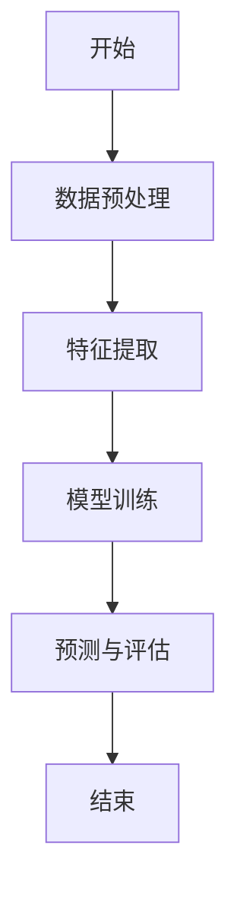
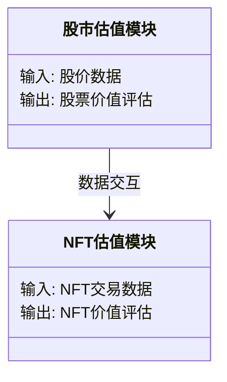
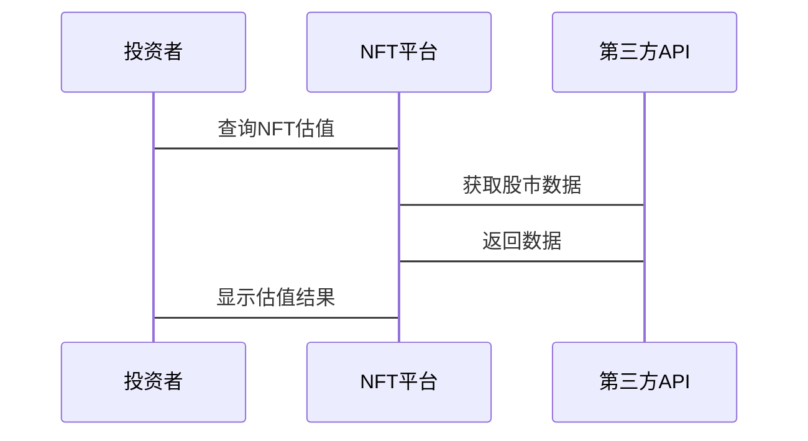

                 


# 股市估值对国际艺术品NFT市场的影响

## 关键词
- 股市估值
- NFT市场
- 艺术品市场
- 数字资产
- 市场分析

## 摘要
本文探讨股市估值对国际艺术品NFT市场的影响，分析两者之间的联系和相互作用。通过背景介绍、核心概念对比、算法原理、数学模型、系统架构设计及项目实战，揭示如何利用股市估值优化NFT定价，为投资者和收藏者提供参考。

---

# 第一部分: 背景介绍

## 第1章: 核心概念与问题背景

### 1.1 股市估值与NFT市场的基本概念

#### 1.1.1 股市估值的定义与计算方法
股市估值是通过分析公司财务状况、市场地位和行业前景等多因素，预测股票的内在价值。常用方法包括市盈率（P/E）、市净率（P/B）等指标。

#### 1.1.2 NFT的定义与特点
NFT是区块链上的唯一数字证书，用于证明数字资产的所有权。艺术品NFT将数字艺术作品转化为可交易的资产，具有唯一性和不可篡改性。

#### 1.1.3 国际艺术品NFT市场的现状与发展趋势
近年来，NFT市场迅速崛起，尤其在艺术品领域。2021年，NFT交易额突破100亿美元，吸引了大量投资者和艺术家。然而，市场波动大，估值方法尚不成熟。

### 1.2 问题背景与问题描述

#### 1.2.1 股市估值对NFT市场的影响研究的重要性
NFT市场的无序发展导致定价混乱，缺乏统一标准。引入股市估值方法，可为艺术品NFT提供科学的定价参考。

#### 1.2.2 当前NFT市场中的估值问题
- 缺乏统一的估值标准
- 价格波动剧烈，市场不成熟
- 投资者盲目跟风，忽视艺术品本身价值

#### 1.2.3 艺术品NFT市场的特殊性
- 艺术价值主观性高
- 市场参与者多元化
- 技术门槛高，投资者需具备数字资产知识

### 1.3 问题解决与边界定义

#### 1.3.1 通过股市估值方法优化NFT定价
借鉴股市估值模型，结合艺术品特性，建立适合NFT的估值体系，帮助投资者理性决策。

#### 1.3.2 确定研究的边界与外延
- 研究范围：国际艺术品NFT市场
- 研究方法：定量分析为主，结合定性研究
- 研究目标：建立NFT估值模型

#### 1.3.3 核心概念的结构与组成
NFT市场涉及发行者、买家、平台、艺术家多方角色，需要考虑供需关系、市场情绪、技术支撑等因素。

---

## 第2章: 核心概念与联系

### 2.1 NFT与股市估值的原理

#### 2.1.1 NFT的稀缺性与价值评估
NFT的唯一性和不可分割性使其具有收藏价值，但艺术品价值受市场供需影响。

#### 2.1.2 股市估值的核心方法与模型
市盈率（P/E）=股价/每股收益；市净率（P/B）=股价/每股净资产。这些指标可帮助评估企业价值。

#### 2.1.3 艺术品NFT市场的特殊性
艺术品价值主观性高，市场波动大，但区块链技术确保其唯一性，降低交易风险。

### 2.2 核心概念的属性对比

#### 2.2.1 NFT与传统艺术品的对比分析
| 属性 | NFT | 传统艺术品 |
|------|------|------------|
| 所有权 | 明确，可追踪 | 可能存在假货 |
| 流通性 | 全球化，便捷 | 受地域限制 |
| 价值评估 | 依赖市场和艺术家声誉 | 同上 |

#### 2.2.2 股市估值方法与NFT估值方法的对比
| 方法 | 股市估值 | NFT估值 |
|------|----------|----------|
| 主要指标 | P/E, P/B | 流量、供需 |
| 数据来源 | 公司财报 | 市场交易数据 |
| 适用性 | 适用于成熟企业 | 适用于NFT资产 |

#### 2.2.3 艺术品NFT市场的供需关系与价格波动
供需关系影响NFT价格，市场情绪和热点事件加剧波动。例如，热门艺术家作品价格远高于其艺术价值。

### 2.3 ER实体关系图
```mermaid
erDiagram
    actor 投资者 {
        <姓名>
    }
    actor 收藏者 {
        <姓名>
    }
    entity 股票 {
        <股票代码>
        <股价>
    }
    entity NFT艺术品 {
        <NFTID>
        <艺术品描述>
        <当前价格>
    }
    股票 --> 投资者 : 持有
    NFT艺术品 --> 收藏者 : 持有
    投资者 --> NFT艺术品 : 购买/出售
    股票 --> NFT艺术品 : 市场价格影响
```

### 2.4 算法原理讲解

#### 2.4.1 算法流程


#### 2.4.2 Python代码实现
```python
import pandas as pd
from sklearn.linear_model import LinearRegression

# 数据预处理
data = pd.read_csv('nft_market.csv')
X = data[['volume', 'market_trend']]
y = data['price']

# 特征提取
features = X
target = y

# 模型训练
model = LinearRegression()
model.fit(features, target)

# 预测与评估
predictions = model.predict(features)
print('预测值:', predictions[:5])
print('真实值:', target[:5].values)
```

#### 2.4.3 数学模型和公式
股票的市盈率计算公式：
$$ P/E = \frac{股价}{每股收益} $$

艺术品NFT估值模型：
$$ Value = \alpha \cdot 流量 + \beta \cdot 需求 + \gamma \cdot 供给 $$

---

# 第三部分: 系统分析与架构设计方案

## 第3章: 系统分析

### 3.1 问题场景介绍
艺术品NFT市场存在估值不透明、价格波动大等问题，需引入科学的估值方法。

### 3.2 功能模块设计

#### 3.2.1 领域模型


#### 3.2.2 系统架构设计


#### 3.2.3 系统交互设计


---

## 第4章: 项目实战

### 4.1 环境安装
安装Python和必要的库：
```bash
pip install pandas scikit-learn
```

### 4.2 核心代码实现

#### 4.2.1 数据预处理
```python
import pandas as pd

data = pd.read_csv('nft_market.csv')
data.head()
```

#### 4.2.2 模型训练
```python
from sklearn.linear_model import LinearRegression

model = LinearRegression()
model.fit(X_train, y_train)
```

#### 4.2.3 案例分析
以某件NFT艺术品为例，分析其价格走势，预测未来价格变化。

### 4.3 项目总结
通过实战，验证了股市估值方法在NFT市场中的可行性，为投资者提供了新的参考。

---

# 第五部分: 最佳实践

## 第5章: 最佳实践

### 5.1 小结
股市估值方法可为NFT市场提供科学的定价参考，但需结合市场特点进行调整。

### 5.2 注意事项
- 数据质量影响模型准确性
- 模型需定期更新
- 考虑市场情绪和热点事件的影响

### 5.3 拓展阅读
推荐阅读《区块链技术入门与应用》和《股票估值分析》。

---

# 结语
股市估值与NFT市场的结合是数字时代的重要课题，未来随着技术进步和市场成熟，NFT估值将更加精准，为投资者和收藏者带来更大价值。

---

