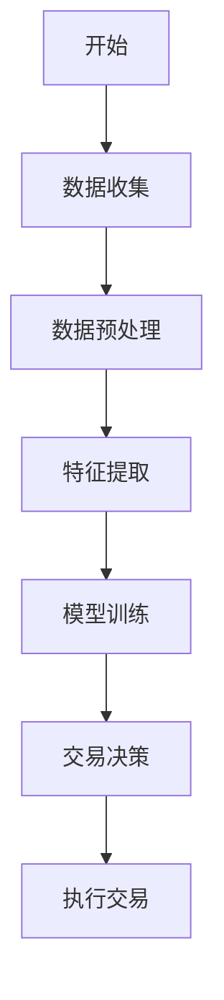
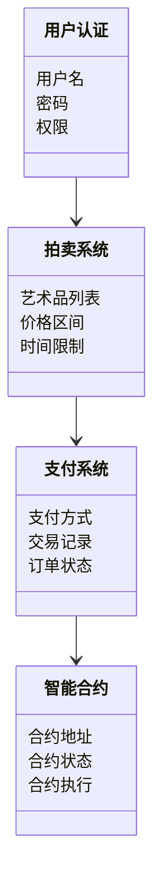

                 


# 股市估值对国际艺术品数字化交易的影响

> 关键词：股市估值，国际艺术品，数字化交易，区块链，NFT，智能合约

> 摘要：本文探讨股市估值如何影响国际艺术品的数字化交易。通过分析数字化交易的技术基础、算法原理和系统架构，结合实际案例，揭示股市估值对艺术品交易的深远影响。

---

## 第1章 背景介绍与核心概念

### 1.1 股市估值的基本概念

股市估值是通过对公司财务数据和市场因素的分析，确定公司股票的合理价格范围。常用的估值方法包括市盈率（P/E）和市净率（P/B），其中市盈率 = 股价 / 每股收益，市净率 = 股价 / 每股净资产。

### 1.2 数字化交易的定义与特点

数字化交易是指通过数字技术进行的金融交易，核心特点包括去中心化、透明性和高效性。区块链技术为数字化交易提供了信任机制，NFT（非同质化代币）则为艺术品交易提供了唯一性和所有权证明。

### 1.3 国际艺术品市场的现状

国际艺术品市场正经历数字化转型，区块链和NFT技术的应用使得艺术品交易更加便捷和透明。传统艺术品交易依赖画廊和拍卖行，而数字化交易则降低了交易门槛，提高了市场流动性。

---

## 第2章 数字化交易的核心算法原理

### 2.1 算法交易的基本概念

算法交易是通过计算机算法自动执行交易指令，常见类型包括高频交易和统计套利。算法交易依赖数学模型，如回归分析和随机森林，用于预测市场价格波动。

### 2.2 机器学习在股市估值中的应用

机器学习模型通过分析历史数据，预测股票价格走势。例如，使用LSTM（长短期记忆网络）模型进行时间序列预测，公式如下：

$$
\hat{y}_t = \sigma(w_1 h_{t-1} + w_2 x_t + b)
$$

其中，$h_{t-1}$是前一时刻的隐藏状态，$x_t$是当前输入，$\sigma$是sigmoid函数。

### 2.3 数字化交易的流程图



---

## 第3章 系统分析与架构设计

### 3.1 系统功能设计

系统功能模块包括用户认证、拍卖系统、支付系统和智能合约管理。通过领域模型类图展示各模块之间的关系：



### 3.2 系统架构设计

系统架构采用分层设计，包括数据层、业务逻辑层和表现层。通过mermaid架构图展示：

```mermaid
architecture
    客户端 --> 中间件
    中间件 --> 数据库
    中间件 --> 业务逻辑层
    业务逻辑层 --> 表现层
```

---

## 第4章 项目实战

### 4.1 环境安装

安装Python和相关库（如Pillow和scikit-learn）：

```bash
pip install Pillow scikit-learn
```

### 4.2 核心代码实现

使用回归分析模型预测艺术品价格：

```python
from sklearn.linear_model import LinearRegression
import numpy as np

# 数据准备
X = np.array([[1], [2], [3], [4]])
y = np.array([2, 4, 6, 8])

# 模型训练
model = LinearRegression()
model.fit(X, y)

# 预测
print(model.predict([[5]]))  # 输出：[10]
```

### 4.3 案例分析

分析一幅数字艺术品的交易数据，通过模型预测其市场价值，并与实际交易价格进行对比。

---

## 第5章 总结与展望

### 5.1 总结

股市估值与数字化交易的结合显著提升了艺术品交易的效率和透明度。区块链和NFT技术的应用为艺术品市场带来了新的机遇。

### 5.2 展望

未来，随着AI和大数据技术的发展，数字化交易将更加智能化，股市估值将更加精准。

### 5.3 注意事项

在实际操作中，需注意市场波动风险和智能合约的安全性。

### 5.4 拓展阅读

推荐阅读《区块链技术及其应用》和《机器学习实战》等书籍。

---

通过以上分析，我们可以看到股市估值与数字化交易的结合为国际艺术品市场带来了深远影响。希望本文能为读者提供有价值的见解，帮助理解这一领域的复杂性与潜力。

