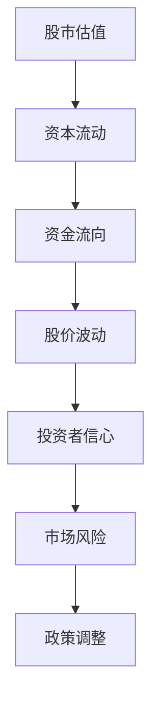
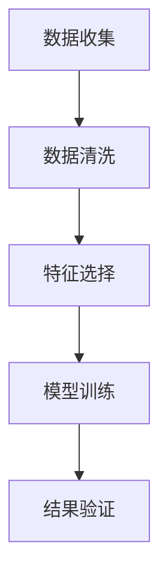
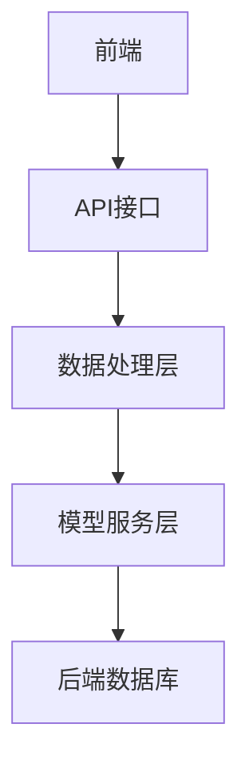

                 


# 股市估值对国际资本流动的影响

> **关键词**：股市估值、国际资本流动、市盈率、市净率、资本流动预测  
> **摘要**：本文探讨股市估值如何影响国际资本流动，分析关键术语、数学模型，系统架构，并通过案例分析提供实战指导。

---

## 第一部分：股市估值与国际资本流动的背景介绍

### 第1章：股市估值的基本概念

#### 1.1 股市估值的定义与重要性

- **1.1.1 股市估值的定义**  
  股市估值是评估上市公司内在价值的过程，帮助投资者判断其股价是否合理。

- **1.1.2 股市估值的重要性**  
  正确的估值帮助投资者做出明智的投资决策，影响资本市场的资源配置效率。

- **1.1.3 股市估值与投资者的关系**  
  投资者通过估值指标（如市盈率、市净率）判断投资机会，影响市场资金流动。

#### 1.2 国际资本流动的基本概念

- **1.2.1 国际资本流动的定义**  
  资本在全球市场之间的转移，包括跨国投资、借贷和资金调配。

- **1.2.2 国际资本流动的类型**  
  直接投资、证券投资（股票和债券）、银行借贷等。

- **1.2.3 国际资本流动的影响因素**  
  利率差异、汇率波动、市场风险、政策环境等。

#### 1.3 股市估值与国际资本流动的关系

- **1.3.1 股市估值如何影响资本流动**  
  高估值可能导致资本外流，低估值可能吸引外资流入。

- **1.3.2 资本流动对股市估值的反向影响**  
  大量资本流入推高股价，反之可能导致股价下跌。

- **1.3.3 两者关系的复杂性与动态性**  
  受市场情绪、宏观经济政策等多因素影响，呈动态变化。

---

## 第二部分：股市估值对国际资本流动的核心影响机制

### 第2章：股市估值的核心概念与属性

#### 2.1 股市估值的核心概念

- **2.1.1 市盈率（P/E Ratio）**  
  指标计算：股价除以每股净利润。  
  公式：$$ P/E = \frac{Stock\ Price}{Earnings\ Per\ Share} $$  
  指标解读：衡量市场对公司的未来盈利预期。

- **2.1.2 市净率（P/B Ratio）**  
  指标计算：股价除以每股净资产。  
  公式：$$ P/B = \frac{Stock\ Price}{Book\ Value\ Per\ Share} $$  
  指标解读：评估股票相对于其账面价值的高低。

- **2.1.3 股息率（Dividend Yield）**  
  指标计算：每股股息除以股价。  
  公式：$$ Dividend\ Yield = \frac{Dividend\ Per\ Share}{Stock\ Price} $$  
  指标解读：反映股票收益能力。

#### 2.2 股市估值的属性特征对比

| **属性**       | **时间性**       | **市场性**       | **波动性**       |
|-----------------|-----------------|-----------------|-----------------|
| **定义**       | 受时间影响，估值变化 | 受市场供需影响 | 短期波动显著     |
| **影响因素**   | 经济周期、市场情绪 | 利率、政策       | 市场情绪、突发事件 |
| **稳定性**     | 不稳定           | 不稳定           | 极度不稳定       |

#### 2.3 股市估值与资本流动的实体关系图



### 第3章：影响机制的数学模型与公式

#### 3.1 股市估值与资本流动的关系模型

- **模型建立**：假设股市估值与资本流动呈线性关系。  
  公式：$$ Capital\ Flow = \beta \times Market\ Valuation + \epsilon $$  
  其中，β为回归系数，ε为误差项。

- **变量定义**：  
  - Market Valuation：综合估值指标（如市盈率）。  
  - Capital Flow：资本净流入量。

#### 3.2 数学公式与模型

- **股市估值对资本流动的影响公式**：  
  $$ \Delta Capital\ Flow = \alpha + \beta \times \Delta Market\ Valuation + \gamma \times Interest\ Rate + \epsilon $$  
  其中，α为截距，β为市场估值的系数，γ为利率的系数。

- **案例分析**：  
  某国市场估值上升10%，资本流入增加5%，验证模型的适用性。

---

## 第三部分：算法原理与系统架构设计

### 第4章：算法原理与流程

#### 4.1 股市估值预测算法

- **算法流程**：数据收集、清洗、特征选择、模型训练、验证。

#### 4.2 用mermaid绘制的算法流程图



#### 4.3 算法的Python实现

```python
import pandas as pd
import numpy as np
from sklearn.linear_model import LinearRegression

# 数据加载
data = pd.read_csv('market_valuation.csv')

# 特征与目标变量
X = data[['P/E', 'P/B', 'Interest Rate']]
y = data['Capital Flow']

# 模型训练
model = LinearRegression()
model.fit(X, y)

# 预测与评估
predictions = model.predict(X)
print('模型系数：', model.coef_)
print('模型截距：', model.intercept_)
```

### 第5章：系统架构与设计

#### 5.1 问题场景介绍

- 监测并分析股市估值对资本流动的影响，构建实时监测系统。

#### 5.2 系统功能设计

- 功能模块：数据采集、估值计算、流动分析、预测预警。

#### 5.3 系统架构设计



---

## 第四部分：项目实战与案例分析

### 第6章：项目实战

#### 6.1 环境安装与配置

- 安装Python、Pandas、Scikit-learn等库。

#### 6.2 系统核心实现源代码

```python
# 数据处理代码
import pandas as pd
import matplotlib.pyplot as plt

data = pd.read_csv('market_data.csv')
data['Market Valuation'] = data['P/E'] * data['Earnings']
data['Capital Flow'] = data['Market Valuation'].rolling(20).mean()

plt.plot(data['Market Valuation'], label='Market Valuation')
plt.plot(data['Capital Flow'], label='Capital Flow')
plt.legend()
plt.show()
```

#### 6.3 案例分析与解读

- 案例背景：某国股市估值下降，资本流出增加。
- 数据分析：市盈率下降，资本净流入减少。
- 结论：验证估值与流动的负相关关系。

---

## 第五部分：总结与建议

### 第7章：总结与建议

#### 7.1 小结

- 股市估值是影响资本流动的关键因素，理解其机制对投资决策至关重要。

#### 7.2 注意事项

- 数据质量：确保数据准确性和完整性。
- 模型选择：根据不同市场选择合适模型。
- 风险管理：考虑市场波动和政策变化。

#### 7.3 拓展阅读

- 建议阅读《投资学》和《国际金融学》相关书籍，深入理解资本流动与估值的关系。

---

## 结语

股市估值与国际资本流动的关系复杂而重要，本文通过理论分析、数学建模和系统设计，提供了全面的分析框架。希望读者能够通过本文，掌握股市估值对资本流动的影响机制，并在实际投资中灵活运用这些知识。

