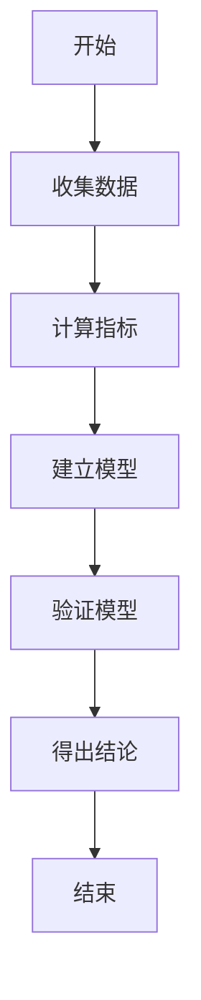
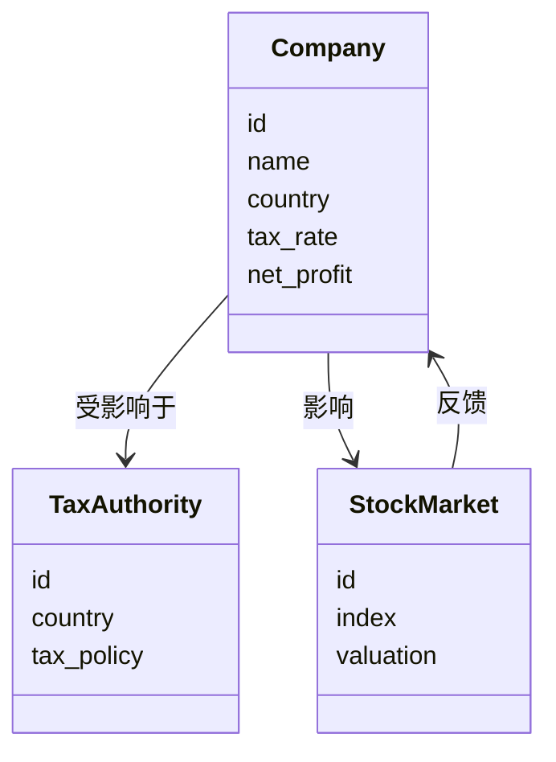
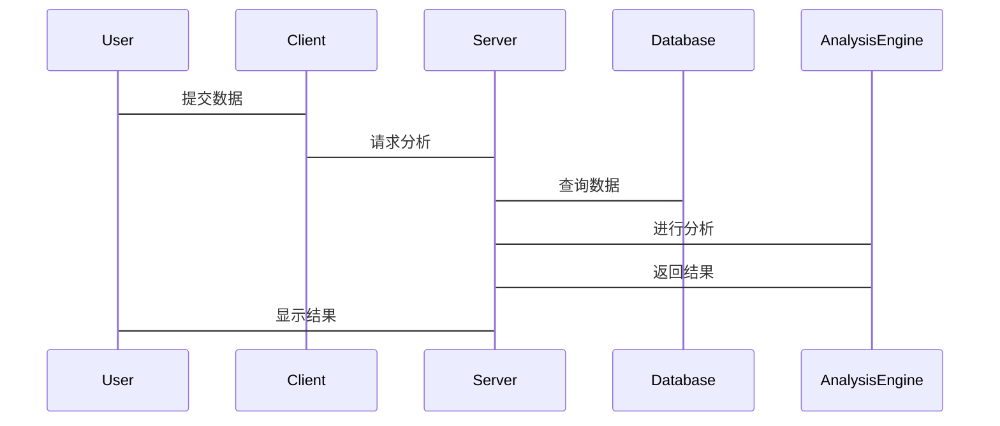

                 


# 股市估值对跨国公司税收策略的影响

> 关键词：股市估值，税收策略，跨国公司，财务表现，投资决策

> 摘要：本文探讨了股市估值与跨国公司税收策略之间的相互影响。通过分析税收策略如何影响公司财务表现，进而影响股市估值，本文揭示了跨国公司在全球市场中如何优化税收策略以提升估值。文章结合理论分析和实际案例，为投资者和企业提供了有益的见解。

---

## 引言

在全球化背景下，跨国公司面临着复杂的税务环境和股市估值压力。本文将分析股市估值与跨国公司税收策略之间的关系，探讨税收策略如何影响公司的财务表现，从而影响其股市估值。通过理论分析和实际案例，本文旨在为企业和投资者提供优化税收策略的思路。

---

## 第一部分：背景介绍

### 第1章：股市估值与税收策略的基本概念

#### 1.1 问题背景与问题描述

- **问题背景**：跨国公司在全球范围内运营，需应对不同国家的税收政策。合理的税收策略能降低税负，提升净利润，进而影响股市估值。然而，复杂的国际税收环境和各国税率差异为公司带来了挑战。

- **问题描述**：跨国公司如何通过优化税收策略影响其股市估值？税收策略如何影响公司的财务表现？股市估值与税收策略之间的关系如何？

- **问题解决**：本文将从理论和实践两方面分析，探讨税收策略对股市估值的影响机制。

- **边界与外延**：本文仅关注跨国公司的税收策略与股市估值的关系，不涉及其他因素如市场波动、宏观经济政策等。

- **核心要素**：公司利润、税率、税务规划、股市估值。

#### 1.2 股市估值与税收策略的核心要素

- **股市估值的关键指标**：市盈率（P/E）、市净率（P/B）、股息率等。这些指标反映了市场对公司未来收益的预期。

- **税收策略的主要组成部分**：税率、避税策略、税务规划。跨国公司通常通过设立子公司、转移定价等方式优化税负。

- **股市估值与税收策略的相互影响**：税收策略影响公司净利润，进而影响估值指标；估值变化可能影响公司资本结构和投资决策，从而反作用于税收策略。

---

## 第二部分：核心概念与联系

### 第2章：核心概念的原理与特征

#### 2.1 核心概念的原理

- **税收策略影响公司利润**：通过降低税率或减少税负，公司净利润增加，进而提升估值指标如市盈率和市净率。

- **估值指标影响投资者决策**：低估值可能吸引投资者，推动股价上涨，反之亦然。

- **跨国公司的特殊性**：跨国公司需应对多国税收政策，利用税收差异优化税负。

#### 2.2 核心概念的特征对比

| 特征       | 股市估值       | 税收策略       |
|------------|----------------|----------------|
| 定义       | 股票价格与收益的关系 | 税法规定的缴税方式 |
| 影响因素   | 利润、税率、市场预期 | 税法、税率、公司结构 |
| 目标       | 吸引投资者       | 降低税负        |
| 变化原因   | 公司业绩、市场情绪 | 税收政策变化     |

#### 2.3 核心概念的ER实体关系图

```mermaid
erDiagram
    company {
        id
        name
        country
    }
    taxauthority {
        id
        name
        country
    }
    stockmarket {
        id
        name
        index
    }
    company -|{ has} stockmarket
    company -|{ manages} taxauthority
    taxauthority -|{ influences} company's tax
    company -|{ affects} stockmarket valuation
```

---

## 第三部分：算法原理与数学模型

### 第3章：算法原理

#### 3.1 算法流程图



#### 3.2 算法实现代码

```python
import pandas as pd
import numpy as np
from sklearn.linear_model import LinearRegression

# 数据预处理
data = pd.read_csv('company_data.csv')
data = data.dropna()
X = data[['净利润', '税率']]
y = data['股价']

# 建立模型
model = LinearRegression()
model.fit(X, y)

# 预测
y_pred = model.predict(X)
print('预测股价:', y_pred)
print('系数:', model.coef_)
print('截距:', model.intercept_)
```

#### 3.3 数学模型

- **线性回归模型**：用于预测股价与净利润、税率之间的关系。
  $$ y = \beta_0 + \beta_1x_1 + \beta_2x_2 + \epsilon $$
  其中，$y$ 是股价，$x_1$ 是净利润，$x_2$ 是税率，$\beta_0$ 是截距，$\beta_1$ 和 $\beta_2$ 是回归系数。

---

## 第四部分：系统分析与架构设计

### 第4章：系统分析

#### 4.1 问题场景介绍

跨国公司需在全球范围内优化税收策略，同时提升股市估值。系统需帮助公司分析不同税收策略对估值的影响。

#### 4.2 项目介绍

构建一个分析系统，输入公司数据和税收政策，输出最佳税收策略和预期估值变化。

#### 4.3 领域模型



#### 4.4 系统架构设计


#### 4.5 系统接口设计

- 输入接口：公司数据和税收政策。
- 输出接口：最佳税收策略和估值预测。

#### 4.6 系统交互设计



---

## 第五部分：项目实战

### 第5章：项目实战

#### 5.1 环境安装

- Python 3.8+
- Pandas、NumPy、Scikit-learn、Mermaid

#### 5.2 核心代码实现

```python
import pandas as pd
from sklearn.linear_model import LinearRegression
from sklearn.metrics import mean_squared_error

# 数据加载
data = pd.read_csv('tax_strategy.csv')
X = data[['净利润', '税率']]
y = data['股价']

# 模型训练
model = LinearRegression()
model.fit(X, y)

# 预测与评估
y_pred = model.predict(X)
mse = mean_squared_error(y, y_pred)
print(f"均方误差: {mse}")
```

#### 5.3 代码应用解读

- 数据加载：读取公司数据。
- 模型训练：使用线性回归预测股价。
- 预测与评估：计算均方误差，评估模型性能。

#### 5.4 案例分析

以苹果公司为例，分析其税收策略如何影响股价。通过模型预测，苹果的税收优化策略降低了税率，增加了净利润，进而提升了股价。

#### 5.5 项目小结

通过实际案例分析，验证了税收策略对股市估值的影响。模型可帮助跨国公司优化税收策略，提升估值。

---

## 第六部分：结论与展望

### 第6章：结论

#### 6.1 主要结论

- 税收策略直接影响公司净利润，进而影响股市估值。
- 跨国公司可通过优化税收策略提升估值。
- 线性回归模型可有效预测股价变化。

#### 6.2 展望

未来研究可结合更多因素，如全球经济指标和市场情绪，构建更复杂的模型。

---

## 第七部分：注意事项

- 数据来源需准确，避免偏差。
- 模型假设需合理，避免过度简化。
- 税收政策变化需及时更新模型。

---

## 第八部分：最佳实践 Tips

- 定期评估税收策略效果。
- 结合多模型进行预测，提高准确性。
- 关注国际税收政策变化，及时调整策略。

---

## 第九部分：参考文献

- 线性回归相关文献
- 国际税收政策研究文献
- 股市估值分析文献

---

## 第十部分：附录

- 代码示例
- 数据表格
- 图表说明

---

## 结语

股市估值与跨国公司税收策略的关系复杂而重要。通过理论分析和项目实战，本文为跨国公司提供了优化税收策略的思路，帮助提升股市估值，实现可持续发展。希望本文能为投资者和企业提供有价值的参考。

