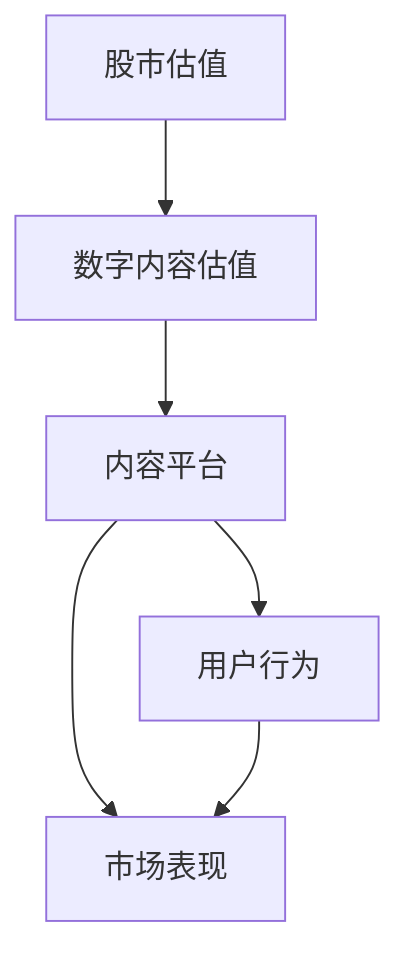
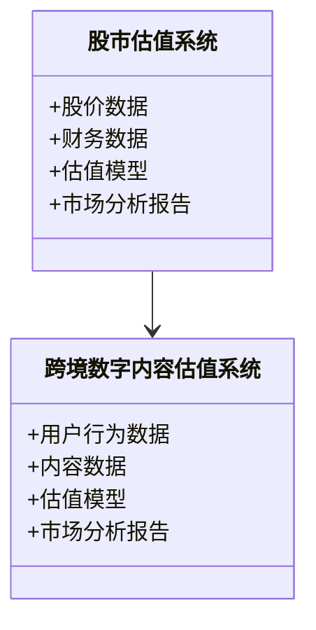

                 


# 股市估值对跨境数字内容估值的影响

> 关键词：股市估值，跨境数字内容，数字内容估值，估值模型，市场影响，技术分析

> 摘要：本文探讨股市估值对跨境数字内容估值的影响，从背景、核心概念、算法原理到系统架构设计，再到项目实战，全面分析两者之间的联系与差异，帮助读者理解如何将股市估值方法应用于数字内容行业的估值实践中。

---

## 第一部分: 背景介绍与核心概念

### 第1章: 股市估值与跨境数字内容估值的背景与问题

#### 1.1 股市估值的核心概念
股票估值是通过对公司财务状况、行业地位、市场前景等多方面因素的分析，确定公司股票的合理价格范围。常用的估值方法包括市盈率法、市净率法和现金流折现法。

- **市盈率法**：通过将公司股价除以每股收益（EPS）来计算。
- **市净率法**：通过将公司股价除以每股净资产（BPS）来计算。
- **现金流折现法**：通过将未来现金流折现到现值来计算公司价值。

#### 1.2 跨境数字内容估值的核心概念
跨境数字内容是指在全球范围内流通的数字化内容，如在线视频、音乐、电子书、游戏等。其估值涉及用户参与度、收入潜力、市场占有率等多个因素。

- **用户参与度模型**：通过分析用户的互动频率和留存率来预测内容的受欢迎程度。
- **收入预测模型**：通过分析用户数量和付费率来预测收入潜力。
- **市场占有率模型**：通过分析市场容量和竞争对手情况来预测市场占有率。

#### 1.3 股市估值与跨境数字内容估值的关联性
股市波动可能间接影响数字内容行业，例如股市资金流动可能导致数字内容企业的融资成本变化。同时，数字内容估值的波动也可能影响相关企业的股票价格。

---

### 第2章: 核心概念与联系

#### 2.1 股市估值与跨境数字内容估值的核心要素对比
| 核心要素 | 股市估值 | 跨境数字内容估值 |
|----------|----------|------------------|
| 估值目标 | 确定股票价格 | 确定数字内容价值 |
| 估值方法 | 市盈率、市净率、现金流折现 | 用户参与度、收入预测、市场占有率 |
| 风险因素 | 市场波动、政策变化 | 用户流失、内容抄袭、技术风险 |

#### 2.2 股市估值与跨境数字内容估值的ER实体关系图


#### 2.3 股市估值与跨境数字内容估值的系统性联系
- **系统性风险的传导机制**：股市波动可能通过资本市场的传导影响数字内容企业的融资成本和投资决策。
- **数字内容行业的周期性波动**：数字内容行业的兴衰可能与股市的整体波动相关联。
- **股市资金流动对数字内容市场的潜在影响**：股市资金的流入流出可能影响数字内容企业的资金链，从而影响其估值。

---

## 第二部分: 算法原理与数学模型

### 第3章: 股市估值的核心算法与数学模型

#### 3.1 股市估值的主要方法
- **市盈率法**：计算公式为：
  $$ P/E = \frac{Price}{Earnings} $$
- **市净率法**：计算公式为：
  $$ P/B = \frac{Price}{Book\ Value} $$
- **现金流折现法**：计算公式为：
  $$ V = \sum_{t=1}^{n} \frac{CF_t}{(1+r)^t} + \frac{TV}{(1+r)^n} $$

### 第4章: 跨境数字内容估值的核心算法与数学模型

#### 4.1 数字内容估值的主要方法
- **用户参与度预测模型**：计算公式为：
  $$ U = a \cdot \text{互动频率} + b \cdot \text{用户留存率} $$
- **收入预测模型**：计算公式为：
  $$ R = c \cdot \text{用户数} + d \cdot \text{付费率} $$

---

## 第三部分: 系统分析与架构设计

### 第5章: 股市估值与跨境数字内容估值的系统分析

#### 5.1 问题场景介绍
- 股市波动可能对数字内容行业的估值产生影响，例如，股市下跌可能导致数字内容企业的融资成本上升，进而影响其估值。

#### 5.2 系统功能设计
- **领域模型**：通过类图展示系统中的各个角色及其关系。
- **系统架构图**：展示系统的整体架构，包括数据源、数据处理层、估值模块等。



---

## 第四部分: 项目实战

### 第6章: 项目实战

#### 6.1 环境安装
- 安装Python和相关库（如Pandas、NumPy、Matplotlib）。

#### 6.2 核心实现
- 使用Python编写用户参与度预测模型：

```python
import pandas as pd
import numpy as np

# 数据加载
data = pd.read_csv('user_behavior.csv')

# 用户参与度预测模型
def user_engagement_model(data):
    a = 0.5
    b = 0.5
    engagement = a * data['互动频率'] + b * data['用户留存率']
    return engagement

# 计算并保存结果
engagement_scores = user_engagement_model(data)
data['用户参与度'] = engagement_scores
data.to_csv('engagement_scores.csv', index=False)
```

---

## 第五部分: 最佳实践与总结

### 第7章: 最佳实践与总结

#### 7.1 小结
- 股市估值和数字内容估值在方法和目标上有一定的相似性和差异性。
- 通过结合两者的估值方法，可以更全面地评估数字内容的价值。

#### 7.2 注意事项
- 在实际应用中，需要注意数据的准确性和模型的可解释性。
- 需要结合具体行业特点进行调整和优化。

#### 7.3 拓展阅读
- 建议进一步学习时间序列分析在股市预测中的应用。
- 探索机器学习算法在数字内容估值中的应用。

---

通过以上分析和实践，我们可以更好地理解股市估值对跨境数字内容估值的影响，并将其应用于实际的商业决策中。

