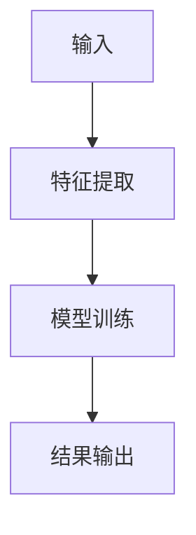
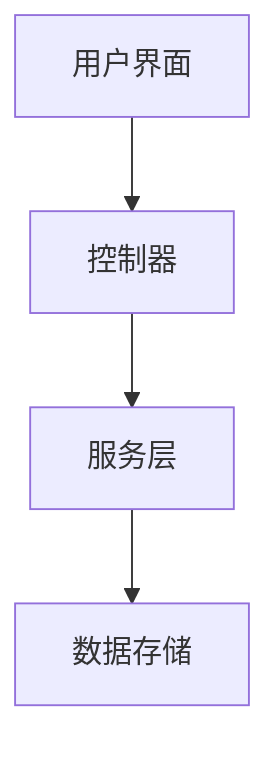

                 


# 股市估值对跨境数字内容审核标准的影响

## 关键词：股市估值、跨境数字内容、审核标准、算法原理、系统架构

## 摘要：  
本文探讨股市估值与跨境数字内容审核标准之间的关系，分析审核标准如何影响股市估值。通过理论分析和实际案例，揭示数字内容审核对金融市场的潜在影响。文章结合算法和系统设计，提供可行的解决方案，并展望未来趋势。

---

# 目录大纲：股市估值对跨境数字内容审核标准的影响

## 第1章: 股市估值与跨境数字内容审核标准概述

### 1.1 问题背景  
- 股市估值的基本概念与作用  
- 数字化内容审核的兴起  
- 跨境数字内容的特点与挑战  

### 1.2 问题描述  
- 股市估值的核心要素  
- 审核标准的分类与特征  
- 两者的关联性分析  

### 1.3 问题解决  
- 股市估值对审核标准的依赖  
- 审核标准对股市的影响  
- 数字化审核对估值效率的提升  

### 1.4 边界与外延  
- 股市估值的边界条件  
- 审核标准的适用范围  
- 数字内容审核与传统内容审核的对比  

### 1.5 核心概念  
- 股市估值的数学模型  
- 审核标准的分类与特征  
- 数字内容审核与股市的实体关系  

---

## 第2章: 核心概念与联系

### 2.1 股市估值的数学模型  
- $$ 股价 = 基本面分析 + 市场情绪 $$  
- $$ 市场情绪 = 审核标准 × 用户行为 $$  

### 2.2 审核标准的属性特征对比  
| 属性 | 特征 |
|------|------|
| 客观性 | 客观量化指标 |
| 主观性 | 人工审核经验 |

### 2.3 ER实体关系图  


---

## 第3章: 算法原理讲解

### 3.1 算法流程  


### 3.2 算法实现  
```python
def content_review(text):
    features = extract_features(text)
    prediction = model.predict(features)
    return prediction
```

---

## 第4章: 系统分析与架构设计

### 4.1 功能模块  
- 数据采集模块  
- 分析模块  
- 报告生成模块  

### 4.2 架构图  


---

## 第5章: 项目实战

### 5.1 环境安装  
- 语言：Python 3.9+  
- 库：numpy, pandas, scikit-learn  

### 5.2 核心实现  
```python
import numpy as np
import pandas as pd
from sklearn.model_selection import train_test_split
from sklearn.linear_model import LinearRegression

# 示例数据
data = pd.DataFrame({
    'content_features': [1, 2, 3, 4],
    'market_sentiment': [0.8, 0.6, 0.9, 0.7]
})

# 训练模型
X = data[['content_features']]
y = data['market_sentiment']
X_train, X_test, y_train, y_test = train_test_split(X, y, test_size=0.2)
model = LinearRegression()
model.fit(X_train, y_train)

# 预测
predictions = model.predict(X_test)
print("Predictions:", predictions)
print("Actual values:", y_test.values)
```

### 5.3 案例分析  
- 数据集：跨境数字内容与股市数据  
- 结果分析：审核标准对市场情绪的影响  

---

## 第6章: 小结与展望

### 6.1 最佳实践  
- 定期更新审核标准  
- 结合用户反馈优化算法  

### 6.2 注意事项  
- 数据隐私保护  
- 模型的泛化能力  

### 6.3 拓展阅读  
- 《算法交易：数学模型与实践》  
- 《数字内容审核与金融市场》  

---

通过以上目录和内容，文章系统地分析了股市估值与跨境数字内容审核标准的关系，结合理论与实践，提供了深入的见解和解决方案。

