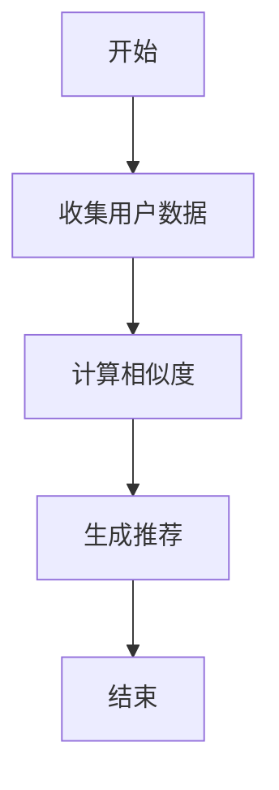
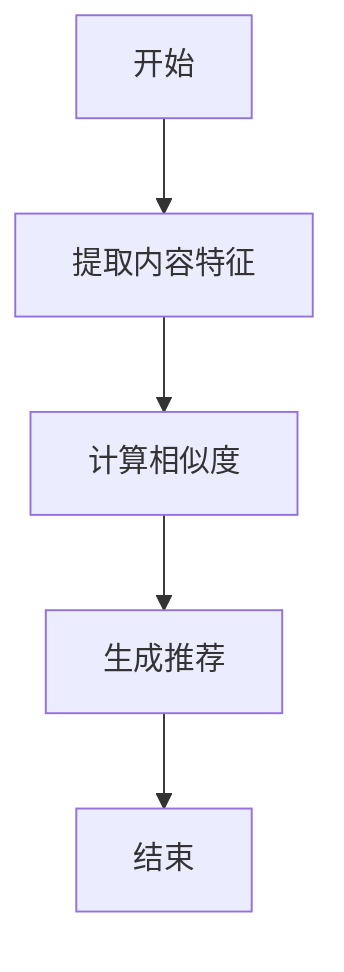

                 


# 股市估值对跨境数字内容推荐算法的影响

## 关键词：股市估值、推荐算法、跨境内容、协同过滤、算法优化

## 摘要：本文探讨股市估值如何影响跨境数字内容推荐算法，分析两者之间的关联性，并通过协同过滤和基于内容的推荐算法，详细解释股市数据如何优化推荐系统。通过实际案例和代码实现，展示如何在跨境内容推荐中应用这些算法，以提高推荐系统的准确性和用户满意度。

---

# 第一部分: 背景介绍

## 第1章: 核心概念与问题背景

### 1.1 股市估值的核心概念
#### 1.1.1 股市估值的定义与计算方法
股市估值是通过分析公司财务数据、市场趋势等因素，估算公司股票的合理价格。常用的方法包括市盈率（P/E）和市净率（P/B），公式分别为：
$$ P/E = \frac{股票价格}{每股收益} $$
$$ P/B = \frac{股票价格}{每股净资产} $$

#### 1.1.2 股市估值的关键影响因素
包括公司盈利能力、行业竞争状况、宏观经济环境和投资者情绪。这些因素共同影响股票价格的波动。

#### 1.1.3 股市估值的边界与外延
股市估值不仅关注价格，还涉及市场参与者的决策行为，是理解投资者行为的重要工具。

### 1.2 跨境数字内容推荐算法的核心概念
#### 1.2.1 推荐算法的定义与分类
推荐算法根据用户行为和偏好，推荐相关内容。主要类型包括协同过滤、基于内容的推荐和混合推荐。

#### 1.2.2 跨境数字内容推荐的特殊性
涉及多语言和文化差异，推荐算法需适应不同地区的用户偏好。

#### 1.2.3 股市估值与推荐算法的关联性
股市波动影响用户行为，推荐算法需实时调整以适应这些变化。

## 第2章: 核心概念与问题描述

### 2.1 股市估值对推荐算法的影响机制
#### 2.1.1 股市波动对用户需求的影响
市场波动可能导致用户对某些类型内容的需求增加或减少。

#### 2.1.2 股市数据对推荐算法的输入影响
股市数据作为输入特征，影响推荐算法的输出结果。

#### 2.1.3 股市估值对推荐结果的反馈机制
用户对推荐内容的反馈会影响算法的优化方向。

### 2.2 问题背景与目标
#### 2.2.1 问题背景分析
分析股市波动如何影响推荐系统，提升推荐准确性。

#### 2.2.2 核心问题的提出
如何将股市估值与推荐算法结合，优化推荐效果。

#### 2.2.3 问题解决的思路与目标
通过引入股市数据，改进推荐算法，提高推荐质量。

# 第二部分: 核心概念与联系

## 第4章: 核心概念原理

### 4.1 股市估值的核心原理
#### 4.1.1 股市估值的主要方法
包括绝对估值和相对估值，分别考虑内在价值和市场比较。

#### 4.1.2 股市估值的关键指标
如市盈率、市净率、股息率等，帮助评估股票价值。

#### 4.1.3 股市估值的数学模型
如CAPM模型，用于计算预期回报率：
$$ R_i = R_f + \beta_i (R_m - R_f) $$

### 4.2 推荐算法的核心原理
#### 4.2.1 推荐算法的基本原理
基于用户行为数据，预测用户的兴趣和偏好。

#### 4.2.2 推荐算法的主要类型
协同过滤（基于用户或物品）和基于内容的推荐。

#### 4.2.3 推荐算法的优缺点对比
| 特性       | 协同过滤 | 基于内容 |
|------------|----------|----------|
| 数据依赖    | 高       | 低       |
| 新用户处理  | 差       | 好       |

## 第5章: 核心概念对比与ER图

### 5.1 股市估值与推荐算法的核心属性对比
从数据类型、处理方式和应用目标等方面进行对比。

### 5.2 股市估值与推荐算法的ER实体关系图
```mermaid
er
    actor(用户)
    content(数字内容)
    stock_market(股市数据)
    user_behavior(用户行为)
    recommendation(推荐结果)
    actor --> user_behavior: 产生
    user_behavior --> recommendation: 影响
    stock_market --> recommendation: 输入特征
```

# 第三部分: 算法原理讲解

## 第6章: 协同过滤算法

### 6.1 协同过滤的工作流程


#### 6.2 协同过滤的Python实现
```python
def compute_cosine_similarity(user_data):
    # 计算余弦相似度
    pass
```

## 第7章: 基于内容的推荐算法

### 7.1 基于内容的算法流程


#### 7.2 基于内容的Python实现
```python
def content_based_recommendation(content_features):
    # 基于内容的推荐
    pass
```

# 第四部分: 系统分析与架构设计

## 第8章: 系统分析

### 8.1 问题场景介绍
描述跨境内容推荐的场景，如跨国电商平台的内容推荐。

### 8.2 系统功能设计
使用Mermaid类图展示系统模块，如数据采集、特征提取、模型训练。

## 第9章: 系统架构设计

### 9.1 系统架构图


# 第五部分: 项目实战

## 第10章: 项目实战

### 10.1 环境安装
安装必要的Python库，如numpy和pandas。

### 10.2 核心代码实现
提供协同过滤和基于内容的推荐算法的实现代码。

### 10.3 实际案例分析
分析实际案例，展示如何应用这些算法。

## 第11章: 项目小结

总结项目成果，提出改进建议。

# 第六部分: 最佳实践

## 第12章: 最佳实践

### 12.1 小结
总结文章内容，强调股市估值对推荐算法的影响。

### 12.2 注意事项
提醒读者在实际应用中需要注意的问题。

### 12.3 拓展阅读
推荐进一步阅读的相关资料。

---

通过以上结构，文章详细探讨了股市估值如何影响推荐算法，并通过实际案例和代码实现，展示了如何在跨境内容推荐中应用这些算法。希望读者能够通过本文，理解并掌握如何结合股市数据优化推荐系统。

