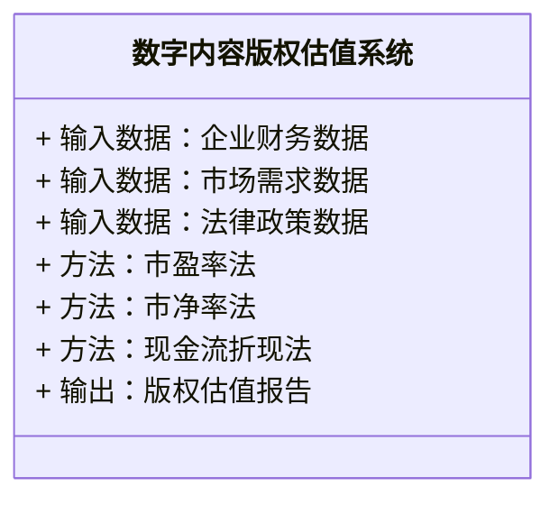

                 


# 股市估值对跨境数字内容版权估值的影响

> 关键词：股市估值，数字内容版权，跨境版权，市盈率，市净率，数字版权估值

> 摘要：本文探讨了股市估值方法对跨境数字内容版权估值的影响，分析了数字内容版权的核心属性、估值方法及其与股市估值的联系，提出了基于股市估值的数字内容版权估值模型和算法，并通过实际案例进行了验证和优化。

---

## 第1章: 股市估值与数字内容版权估值的背景

### 1.1 股市估值的核心概念
#### 1.1.1 股票估值的基本原理
股票估值是通过对企业的财务状况、市场地位、盈利能力等多方面因素进行分析，估算其股票的内在价值。常用的估值方法包括市盈率（P/E）、市净率（P/B）和现金流折现法（DCF）等。

#### 1.1.2 市盈率与市净率的定义与计算
- **市盈率（P/E）**：市盈率 = 股价 / 每股净利润。  
- **市净率（P/B）**：市净率 = 股价 / 每股净资产。  

#### 1.1.3 数字内容版权的特性与价值评估
数字内容版权具有可复制性、无形性和全球性等特点，其价值受市场需求、版权保护、技术发展等因素影响。

---

### 1.2 数字内容版权的定义与属性
#### 1.2.1 数字内容版权的定义
数字内容版权是指对数字化作品（如音乐、视频、软件、文学作品等）的知识产权，包括复制权、分发权和使用权等。

#### 1.2.2 数字内容版权的核心属性对比
| 特性 | 数字内容版权 | 传统版权 |
|------|--------------|----------|
| 转移性 | 可快速复制和分发 | 需物理载体支持 |
| 保护性 | 依赖数字技术保护 | 依赖法律保护 |
| 全球性 | 可跨境分发 | 地域限制较强 |

#### 1.2.3 数字内容版权与传统版权的区别
数字内容版权的核心区别在于其易于跨境分发和快速复制，这使得其估值受市场需求和技术因素影响更大。

---

### 1.3 跨境数字内容版权的特点
#### 1.3.1 跨境数字内容的定义
跨境数字内容是指在全球范围内可在线分发和使用的数字化作品，如Netflix的流媒体服务、Spotify的音乐订阅等。

#### 1.3.2 跨境数字内容版权的挑战
- 市场需求的波动性：不同国家的消费者偏好差异大，影响版权价值。
- 法律保护的差异性：不同国家的版权法和税收政策不同，增加了估值复杂性。

#### 1.3.3 跨境数字内容版权的法律与经济影响
跨境版权的估值需考虑税收、汇率、法律风险等多方面因素。

---

## 第2章: 股市估值方法与数字内容版权估值的联系

### 2.1 股市估值的主要方法
#### 2.1.1 市盈率法
市盈率法通过比较企业与同行业企业的市盈率差异，估算目标企业的股价。

#### 2.1.2 市净率法
市净率法通过比较企业与同行业企业的市净率差异，估算目标企业的股价。

#### 2.1.3 现金流折现法
现金流折现法通过预测企业的未来现金流，将其折现为当前价值。

---

### 2.2 数字内容版权估值的核心要素
#### 2.2.1 数字内容版权的市场需求
市场需求包括用户的消费能力、版权类型（如音乐、视频）等。

#### 2.2.2 数字内容版权的供给能力
供给能力包括内容创作能力、技术分发能力等。

#### 2.2.3 数字内容版权的法律保护
法律保护包括版权登记、侵权打击力度等。

---

### 2.3 股市估值方法在数字内容版权估值中的应用
#### 2.3.1 市盈率法在数字内容版权估值中的应用
通过比较同类数字内容企业的市盈率，估算目标企业的版权价值。

#### 2.3.2 市净率法在数字内容版权估值中的应用
通过比较同类数字内容企业的市净率，估算目标企业的版权价值。

#### 2.3.3 现金流折现法在数字内容版权估值中的应用
通过预测数字内容企业的未来现金流，折现为当前价值。

---

## 第3章: 股市估值对数字内容版权估值的影响机制

### 3.1 数字内容版权的市场价值评估
#### 3.1.1 数字内容版权的市场价值构成
市场价值包括内容的吸引力、分发能力、用户基数等。

#### 3.1.2 数字内容版权的市场需求与供给分析
需求分析：用户对不同类型数字内容的需求量。  
供给分析：市场上数字内容的供给能力。

#### 3.1.3 数字内容版权的市场波动与风险
市场波动包括政策变化、技术革新等。

---

### 3.2 股市波动对数字内容版权估值的影响
#### 3.2.1 股市波动对数字内容版权价值的影响
股市波动会导致数字内容企业的市值波动，进而影响版权估值。

#### 3.2.2 数字内容版权估值的周期性与波动性
数字内容版权估值受市场需求和股市波动的双重影响，具有周期性。

#### 3.2.3 股市环境对数字内容版权估值的调节作用
股市环境通过影响企业的融资能力和投资者信心，调节数字内容版权估值。

---

### 3.3 数字内容版权估值的外部影响因素
#### 3.3.1 政策法规对数字内容版权估值的影响
政策法规包括版权保护法、税收政策等，影响数字内容版权的市场价值。

#### 3.3.2 技术发展对数字内容版权估值的影响
技术发展包括区块链、人工智能等，影响数字内容的分发和保护。

#### 3.3.3 市场竞争对数字内容版权估值的影响
市场竞争包括同类型内容的供给量和价格，影响数字内容版权的价值。

---

## 第4章: 股市估值对数字内容版权估值的数学模型与算法

### 4.1 数字内容版权估值的数学模型
#### 4.1.1 数字内容版权估值的基本模型
$$ V = \alpha \times E + \beta \times F $$
其中，$V$为估值，$E$为企业的盈利，$F$为企业的资产。

#### 4.1.2 数字内容版权估值的改进模型
$$ V = \alpha \times E + \beta \times F + \gamma \times G $$
其中，$G$为企业的技术优势。

#### 4.1.3 数字内容版权估值的验证与优化
通过实际数据验证模型的准确性，并进行参数优化。

---

### 4.2 股市估值对数字内容版权估值的影响算法
#### 4.2.1 基于市盈率的数字内容版权估值算法
1. 计算目标企业的每股收益（EPS）。  
2. 比较同行业企业的市盈率，估算目标企业的股价。

#### 4.2.2 基于市净率的数字内容版权估值算法
1. 计算目标企业的每股净资产（BVPS）。  
2. 比较同行业企业的市净率，估算目标企业的股价。

#### 4.2.3 基于现金流折现的数字内容版权估值算法
1. 预测目标企业的未来现金流。  
2. 使用适当的折现率，计算现金流的现值。

---

## 第5章: 数字内容版权估值的系统分析与架构设计

### 5.1 系统功能设计
#### 5.1.1 领域模型（Mermaid类图）


#### 5.1.2 系统架构设计（Mermaid架构图）
```mermaid
context 数字内容版权估值系统 {
    participant 用户
    participant 数据采集模块
    participant 估值计算模块
    participant 报告生成模块
    用户 --> 数据采集模块: 提供数据
    数据采集模块 --> 估值计算模块: 传输数据
    估值计算模块 --> 报告生成模块: 输出估值结果
}
```

---

## 第6章: 项目实战与案例分析

### 6.1 项目环境安装
- 安装Python、Pandas、Scikit-learn等工具。

### 6.2 核心代码实现
```python
import pandas as pd
import numpy as np

# 示例数据：数字内容企业的财务数据
data = {
    '企业': ['A', 'B', 'C'],
    '收入': [100, 150, 200],
    '净利润': [20, 30, 40],
    '市盈率': [15, 20, 25]
}
df = pd.DataFrame(data)

# 计算市盈率
def calculate_pe_ratio(revenue, net_profit):
    return revenue / net_profit

df['计算市盈率'] = df.apply(lambda x: calculate_pe_ratio(x['收入'], x['净利润']), axis=1)

# 比较市盈率
print(df)
```

---

## 第7章: 总结与展望

### 7.1 本章小结
本文通过分析股市估值方法，提出了数字内容版权估值的数学模型和算法，并通过案例验证了其有效性。

### 7.2 最佳实践 tips
- 在实际应用中，建议结合多种估值方法进行综合评估。  
- 注意考虑政策和市场波动对估值的影响。  

### 7.3 注意事项
- 数据采集应尽量全面，以提高估值的准确性。  
- 模型优化需结合实际数据进行调整。  

### 7.4 拓展阅读
- 推荐阅读《股票估值的奥秘》、《数字版权保护与估值》等书籍。

---

通过以上章节的分析与讲解，读者可以全面理解股市估值对数字内容版权估值的影响，并能够将其应用于实际的数字内容版权评估中。

