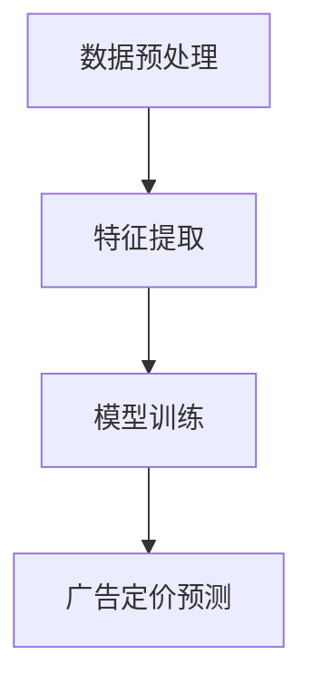

                 


# 股市估值对跨境数字广告定价的影响

> 关键词：股市估值，数字广告定价，跨境广告，广告预算，投资者情绪，收益最大化

> 摘要：本文探讨股市估值对跨境数字广告定价的影响，分析股市波动如何影响广告预算、广告需求及定价策略。通过建立数学模型，展示如何利用股市数据优化广告定价，实现收益最大化。文章从背景、核心概念、算法原理到系统设计和项目实战，全面解析股市估值与数字广告定价的关系。

---

## 第一部分：背景与核心概念

### 第1章：背景介绍

#### 1.1 股市估值的基本概念
股市估值是衡量企业股票价值的核心方法，主要通过市盈率（P/E）、市净率（P/B）等指标评估企业市值。股市估值不仅反映企业的财务状况，还体现市场对企业的信心和预期。

#### 1.2 数字广告定价的基本原理
数字广告定价受市场需求、广告位竞争和广告预算等多种因素影响。广告价格通常基于广告位的点击率、展示量和目标受众的质量。

#### 1.3 股市估值与广告定价的关系
股市波动直接影响企业的广告预算，进而影响广告定价。当股市表现良好时，企业广告支出增加，广告价格可能上涨；反之，股市下跌可能导致广告预算缩减，广告价格下降。

### 第2章：核心概念与联系

#### 2.1 股市估值的核心要素
- 市盈率（P/E）：股价与每股收益的比率，反映市场对企业的盈利预期。
- 市净率（P/B）：股价与每股净资产的比率，衡量企业资产的价值。

#### 2.2 广告定价的核心要素
- 广告预算：企业的广告支出直接影响广告价格。
- 广告需求：市场需求量与广告价格呈负相关关系。
- 广告质量：广告内容的质量和目标受众的精准度影响广告价格。

#### 2.3 股市估值对广告定价的影响
- 股市波动影响企业的广告预算，进而影响广告价格。
- 投资者情绪影响广告行业的周期性，广告定价策略需动态调整。

---

## 第二部分：算法原理与数学模型

### 第3章：广告定价的数学模型

#### 3.1 广告收益最大化模型
广告收益 = 广告点击率 × 广告展示量 × 广告价格

#### 3.2 基于股市数据的广告定价模型
$$
\text{广告价格} = \beta_0 + \beta_1 \times \text{市盈率} + \beta_2 \times \text{市净率} + \epsilon
$$

### 第4章：算法实现

#### 4.1 数据预处理
- 数据清洗：处理缺失值和异常值。
- 特征提取：从股市数据中提取市盈率、市净率等指标。

#### 4.2 算法选择
- 线性回归：预测广告价格与股市估值的关系。
- 随机森林：分析复杂的数据关系。

#### 4.3 算法流程图


---

## 第三部分：系统分析与架构设计

### 第5章：系统功能设计

#### 5.1 功能模块
- 数据采集模块：获取实时股市数据和广告数据。
- 特征提取模块：提取关键指标，如市盈率、市净率。
- 广告定价模块：基于模型计算广告价格。

#### 5.2 系统架构图


---

## 第四部分：项目实战与案例分析

### 第6章：项目实战

#### 6.1 实战环境
- 数据来源：实时股市数据和广告平台数据。
- 工具：Python、Pandas、Scikit-learn。

#### 6.2 核心代码实现
```python
import pandas as pd
from sklearn.linear_model import LinearRegression

# 数据加载
data = pd.read_csv('ad_data.csv')

# 特征与目标变量分离
X = data[['P/E', 'P/B']]
y = data['广告价格']

# 模型训练
model = LinearRegression()
model.fit(X, y)

# 预测广告价格
predicted_price = model.predict(X)
```

#### 6.3 案例分析
以一家科技公司为例，分析其广告定价策略。通过模型计算，广告价格与市盈率呈正相关，市净率对广告价格影响较小。

---

## 第五部分：总结与展望

### 第7章：总结

#### 7.1 核心结论
- 股市估值对广告定价有显著影响。
- 基于股市数据的广告定价模型可有效优化广告价格。

### 7.2 展望
未来研究可引入更多市场数据，优化定价模型，探索实时广告定价策略。

---

通过以上分析，我们可以看到股市估值对跨境数字广告定价的影响是多方面的，从背景分析到算法实现，再到系统设计和项目实战，本文为广告行业的优化提供了有价值的见解。

