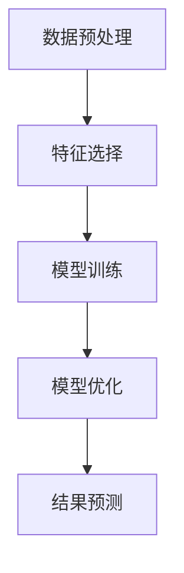
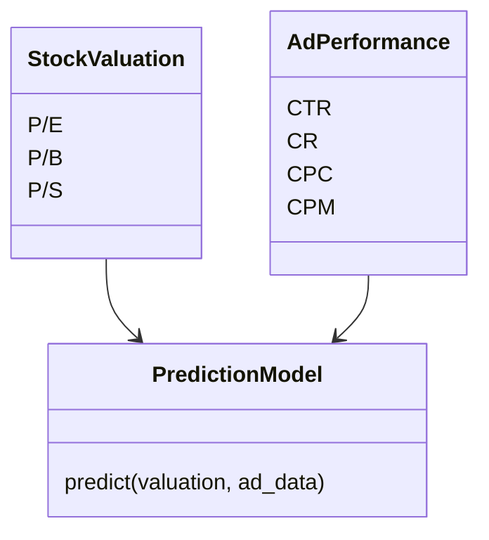
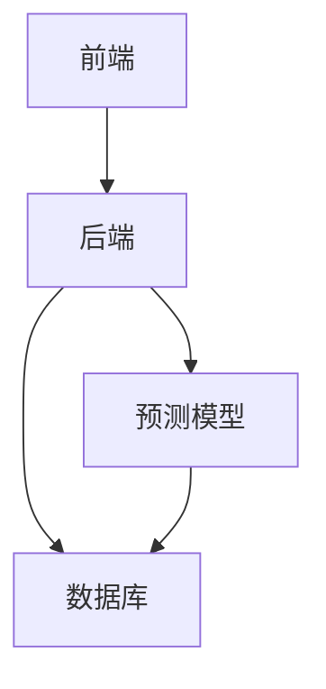
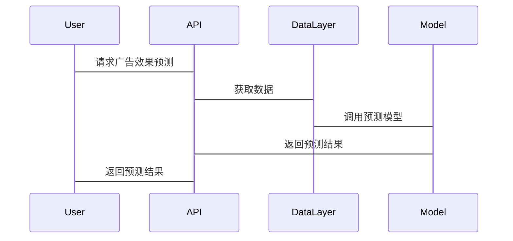

                 


# 目录大纲：《股市估值对跨境数字广告效果评估的影响》

---

## 第一部分：背景介绍

### 第1章：股市估值与跨境数字广告概述

#### 1.1 股市估值的基本概念
- 1.1.1 股市估值的定义与核心要素
  - 股市估值是衡量企业价值的重要指标，包括市盈率（P/E）、市净率（P/B）等。
- 1.1.2 股市估值的主要方法
  - 现金流折现模型（DCF）、市盈率模型、市净率模型。
- 1.1.3 股市估值与企业价值的关系
  - 股市估值反映市场对企业的信心和预期。

#### 1.2 跨境数字广告的基本概念
- 1.2.1 跨境数字广告的定义与特点
  - 跨境广告针对不同地区的用户，具有本地化和全球化特点。
- 1.2.2 跨境数字广告的主要形式
  - 搜索引擎广告、社交媒体广告、程序化广告。
- 1.2.3 跨境数字广告的市场现状
  - 数字广告支出增长迅速，技术驱动行业变革。

#### 1.3 股市估值与跨境数字广告的关系
- 1.3.1 股市估值对广告效果的影响
  - 股市波动影响广告预算和投放策略。
- 1.3.2 跨境广告如何影响企业市值
  - 广告效果提升企业收入，间接影响市值。
- 1.3.3 两者关系的理论框架
  - 通过数据驱动的方法，建立两者之间的关联模型。

---

## 第二部分：核心概念与联系

### 第2章：股市估值的核心原理

#### 2.1 股市估值的关键指标
- 市盈率（P/E）：市盈率 = 股价 / 每股净利润。
- 市净率（P/B）：市净率 = 股价 / 每股净资产。
- 市销率（P/S）：市销率 = 股价 / 每股收入。

#### 2.2 股票定价模型
- 现金流折现模型（DCF）：通过未来现金流的现值评估企业价值。
- 市盈率模型：根据行业平均市盈率估计股价。
- 市净率模型：基于资产价值评估股价。

### 第3章：数字广告效果评估的核心原理

#### 3.1 广告效果评估的主要指标
- 点击率（CTR）：广告点击数 / 展示次数。
- 转化率（CR）：广告点击后完成目标行为的比例。
- 每点击成本（CPC）：广告总花费 / 点击次数。
- 每千次展示成本（CPM）：广告总花费 / 展示次数 × 1000。

#### 3.2 广告效果评估模型
- 受众匹配模型：通过用户画像优化广告投放。
- 转化预测模型：预测广告点击后的转化概率。
- ROI评估模型：广告收入与成本的比率。

### 第4章：股市估值与数字广告的关联机制

#### 4.1 股市波动对广告效果的影响
- 市场情绪与广告点击率的关系：股市上涨时，广告点击率可能提高。
- 股价波动对广告预算的影响：股价波动影响企业的广告支出。

#### 4.2 广告效果对股市估值的影响
- 广告转化率与企业收入的关系：广告效果提升收入，可能推高股价。
- 广告效果与企业市值的关联：广告效果优异的企业可能获得更高的市值。

---

## 第三部分：算法原理讲解

### 第5章：股市估值预测算法

#### 5.1 基于机器学习的股市估值预测

##### 5.1.1 算法流程图（Mermaid）



##### 5.1.2 数据预处理步骤
1. 数据清洗：处理缺失值、异常值。
2. 特征工程：提取相关特征，如P/E、P/B等。
3. 数据分割：将数据分为训练集和测试集。

##### 5.1.3 模型训练与优化
- 使用线性回归或随机森林等模型。
- 通过交叉验证优化模型参数。

##### 5.1.4 算法实现代码
```python
import pandas as pd
from sklearn.model import LinearRegression

data = pd.read_csv('stock_data.csv')
features = data[['PE', 'PB', 'PS']]
target = data['Price']

model = LinearRegression()
model.fit(features, target)
```

### 第6章：数字广告效果预测算法

#### 6.1 基于机器学习的广告效果预测

##### 6.1.1 算法流程图（Mermaid）


##### 6.1.2 数学模型和公式
- 使用逻辑回归模型预测点击率：
  $$ P(y=1|x) = \frac{1}{1 + e^{-\beta x}} $$
  
##### 6.1.3 算法实现代码
```python
from sklearn.linear_model import LogisticRegression

data = pd.read_csv('ad_data.csv')
features = data[['age', 'gender', 'interest']]
target = data['click']

model = LogisticRegression()
model.fit(features, target)
```

---

## 第四部分：系统架构设计

### 第7章：系统功能设计

#### 7.1 领域模型类图（Mermaid）



### 第8章：系统架构设计

#### 8.1 系统架构图（Mermaid）



### 第9章：系统交互设计

#### 9.1 系统交互图（Mermaid）



---

## 第五部分：项目实战

### 第10章：环境安装与数据准备

#### 10.1 环境安装
- 安装Python和相关库（如pandas、scikit-learn）。

#### 10.2 数据准备
- 下载股票数据和广告数据，进行清洗和预处理。

### 第11章：核心代码实现

#### 11.1 核心代码
```python
import pandas as pd
from sklearn.linear_model import LinearRegression

# 加载数据
data = pd.read_csv('stock_data.csv')

# 特征选择
features = data[['PE', 'PB', 'PS']]
target = data['Price']

# 训练模型
model = LinearRegression()
model.fit(features, target)

# 预测
predicted_price = model.predict(features)
```

#### 11.2 代码解读
- 使用线性回归模型进行股市估值预测，展示特征与目标变量的关系。

### 第12章：案例分析与结果展示

#### 12.1 案例分析
- 以某跨国企业为例，分析广告效果与股市估值的关联。

#### 12.2 结果展示
- 展示预测结果与实际数据的对比，评估模型的准确性。

---

## 第六部分：最佳实践与总结

### 第13章：最佳实践

#### 13.1 数据处理建议
- 确保数据质量和完整性，进行适当特征工程。

#### 13.2 模型选择建议
- 根据数据特点选择合适的算法，进行交叉验证优化。

#### 13.3 结果验证
- 使用回测和现实检验方法验证模型的有效性。

### 第14章：小结

- 总结全文内容，强调数据驱动方法在股市估值和广告效果评估中的重要性。

### 第15章：注意事项与拓展阅读

#### 15.1 注意事项
- 股市有风险，投资需谨慎。
- 广告效果受多种因素影响，需综合考虑。

#### 15.2 拓展阅读
- 推荐相关书籍和文章，深入学习股市估值和数字广告的知识。

---

通过以上详细目录大纲，可以系统地构建《股市估值对跨境数字广告效果评估的影响》的内容，确保每一部分都详尽且逻辑清晰，帮助读者深入理解两者之间的关系，并掌握相关算法和系统设计的方法。

