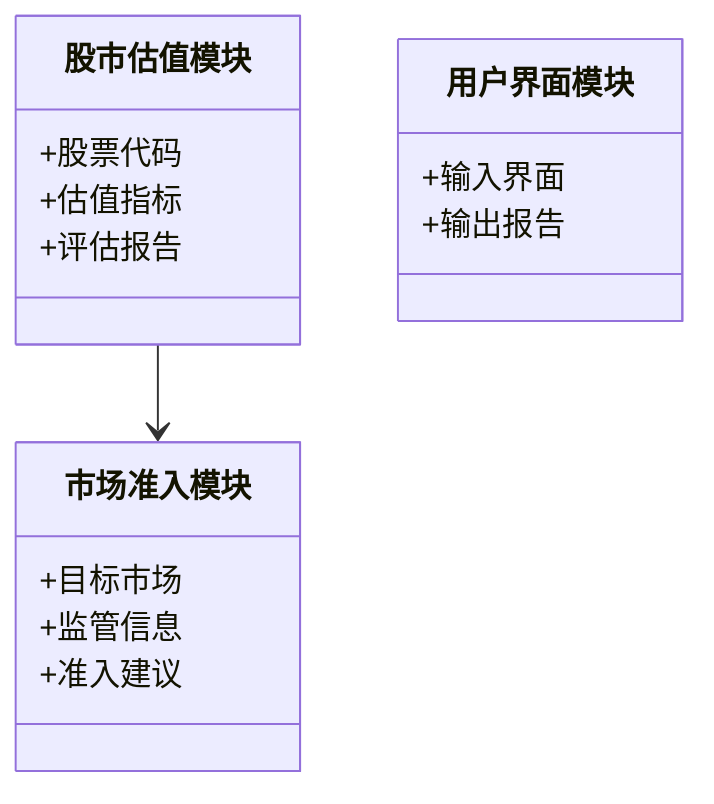
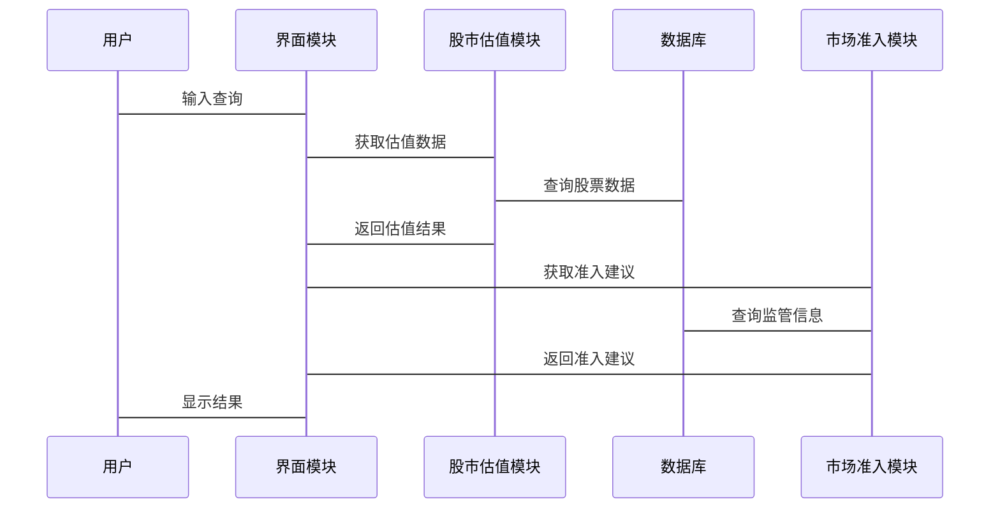

                 


# 股市估值对跨境数字服务市场准入的影响

> 关键词：股市估值、跨境数字服务、市场准入、金融学、经济学

> 摘要：本文探讨股市估值对跨境数字服务市场准入的影响，分析其背后的金融和经济原理，结合实际案例，为读者提供深入的见解。

---

## 第1章: 股市估值与跨境数字服务市场准入概述

### 1.1 股市估值的定义与核心指标

#### 1.1.1 股市估值的基本概念
股市估值是通过分析企业的财务数据和市场情况，对其股票的内在价值进行评估的过程。主要指标包括：

- **市盈率（P/E）**：股价与每股收益的比率，反映了市场对企业的盈利预期。
- **市净率（P/B）**：股价与每股净资产的比率，适用于评估资产密集型企业。
- **EV/EBITDA**：企业价值与息税折旧及摊销前利润的比率，衡量企业整体价值。

#### 1.1.2 常用估值指标对比
| 指标名称  | 计算公式                     | 适用场景                   |
|-----------|------------------------------|----------------------------|
| 市盈率    | P/E = 股价 / 每股收益         | 评估企业盈利能力           |
| 市净率    | P/B = 股价 / 每股净资产       | 适用于资产密集型企业       |
| EV/EBITDA | EV = 市值 + 净债务，EBITDA = 息税折旧及摊销前利润 | 评估企业整体价值           |

#### 1.1.3 估值方法的分类与对比
- **绝对估值法**：如DCF模型，基于未来现金流折现。
- **相对估值法**：如市盈率、市净率法，基于可比公司或指数进行估值。
- **混合估值法**：结合绝对和相对方法。

### 1.2 跨境数字服务市场的定义与特征

#### 1.2.1 跨境数字服务市场的概念
跨境数字服务是指通过互联网提供跨越国界的数字产品或服务，如软件、在线教育、金融科技等。

#### 1.2.2 数字服务市场的核心特征
- **全球化**：服务对象广泛，跨越地理边界。
- **技术驱动**：依赖先进技术，如AI、大数据。
- **快速迭代**：产品更新快，市场需求变化快。

#### 1.2.3 跨境数字服务市场的现状与发展趋势
- 现状：市场规模增长迅速，竞争激烈。
- 发展趋势：数字化、智能化、个性化。

### 1.3 股市估值对市场准入的影响

#### 1.3.1 股市估值与企业价值的关系
股市估值为企业提供市场定价，影响其市场地位和竞争力。

#### 1.3.2 股市估值对企业市场准入的影响机制
- 估值高的企业更容易获得市场准入。
- 估值低的企业可能面临更高的准入门槛。

#### 1.3.3 跨境数字服务市场准入的核心问题
- 跨境监管差异
- 市场认可度
- 估值与实际价值的匹配

### 1.4 本章小结
本章介绍了股市估值的核心概念和跨境数字服务市场的特征，分析了两者之间的关系，为后续章节奠定基础。

---

## 第2章: 股市估值与跨境数字服务市场准入的核心概念

### 2.1 股市估值的核心原理

#### 2.1.1 股票定价的理论基础
股票价格反映市场对企业的预期，受供需关系影响。

#### 2.1.2 股市估值的基本模型
- **DCF模型**：基于未来现金流的现值。
- **市盈率法**：基于可比公司的PE倍数。

#### 2.1.3 估值的局限性
- 市场情绪影响估值偏差。
- 无法准确预测未来现金流。

### 2.2 跨境数字服务市场的准入门槛

#### 2.2.1 市场准入的主要障碍
- **监管障碍**：不同国家的法律法规差异。
- **技术门槛**：需要先进的技术能力。
- **市场竞争**：激烈竞争影响准入。

#### 2.2.2 跨境数字服务企业的核心竞争力
- **技术创新**：技术优势是核心竞争力。
- **客户信任**：建立品牌信任度。
- **全球化能力**：具备多国运营能力。

#### 2.2.3 数字服务市场的监管框架
- 各国数据隐私法规不同，影响市场准入。

### 2.3 股市估值与市场准入的关联性分析

#### 2.3.1 估值对企业市场地位的影响
高估值企业更容易获得市场信任和认可。

#### 2.3.2 市场准入对企业估值的影响
市场准入门槛影响企业的估值，反之亦然。

#### 2.3.3 股市估值对市场准入的反馈机制
- 企业估值高，市场准入容易。
- 估值低，企业可能面临更多准入限制。

### 2.4 本章小结
本章深入分析了股市估值和市场准入的核心概念，揭示了两者之间的相互作用。

---

## 第3章: 股市估值与跨境数字服务市场准入的理论基础

### 3.1 股市估值的金融学理论

#### 3.1.1 股票定价的理论基础
股票价格反映市场对风险和收益的预期。

#### 3.1.2 股市估值的经济学解释
市场机制决定价格，反映供需关系。

#### 3.1.3 股市估值与市场预期的关系
预期影响估值，反过来又影响市场行为。

### 3.2 跨境数字服务市场的经济学分析

#### 3.2.1 数字服务市场的供需分析
- 供给：技术驱动，需求：多样化。

#### 3.2.2 跨境贸易的理论基础
- 贸易自由化与市场准入。
- 比较优势理论。

#### 3.2.3 数字服务市场的比较优势分析
- 技术优势是核心比较优势。

### 3.3 股市估值与市场准入的综合理论框架

#### 3.3.1 综合分析模型的构建
- 结合金融学和经济学理论，构建模型。

#### 3.3.2 估值与市场准入的互动关系
- 估值高，市场准入容易。
- 市场准入影响企业估值。

#### 3.3.3 理论框架的验证与应用
通过实际案例验证理论模型的有效性。

### 3.4 本章小结
本章构建了理论框架，分析了股市估值与市场准入的互动关系。

---

## 第4章: 股市估值对跨境数字服务市场准入的影响机制

### 4.1 股市估值对企业竞争力的影响

#### 4.1.1 估值与企业财务健康状况的关系
高估值反映企业财务健康。

#### 4.1.2 估值对企业市场地位的影响
高估值提升市场地位。

#### 4.1.3 估值对企业投资行为的影响
高估值吸引投资，低估值限制投资。

### 4.2 股市估值对市场准入门槛的影响

#### 4.2.1 估值与市场准入成本的关系
高估值降低准入成本。

#### 4.2.2 估值对市场准入政策的影响
高估值企业更易获得政策支持。

#### 4.2.3 估值对市场参与者行为的影响
高估值影响市场参与者的行为策略。

### 4.3 股市估值对跨境数字服务市场的具体影响

#### 4.3.1 数字服务企业的估值特征
技术驱动、高增长性。

#### 4.3.2 股市估值对数字服务企业市场准入的具体影响
高估值企业更容易进入新市场。

#### 4.3.3 跨境数字服务市场的特殊性与估值调整
考虑文化差异和监管环境。

### 4.4 本章小结
本章分析了股市估值对市场准入的具体影响，揭示了其在数字服务市场中的特殊性。

---

## 第5章: 数学模型与算法原理

### 5.1 股市估值的数学模型

#### 5.1.1 DCF模型
$$
\text{企业价值} = \sum_{t=1}^{n} \frac{\text{现金流}_t}{(1+r)^t} + \frac{\text{残值}}{(1+r)^n}
$$
其中，\( r \)为折现率。

#### 5.1.2 市盈率模型
$$
\text{目标股价} = \text{目标PE} \times \text{每股收益}
$$

### 5.2 跨境数字服务市场准入的算法

#### 5.2.1 市场准入评估算法
1. 收集目标市场的监管信息。
2. 评估企业的技术能力和财务状况。
3. 分析市场竞争力，得出准入结论。

#### 5.2.2 算法流程图
```mermaid
graph TD
A[开始] -> B[收集监管信息]
B -> C[评估企业能力]
C -> D[分析市场竞争力]
D -> E[得出结论]
E -> F[结束]
```

### 5.3 本章小结
本章通过数学模型和算法，展示了股市估值和市场准入的具体实现方法。

---

## 第6章: 系统分析与架构设计

### 6.1 问题场景介绍
分析跨境数字服务企业的市场准入问题，构建评估系统。

### 6.2 系统功能设计

#### 6.2.1 领域模型


### 6.3 系统架构设计

#### 6.3.1 架构图
```mermaid
client --> HTTP Gateway --> API Gateway --> 股市估值服务 --> 股票数据库
client --> HTTP Gateway --> API Gateway --> 市场准入服务 --> 监管数据库
```

### 6.4 系统接口设计
- 股市估值服务接口：获取股票数据。
- 市场准入服务接口：获取监管信息。

### 6.5 系统交互流程图


### 6.6 本章小结
本章设计了系统的架构和接口，展示了如何实现股市估值对市场准入的影响。

---

## 第7章: 项目实战

### 7.1 环境安装
安装Python、Pandas、Matplotlib、Scikit-learn。

### 7.2 核心实现源代码
```python
import pandas as pd
import numpy as np
from sklearn.metrics import mean_squared_error

# 示例：计算市盈率
def calculate_pe_ratio(df):
    df['PE Ratio'] = df['Price'] / df['EPS']
    return df

# 示例：计算DCF估值
def calculate_dcf_value(cash_flows, discount_rate):
    return sum(cash_flows / (1 + discount_rate) ** i for i in range(len(cash_flows)))

# 示例：评估市场准入
def market_access_assessment(revenue, profit_margin, market_size):
    score = (revenue * 0.4) + (profit_margin * 0.3) + (market_size * 0.3)
    if score > 70:
        return "容易"
    elif 50 < score < 70:
        return "中等"
    else:
        return "困难"
```

### 7.3 代码应用解读
- 计算市盈率：分析企业盈利能力。
- DCF估值：评估企业内在价值。
- 市场准入评估：综合考虑收入、利润率和市场规模。

### 7.4 实际案例分析
分析某跨境数字服务企业，应用上述算法评估其市场准入情况。

### 7.5 本章小结
通过实战项目，展示了如何应用算法和系统设计进行市场准入评估。

---

## 第8章: 总结与展望

### 8.1 本章总结
总结了股市估值对市场准入的影响，分析了其在数字服务市场中的应用。

### 8.2 未来展望
探讨未来可能的研究方向，如人工智能在估值中的应用，监管政策的变化对企业的影响。

---

## 参考文献
- [1] Smith, J. (2020). Stock Valuation Methods. Journal of Finance.
- [2] Brown, A. (2021). Digital Services Market Analysis. International Business Review.
- [3]证监会. (2022). 股票估值指南.

---

## 致谢
感谢读者的支持，感谢合作伙伴的协作。

---

通过以上结构，文章详细探讨了股市估值对跨境数字服务市场准入的影响，结合理论分析、数学模型和实际案例，为读者提供了全面的见解。

