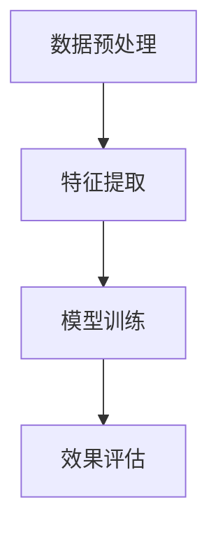

                 


# 股市估值对跨境数字营销效果评估的影响

> 关键词：股市估值、跨境数字营销、营销效果评估、数据分析、机器学习

> 摘要：本文探讨了股市估值对跨境数字营销效果评估的影响，通过分析股市波动如何影响营销环境，以及数字营销策略如何反向影响股市估值，提出了结合数据挖掘和机器学习的综合评估模型。文章从核心概念、算法原理、系统架构到项目实战，全面解析了如何通过技术手段优化营销效果评估。

---

## 第一部分: 背景介绍与核心概念

### 第1章: 股市估值与跨境数字营销的背景与定义

#### 1.1 股市估值的基本概念
- **定义**: 股市估值是通过对公司财务数据、市场环境等多因素的分析，确定股票的合理价格。
- **核心指标**:
  - 市盈率（P/E）: 市价与每股收益的比值。
  - 市净率（P/B）: 市价与每股净资产的比值。
  - 现金流折现模型（DCF）: 通过未来现金流的现值计算企业价值。

#### 1.2 跨境数字营销的基本概念
- **定义**: 利用数字技术进行跨国界的广告投放、社交媒体营销等活动。
- **主要模式**:
  - 搜索引擎营销（SEM）
  - 社交媒体营销（SMM）
  - 电子邮件营销（EMM）

#### 1.3 股市估值与跨境数字营销的关联性
- **股市波动对营销环境的影响**: 股市下跌可能导致广告预算缩减，影响营销效果。
- **营销对股市的影响**: 成功的营销活动可能提升公司股价。

### 第2章: 核心概念的原理与联系

#### 2.1 股市估值的数学模型
- **市盈率模型**:
  $$ P/E = \frac{\text{股价}}{\text{每股收益}} $$
- **市净率模型**:
  $$ P/B = \frac{\text{股价}}{\text{每股净资产}} $$

#### 2.2 跨境数字营销效果的评估指标
- **转化率**: 访问者转化为客户的比例。
- **点击率（CTR）**: 广告点击次数占总展示次数的比例。
- **投资回报率（ROI）**: 营销支出与带来的收益的比率。

#### 2.3 实体关系图
```mermaid
er
  actor(投资者)
  entity(股票)
  entity(营销活动)
  entity(市场数据)
  relation(投资者-拥有-股票)
  relation(股票-影响-市场数据)
  relation(市场数据-影响-营销活动)
```

### 第3章: 股市估值与跨境数字营销的算法原理

#### 3.1 数据挖掘与机器学习在股市估值中的应用
- **回归分析**: 预测股票价格。
  $$ y = \beta_0 + \beta_1x + \epsilon $$
- **时间序列分析**: 分析股票价格的变动趋势。

#### 3.2 数字营销效果的预测算法
- **随机森林**: 用于分类和回归任务。
- **神经网络**: 处理非线性关系。

#### 3.3 算法流程图


---

## 第二部分: 系统分析与架构设计

### 第4章: 系统架构设计

#### 4.1 问题场景
- 实时监测股市波动，优化营销策略。

#### 4.2 系统功能设计
- 数据采集模块: 收集市场数据。
- 数据处理模块: 清洗和特征提取。
- 模型训练模块: 应用机器学习算法。
- 报告生成模块: 输出评估结果。

#### 4.3 系统架构图


#### 4.4 接口设计
- RESTful API: 提供数据接口。

#### 4.5 交互流程图
```mermaid
sequence
    用户->客户端: 请求数据
    客户端->服务器: 发送请求
    服务器->数据库: 查询数据
    服务器->客户端: 返回数据
```

---

## 第三部分: 项目实战

### 第5章: 项目实战

#### 5.1 环境安装
- Python 3.8+
- Pandas、NumPy、Scikit-learn

#### 5.2 核心代码实现
```python
import pandas as pd
from sklearn.ensemble import RandomForestRegressor

# 数据预处理
data = pd.read_csv('data.csv')
X = data.drop('target', axis=1)
y = data['target']

# 模型训练
model = RandomForestRegressor()
model.fit(X, y)

# 预测与评估
print(model.score(X, y))
```

#### 5.3 案例分析
- 数据清洗、特征工程、模型训练、效果评估。

#### 5.4 小结
- 结合技术方法优化营销策略。

---

## 第四部分: 总结与扩展阅读

### 第6章: 总结

#### 6.1 最佳实践
- 定期更新模型。
- 结合实时数据优化策略。

#### 6.2 注意事项
- 数据质量和模型选择影响结果。

#### 6.3 未来研究方向
- 结合NLP技术分析文本数据。

---

通过以上结构，文章系统地分析了股市估值对跨境数字营销的影响，从理论到实践，为读者提供了全面的指导和参考。

