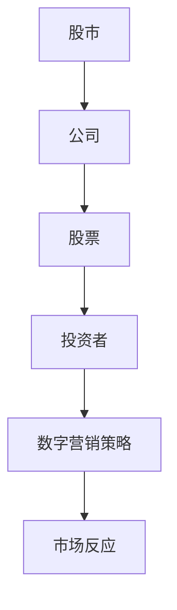
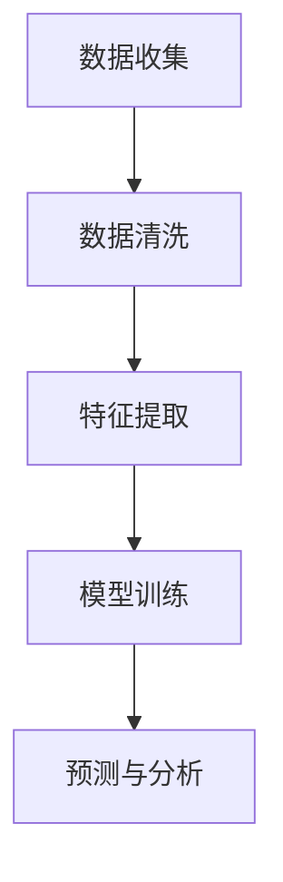
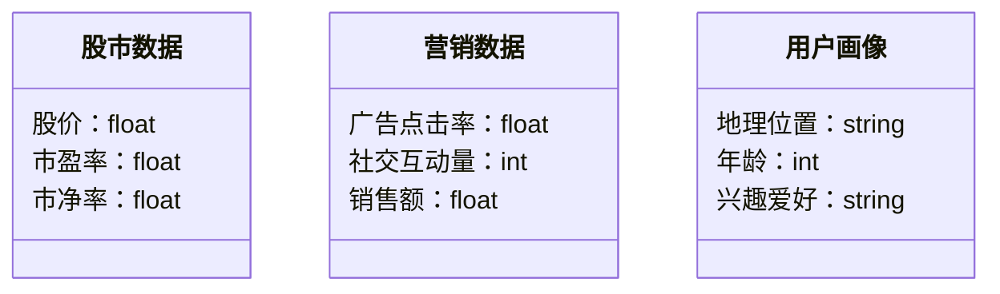
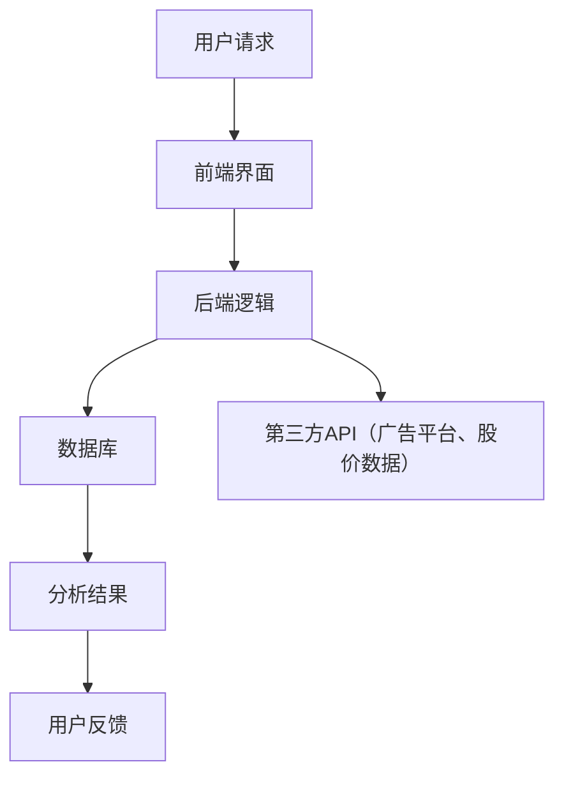
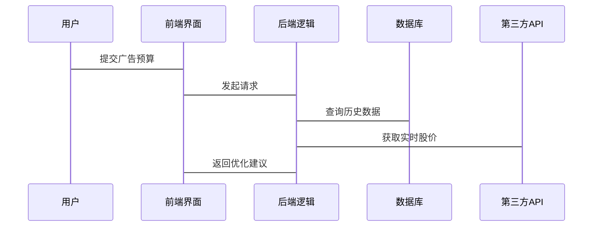

                 


# 股市估值对跨境数字营销策略的影响

## 关键词：股市估值，数字营销，跨境营销，市场分析，数据挖掘

## 摘要：股市估值对跨境数字营销策略的影响分析，探讨如何通过股市数据和数字营销策略的结合，优化企业营销决策，提升市场竞争力。本文从背景介绍、核心概念分析、算法原理、系统设计、项目实战等多个维度，全面解析股市估值与数字营销策略的关联性，为企业提供数据驱动的营销优化建议。

---

## 第一部分: 背景介绍

### 第1章: 核心概念与问题背景

#### 1.1 股市估值的核心概念

##### 1.1.1 股市估值的基本定义
股市估值是指通过对企业的财务数据、市场环境、行业趋势等因素进行分析，评估企业股票的合理价格范围。常见的估值方法包括市盈率（P/E）、市净率（P/B）、股息率等。

##### 1.1.2 股市估值的主要方法
- **相对估值法**：基于可比公司或行业平均进行估值。
- **绝对估值法**：基于DCF模型（现金流折现法）等方法进行估值。
- **指数估值法**：通过市场指数波动推测个股估值。

##### 1.1.3 股市估值的核心要素
- **企业基本面**：收入、利润、现金流等财务指标。
- **市场环境**：宏观经济、行业趋势、政策法规。
- **投资者情绪**：市场参与者的心理预期。

#### 1.2 跨境数字营销策略的核心概念

##### 1.2.1 跨境数字营销的定义
跨境数字营销是指通过数字平台（如社交媒体、搜索引擎、电商平台等）在全球范围内推广产品或服务，目标受众分布在不同国家或地区的营销活动。

##### 1.2.2 跨境数字营销的主要模式
- **搜索引擎营销（SEM）**：通过搜索引擎优化（SEO）或付费广告（如Google Ads）吸引目标用户。
- **社交媒体营销（SMM）**：利用Facebook、Instagram、LinkedIn等社交平台进行品牌推广和用户互动。
- **内容营销**：通过发布高质量的内容（如博客、视频、播客）吸引目标受众。
- **电子邮件营销**：通过电子邮件与潜在客户保持联系并推广产品。

##### 1.2.3 跨境数字营销的关键成功因素
- **目标受众定位**：精准识别目标市场的消费者行为和偏好。
- **内容本地化**：根据目标市场的语言、文化习俗调整内容。
- **技术与工具**：使用数据分析工具（如Google Analytics）和广告平台（如Google Ads、Facebook Ads）进行精准投放。

#### 1.3 股市估值与数字营销策略的关联性

##### 1.3.1 问题背景的提出
在跨境数字营销中，企业需要投入大量预算用于广告投放、内容制作和平台运营。然而，股市估值的波动可能影响企业的财务状况，进而影响其营销预算。同时，数字营销活动的效果也可能反过来影响企业的股价表现。

##### 1.3.2 问题描述与研究目标
- 问题描述：如何在股市波动中优化跨境数字营销策略，以实现最佳的投资回报率（ROI）。
- 研究目标：探索股市估值与数字营销策略之间的关系，提出基于数据驱动的营销优化建议。

##### 1.3.3 研究的边界与外延
- 研究边界：聚焦于跨境数字营销和股市估值的直接关联，不涉及企业内部运营和管理。
- 研究外延：探讨数字营销对股价的潜在影响，以及如何通过数字营销提升企业估值。

---

## 第二部分: 核心概念与联系

### 第2章: 股市估值与数字营销策略的内在联系

#### 2.1 股市估值的原理与机制

##### 2.1.1 股市估值的基本原理
股市估值的核心在于平衡市场供给与需求，反映企业的实际价值。投资者通过分析企业的财务数据、行业地位和市场前景，判断其股票的合理价格。

##### 2.1.2 影响股市估值的主要因素
- **宏观经济因素**：GDP增长率、利率水平、通货膨胀等。
- **企业基本面**：收入、利润、现金流等财务指标。
- **行业趋势**：技术进步、政策变化、市场竞争等。
- **投资者情绪**：市场参与者的心理预期和行为。

##### 2.1.3 股市估值的数学模型与公式
常用的时间序列分析模型包括ARIMA（自回归积分滑动平均模型）和GARCH（广义自回归条件异方差模型）。例如：
$$ ARIMA(p, d, q) $$
其中，p为自回归阶数，d为差分阶数，q为移动平均阶数。

#### 2.2 跨境数字营销策略的原理与机制

##### 2.2.1 跨境数字营销的核心原理
数字营销通过精准定位目标受众、提供个性化内容和优化广告投放，提升品牌知名度和用户转化率。

##### 2.2.2 数字营销策略的关键要素
- **目标受众定位**：基于地理位置、语言、兴趣爱好等因素进行受众细分。
- **内容策略**：制定符合目标市场文化习惯的内容策略，提升用户参与度。
- **广告投放优化**：通过A/B测试优化广告文案、关键词和投放渠道。

##### 2.2.3 股市估值与数字营销策略的联系
数字营销活动的投入和效果直接影响企业的财务表现，进而影响其股市估值。例如，有效的数字营销策略可以提升企业销售额和利润，从而提高市盈率（P/E）。

#### 2.3 股市估值与数字营销策略的联系

##### 2.3.1 数据驱动的市场分析
通过分析历史股价数据和营销数据，可以发现两者之间的相关性。例如，股价波动可能与广告点击率、社交媒体互动量等指标相关联。

##### 2.3.2 股市波动与营销策略的相互影响
- **股市上涨**：企业估值上升，可能增加数字营销预算。
- **股市下跌**：企业可能缩减营销投入，优化广告投放策略。

##### 2.3.3 数字营销对股市估值的潜在影响
通过优化数字营销策略，提升企业收入和利润，进而提升股价和市盈率。

### 第3章: 核心概念的对比与分析

#### 3.1 核心概念的属性特征对比

| **属性**       | **股市估值**                         | **数字营销策略**                     |
|----------------|------------------------------------|------------------------------------|
| **核心目标**   | 评估企业股票的合理价格              | 提升品牌知名度和用户转化率            |
| **数据驱动**   | 财务数据、市场数据                   | 用户行为数据、广告投放数据          |
| **影响因素**   | 宏观经济、企业基本面、投资者情绪      | 目标受众、内容策略、广告效果        |
| **数学模型**   | ARIMA、GARCH                       | A/B测试、机器学习模型              |

#### 3.2 ER实体关系图


---

## 第三部分: 算法原理讲解

### 第4章: 数据驱动的市场分析算法

#### 4.1 数据挖掘与市场分析

##### 4.1.1 数据挖掘的基本原理
数据挖掘是从大量数据中提取隐含模式、关联性和趋势的过程，常用于市场分析、客户画像和预测建模。

##### 4.1.2 常用的数据挖掘算法
- **聚类分析**：K-Means算法，用于客户分群。
- **分类分析**：决策树、随机森林，用于预测客户行为。
- **关联规则学习**：Apriori算法，用于发现数据中的关联性。

##### 4.1.3 数据挖掘在股市分析中的应用
通过分析历史股价和市场数据，发现价格波动的规律和趋势。

#### 4.2 数学模型与公式

##### 4.2.1 时间序列分析模型
$$ ARIMA(p, d, q) $$
其中，p为自回归阶数，d为差分阶数，q为移动平均阶数。

##### 4.2.2 回归分析模型
$$ Y = \beta_0 + \beta_1 X + \epsilon $$
其中，Y为因变量（如股价），X为自变量（如广告点击率），$\epsilon$为误差项。

#### 4.3 算法流程图


---

## 第四部分: 系统分析与架构设计

### 第5章: 系统分析与架构设计方案

#### 5.1 项目介绍与背景
本项目旨在通过整合股市数据和数字营销数据，构建一个数据驱动的营销优化系统，帮助企业在不同市场环境下制定最优的数字营销策略。

#### 5.2 系统功能设计

##### 5.2.1 领域模型


##### 5.2.2 系统架构设计


#### 5.3 系统接口设计
- **输入接口**：用户输入广告预算、目标市场等参数。
- **输出接口**：系统输出广告投放建议、预期投资回报率等。

#### 5.4 系统交互流程


---

## 第五部分: 项目实战

### 第6章: 项目实战与案例分析

#### 6.1 环境安装与工具准备
- **编程语言**：Python 3.8+
- **开发框架**：Django或Flask
- **数据处理工具**：Pandas、NumPy
- **可视化工具**：Matplotlib、Seaborn
- **机器学习库**：Scikit-learn、XGBoost
- **云服务**：AWS、阿里云

#### 6.2 系统核心实现源代码
##### 6.2.1 数据清洗与预处理
```python
import pandas as pd
import numpy as np

# 读取数据
data = pd.read_csv('marketing_data.csv')

# 删除缺失值
data = data.dropna()

# 标准化处理
from sklearn.preprocessing import StandardScaler
scaler = StandardScaler()
scaled_data = scaler.fit_transform(data)
```

##### 6.2.2 模型训练与预测
```python
from sklearn.model_selection import train_test_split
from sklearn.ensemble import RandomForestRegressor

# 划分训练集和测试集
X_train, X_test, y_train, y_test = train_test_split(scaled_data, data['target'], test_size=0.2, random_state=42)

# 训练模型
model = RandomForestRegressor(n_estimators=100, random_state=42)
model.fit(X_train, y_train)

# 预测结果
y_pred = model.predict(X_test)
```

#### 6.3 案例分析与实际应用
假设一家跨境电商公司希望通过数字营销提升销售额，进而影响其股价。通过分析历史股价数据和广告点击率，可以发现两者之间的相关性，从而优化广告投放策略。

#### 6.4 项目小结
通过本项目，我们展示了如何将股市估值与数字营销策略结合起来，利用数据驱动的方法优化企业的营销决策，提升市场竞争力。

---

## 第六部分: 总结与展望

### 第7章: 总结与最佳实践

#### 7.1 总结
本文通过分析股市估值与数字营销策略的内在联系，提出了基于数据驱动的营销优化建议。通过案例分析和系统设计，展示了如何利用技术手段提升企业的市场竞争力。

#### 7.2 最佳实践 tips
- **数据驱动决策**：定期分析股价波动和营销数据，优化广告投放策略。
- **精准定位目标受众**：根据市场环境和用户行为调整营销策略。
- **技术与业务结合**：利用大数据和机器学习技术，提升营销效果和投资回报率。

#### 7.3 注意事项
- **数据隐私保护**：确保用户数据的合法性和隐私性。
- **模型更新与维护**：定期更新模型参数，适应市场变化。
- **风险管理**：制定风险应对策略，降低市场波动对营销活动的影响。

#### 7.4 拓展阅读
- 推荐阅读《Data-Driven Marketing》和《Financial Analysis and Portfolio Management》。

---

## 结语
股市估值与数字营销策略的结合为企业提供了新的视角和机会。通过技术手段和数据驱动的方法，企业可以更好地应对市场波动，优化营销策略，实现可持续的业务增长。

