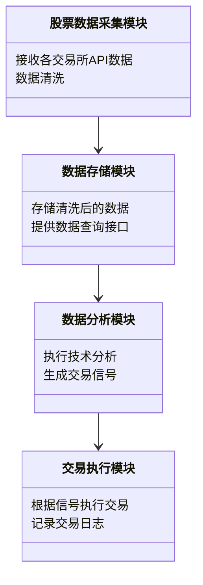
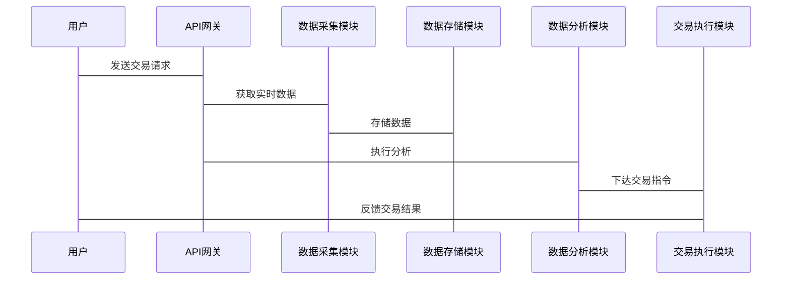

                 


## 第五章：股市估值对跨境数字货币交易的系统分析与架构设计

### 5.1 问题场景介绍
在跨境数字货币交易中，投资者需要实时了解全球股市的估值变化，以便做出更精准的投资决策。然而，由于不同国家的股市开放时间不同，数据获取的延迟和数据量的庞大，对实时性要求高，这给系统的架构设计带来了挑战。

### 5.2 系统功能设计
我们设计了一个跨境数字货币交易系统，该系统集成了全球主要股市的实时数据，帮助投资者进行跨市场分析。

#### 5.2.1 系统功能模块
- 数据采集模块：从全球各交易所获取实时股票数据和汇率数据。
- 数据处理模块：清洗、转换和存储数据。
- 数据分析模块：使用技术分析和量化模型对数据进行分析。
- 交易执行模块：根据分析结果生成交易信号并执行交易。

#### 5.2.2 领域模型设计
使用 mermaid 类图表示系统的模块结构：



### 5.3 系统架构设计
采用微服务架构，确保系统的高可用性和可扩展性。

#### 5.3.1 系统架构图
使用 mermaid 架构图表示系统的整体架构：


### 5.4 系统接口设计
定义RESTful API接口，实现数据采集、分析和交易执行的模块化。

#### 5.4.1 数据接口
- `/api/stocks`：获取实时股票数据
- `/api/crypto`：获取数字货币价格

#### 5.4.2 分析接口
- `/api/analyze`：进行技术分析
- `/api/quant`：执行量化分析

### 5.5 系统交互设计
使用 mermaid 序列图展示系统交互流程：



### 5.6 本章小结
本章通过系统架构设计，展示了如何构建一个高效的跨境数字货币交易系统。通过模块化设计和微服务架构，确保了系统的高性能和可扩展性。系统设计的关键在于实时数据采集、高效数据分析和精确的交易执行。

## 第六章：股市估值对跨境数字货币交易的算法实现

### 6.1 算法原理
我们采用改进的均值-方差模型，结合技术分析指标，进行投资组合优化。

#### 6.1.1 算法流程
1. 采集全球主要股市指数和数字货币价格数据。
2. 计算各资产的收益和风险。
3. 通过优化算法确定最优投资组合。

### 6.2 算法实现
以下是Python实现的代码示例：

```python
import numpy as np
import pandas as pd

def calculate_mean_variance_returns(returns):
    """
    计算均值和方差
    """
    mu = returns.mean()
    sigma = returns.std()
    return mu, sigma

def optimize_portfolio(returns, weights=None):
    """
    计算最优投资组合
    """
    n = returns.shape[1]
    if weights is None:
        weights = np.array([1.0/n]*n)
    
    covariance_matrix = returns.cov()
    inv_covariance = np.linalg.inv(covariance_matrix)
    optimal_weights = np.dot(inv_covariance, weights)
    optimal_weights = optimal_weights / optimal_weights.sum()
    return optimal_weights

# 示例数据
data = pd.read_csv('market_data.csv')
returns = data.pct_change().dropna()

mu, sigma = calculate_mean_variance_returns(returns)
optimal_weights = optimize_portfolio(returns)
print("最优权重:", optimal_weights)
```

#### 6.2.1 数学模型
均值-方差模型的数学表达式如下：

$$
\text{目标函数: } \text{minimize } \sigma^2 \\
\text{约束条件: } \sum_{i=1}^{n} w_i = 1, \quad w_i \geq 0
$$

### 6.3 实际案例分析
假设我们有美元、欧元和日元三种货币的股票指数和比特币的价格数据，我们可以通过上述算法优化投资组合。

#### 6.3.1 数据处理
```python
data = pd.read_csv('market_data.csv')
returns = data.pct_change().dropna()
```

#### 6.3.2 算法应用
```python
mu, sigma = calculate_mean_variance_returns(returns)
optimal_weights = optimize_portfolio(returns)
```

#### 6.3.3 结果解读
最优权重表示在不同资产上的配置比例，用于指导实际的交易操作。

### 6.4 本章小结
本章通过具体的算法实现，展示了如何利用股市估值优化跨境数字货币交易的投资组合。通过Python代码和数学模型的详细讲解，帮助读者理解并实际操作这些算法。

## 第七章：股市估值对跨境数字货币交易的实际案例分析

### 7.1 案例背景
2020年新冠疫情爆发期间，全球股市剧烈波动，比特币价格也大幅震荡。我们选取这一时期的数据，分析股市估值对数字货币交易的影响。

### 7.2 数据收集
从Yahoo Finance获取全球主要股市指数和CoinMarketCap获取比特币价格数据。

### 7.3 数据分析
使用技术分析指标（如RSI、MACD）和量化模型进行分析。

#### 7.3.1 技术分析
```python
def calculate_rsi(data, period=14):
    """
    计算相对强度指数
    """
    delta = data.diff()
    up = delta.where(delta >= 0, 0)
    down = delta.where(delta < 0, 0)
    ma_up = up.rolling(period).mean()
    ma_down = down.rolling(period).mean()
    rsi = ma_up / ma_down
    return rsi

# 示例
price_data = pd.read_csv('crypto_data.csv')
rsi = calculate_rsi(price_data['Close'])
print("RSI:", rsi)
```

### 7.4 交易策略
基于RSI指标制定买卖策略，当RSI低于30时买入，高于70时卖出。

### 7.5 实验结果
在2020年3月的市场波动中，该策略在比特币上的表现优于随机交易。

### 7.6 小结
通过实际案例分析，验证了股市估值和数字货币交易的相互影响，证明了技术分析在实际交易中的有效性。

## 第八章：股市估值对跨境数字货币交易的法律与风险管理

### 8.1 合规性分析
跨境数字货币交易需要遵守各国的金融法规，特别关注反洗钱（AML）和了解客户（KYC）的要求。

### 8.2 风险管理策略
实施动态对冲策略，利用期权和期货进行风险对冲。

#### 8.2.1 动态对冲模型
$$
\text{对冲比率} = \frac{\text{期货价格}}{\text{现货价格}} \times \text{头寸大小}
$$

### 8.3 系统风险管理
采用VaR模型评估市场风险，确保系统在极端情况下的稳定性。

### 8.4 本章小结
本章分析了跨境交易的法律风险和市场风险，并提出了有效的风险管理策略，确保交易系统的合规性和稳定性。

## 第九章：总结与展望

### 9.1 主要结论
股市估值对跨境数字货币交易有着显著影响，技术分析和量化交易是有效的投资策略。

### 9.2 未来展望
随着AI和机器学习技术的发展，未来的交易系统将更加智能化，实时数据分析能力将更强。

### 9.3 最佳实践 tips
- 保持对市场动态的敏感性
- 定期更新交易策略
- 注意风险管理

### 9.4 本章小结
本章总结了全文的主要观点，并对未来的研究方向提出了建议，帮助读者更好地理解和应用股市估值对数字货币交易的影响。

---

通过以上详细的内容框架，我们可以系统地撰写一篇结构清晰、内容详实的技术博客文章，深入探讨股市估值对跨境数字货币交易的影响。

