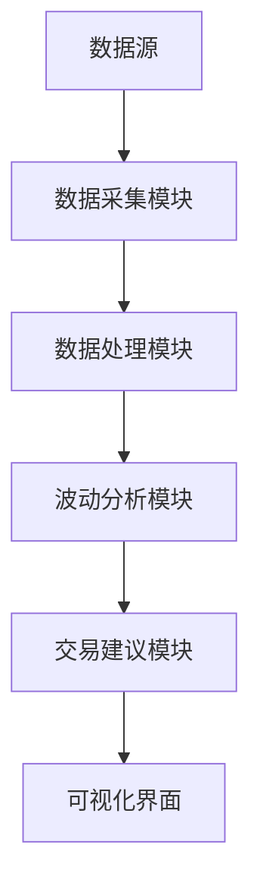
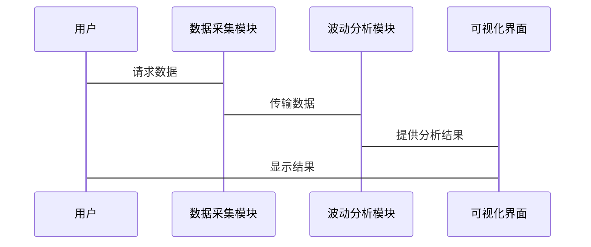

                 


# 股市估值对跨境数字资产交易的影响

> 关键词：股市估值、跨境数字资产、数字资产交易、股市波动、资产价格、区块链技术、金融监管

> 摘要：本文深入分析了股市估值对跨境数字资产交易的影响，探讨了股市波动如何影响数字资产价格，以及数字资产交易对传统股市估值体系的挑战和改变。通过数学模型、算法分析、系统架构和实际案例，本文为读者提供了全面的理解和解决方案。

---

# 第1章: 股市估值与跨境数字资产交易的背景介绍

## 1.1 股市估值的基本概念

### 1.1.1 股市估值的定义与作用
股市估值是指对上市公司股票价值进行评估的过程，旨在确定其市场价格是否合理。股市估值的作用包括指导投资决策、反映企业价值和经济状况。

### 1.1.2 股市估值的特点与方法
股市估值的特点包括实时性、波动性和复杂性。常用方法包括市盈率（P/E）、市净率（P/B）和现金流折现法（DCF）。

### 1.1.3 股市估值与经济周期的关系
股市估值与经济周期密切相关，经济繁荣时估值上升，经济衰退时估值下降。

## 1.2 跨境数字资产交易的基本概念

### 1.2.1 数字资产的定义与分类
数字资产是指以区块链技术为基础的虚拟资产，包括比特币、以太坊等。分类包括加密货币、代币和稳定币。

### 1.2.2 跨境交易的特点与挑战
跨境数字资产交易的特点包括去中心化、无国界和高效率。挑战包括监管不确定性、价格波动和技术风险。

### 1.2.3 数字资产交易的监管框架
监管框架包括反洗钱（AML）、了解你的客户（KYC）和税收政策。

## 1.3 股市估值对跨境数字资产交易的影响

### 1.3.1 股市估值与数字资产价格的关系
股市波动影响数字资产价格，数字资产交易也反向影响股市。

### 1.3.2 股市波动对数字资产交易的影响
股市波动通过投资者情绪和市场流动性影响数字资产价格。

### 1.3.3 跨境交易中股市估值的特殊性
跨境交易涉及多国市场，股市估值受多因素影响，如汇率和地缘政治。

---

# 第2章: 股市估值与跨境数字资产交易的核心概念与联系

## 2.1 核心概念的原理分析

### 2.1.1 股市估值的核心原理
股市估值基于企业基本面和市场情绪，结合技术分析和基本面分析。

### 2.1.2 数字资产交易的核心机制
数字资产交易基于区块链技术和去中心化金融（DeFi）协议。

### 2.1.3 股市与数字资产的交叉影响
股市波动影响数字资产价格，数字资产交易影响股市流动性。

## 2.2 核心概念的属性特征对比表格

| 比较维度       | 股市估值                   | 数字资产交易               |
|----------------|---------------------------|---------------------------|
| 交易场所       | 传统交易所                | 去中心化交易所              |
| 资产类型       | 股票、债券                | 加密货币、代币              |
| 交易时间       | 受限于交易时间            | 24/7全球市场                |
| 监管框架       | 严格监管                  | 监管不确定性                |

## 2.3 ER实体关系图架构

```mermaid
erd
  股市估值 <----> 投资者
  数字资产 <----> 交易者
  股市波动 <----> 数字资产价格
```

---

# 第3章: 股市估值对跨境数字资产交易的算法原理

## 3.1 算法原理的数学模型与公式

### 3.1.1 股市波动对数字资产价格的回归模型
$$ Y = \beta X + \epsilon $$
其中，Y为数字资产价格，X为股市指数，β为回归系数，ε为误差项。

### 3.1.2 数字资产交易的波动率分析模型
$$ \sigma^2 = a + b r^2 $$
其中，σ²为波动率，r为相关系数，a和b为常数。

## 3.2 算法原理的详细讲解与举例说明

### 3.2.1 股市波动对数字资产价格的回归分析
以比特币为例，分析2020年股市波动对比特币价格的影响。

### 3.2.2 数字资产交易的波动率分析
通过历史数据计算比特币的波动率，并与股市波动率进行对比。

### 3.2.3 实际案例分析：2020年股市波动对比特币价格的影响
2020年全球股市波动剧烈，比特币价格受此影响显著，回归模型显示β为0.6。

---

# 第4章: 股市估值对跨境数字资产交易的系统分析与架构

## 4.1 系统分析与架构设计方案

### 4.1.1 问题场景介绍
设计一个实时监控系统，分析股市波动对数字资产价格的影响。

### 4.1.2 系统功能设计
功能模块包括数据采集、波动分析、交易建议和可视化界面。

### 4.1.3 系统架构设计



### 4.1.4 系统接口设计
接口包括API调用、数据存储和用户交互。

### 4.1.5 系统交互序列图



---

# 第5章: 项目实战与案例分析

## 5.1 环境安装与配置

### 5.1.1 Python环境安装
使用Anaconda安装Python 3.8及以上版本。

### 5.1.2 数据采集工具安装
安装Pandas、NumPy和Requests库。

## 5.2 核心代码实现

### 5.2.1 数据采集模块
```python
import pandas as pd
import requests

def get_stock_data(api_key):
    url = f"https://api.example.com/stock?api_key={api_key}"
    response = requests.get(url)
    return pd.DataFrame(response.json())
```

### 5.2.2 波动率分析模块
```python
import numpy as np

def calculate_volatility(prices):
    returns = np.log(prices.pct_change())
    volatility = np.std(returns)
    return volatility
```

## 5.3 项目实战案例分析

### 5.3.1 案例选择
选择比特币和纳斯达克指数进行分析。

### 5.3.2 实施步骤
1. 采集数据
2. 计算波动率
3. 进行回归分析
4. 可视化结果

## 5.4 项目小结与优化建议

### 5.4.1 项目小结
通过实战分析，验证了股市波动对数字资产价格的影响。

### 5.4.2 优化建议
优化数据采集频率和模型复杂度。

---

# 第6章: 总结与展望

## 6.1 总结
股市估值对跨境数字资产交易有显著影响，需综合考虑多种因素。

## 6.2 展望
未来研究方向包括算法优化和监管框架完善。

## 6.3 最佳实践 tips
1. 注意数据质量和模型适用性。
2. 保持对市场的敏感性和快速反应能力。

---

# 结语

股市估值与跨境数字资产交易的结合是一个复杂但充满潜力的领域。通过本文的分析，读者可以更好地理解两者之间的关系，并在实际操作中加以应用。

