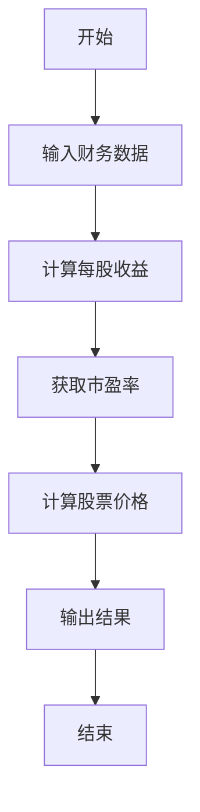
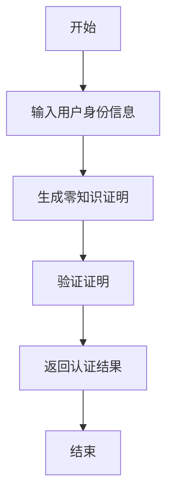
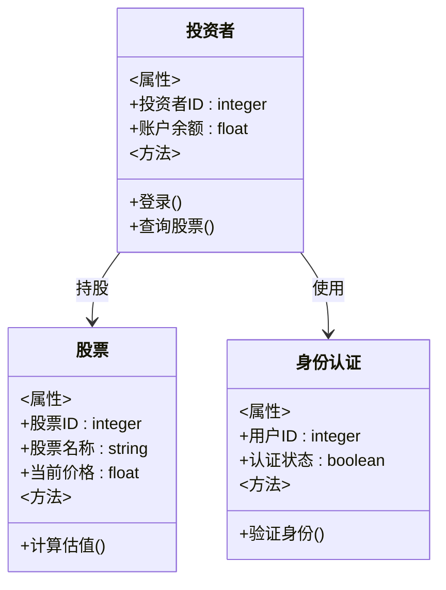
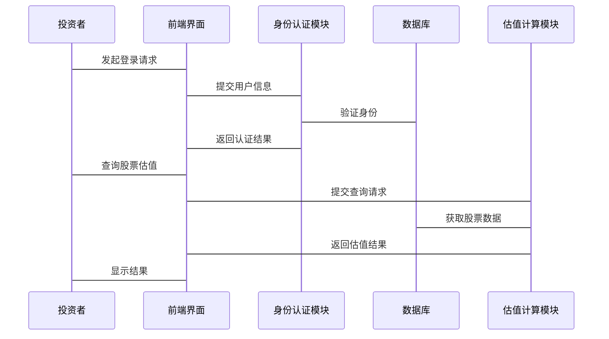

                 


# 股市估值对跨境数字身份认证标准的影响

## 关键词：股市估值、跨境数字身份认证、标准影响、技术分析、系统架构、安全机制

## 摘要：本文探讨了股市估值与跨境数字身份认证标准之间的相互影响。通过分析股市波动对数字身份认证技术需求的影响，以及数字身份认证标准对股市估值的反向作用，揭示了两者之间的动态关系。文章从核心概念、算法原理、系统架构设计、项目实战等多维度进行详细分析，为理解和优化跨境数字身份认证标准提供了新的视角。

---

## 第1章: 股市估值与跨境数字身份认证概述

### 1.1 股市估值的基本概念

#### 1.1.1 股市估值的定义与作用
股市估值是指通过对公司财务数据和市场因素的分析，估算其股票的合理价格。它是投资者决策的重要依据，也是衡量企业价值的关键指标。股市估值的作用在于帮助投资者判断市场的合理性和潜在风险。

#### 1.1.2 股市估值的核心指标与方法
股市估值的核心指标包括市盈率（P/E）、市净率（P/B）、股息率等。常用的方法有相对估值法、绝对估值法和指数估值法。这些指标和方法帮助投资者评估股票的内在价值。

#### 1.1.3 股市估值与经济发展的关系
股市估值不仅是企业价值的体现，也是经济发展的重要风向标。股市的波动往往反映了宏观经济的变化，而经济的稳定增长也会推动股市估值的提升。

### 1.2 跨境数字身份认证的定义与特点

#### 1.2.1 跨境数字身份认证的定义
跨境数字身份认证是指在不同国家或地区之间，通过数字技术对个人或企业的身份进行验证和确认的过程。它结合了区块链、加密技术等手段，确保身份信息的唯一性和安全性。

#### 1.2.2 跨境数字身份认证的核心要素
跨境数字身份认证的核心要素包括身份标识、认证技术、数据加密和信任机制。这些要素共同确保了身份认证的准确性和可靠性。

#### 1.2.3 跨境数字身份认证与传统身份认证的区别
与传统身份认证相比，跨境数字身份认证更加注重数据的跨境流动和安全性，依赖于先进的技术手段，如区块链和零知识证明，以实现高效和安全的认证。

### 1.3 股市估值与跨境数字身份认证的关联性

#### 1.3.1 股市估值对跨境数字身份认证的影响
股市估值的波动会影响企业对数字身份认证技术的需求。例如，股市的繁荣会增加企业对高效认证系统的需求，从而推动技术的升级。

#### 1.3.2 跨境数字身份认证对股市估值的作用
跨境数字身份认证技术的普及和标准化将提升市场的信任度，从而影响股市估值。例如，高效的认证系统可以降低交易成本，提升市场流动性。

#### 1.3.3 两者的相互作用与协同效应
股市估值和跨境数字身份认证之间存在动态平衡。股市的波动推动技术需求，而技术的进步又反向促进股市的稳定发展。

### 1.4 本章小结
本章通过定义和分析股市估值与跨境数字身份认证的核心概念，揭示了两者之间的相互影响和协同作用，为后续的深入分析奠定了基础。

---

## 第2章: 股市估值对跨境数字身份认证标准的影响

### 2.1 股市估值波动对跨境数字身份认证的影响

#### 2.1.1 股市波动对数字身份认证技术的需求变化
股市的波动会导致企业对数字身份认证技术的需求发生变化。例如，在股市波动剧烈的时期，企业可能需要更加安全和高效的认证系统来保障交易安全。

#### 2.1.2 股市波动对跨境身份认证标准的挑战
股市的波动可能引发跨境交易的频繁变化，这对身份认证标准提出了更高的要求。例如，需要更灵活和适应性强的标准来应对市场的变化。

#### 2.1.3 股市波动对数字身份认证系统的稳定性要求
股市的波动要求数字身份认证系统具备更高的稳定性和容错能力，以应对突发的交易需求和安全威胁。

### 2.2 跨境数字身份认证标准的演变

#### 2.2.1 数字身份认证标准的历史发展
数字身份认证标准经历了从本地认证到跨境认证的演变。早期的标准主要用于本地交易，而随着全球化的推进，跨境认证标准逐渐成为主流。

#### 2.2.2 跨境数字身份认证标准的国际化趋势
国际组织和各国政府正在推动跨境数字身份认证的标准化，例如通过制定统一的认证协议和数据交换标准。

#### 2.2.3 标准化对股市估值的影响
标准化的推进降低了交易成本，提高了市场效率，从而对股市估值产生积极影响。例如，统一的标准可以提升市场的透明度，吸引更多投资者。

### 2.3 数字身份认证技术对股市估值的反向影响

#### 2.3.1 数字身份技术如何提升股市估值
先进的数字身份认证技术可以降低交易风险，提升市场信任度，从而提高企业的估值。

#### 2.3.2 股市估值变化如何推动数字身份技术的创新
股市估值的变化推动企业加大对数字身份认证技术的研发投入，从而推动技术的不断进步和创新。

#### 2.3.3 技术与估值的动态平衡
数字身份认证技术和股市估值之间存在动态平衡。技术的进步推动估值的提升，而估值的变化又反过来促进技术的优化。

### 2.4 本章小结
本章分析了股市估值波动对跨境数字身份认证标准的多方面影响，强调了标准化和技术创新对股市估值的重要性。

---

## 第3章: 核心概念与联系

### 3.1 股市估值与跨境数字身份认证的核心概念

#### 3.1.1 股市估值的核心要素
- 财务数据：包括收入、利润、资产等。
- 市场因素：包括利率、通货膨胀、市场情绪等。

#### 3.1.2 跨境数字身份认证的核心要素
- 身份标识：唯一标识用户身份的数字证书或密钥。
- 认证技术：如OAuth、OpenID Connect等。
- 数据加密：确保数据传输的安全性。
- 信任机制：建立不同机构之间的信任关系。

#### 3.1.3 两者的关联性分析
股市估值依赖于市场的信任和效率，而跨境数字身份认证通过技术手段提升信任和效率，从而影响股市估值。

### 3.2 核心概念原理

#### 3.2.1 股市估值的数学模型
股市估值的常见模型包括：

$$ P = \frac{E}{P/E} $$
其中，P为股票价格，E为每股收益，P/E为市盈率。

#### 3.2.2 跨境数字身份认证的算法原理
跨境数字身份认证通常采用零知识证明技术，通过验证用户身份信息的正确性而不泄露详细信息。

#### 3.2.3 两者的相互作用机制
股市估值的变化驱动企业对数字身份认证技术的需求，而技术的进步又反过来影响股市估值。

### 3.3 核心概念属性特征对比

| 属性 | 股市估值 | 跨境数字身份认证 |
|------|----------|------------------|
| 核心目标 | 评估企业价值 | 确保身份真实性 |
| 主要影响因素 | 财务数据、市场情绪 | 技术安全、法律法规 |
| 发展趋势 | 数据化、智能化 | 标准化、国际化 |

### 3.4 ER实体关系图

```mermaid
erDiagram
    actor 投资者 {
        <属性>
        - 投资者ID : integer
        - 账户余额 : float
        - 投资组合 : list of股票
    }
    actor 企业 {
        <属性>
        - 企业ID : integer
        - 财务数据 : list of 财务指标
    }
    entity 股票 {
        <属性>
        - 股票ID : integer
        - 股票名称 : string
        - 当前价格 : float
    }
    entity 身份认证 {
        <属性>
        - 用户ID : integer
        - 认证状态 : boolean
        - 认证时间 : datetime
    }
    investor o-<> 股票 : 持股
    investor o-<> 身份认证 : 使用
    企业 o-<> 股票 : 发行
```

### 3.5 本章小结
本章通过对比和分析股市估值与跨境数字身份认证的核心概念，揭示了它们在属性和机制上的差异与联系。

---

## 第4章: 算法原理讲解

### 4.1 股市估值算法

#### 4.1.1 股市估值的数学模型
使用市盈率模型计算股票的合理价格：

$$ P = \frac{E}{P/E} $$
其中，E为每股收益，P/E为市盈率。

#### 4.1.2 算法流程图



#### 4.1.3 算法实现的Python代码示例

```python
def calculate_stock_price(eps, pe_ratio):
    return eps / pe_ratio

eps = 5  # 每股收益
pe_ratio = 15  # 市盈率
price = calculate_stock_price(eps, pe_ratio)
print(f"股票价格为: {price}")
```

### 4.2 跨境数字身份认证算法

#### 4.2.1 身份认证的数学模型
使用零知识证明技术验证用户身份：

$$ y = g^x \mod p $$
其中，g为生成元，x为私钥，p为质数。

#### 4.2.2 算法流程



### 4.3 本章小结
本章通过数学模型和算法流程图，详细讲解了股市估值和跨境数字身份认证的算法原理，为后续的系统设计奠定了基础。

---

## 第5章: 系统架构设计

### 5.1 问题场景介绍

#### 5.1.1 系统目标
设计一个支持跨境数字身份认证的股市估值系统，实现高效、安全的身份认证和估值计算。

#### 5.1.2 项目介绍
本系统旨在为全球投资者提供统一的数字身份认证服务，并结合实时数据进行股市估值。

### 5.2 系统功能设计

#### 5.2.1 领域模型



#### 5.2.2 系统架构设计

```mermaid
container 系统架构 {
    <组件>
    +前端界面
    +身份认证模块
    +估值计算模块
    +数据库
}
    前端界面 --> 身份认证模块 : 发起认证请求
    身份认证模块 --> 数据库 : 验证用户信息
    估值计算模块 --> 数据库 : 获取股票数据
    估值计算模块 --> 前端界面 : 返回估值结果
```

#### 5.2.3 系统接口设计
系统接口包括身份认证接口和估值计算接口，分别用于验证用户身份和计算股票价格。

#### 5.2.4 系统交互流程



### 5.3 本章小结
本章通过系统架构设计，展示了如何将股市估值与跨境数字身份认证技术结合起来，构建一个高效、安全的系统。

---

## 第6章: 项目实战

### 6.1 环境搭建与配置

#### 6.1.1 开发环境安装
安装Python、Django框架、PostgreSQL数据库。

#### 6.1.2 依赖管理
使用pip安装相关依赖包，如Django、djangorestframework、python-dotenv。

### 6.2 系统核心实现

#### 6.2.1 身份认证模块实现

```python
from rest_framework.views import APIView
from rest_framework.response import Response
from django.contrib.auth.models import User
from rest_framework.authtoken.models import Token

class LoginView(APIView):
    def post(self, request):
        username = request.data.get('username')
        password = request.data.get('password')
        user = User.objects.filter(username=username, password=password).first()
        if user:
            token, created = Token.objects.get_or_create(user=user)
            return Response({'token': token.key})
        return Response({'error': 'Invalid credentials'}, status=401)
```

#### 6.2.2 股市估值模块实现

```python
import numpy as np
from pandas_datareader import data as pdr
import yfinance as yf

def calculate_valuation(ticker, start_date, end_date):
    df = pdr.get_data_yahoo(ticker, start_date, end_date)
    df['SMA'] = df['Close'].rolling(20).mean()
    return df[['Close', 'SMA']].tail(1).values[0]
```

### 6.3 代码应用解读与分析

#### 6.3.1 身份认证模块解读
上述代码实现了基于Django的Token认证机制，用户登录后获得访问令牌，用于后续API调用。

#### 6.3.2 股市估值模块解读
使用Yahoo Finance的数据接口，计算股票的简单移动平均线（SMA）作为估值指标。

### 6.4 实际案例分析

#### 6.4.1 案例背景
假设投资者需要登录系统并查询苹果公司的股票估值。

#### 6.4.2 操作步骤
1. 用户登录系统，获取访问令牌。
2. 使用令牌调用股市估值API，查询苹果股票的SMA。
3. 系统返回估值结果。

### 6.5 项目小结
本章通过实际代码实现，展示了如何将身份认证与股市估值系统结合起来，实现跨境数字身份认证下的股票估值服务。

---

## 第7章: 总结与展望

### 7.1 总结
本文通过分析股市估值与跨境数字身份认证的相互影响，揭示了标准化和技术创新对股市估值的重要作用。系统架构设计和项目实战进一步验证了理论的可行性。

### 7.2 未来展望
未来，随着技术的进步，跨境数字身份认证标准将更加完善，股市估值也将更加智能化和数据化。双方的协同优化将为金融市场带来更大的价值。

---

## 第8章: 最佳实践与注意事项

### 8.1 最佳实践 tips

#### 8.1.1 技术实现
- 采用区块链技术提升身份认证的安全性。
- 定期更新算法模型以适应市场变化。

#### 8.1.2 安全管理
- 建立严格的身份认证安全策略。
- 定期进行安全审计和漏洞修复。

#### 8.1.3 维护与优化
- 定期监控系统性能，优化架构设计。
- 及时更新标准，适应市场需求。

### 8.2 注意事项

#### 8.2.1 标准化建设
- 注重跨境数字身份认证的标准化，避免技术孤岛。
- 加强国际合作，推动统一标准的制定。

#### 8.2.2 技术风险
- 关注技术安全风险，防范数据泄露和网络攻击。
- 建立风险预警机制，及时应对突发事件。

### 8.3 本章小结
本章总结了实践中的经验和教训，为读者提供了实用的建议和注意事项。

---

## 结语

股市估值与跨境数字身份认证的结合是一个复杂而富有挑战性的课题。通过本文的分析和实践，我们看到了技术与金融的深度融合带来的巨大潜力。未来，随着技术的进步和市场的成熟，跨境数字身份认证标准将更加完善，股市估值也将更加智能化和数据化。希望本文的分析和实践能为相关领域的研究和应用提供有益的参考。

