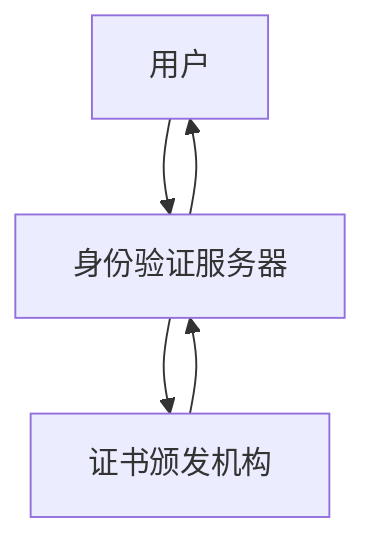
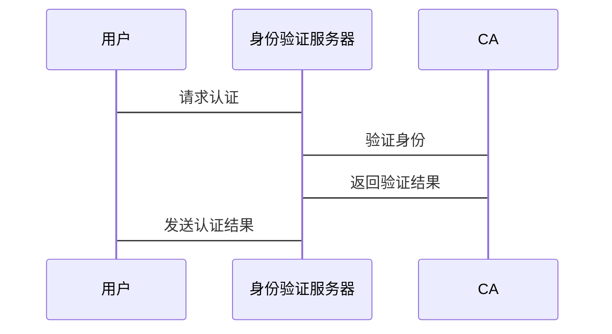
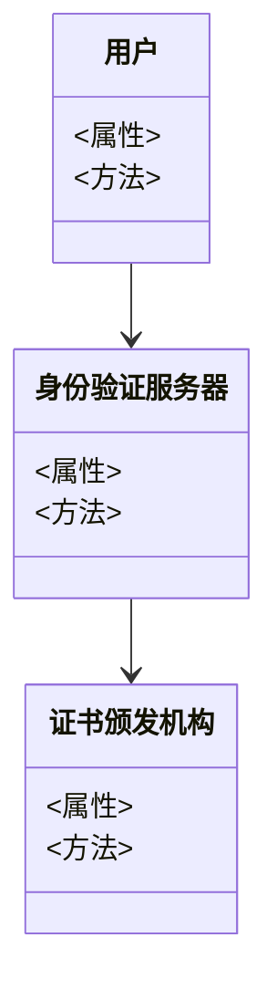

                 


# 股市估值对跨境数字身份认证的影响

---

## 关键词：  
股市估值、数字身份认证、跨境支付、身份认证系统、股票定价、身份认证算法、数字安全

---

## 摘要：  
本文从股市估值与数字身份认证的双重角度出发，探讨数字身份认证如何影响股市估值，特别是在跨境交易中的应用。通过分析股市估值的数学模型和数字身份认证的系统架构，揭示两者的相互作用机制，并结合实际案例，提出优化建议。

---

# 第3章: 股市估值的算法原理

## 3.1 股票定价模型的数学公式

### 3.1.1 DCF模型的公式推导
 discounted cash flow (DCF) 模型是一种常用的股票估值方法，其基本公式如下：

$$
\text{股票价值} = \frac{\text{自由现金流}}{\text{折现率}} \times (1 + \text{增长率})
$$

例如，假设某公司未来五年的自由现金流分别为 $100, 110, 120, 130, 140$，折现率为 $10\%$，则其现值为：

$$
\text{现值} = \sum_{t=1}^{5} \frac{\text{现金流}_t}{(1 + 0.1)^t}
$$

### 3.1.2 市盈率与市净率的计算公式
市盈率 (P/E) 和市净率 (P/B) 是常用的估值指标：

$$
\text{市盈率} = \frac{\text{股价}}{\text{每股收益}} \\
\text{市净率} = \frac{\text{股价}}{\text{每股净资产}}
$$

### 3.1.3 股票估值的数学模型
综合考虑多因素的股票估值模型：

$$
\text{股票价值} = \alpha \times \text{净利润} + \beta \times \text{营收} + \gamma \times \text{行业风险}
$$

---

## 3.2 算法实现与代码示例

### 3.2.1 使用Python实现DCF模型

```python
def discounted_cash_flow(cash_flows, discount_rate, growth_rate):
    present_value = 0
    for year in range(5):
        cash_flow = cash_flows[year] * (1 + growth_rate)**year
        present_value += cash_flow / (1 + discount_rate)**year
    return present_value

# 示例数据
cash_flows = [100, 110, 120, 130, 140]
discount_rate = 0.1
growth_rate = 0.05

value = discounted_cash_flow(cash_flows, discount_rate, growth_rate)
print("股票价值：", value)
```

### 3.2.2 股票估值的机器学习算法

```python
from sklearn.linear_model import LinearRegression

# 数据准备
X = [[100, 200, 1.5], [120, 250, 1.2], [150, 300, 1.8]]
y = [50, 60, 70]

# 模型训练
model = LinearRegression()
model.fit(X, y)

# 预测
new_X = [[110, 220, 1.6]]
prediction = model.predict(new_X)
print("预测股票价值：", prediction[0])
```

---

## 3.3 算法实现的代码解读
1. **DCF模型**：计算未来现金流的现值，用于评估股票的内在价值。
2. **机器学习算法**：利用历史数据训练模型，预测股票价值。

---

# 第4章: 数字身份认证的算法原理

## 4.1 数字身份认证的加密算法

### 4.1.1 常见加密算法（如RSA、AES）

#### RSA加密流程
1. 生成公钥和私钥。
2. 用公钥加密数据。
3. 用私钥解密数据。

#### AES加密流程
1. 生成密钥。
2. 对明文进行分组加密。
3. 解密密文。

### 4.1.2 数字签名的原理与实现
数字签名过程：

1. 生成哈希值。
2. 用私钥对哈希值签名。
3. 用公钥验证签名。

---

## 4.2 身份认证的数学模型

### 4.2.1 数字签名的数学公式
RSA算法中，公钥 $(n, e)$ 和私钥 $(n, d)$ 的关系满足：

$$
e \times d \equiv 1 \pmod{n}
$$

### 4.2.2 身份认证的流程图



---

## 4.3 身份认证的系统架构

### 4.3.1 系统组成
1. 用户端。
2. 身份验证服务器。
3. 证书颁发机构 (CA)。

### 4.3.2 系统交互流程图



---

## 第5章: 系统分析与架构设计方案

## 5.1 问题场景介绍
跨境支付中，用户身份验证的延迟可能导致股市交易延迟，进而影响股市估值。

## 5.2 系统功能设计

### 5.2.1 领域模型类图



### 5.2.2 系统架构图


---

## 第6章: 项目实战

## 6.1 环境安装
- 安装Python和相关库（如`mermaid`、`numpy`、`scikit-learn`）。

## 6.2 核心实现

### 6.2.1 DCF模型实现

```python
def calculate_dcf(cash_flows, discount_rate, growth_rate):
    present_value = 0
    for year in range(len(cash_flows)):
        cash_flow = cash_flows[year] * (1 + growth_rate)**year
        present_value += cash_flow / (1 + discount_rate)**year
    return present_value

# 示例
cash_flows = [100, 110, 120, 130, 140]
discount_rate = 0.1
growth_rate = 0.05

dcf_value = calculate_dcf(cash_flows, discount_rate, growth_rate)
print("DCF模型计算的股票价值：", dcf_value)
```

### 6.2.2 数字签名实现

```python
from cryptography.hazmat.primitives.asymmetric import padding, utils
from cryptography.hazmat.primitives import hashes

def sign(private_key, message):
    signature = private_key.sign(message, padding.PKCS1v15(), hashes.SHA256())
    return signature

def verify(public_key, signature, message):
    try:
        public_key.verify(signature, message, padding.PKCS1v15(), hashes.SHA256())
        return True
    except:
        return False
```

## 6.3 案例分析

### 6.3.1 案例1：DCF模型的应用
假设某公司未来五年的现金流为 $100, 110, 120, 130, 140$，折现率为 $10\%$，计算其股票价值。

### 6.3.2 案例2：数字签名的验证
验证一条消息的签名是否有效。

---

## 第7章: 小结与展望

## 7.1 最佳实践 tips
- 使用高效的加密算法优化身份认证。
- 定期更新数字证书提高安全性。

## 7.2 小结
本文通过分析股市估值与数字身份认证的相互作用，提出了优化建议。

## 7.3 注意事项
- 股市数据具有不确定性，需谨慎处理。
- 数字身份认证需确保安全性。

## 7.4 拓展阅读
- 《区块链技术与数字身份认证》
- 《金融数据分析与股票估值》

---

通过以上分析，我们深入探讨了股市估值与数字身份认证的关系，及其在跨境支付中的应用。希望本文能为相关领域的研究和实践提供参考。

