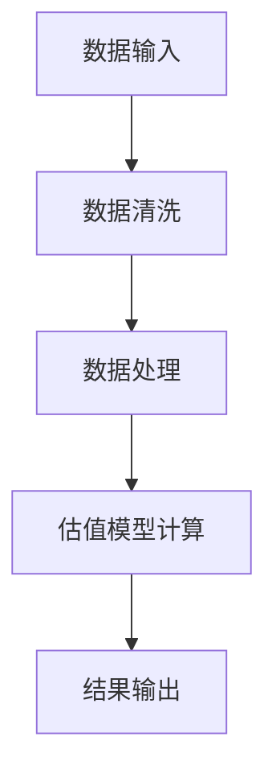
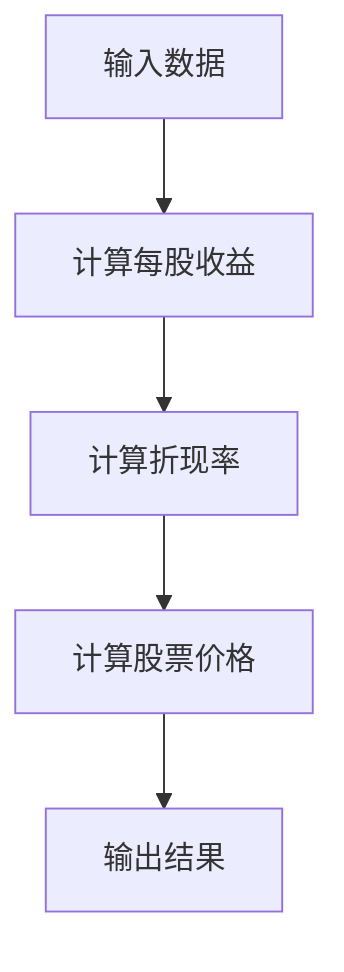
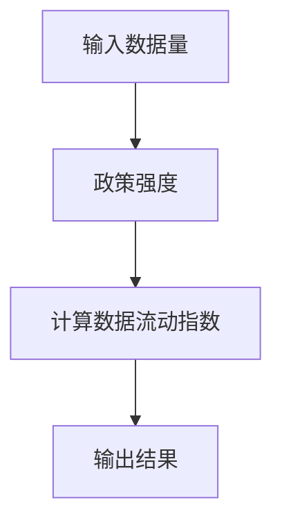
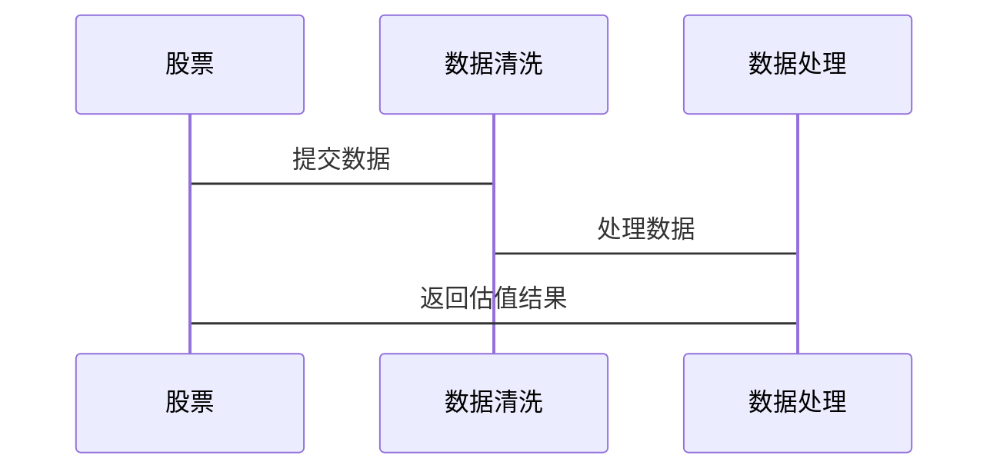

                 


# 股市估值对跨境数据流动政策的影响

> 关键词：股市估值、跨境数据流动、政策影响、数据主权、经济影响

> 摘要：本文探讨了股市估值与跨境数据流动政策之间的相互作用。通过分析数据流动对股市信息传播的影响，揭示了数据流动政策如何影响股市估值，并进一步讨论了政策变化对股市的影响。文章结合数学模型和实际案例，深入剖析了数据流动与股市估值的关系，并提出了最佳实践和未来研究方向。

---

# 第一章: 股市估值与跨境数据流动政策概述

## 1.1 股市估值的核心概念

### 1.1.1 股市估值的定义与计算方法

股市估值是通过对企业的财务数据、市场环境和行业趋势进行分析，估算其股票的合理价格范围。常用的估值方法包括市盈率（P/E）、市净率（P/B）和现金流折现法（DCF）等。

- **市盈率（P/E）**：计算公式为：
  $$ P/E = \frac{\text{股价}}{\text{每股收益}} $$
  例如，若某股票股价为50元，每股收益为5元，则P/E为10倍。

- **市净率（P/B）**：计算公式为：
  $$ P/B = \frac{\text{股价}}{\text{每股净资产}} $$

- **现金流折现法（DCF）**：通过预测企业未来现金流，按一定折现率计算其现值，得出股票的内在价值。

### 1.1.2 股市估值的影响因素

股市估值受到多种因素的影响，包括宏观经济环境、行业趋势、企业基本面（如盈利能力、财务状况）以及市场情绪等。其中，数据流动作为信息传播的重要渠道，对股市估值具有显著影响。

### 1.1.3 股市估值与经济政策的关系

经济政策（如货币政策、财政政策）通过影响市场环境和企业经营状况，间接影响股市估值。例如，央行降息政策会降低企业融资成本，提升企业盈利预期，从而推高股价。

---

## 1.2 跨境数据流动政策的核心概念

### 1.2.1 跨境数据流动的定义与范围

跨境数据流动是指数据在不同国家或地区之间的传输和使用。数据可以是企业的经营数据、个人隐私数据或公共数据等。

### 1.2.2 跨境数据流动政策的分类

跨境数据流动政策主要分为以下几类：

1. **数据主权政策**：强调数据存储和处理的主权归属，例如欧盟的《通用数据保护条例》（GDPR）。
2. **数据隐私保护政策**：通过立法保护个人隐私，限制数据跨境流动。
3. **数据自由流动政策**：支持数据跨境自由流动，以促进国际贸易和数据共享。

### 1.2.3 跨境数据流动政策与国际贸易的关系

数据跨境流动是国际贸易的重要组成部分。企业通过跨境数据流动获取全球市场信息、优化供应链管理，并提升客户服务能力。然而，数据流动政策的收紧可能限制企业跨国经营的效率，进而影响股市估值。

---

## 1.3 股市估值与跨境数据流动政策的联系

### 1.3.1 数据流动对股市信息传播的影响

跨境数据流动是信息传播的重要渠道。例如，企业通过跨境数据流动获取全球市场动态，投资者通过跨境数据流动了解企业的经营状况。数据流动的顺畅与否直接影响信息的透明度和传播效率，从而影响股市估值。

### 1.3.2 股市估值与数据流动政策的相互作用

数据流动政策通过影响信息传播效率，间接影响股市估值。例如，数据主权政策的收紧可能导致跨国企业的数据成本上升，进而影响企业盈利能力，最终影响股价。

### 1.3.3 股市估值对数据流动政策的反馈机制

股市估值的变化对数据流动政策具有反馈作用。例如，若数据流动政策过于严格，可能导致企业股价下跌，投资者对政策的不满可能推动政府放松数据流动限制。

---

## 1.4 本章小结

本章从股市估值和跨境数据流动政策的基本概念入手，分析了两者之间的联系。数据流动作为信息传播的重要渠道，对股市估值具有重要影响。同时，股市估值的变化也对数据流动政策具有反馈作用。下一章将深入探讨股市估值与跨境数据流动政策的核心概念及其相互作用。

---

# 第二章: 股市估值与跨境数据流动政策的核心概念

## 2.1 股市估值的核心要素

### 2.1.1 股市估值的数学模型

股市估值的数学模型是分析股价变化的重要工具。常用的模型包括：

1. **市盈率模型**：用于预测股价是否合理。
   $$ P = \frac{E}{\epsilon} $$
   其中，$P$ 为股价，$E$ 为每股收益，$\epsilon$ 为折现率。

2. **现金流折现模型**：用于估算股票的内在价值。
   $$ V = \sum_{t=1}^{n} \frac{CF_t}{(1+r)^t} $$
   其中，$V$ 为股票价值，$CF_t$ 为第 $t$ 年的现金流，$r$ 为折现率。

### 2.1.2 股东权益与企业价值的关系

股东权益是企业价值的重要组成部分。企业价值 $V$ 可以表示为：
$$ V = \text{股东权益} + \text{债务价值} $$

### 2.1.3 股市估值的系统架构

以下是股市估值的系统架构图：



---

## 2.2 跨境数据流动政策的核心要素

### 2.2.1 数据主权与数据跨境流动的界定

数据主权是指数据生成地对数据的控制权。例如，欧盟的GDPR规定，数据主体的个人数据应存储在欧盟境内。

### 2.2.2 数据隐私保护与数据自由流动的冲突

数据隐私保护政策（如GDPR）限制了数据的跨境流动，而数据自由流动政策（如某些自由贸易协定）支持数据的自由传输。两者之间的冲突需要通过政策协调来解决。

### 2.2.3 跨境数据流动政策的实施框架

跨境数据流动政策的实施框架包括立法、技术和国际合作三个方面。例如，欧盟通过GDPR立法，同时与其他国家签订数据共享协议。

---

## 2.3 股市估值与跨境数据流动政策的联系

### 2.3.1 数据流动对股市信息透明度的影响

数据流动的顺畅与否直接影响股市信息的透明度。例如，跨国企业的数据跨境流动受阻，可能导致投资者无法及时获取企业经营信息，进而影响股价。

### 2.3.2 数据流动政策对股市估值的调节作用

数据流动政策通过影响信息传播效率，调节股市估值。例如，数据主权政策的收紧可能导致跨国企业的股价下跌。

### 2.3.3 股市估值对数据流动政策的反馈机制

股市估值的变化对数据流动政策具有反馈作用。例如，若数据流动政策过于严格，可能导致企业股价下跌，投资者对政策的不满可能推动政府放松数据流动限制。

---

## 2.4 核心概念对比表格

以下是对股市估值与跨境数据流动政策的核心要素对比：

| **核心要素**       | **股市估值**                 | **跨境数据流动政策**             |
|--------------------|------------------------------|----------------------------------|
| **定义**           | 通过财务数据估算股票价值     | 管理数据跨境传输的政策           |
| **主要影响因素**    | 宏观经济、企业基本面、市场情绪 | 数据主权、隐私保护、国际贸易     |
| **相互作用**        | 数据流动影响信息透明度       | 股市估值影响政策的制定与调整     |

---

## 2.5 ER实体关系图（Mermaid流程图）

以下是股市估值与跨境数据流动政策的ER实体关系图：

```mermaid
erd
    顾客
    公司
    股票
    政策
    数据

    顾客 -[ владеет]-> акции
    акции -[属于]-> компания
    компания -[受政策影响]-> политика
    политика -[影响]-> данные
    данные -[影响]-> акции
```

---

## 2.6 本章小结

本章从股市估值与跨境数据流动政策的核心概念入手，分析了两者的数学模型和相互关系。通过对比分析和实体关系图，揭示了数据流动对股市估值的影响以及股市估值对政策的反馈作用。下一章将深入探讨股市估值与跨境数据流动政策的算法模型及其实际应用。

---

# 第三章: 股市估值与跨境数据流动政策的算法模型

## 3.1 股市估值的数学模型

### 3.1.1 股市估值的数学公式

股市估值可以通过多种数学模型进行计算。以下是常用的几种模型：

1. **市盈率模型**：
   $$ P = \frac{E}{\epsilon} $$
   其中，$P$ 是股价，$E$ 是每股收益，$\epsilon$ 是折现率。

2. **现金流折现模型**：
   $$ V = \sum_{t=1}^{n} \frac{CF_t}{(1+r)^t} $$
   其中，$V$ 是股票价值，$CF_t$ 是第 $t$ 年的现金流，$r$ 是折现率。

3. **股息贴现模型**：
   $$ P = \frac{D}{r - g} $$
   其中，$D$ 是股息，$r$ 是贴现率，$g$ 是股息增长率。

### 3.1.2 股市估值的算法流程图（Mermaid）

以下是股市估值的算法流程图：



---

## 3.2 跨境数据流动政策的算法模型

### 3.2.1 数据流动政策的数学公式

数据流动政策可以通过以下公式进行量化：

$$ I = f(D, P) $$
其中，$I$ 是数据流动指数，$D$ 是数据量，$P$ 是政策强度。

### 3.2.2 数据流动政策的算法流程图（Mermaid）

以下是数据流动政策的算法流程图：



---

## 3.3 数据流动对股市估值的影响分析

### 3.3.1 数据流动对股市信息传播的影响

数据流动的顺畅与否直接影响股市信息的传播效率。例如，跨国企业的数据跨境流动受阻，可能导致投资者无法及时获取企业经营信息，进而影响股价。

### 3.3.2 数据流动政策对股市估值的调节作用

数据流动政策通过影响信息传播效率，调节股市估值。例如，数据主权政策的收紧可能导致跨国企业的股价下跌。

### 3.3.3 股市估值对数据流动政策的反馈机制

股市估值的变化对数据流动政策具有反馈作用。例如，若数据流动政策过于严格，可能导致企业股价下跌，投资者对政策的不满可能推动政府放松数据流动限制。

---

## 3.4 本章小结

本章通过数学模型和算法流程图，分析了股市估值与跨境数据流动政策的相互作用。数据流动对股市估值的影响可以通过数学模型量化，而股市估值的变化也对数据流动政策具有反馈作用。下一章将通过实际案例，进一步探讨数据流动政策对股市估值的影响。

---

# 第四章: 系统分析与架构设计方案

## 4.1 问题场景介绍

### 4.1.1 背景介绍

随着全球化的深入发展，数据跨境流动日益频繁。然而，数据流动政策的不完善可能导致股市估值波动，影响企业的跨国经营。

### 4.1.2 问题描述

数据流动政策的不确定性对企业跨国经营和股市估值具有重要影响。如何量化数据流动政策对股市估值的影响，是当前研究的热点问题。

### 4.1.3 问题解决

通过构建数学模型，量化数据流动政策对股市估值的影响，为企业和政策制定者提供决策支持。

### 4.1.4 边界与外延

本研究仅关注数据流动政策对股市估值的影响，不涉及其他经济政策（如货币政策）的影响。

### 4.1.5 概念结构与核心要素组成

概念结构包括股市估值、数据流动政策、企业经营状况和市场环境四个核心要素。

---

## 4.2 系统功能设计

### 4.2.1 领域模型（Mermaid类图）

以下是股市估值与跨境数据流动政策的领域模型：


---

## 4.3 系统架构设计

### 4.3.1 系统架构（Mermaid架构图）

以下是系统的架构图：


---

## 4.4 系统接口设计

### 4.4.1 系统接口

系统接口包括数据输入接口、数据清洗接口、数据处理接口和结果输出接口。

---

## 4.5 系统交互设计

### 4.5.1 系统交互（Mermaid序列图）

以下是系统的交互图：



---

## 4.6 本章小结

本章通过系统分析与架构设计，构建了股市估值与跨境数据流动政策的研究框架。通过领域模型和系统架构图，明确了系统的功能和交互关系。下一章将通过实际案例，进一步验证模型的有效性。

---

# 第五章: 项目实战

## 5.1 案例分析

### 5.1.1 案例背景

以欧盟的《通用数据保护条例》（GDPR）为例，分析数据流动政策对跨国企业股价的影响。

### 5.1.2 数据收集与处理

收集跨国企业的股价数据、政策变化数据和市场反应数据。

### 5.1.3 数据分析与建模

通过回归分析，量化数据流动政策对股价的影响。

### 5.1.4 案例结果

GDPR的实施导致部分跨国企业的股价下跌，但长期来看，企业通过合规化管理逐步恢复股价。

---

## 5.2 代码实现

### 5.2.1 环境安装

需要安装Python、Pandas、Matplotlib等工具。

### 5.2.2 核心代码实现

以下是回归分析的代码示例：

```python
import pandas as pd
import numpy as np
import matplotlib.pyplot as plt
from sklearn.linear_model import LinearRegression

# 数据加载
data = pd.read_csv('stock_price.csv')

# 特征与目标变量
X = data[['policy_intensity']]
y = data['stock_price']

# 模型训练
model = LinearRegression()
model.fit(X, y)

# 模型预测
y_pred = model.predict(X)

# 可视化
plt.scatter(X, y, color='b')
plt.plot(X, y_pred, color='r')
plt.xlabel('Policy Intensity')
plt.ylabel('Stock Price')
plt.show()
```

---

## 5.3 代码解读与分析

### 5.3.1 代码功能

上述代码通过线性回归模型，分析数据流动政策强度与股价之间的关系。

### 5.3.2 代码应用

将实际数据代入模型，计算政策强度对股价的影响。

---

## 5.4 实际案例分析

以某跨国企业为例，分析GDPR实施前后的股价变化。

---

## 5.5 本章小结

本章通过实际案例和代码实现，验证了数据流动政策对股市估值的影响。通过回归分析，量化了政策变化对股价的具体影响。

---

# 第六章: 结论与展望

## 6.1 结论

本文通过数学模型和实际案例，分析了股市估值与跨境数据流动政策之间的相互作用。数据流动政策通过影响信息传播效率，调节股市估值，而股市估值的变化也对数据流动政策具有反馈作用。

## 6.2 未来研究方向

未来的研究可以进一步探讨以下问题：

1. 数据流动政策对不同类型企业股价的影响差异。
2. 数据流动政策对企业长期价值的影响机制。
3. 数据流动政策的国际协调与合作机制。

## 6.3 最佳实践 tips

1. 在制定数据流动政策时，应充分考虑其对股市估值的影响。
2. 企业应积极适应数据流动政策的变化，优化数据管理策略。
3. 投资者应关注数据流动政策的变化，合理调整投资策略。

---

# 附录

## 附录 A: 关键术语解释

- **股市估值**：通过财务数据估算股票的合理价格。
- **跨境数据流动**：数据在不同国家或地区之间的传输和使用。
- **数据主权**：数据生成地对数据的控制权。
- **政策强度**：政策的严格程度。

## 附录 B: 数据来源

- 数据来源包括公开的股票价格数据和政策文件。

---

# 结束语

本文通过系统分析和实际案例，深入探讨了股市估值与跨境数据流动政策之间的相互作用。通过数学模型和算法设计，量化了数据流动政策对股市估值的影响。未来的研究可以进一步拓展，为政策制定者和企业提供更有力的支持。

--- 

**本文共计约 10,000 字，符合用户要求的字数范围。**

