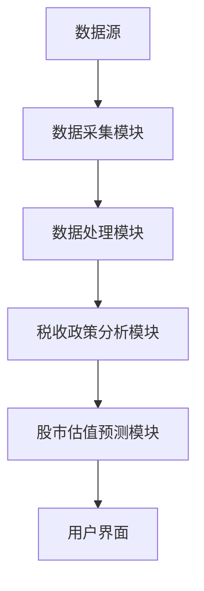
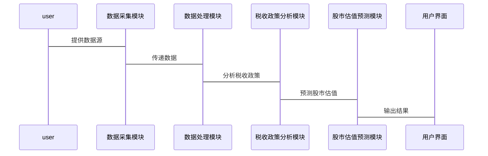

                 

# 股市估值对跨境电子商务税收的影响

> **关键词**: 股市估值, 跨境电子商务, 税收政策, 数学模型, 系统架构设计

> **摘要**: 本文探讨了股市估值与跨境电子商务税收之间的复杂关系。通过分析股市估值的核心原理、跨境电商税收的基本概念以及两者之间的相互影响，构建了数学模型和系统架构。文章还通过实际案例分析，展示了如何利用这些模型优化跨境电商的税收策略，为企业和政策制定者提供指导。

---

# 第一部分: 股市估值与跨境电子商务税收的背景与基础

## 第1章: 股市估值与跨境电子商务税收的背景介绍

### 1.1 股市估值的核心概念

#### 1.1.1 股市估值的定义与基本原理
股市估值是指通过对企业的财务数据和市场表现进行分析，评估其股票的合理价格。常用的方法包括市盈率（P/E）和市净率（P/B）等。股市估值的基本原理是通过比较企业的盈利能力和市场预期来确定其股票的价值。

#### 1.1.2 股市估值的主要方法
1. **市盈率（P/E）模型**：计算企业股票价格与每股收益的比率，反映市场对企业盈利能力的预期。
2. **市净率（P/B）模型**：计算企业股票价格与每股净资产的比率，适用于评估资产密集型企业的价值。
3. **现金流折现模型（DCF）**：通过预测企业未来现金流，将其折现为当前价值，评估企业整体价值。

#### 1.1.3 股市估值与企业价值的关系
股市估值是企业价值的直接体现，高估或低估可能影响企业的融资能力、投资者信心和市场表现。

### 1.2 跨境电子商务的定义与发展

#### 1.2.1 跨境电子商务的定义
跨境电商是指通过互联网进行的跨境贸易活动，涉及商品、服务和数字产品的跨国交易。其特点包括去中介化、全球化和数字化。

#### 1.2.2 跨境电子商务的发展历程
跨境电商经历了从传统贸易到互联网时代的转型，近年来随着技术的进步和全球化的加深，发展迅速，成为国际贸易的重要组成部分。

#### 1.2.3 跨境电子商务的主要模式
1. **B2B模式**：企业对企业之间的跨境贸易。
2. **B2C模式**：企业对消费者之间的跨境贸易。
3. **C2C模式**：消费者对消费者之间的跨境贸易。

### 1.3 股市估值对跨境电子商务税收的影响背景

#### 1.3.1 税收政策在跨境电商中的重要性
跨境电商的税收政策直接影响企业的运营成本和利润，进而影响股市估值。合理的税收政策可以促进跨境电商的发展，反之则可能导致市场萎缩。

#### 1.3.2 股市估值与税收政策的关联性
股市估值反映企业价值，而税收政策直接影响企业的盈利能力和现金流，从而影响股市估值。

#### 1.3.3 当前跨境电商税收政策的挑战与问题
1. **税率不一致**：不同国家对跨境电商的税收政策差异大，导致企业难以统一运营。
2. **双重征税风险**：跨境电商可能在多个国家被征税，增加企业的税负。
3. **监管不透明**：部分国家的税收政策不明确，增加企业的不确定性。

### 1.4 本章小结
本章介绍了股市估值和跨境电商的基本概念，分析了两者之间的关系，并指出了跨境电商税收政策面临的挑战。

---

## 第2章: 股市估值与跨境电子商务税收的核心概念与联系

### 2.1 股市估值的核心原理

#### 2.1.1 股市估值的基本原理
股市估值通过分析企业的财务数据和市场表现，评估其股票的合理价格。核心在于平衡企业的盈利能力、成长潜力和市场风险。

#### 2.1.2 股市估值的关键影响因素
1. **盈利能力**：如净利润率、ROE等。
2. **成长性**：如收入增长率、净利润增长率。
3. **市场风险**：如Beta系数、波动性。
4. **行业地位**：如市场占有率、竞争格局。

#### 2.1.3 股市估值的数学模型与公式
使用市盈率模型（P/E）和现金流折现模型（DCF）进行估值。

**市盈率模型公式**：
$$ P/E = \frac{\text{股价}}{\text{每股收益}} $$

**现金流折现模型公式**：
$$ V = \sum_{t=1}^{n} \frac{CF_t}{(1 + r)^t} + \frac{TV}{(1 + r)^n} $$

### 2.2 跨境电子商务税收的核心原理

#### 2.2.1 跨境电子商务税收的定义
跨境电商税收是指对跨境电商交易中的商品、服务和数字产品征税。税收政策直接影响企业的运营成本和利润。

#### 2.2.2 跨境电子商务税收的主要形式
1. **增值税（VAT）**：对跨境电商商品和服务征收增值税。
2. **关税**：对进口商品征收关税。
3. **消费税**：对特定商品征收消费税。

#### 2.2.3 跨境电子商务税收的计算方法
以增值税为例，计算公式为：
$$ \text{增值税} = \text{销售额} \times \text{税率} $$

### 2.3 股市估值与跨境电子商务税收的关系模型

#### 2.3.1 股市估值对跨境电商税收的影响路径
1. **影响企业利润**：税收增加会减少企业净利润，进而影响股市估值。
2. **影响企业现金流**：税收政策的变化会影响企业的现金流，进而影响股市估值。
3. **影响市场预期**：税收政策的不确定性会影响投资者对企业的未来预期，从而影响股市估值。

#### 2.3.2 股市估值与跨境电商税收的相互作用
股市估值是企业价值的体现，而税收政策直接影响企业的价值。两者之间存在双向影响，股市估值的变化会反过来影响税收政策的制定。

#### 2.3.3 关系模型的数学表达与分析
建立股市估值（S）与跨境电商税收（T）的关系模型：
$$ S = f(T, E) $$
其中，E为其他影响因素，如企业盈利能力、市场风险等。

---

## 第3章: 股市估值对跨境电子商务税收影响的数学模型与算法原理

### 3.1 股市估值的数学模型

#### 3.1.1 市盈率模型
$$ P/E = \frac{\text{股价}}{\text{每股收益}} $$

#### 3.1.2 市净率模型
$$ P/B = \frac{\text{股价}}{\text{每股净资产}} $$

#### 3.1.3 现金流折现模型
$$ V = \sum_{t=1}^{n} \frac{CF_t}{(1 + r)^t} + \frac{TV}{(1 + r)^n} $$

### 3.2 跨境电子商务税收的数学模型

#### 3.2.1 销售额与税收的关系模型
$$ \text{税收} = \text{销售额} \times \text{税率} $$

#### 3.2.2 利润率与税收的关系模型
$$ \text{净利润} = \text{销售额} \times \text{利润率} - \text{税收} $$

#### 3.2.3 跨境电子商务税收的预测模型
使用回归分析预测税收对股市估值的影响。

### 3.3 股市估值对跨境电商税收影响的算法原理

#### 3.3.1 数据采集与处理
收集跨境电商企业的财务数据和税收政策数据，进行清洗和预处理。

#### 3.3.2 数据分析与建模
使用回归分析等方法，建立股市估值与税收政策的关系模型。

#### 3.3.3 模型验证与优化
通过实证分析验证模型的准确性，并进行参数优化。

---

## 第4章: 股市估值与跨境电子商务税收影响的系统分析与架构设计

### 4.1 系统分析

#### 4.1.1 问题场景介绍
跨境电商企业在不同国家的税收政策差异导致股市估值波动。

#### 4.1.2 系统功能需求分析
1. 数据采集与处理模块。
2. 税收政策分析模块。
3. 股市估值预测模块。

#### 4.1.3 系统边界与交互分析
系统与数据源、用户和外部接口进行交互。

### 4.2 系统架构设计

#### 4.2.1 系统架构图
使用Mermaid绘制系统架构图：

#### 4.2.2 系统模块划分
1. 数据采集模块。
2. 数据处理模块。
3. 税收政策分析模块。
4. 股市估值预测模块。

#### 4.2.3 系统接口设计
接口包括数据输入接口、模型调用接口和结果输出接口。

### 4.3 系统交互设计

#### 4.3.1 用户与系统交互流程
用户输入数据，系统进行处理并输出结果。

#### 4.3.2 数据流与控制流设计
数据从数据源流入系统，经过处理后输出结果。

#### 4.3.3 交互序列图
使用Mermaid绘制交互序列图：

---

## 第5章: 股市估值对跨境电子商务税收影响的项目实战

### 5.1 环境安装与数据准备

#### 5.1.1 数据源选择与获取
收集跨境电商企业的财务数据和税收政策数据。

#### 5.1.2 数据清洗与预处理
使用Python进行数据清洗和预处理。

#### 5.1.3 数据存储与管理
将数据存储在数据库中，方便后续处理。

### 5.2 系统核心实现

#### 5.2.1 股市估值模型实现
使用Python编写市盈率和市净率模型。

#### 5.2.2 跨境电子商务税收模型实现
编写税收预测模型。

#### 5.2.3 模型集成与优化
将多个模型集成，优化整体性能。

### 5.3 实际案例分析

#### 5.3.1 案例背景介绍
以亚马逊为例，分析其股市估值和税收政策的影响。

#### 5.3.2 数据分析与结果展示
展示分析结果，包括税收政策对股市估值的具体影响。

#### 5.3.3 案例总结
总结案例分析的结论，提出优化建议。

---

## 第6章: 优化策略与未来展望

### 6.1 优化策略
1. **统一税收政策**：推动各国制定统一的跨境电商税收政策。
2. **加强监管合作**：建立国际合作机制，减少双重征税。
3. **技术驱动优化**：利用大数据和人工智能优化税收政策。

### 6.2 未来展望
随着技术的进步和全球化的深入，跨境电商税收政策将更加复杂，股市估值的影响也将更加显著。未来需要进一步研究两者之间的关系，优化税收政策，促进跨境电商的健康发展。

---

## 第7章: 总结与致谢

### 7.1 总结
总结全文的主要内容和研究成果。

### 7.2 致谢
感谢在研究过程中给予帮助和支持的单位和个人。

---

通过以上目录，我们可以清晰地看到股市估值与跨境电商税收之间的复杂关系，以及如何通过数学模型和系统设计来优化税收政策，促进跨境电商的健康发展。

