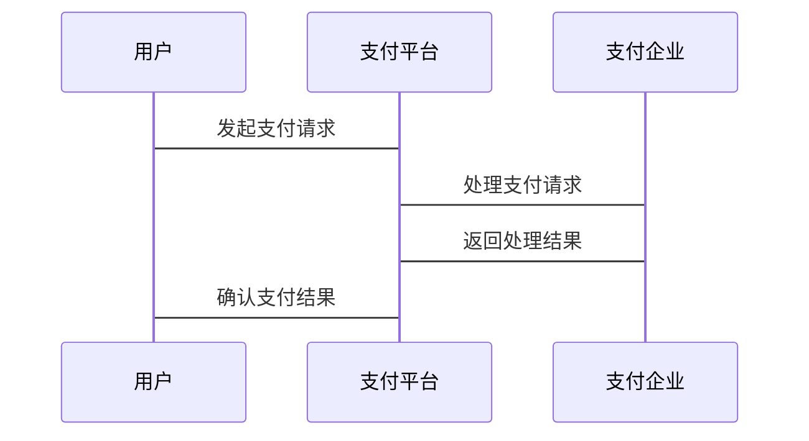

                 


# 股市估值对跨境电子支付发展的影响

> 关键词：股市估值、跨境电子支付、支付技术、支付效率、支付监管、支付企业、支付安全

> 摘要：本文探讨了股市估值与跨境电子支付之间的相互影响。通过分析股市估值的核心概念和跨境电子支付的发展现状，揭示了两者在支付效率、支付安全和支付监管等关键因素上的关联。结合数学模型和算法，本文进一步探讨了股市波动对支付企业的影响路径，并通过实际案例分析展示了如何利用这些模型进行系统设计和优化。

---

## 第一部分：背景介绍

### 第1章：股市估值的基本概念与现状

#### 1.1 股市估值的定义与计算方法
股市估值是指通过特定的金融指标和模型，对上市公司股票的价值进行评估的过程。常见的估值方法包括市盈率（P/E Ratio）、市净率（P/B Ratio）和股息率（Dividend Yield）等。市盈率反映了股票的市场价值相对于其每股收益的倍数，市净率则反映了股票价格与每股净资产的比例，股息率则衡量了股票的分红能力。

#### 1.2 跨境电子支付的发展现状
跨境电子支付是指通过电子方式在全球范围内进行的支付活动。其主要模式包括银行间支付、第三方支付平台和数字货币支付。近年来，随着技术的进步和全球化的加深，跨境电子支付的市场规模迅速增长，成为推动全球经济的重要力量。

#### 1.3 股市估值与跨境电子支付的关联性
股市估值对跨境电子支付的影响体现在支付企业的融资能力和市场信任度上。支付企业的上市融资和业绩表现直接影响股市估值，而股市的波动也会反过来影响支付企业的运营和技术创新能力。因此，两者之间存在着复杂的相互作用机制。

---

## 第二部分：核心概念与联系

### 第2章：股市估值与跨境电子支付的核心概念

#### 2.1 股市估值的核心要素
股市估值的核心要素包括市盈率、市净率和股息率。这些指标不仅反映了企业的财务状况，还影响投资者对支付企业的信心和投资决策。

#### 2.2 跨境电子支付的关键因素
跨境电子支付的关键因素包括支付技术、支付安全和支付监管。支付技术决定了支付的效率和成本，支付安全关系到用户的信任度，而支付监管则影响支付行业的合规性和稳定性。

#### 2.3 股市估值与跨境电子支付的联系
股市估值与跨境电子支付的联系主要体现在支付企业的融资能力、市场信任度和技术创新能力上。支付企业的上市融资和业绩表现直接影响股市估值，而股市的波动也会影响支付企业的运营和支付技术的创新。

---

## 第三部分：股市估值与跨境电子支付的相互作用机制

### 第3章：股市估值对跨境电子支付的影响路径

#### 3.1 股市估值影响支付企业的资金流动性
股市估值的高低直接影响支付企业的资金流动性。高估值意味着投资者对支付企业有信心，愿意投资，从而为企业提供了更多的资金支持。

#### 3.2 股市估值影响支付企业的市场信任度
股市估值是市场对支付企业信任度的体现。高估值意味着市场对支付企业的发展前景有信心，从而提升了企业的市场信任度。

#### 3.3 股市估值影响支付企业的技术创新能力
股市估值的高低会影响支付企业的技术创新能力。高估值意味着企业有更多的资金用于技术研发，从而推动支付技术的创新。

### 第4章：跨境电子支付对股市的影响路径

#### 4.1 支付企业的上市融资对股市的影响
支付企业的上市融资会直接影响股市的流动性。通过IPO或增发，支付企业为市场提供了更多的交易机会，从而影响股市的整体表现。

#### 4.2 支付企业的业绩对股市的影响
支付企业的业绩表现直接影响股市的波动。良好的业绩会提升企业的股价，而业绩不佳则会引发股价下跌。

#### 4.3 支付行业的整体发展对股市的影响
支付行业的整体发展对股市的影响是多层次的。行业的增长会带动相关企业的业绩，从而影响股市的整体表现。

---

## 第四部分：算法原理与系统分析

### 第5章：股市估值与跨境电子支付的数学模型与算法

#### 5.1 股市估值的数学模型
股市估值的数学模型包括市盈率模型和市净率模型。市盈率模型通过计算企业的市盈率来评估其股票的价值，而市净率模型则通过计算企业的市净率来评估其股票的价值。

#### 5.2 跨境电子支付的支付效率模型
跨境电子支付的支付效率模型通过计算支付交易的时间和成本，评估支付效率。通过优化支付技术，可以降低支付交易的时间和成本，从而提高支付效率。

---

## 第五部分：系统分析与架构设计

### 第6章：系统功能设计

#### 6.1 领域模型（Mermaid 类图）


#### 6.2 系统架构设计（Mermaid 架构图）


#### 6.3 系统接口设计
系统接口设计包括支付企业与支付平台之间的接口、支付平台与银行之间的接口，以及支付平台与用户之间的接口。

#### 6.4 系统交互（Mermaid 序列图）


---

## 第六部分：项目实战

### 第7章：环境安装与代码实现

#### 7.1 环境配置
需要安装Python和相关库，如numpy、pandas和scikit-learn。

#### 7.2 核心代码实现
以下是一个简单的支付效率分析代码示例：

```python
import numpy as np
import pandas as pd

# 示例数据
data = {'支付时间': [1, 2, 3, 4, 5],
        '支付金额': [100, 200, 300, 400, 500]}
df = pd.DataFrame(data)

# 支付效率计算
def payment_efficiency(data):
    return np.mean(data['支付时间'])

efficiency = payment_efficiency(df)
print(f"支付效率: {efficiency}")
```

---

## 第七部分：最佳实践

### 第8章：总结与展望

#### 8.1 小结
股市估值与跨境电子支付之间的相互影响是复杂而深远的。股市估值影响支付企业的融资能力和技术创新能力，而支付行业的发展也反过来影响股市的表现。

#### 8.2 注意事项
在实际应用中，需要注意支付安全和支付监管的问题，确保支付系统的稳定性和合规性。

#### 8.3 未来展望
未来，随着技术的进步和全球化的深入，股市估值与跨境电子支付之间的关系将更加紧密。支付技术的创新和支付监管的完善将为股市估值的提升提供更多的可能性。

---

通过以上分析，我们可以看到，股市估值对跨境电子支付的发展具有重要的影响。理解两者的相互作用机制，有助于我们更好地把握支付行业的未来发展方向，并为投资者提供更精准的决策支持。

