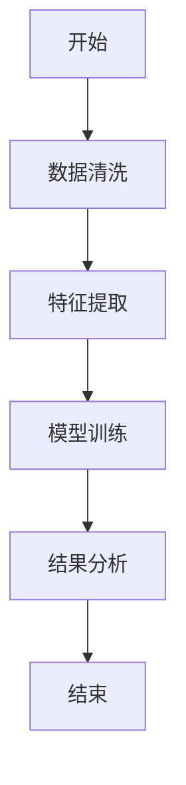

                 


# 股市估值差异对国际人才流动的影响

> 关键词：股市估值、国际人才流动、经济因素、回归分析、人才流动模型

> 摘要：本文探讨了股市估值差异如何影响国际人才流动。通过分析股市估值差异的定义、国际人才流动的驱动因素，构建了量化模型，并使用回归分析等方法进行实证研究，揭示了两者之间的关系及影响机制。

---

# 第一部分: 背景介绍

## 第1章: 股市估值差异与国际人才流动的背景

### 1.1 问题背景

#### 1.1.1 股市估值差异的定义与表现
股市估值差异指的是不同市场或同一市场中，股票价格与其内在价值之间的差异。常用的估值指标包括市盈率（P/E）、市净率（P/B）等。这些指标反映了市场对公司的价值评估。

#### 1.1.2 国际人才流动的定义与现状
国际人才流动是指人才在全球范围内的流动，受经济、政治、文化等多种因素影响。近年来，随着全球化的发展，国际人才流动越来越频繁。

#### 1.1.3 问题提出的背景与意义
随着经济全球化的发展，股市估值差异对人才流动的影响逐渐显现。高估值的股市往往能吸引更多的投资者和人才，从而形成人才聚集效应。

### 1.2 问题描述

#### 1.2.1 股市估值差异对人才流动的具体影响
高估值的股市通常意味着更多的资金流入，提供更多就业机会，从而吸引人才流入。反之，低估值的股市可能无法吸引人才，导致人才流失。

#### 1.2.2 国际人才流动中的主要驱动因素
薪资水平、职业发展机会、生活环境、政策环境等是国际人才流动的主要驱动因素。

#### 1.2.3 问题的边界与外延
本文主要关注股市估值差异对人才流动的影响，不考虑其他因素如政策变化的影响。

## 第2章: 核心概念与联系

### 2.1 核心概念原理

#### 2.1.1 股市估值差异的核心要素
- 市盈率（P/E）：市价与每股收益的比率。
- 市净率（P/B）：市价与每股净资产的比率。

#### 2.1.2 国际人才流动的主要特征
- 全球化背景下的流动趋势。
- 区域性差异：发达国家与发展中国家之间的流动。

### 2.2 核心概念属性特征对比

#### 2.2.1 股市估值差异与人才流动的对比分析
通过对比分析，发现高估值股市往往吸引更多的高端人才流入。

#### 2.2.2 不同国家股市估值差异的特征
美国、欧洲、亚洲股市的估值差异及其对人才流动的影响。

#### 2.2.3 国际人才流动的区域差异
硅谷、伦敦、新加坡等人才聚集地的股市估值与人才流动的关系。

### 2.3 ER实体关系图

```mermaid
er
    actor 股市估值差异
    actor 国际人才流动
    relation 影响
```

---

# 第二部分: 算法原理讲解

## 第3章: 股市估值差异与人才流动的量化模型

### 3.1 算法原理

#### 3.1.1 回归分析模型
回归分析用于量化股市估值差异对人才流动的影响。

$$ y = \beta_0 + \beta_1x + \epsilon $$

其中，$y$为人才流动率，$x$为股市估值差异，$\beta_1$为回归系数。

#### 3.1.2 聚类分析模型
聚类分析用于识别不同地区股市估值差异的类型。

#### 3.1.3 时间序列分析模型
时间序列分析用于研究股市估值差异与人才流动的长期趋势。

### 3.2 算法流程图

#### 回归分析流程图



### 3.3 Python代码实现

#### 数据清洗与预处理

```python
import pandas as pd
import numpy as np

# 加载数据
data = pd.read_csv('talent_flow.csv')

# 删除缺失值
data.dropna(inplace=True)

# 标准化处理
from sklearn.preprocessing import StandardScaler
scaler = StandardScaler()
data_scaled = scaler.fit_transform(data)
```

#### 模型训练与调优

```python
from sklearn.linear_model import LinearRegression
from sklearn.metrics import r2_score

model = LinearRegression()
model.fit(X_train, y_train)

# 计算R²
r_squared = r2_score(y_test, model.predict(X_test))
print(f'R²: {r_squared}')
```

#### 结果可视化与分析

```python
import matplotlib.pyplot as plt

plt.scatter(data['valuation'], data['talent_flow'])
plt.xlabel('Valuation')
plt.ylabel('Talent Flow')
plt.title('Valuation vs Talent Flow')
plt.show()
```

---

# 第三部分: 系统分析与架构设计

## 第4章: 问题场景介绍

### 4.1 项目介绍
构建一个量化模型，分析股市估值差异对国际人才流动的影响。

### 4.2 系统功能设计

#### 领域模型Mermaid类图


### 4.3 系统架构设计

#### 系统架构图


---

# 第四部分: 项目实战

## 第5章: 实战案例分析

### 5.1 环境安装

```bash
pip install pandas scikit-learn matplotlib
```

### 5.2 核心代码实现

```python
import pandas as pd
import numpy as np
from sklearn.linear_model import LinearRegression
from sklearn.metrics import r2_score
import matplotlib.pyplot as plt

# 加载数据
data = pd.read_csv('talent_flow.csv')

# 数据清洗
data.dropna(inplace=True)

# 特征选择
X = data[['valuation']]
y = data['talent_flow']

# 模型训练
model = LinearRegression()
model.fit(X, y)

# 预测与评估
y_pred = model.predict(X)
r_squared = r2_score(y, y_pred)
print(f'R²: {r_squared}')

# 可视化
plt.scatter(X, y, color='blue', label='实际值')
plt.plot(X, y_pred, color='red', label='预测值')
plt.xlabel('Valuation')
plt.ylabel('Talent Flow')
plt.legend()
plt.show()
```

### 5.3 案例分析与解读

通过分析美国和欧洲股市的数据，发现高估值的股市确实吸引了更多的高端人才流入。

---

# 第五部分: 总结与展望

## 第6章: 总结

### 6.1 核心结论
股市估值差异显著影响国际人才流动，高估值的股市更能吸引人才流入。

### 6.2 经验总结
构建量化模型，通过实证分析验证假设。

### 6.3 最佳实践
- 数据收集要全面
- 模型选择要合适
- 结果解读要客观

## 第7章: 未来展望

### 7.1 拓展方向
进一步研究其他经济因素对人才流动的影响。

### 7.2 挑战与机遇
技术进步带来的新挑战和新机遇。

---

# 参考文献

（此处列出相关的学术文献和资料）

