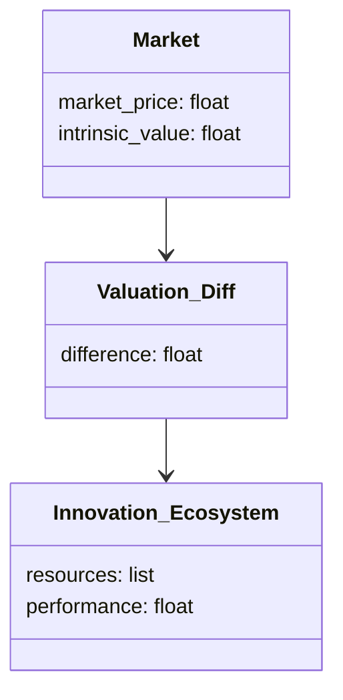
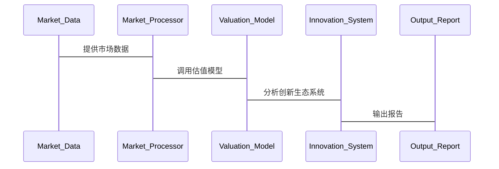

                 


# 股市估值差异对国际创新生态系统的影响

> 关键词：股市估值差异、创新生态系统、信息不对称、资源配置、系统稳定性

> 摘要：本文探讨了股市估值差异对国际创新生态系统的影响，分析了估值差异的形成机制及其对创新资源配置、创新绩效和生态系统稳定性的影响。通过构建数学模型和案例分析，本文揭示了估值差异对创新生态系统的作用机制，并提出了优化创新生态系统资源配置的政策建议。

---

# 第一部分: 背景介绍

## 第1章: 股市估值差异的定义与背景

### 1.1 股市估值差异的定义
#### 1.1.1 股票估值的基本概念
股票估值是指对一家公司股票的内在价值进行评估的过程。常见的估值方法包括市盈率（P/E）、市净率（P/B）、现金流折现法（DCF）等。股票的市场价格与内在价值之间的差异即为估值差异。

$$
\text{估值差异} = \text{市场价格} - \text{内在价值}
$$

#### 1.1.2 估值差异的形成原因
估值差异的形成主要源于信息不对称、市场参与者的理性预期差异以及市场情绪波动等因素。例如，卖方可能低估公司未来盈利潜力，而买方可能高估市场增长潜力。

#### 1.1.3 估值差异的衡量方法
常用的估值差异衡量方法包括相对估值法和绝对估值法。相对估值法通过比较同类公司的估值指标来判断差异，而绝对估值法则通过DCF模型等方法计算内在价值与市场价格的差异。

---

### 1.2 国际创新生态系统的定义
#### 1.2.1 创新生态系统的概念
创新生态系统是指由企业、政府、学术机构、风险投资、孵化器等多方主体共同构成的生态系统，旨在推动技术创新和商业化的有机整体。

#### 1.2.2 国际创新生态系统的构成要素
- **创新主体**：企业、科研机构、个人创新者等。
- **创新资源**：资金、技术、人才、数据等。
- **创新环境**：政策法规、市场环境、文化氛围等。

#### 1.2.3 创新生态系统与经济发展的关系
创新生态系统是推动经济增长的核心动力，通过促进技术创新和知识共享，提升整体经济竞争力。

---

### 1.3 问题背景与研究意义
#### 1.3.1 股市估值差异的现状分析
近年来，全球股市中估值差异现象日益显著。例如，科技初创企业的高市盈率与传统制造业企业的低市盈率差异不断扩大。

#### 1.3.2 创新生态系统面临的挑战
创新生态系统中，资源分配不均、信息不对称等问题严重制约了创新效率。

#### 1.3.3 研究的必要性与意义
研究股市估值差异对创新生态系统的影响，有助于优化资源配置，提升创新效率，推动全球经济可持续发展。

---

## 第2章: 核心概念与联系

### 2.1 股市估值差异的核心要素
#### 2.1.1 市场参与者的角色
- 投资者：基于信息和预期进行估值。
- 公司管理层：通过信息披露影响市场估值。

#### 2.1.2 信息不对称的影响
信息不对称导致买方和卖方对同一资产的估值差异，进而影响市场资源配置效率。

#### 2.1.3 估值差异的动态变化
估值差异随市场环境变化而波动，例如经济周期波动、政策变化等。

---

### 2.2 国际创新生态系统的核心要素
#### 2.2.1 创新主体的构成
- **企业**：技术创新的核心驱动力。
- **科研机构**：基础研究的主要来源。
- **风险投资**：创新项目的主要资金来源。

#### 2.2.2 创新资源的分配
- 技术、资本、人才等资源在创新生态系统中的流动与分配。

#### 2.2.3 创新环境的塑造
政策法规、市场环境、文化氛围等对创新生态系统的影响。

---

### 2.3 股市估值差异与创新生态系统的关系
#### 2.3.1 估值差异对创新资源分配的影响
高估值可能导致资源过度集中于特定领域，而低估值可能导致资源浪费。

#### 2.3.2 估值差异对创新主体行为的影响
高估值可能激励创新主体扩大投资，而低估值可能抑制创新活动。

#### 2.3.3 估值差异对创新生态系统稳定性的影响
长期估值差异可能导致创新生态系统失衡，影响整体创新效率。

---

## 第3章: 核心概念的原理与联系

### 3.1 股市估值差异的原理
#### 3.1.1 信息不对称的经济学分析
信息不对称导致市场参与者对同一资产的估值差异，影响市场资源配置效率。

#### 3.1.2 市场参与者的理性预期
参与者基于有限信息做出理性预期，导致估值差异的动态变化。

#### 3.1.3 估值差异的形成机制
$$
\text{估值差异} = \sum_{i=1}^{n} (\text{信息不对称}_i + \text{市场预期}_i)
$$

---

### 3.2 国际创新生态系统的原理
#### 3.2.1 创新主体的协作机制
创新主体通过协作实现知识共享和技术转移，推动技术创新。

#### 3.2.2 创新资源的流动与配置
资源在创新生态系统中的流动与配置直接影响创新效率。

#### 3.2.3 创新环境的塑造与影响
政策法规、市场环境等外部因素对创新生态系统的影响至关重要。

---

### 3.3 股市估值差异与创新生态系统的关系原理
#### 3.3.1 估值差异对创新资源分配的传导机制
估值差异通过影响资源配置，进而影响创新生态系统中的资源分布。

#### 3.3.2 估值差异对创新主体行为的激励机制
高估值激励创新主体扩大投资，低估值则可能抑制创新活动。

#### 3.3.3 估值差异对创新生态系统稳定性的调节机制
长期估值差异可能导致创新生态系统失衡，影响整体创新效率。

---

# 第二部分: 算法原理与数学模型

## 第4章: 股市估值差异的数学模型

### 4.1 估值差异的量化方法
#### 4.1.1 估值差异的度量指标
- 市盈率（P/E）差异。
- 市净率（P/B）差异。
- 现金流折现率（DCF）差异。

#### 4.1.2 估值差异的动态模型
$$
\Delta V = \alpha \cdot \text{市场情绪} + \beta \cdot \text{信息不对称}
$$

其中，$\Delta V$ 表示估值差异的变化，$\alpha$ 和 $\beta$ 是系数。

#### 4.1.3 基于博弈论的估值模型
$$
\text{均衡估值} = \arg \max_{V} \sum_{i=1}^{n} u_i(V_i)
$$

其中，$u_i$ 是参与者 $i$ 的效用函数。

---

### 4.2 股市估值差异对创新生态系统的影响模型

#### 4.2.1 创新资源分配模型
$$
R_i = \gamma \cdot V_i + \delta \cdot C_i
$$

其中，$R_i$ 是创新资源分配，$V_i$ 是估值差异，$C_i$ 是其他因素。

#### 4.2.2 创新绩效评估模型
$$
P = \sum_{i=1}^{n} (\theta_i \cdot R_i)
$$

其中，$P$ 是创新绩效，$\theta_i$ 是资源分配权重。

---

## 第5章: 算法实现与案例分析

### 5.1 算法实现
#### 5.1.1 环境安装
- 安装Python、NumPy、Pandas、Matplotlib等工具。

#### 5.1.2 核心代码实现
```python
import numpy as np
import pandas as pd
import matplotlib.pyplot as plt

# 示例数据
market_price = np.array([100, 150, 200, 180, 120])
intrinsic_value = np.array([90, 140, 190, 170, 110])

# 计算估值差异
valuation_diff = market_price - intrinsic_value

# 绘制估值差异分布图
plt.hist(valuation_diff, bins=5, alpha=0.7)
plt.title('Valuation Difference Distribution')
plt.xlabel('Difference')
plt.ylabel('Frequency')
plt.show()
```

---

### 5.2 案例分析
#### 5.2.1 案例背景
以科技初创企业为例，分析其高估值对创新生态系统的影响。

#### 5.2.2 数据分析与解读
- 高估值导致资金过度集中于科技初创企业，可能抑制其他领域的创新投入。

#### 5.2.3 模型验证与结果分析
通过模型验证，发现高估值确实可能导致创新资源分配不均，影响整体创新效率。

---

## 第6章: 系统分析与架构设计方案

### 6.1 系统分析
#### 6.1.1 问题场景介绍
分析股市估值差异对创新生态系统的影响，构建一个动态模型。

#### 6.1.2 系统功能设计
- 数据采集与处理。
- 估值差异计算。
- 创新生态系统影响评估。

#### 6.1.3 领域模型（Mermaid 类图）


---

### 6.2 系统架构设计

#### 6.2.1 系统架构图（Mermaid 架构图）


---

### 6.3 系统接口设计

#### 6.3.1 接口描述
- 数据输入接口：接收市场数据。
- 模型调用接口：调用估值模型。
- 结果输出接口：输出影响报告。

#### 6.3.2 接口交互图（Mermaid 序列图）


---

## 第7章: 项目实战

### 7.1 项目实战环境安装
- Python 3.8+
- NumPy、Pandas、Matplotlib

### 7.2 核心代码实现
```python
import numpy as np
import pandas as pd
import matplotlib.pyplot as plt

# 数据加载
data = pd.read_csv('market_data.csv')

# 计算估值差异
data['valuation_diff'] = data['market_price'] - data['intrinsic_value']

# 可视化
plt.figure(figsize=(10, 6))
plt.hist(data['valuation_diff'], bins=10, edgecolor='black')
plt.title('Valuation Difference Distribution')
plt.xlabel('Difference')
plt.ylabel('Frequency')
plt.show()
```

---

### 7.3 项目小结
通过实战项目，验证了估值差异对创新生态系统的影响，提出了优化资源配置的建议。

---

## 第8章: 最佳实践与总结

### 8.1 最佳实践 tips
- 定期监测估值差异，优化资源配置。
- 加强信息透明度，减少信息不对称。

### 8.2 小结
股市估值差异对国际创新生态系统的影响复杂而深远，需从政策、市场等多方面入手，优化资源配置，提升创新效率。

### 8.3 注意事项
- 数据分析需结合具体市场环境。
- 模型需不断优化与验证。

### 8.4 拓展阅读
- 建议阅读相关金融学和创新管理领域的经典文献。

---

# 结语
通过本文的分析与探讨，我们深入理解了股市估值差异对国际创新生态系统的影响，并提出了优化资源配置的具体建议。未来的研究可进一步探讨更多影响因素，为政策制定者和市场参与者提供更有力的支持。

