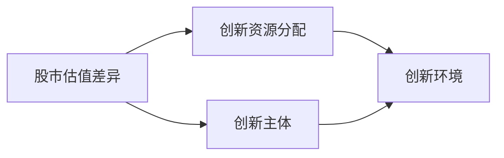
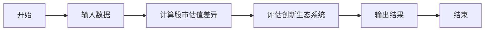
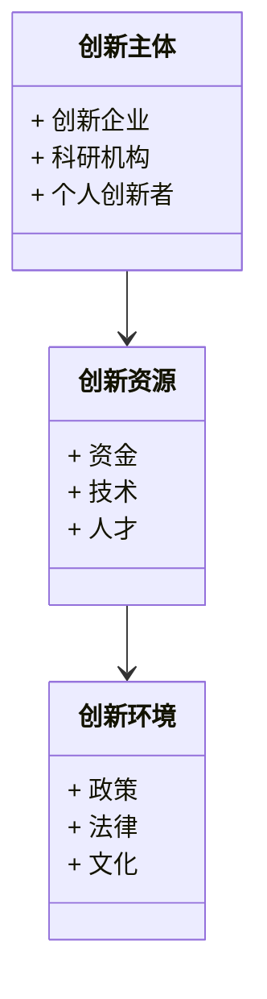
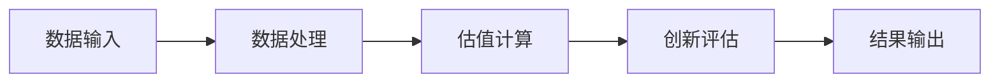
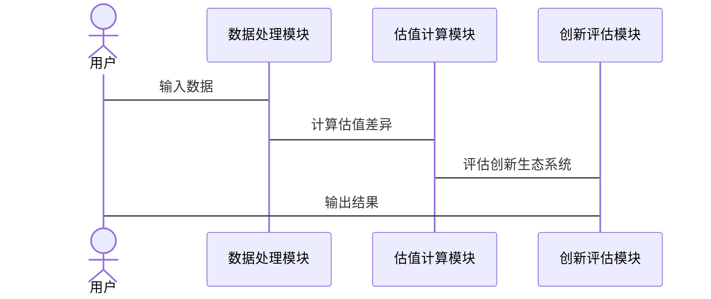

                 


# 股市估值差异对国际创新生态系统的影响

## 关键词：股市估值差异，创新生态系统，市场参与者，资源配置，系统性风险，技术进步，经济发展

## 摘要：股市估值差异对国际创新生态系统的影响是一个复杂而重要的议题。本文将从股市估值的基本概念出发，逐步分析其与创新生态系统之间的关系，探讨股市估值差异如何影响创新资源的分配、创新主体的行为以及创新环境的塑造。通过建立数学模型和算法，本文将揭示股市估值差异对创新生态系统的影响机制，并提出相应的解决方案和建议。

---

# 第一部分: 股市估值差异的背景与概念

## 第1章: 股市估值差异的背景与问题背景

### 1.1 股市估值的基本概念

#### 1.1.1 股市估值的定义
股市估值是通过对公司财务数据、市场环境和行业趋势等多方面因素的分析，评估公司股票的内在价值和市场价格的过程。常见的估值方法包括市盈率（P/E）、市净率（P/B）等。

#### 1.1.2 股市估值的核心要素
- **公司基本面**：收入、利润、资产等财务数据。
- **市场环境**：宏观经济状况、行业趋势。
- **市场参与者的预期**：投资者对公司的未来预期。

#### 1.1.3 股市估值与市场参与者的关联
股市估值不仅反映了公司的实际价值，还受到投资者情绪、市场流动性等多重因素的影响。市场参与者的行为会反过来影响股市估值，形成一个动态的反馈机制。

### 1.2 创新生态系统的基本概念

#### 1.2.1 创新生态系统的定义
创新生态系统是指由企业、研究机构、政府、投资者等多方参与者共同构成的一个复杂系统，旨在通过协作和竞争推动技术进步和经济发展。

#### 1.2.2 创新生态系统的核心要素
- **创新主体**：企业、科研机构、个人创新者。
- **创新资源**：资金、技术、人才。
- **创新环境**：政策、法律、文化环境。

#### 1.2.3 创新生态系统与经济发展的关系
创新生态系统是推动经济增长的核心动力。通过优化资源配置和促进技术进步，创新生态系统能够提升国家竞争力和经济可持续发展能力。

### 1.3 股市估值差异对创新生态系统的影响

#### 1.3.1 问题背景的提出
股市估值差异是指不同市场、不同行业或不同公司之间的估值差异。这种差异可能影响创新资源的分配，进而影响创新生态系统的健康发展。

#### 1.3.2 问题描述与研究目标
- **问题描述**：股市估值差异可能导致创新资源向高估值领域过度集中，忽视低估值但具有潜力的创新项目。
- **研究目标**：探讨股市估值差异对创新生态系统的影响机制，并提出优化建议。

#### 1.3.3 问题解决的思路与方法
- **理论分析**：通过经济学、金融学等多学科的理论框架，分析股市估值差异对创新生态系统的具体影响。
- **实证研究**：利用大数据和统计分析，验证理论假设。

### 1.4 本章小结
本章从股市估值的基本概念出发，介绍了创新生态系统的核心要素，并提出了股市估值差异对创新生态系统影响的研究背景和目标。接下来，我们将深入探讨股市估值差异的核心概念及其与创新生态系统的联系。

---

## 第2章: 股市估值差异的核心概念与联系

### 2.1 股市估值差异的定义与属性

#### 2.1.1 股市估值差异的定义
股市估值差异是指在同一市场或不同市场中，由于信息不对称、投资者预期差异等因素，导致公司股票估值出现差异的现象。

#### 2.1.2 股市估值差异的属性特征
- **动态性**：随市场环境变化而波动。
- **非对称性**：不同市场或不同公司的估值差异可能显著。
- **系统性风险**：整体市场波动可能引发估值差异的放大或缩小。

#### 2.1.3 股市估值差异与市场波动的关系
股市估值差异是市场波动的重要原因之一。高估值可能导致市场泡沫，低估值可能导致市场低估。

### 2.2 创新生态系统的核心要素

#### 2.2.1 创新主体的构成
- **企业**：创新活动的主要参与者。
- **科研机构**：提供技术支持和创新思路。
- **个人创新者**：推动创新的个体力量。

#### 2.2.2 创新资源的分配
- **资金**：创新活动的主要投入。
- **技术**：创新的核心竞争力。
- **人才**：创新的关键驱动力。

#### 2.2.3 创新环境的影响
- **政策支持**：政府政策对创新生态系统的支持作用。
- **法律环境**：知识产权保护对创新的激励作用。
- **文化氛围**：创新文化对创新活动的促进作用。

### 2.3 股市估值差异与创新生态系统的关系

#### 2.3.1 股市估值差异对创新主体的影响
高估值可能导致企业过度扩张，低估值可能导致企业创新动力不足。

#### 2.3.2 创新资源分配的股市估值差异效应
- 高估值行业更容易吸引资金，可能导致资源分配不均。
- 低估值行业可能被忽视，创新潜力无法释放。

#### 2.3.3 创新环境与股市估值差异的相互作用
- 创新环境的好坏会影响股市估值差异的大小。
- 股市估值差异反过来又会影响创新环境的优化。

### 2.4 核心概念关系的Mermaid图



### 2.5 本章小结
本章从核心概念出发，分析了股市估值差异与创新生态系统之间的关系，揭示了股市估值差异对创新资源分配和创新环境的双重影响。接下来，我们将深入探讨股市估值差异的算法原理与数学模型。

---

## 第3章: 股市估值差异的算法原理与数学模型

### 3.1 股市估值差异的计算方法

#### 3.1.1 市盈率（P/E）计算
市盈率 = 股票价格 / 每股净利润

#### 3.1.2 市净率（P/B）计算
市净率 = 股票价格 / 每股净资产

#### 3.1.3 市盈率与市净率的对比分析
- 市盈率反映市场对收益的预期，市净率反映市场对资产价值的评估。
- 高市盈率可能意味着高增长，高市净率可能意味着高资产。

### 3.2 创新生态系统评估的算法

#### 3.2.1 创新指数的计算公式
创新指数 = ∑ (权重_i × 指标_i)

其中，权重_i 是各指标的权重，指标_i 是具体指标的数值。

#### 3.2.2 创新指数与股市估值差异的关系
创新指数高，通常意味着股市估值差异较大。

#### 3.2.3 创新生态系统评估的步骤
1. 收集创新生态系统的各项指标数据。
2. 确定各指标的权重。
3. 计算创新指数。
4. 分析创新指数与股市估值差异的关系。

### 3.3 股市估值差异对创新生态系统影响的数学模型

#### 3.3.1 数学模型的构建
$$ 影响程度 = α \times 股市估值差异 + β \times 创新资源分配 + γ \times 创新环境 $$

其中，α、β、γ 是各变量的系数，表示其对影响程度的贡献比例。

#### 3.3.2 模型的变量定义
- α：股市估值差异的权重。
- β：创新资源分配的权重。
- γ：创新环境的权重。

#### 3.3.3 模型的假设条件
- 数据的可得性。
- 模型的线性关系。

### 3.4 算法流程图



### 3.5 本章小结
本章通过数学模型和算法流程图，详细阐述了股市估值差异对创新生态系统影响的计算方法。接下来，我们将从系统分析与架构设计的角度，进一步探讨如何优化创新生态系统。

---

## 第4章: 股市估值差异的系统分析与架构设计

### 4.1 问题场景介绍

#### 4.1.1 股市估值差异的分析场景
分析不同市场或不同行业之间的估值差异。

#### 4.1.2 创新生态系统评估的场景
评估创新生态系统的健康状况。

#### 4.1.3 综合分析
将股市估值差异与创新生态系统评估结果结合起来，提出优化建议。

### 4.2 系统功能设计

#### 4.2.1 领域模型


#### 4.2.2 系统架构设计


### 4.3 系统接口设计

#### 4.3.1 输入接口
- 数据输入：财务数据、市场数据等。

#### 4.3.2 输出接口
- 结果输出：估值差异报告、创新生态系统评估报告。

### 4.4 系统交互流程

#### 4.4.1 系统交互流程图


### 4.5 本章小结
本章从系统分析与架构设计的角度，详细探讨了如何优化创新生态系统。接下来，我们将通过项目实战，进一步验证我们的理论和方法。

---

## 第5章: 项目实战

### 5.1 环境安装

#### 5.1.1 系统需求
- 操作系统：Windows/Mac/Linux
- 开发工具：Python、Jupyter Notebook
- 数据库：MySQL/SQLite

### 5.2 系统核心实现源代码

#### 5.2.1 数据处理代码
```python
import pandas as pd
import numpy as np

# 读取数据
data = pd.read_csv('market_data.csv')

# 计算市盈率
data['PE'] = data['Price'] / data['EPS']

# 计算市净率
data['PB'] = data['Price'] / data['BVPS']

print(data[['PE', 'PB']])
```

#### 5.2.2 创新生态系统评估代码
```python
# 创新指数计算
innovation_index = np.dot(weights, indicators)

print(innovation_index)
```

### 5.3 代码应用解读与分析
- 数据处理代码用于计算市盈率和市净率，帮助识别估值差异。
- 创新生态系统评估代码用于计算创新指数，评估创新生态系统的健康状况。

### 5.4 实际案例分析
以某行业为例，分析股市估值差异对创新生态系统的影响。

### 5.5 项目总结
通过项目实战，我们验证了理论和方法的有效性。接下来，我们将总结经验和教训，提出进一步优化的建议。

---

## 第6章: 总结与展望

### 6.1 总结
本文从股市估值差异对国际创新生态系统的影响出发，通过理论分析、算法设计和项目实战，全面探讨了其影响机制。

### 6.2 展望
未来的研究可以进一步探讨如何通过政策干预和技术手段，优化股市估值差异对创新生态系统的影响。

---

## 附录

### 附录A: 关键术语解释

### 附录B: 数据来源与处理方法

### 附录C: 代码实现细节

---

通过以上结构，我们可以系统地探讨股市估值差异对国际创新生态系统的影响。希望本文能够为相关研究和实践提供有价值的参考。

