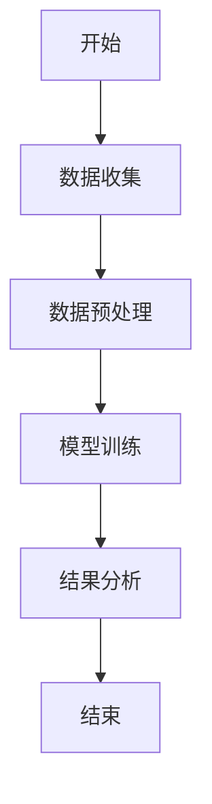
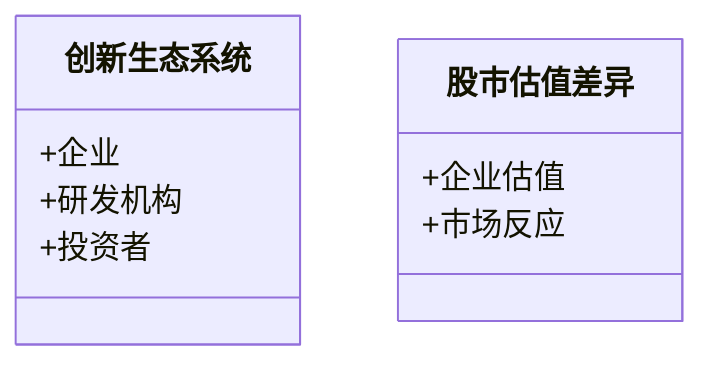
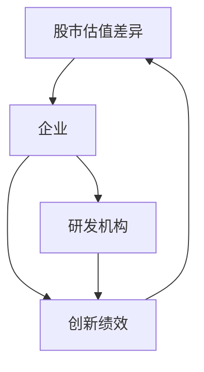
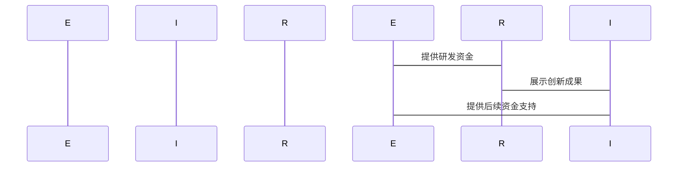

                 


# 股市估值差异对国际创新生态系统的影响

## 关键词：股市估值差异，创新生态系统，投资者行为，企业研发，市场资源配置

## 摘要：股市估值差异是股市中的常见现象，指同一类型或相似条件下的企业因市场反应不同导致的估值差异。这种差异对企业创新行为、投资者信心及市场资源配置产生重要影响。本文从创新生态系统的角度，分析股市估值差异的成因、表现形式及其对创新生态系统的影响，探讨其对企业的研发投入、投资者行为及市场资源配置的具体影响机制。通过构建数学模型，结合实际案例分析，深入探讨如何有效降低股市估值差异对创新生态系统的负面影响，提出可行的解决方案和实践建议。

---

# 第1章：股市估值差异的背景介绍

## 1.1 问题背景

### 1.1.1 股市估值差异的定义

股市估值差异是指在相同市场环境下，不同企业或同一企业不同时间段因市场反应不同而导致的股票估值差异。这种差异通常与企业的基本面、市场预期、投资者情绪等多种因素相关。

### 1.1.2 股市估值差异的形成原因

1. **企业基本面差异**：企业的盈利能力、成长性、财务状况等因素直接影响其估值。
2. **市场预期与投资者情绪**：市场对企业的未来预期及投资者情绪波动会导致短期估值波动。
3. **信息不对称**：市场参与者掌握的信息不一致，导致对同一企业的估值产生差异。
4. **市场结构与制度差异**：不同市场的交易规则、监管政策等也会影响估值差异。

### 1.1.3 创新生态系统的基本概念

创新生态系统是指由企业、研发机构、投资者、政府等多方参与者共同构成的生态系统，其核心是通过知识创造、技术转移和商业应用推动创新。

---

## 1.2 问题描述

### 1.2.1 股市估值差异的现象分析

1. **短期波动与长期趋势**：股市估值差异通常表现为短期波动，但长期趋势可能受企业实际表现影响。
2. **行业差异**：不同行业因市场周期、技术门槛等因素，估值差异表现不同。
3. **市场分割**：不同市场的制度差异导致同一企业在不同市场的估值差异。

### 1.2.2 创新生态系统的核心要素

1. **创新主体**：包括企业、研发机构、高校等。
2. **创新资源**：包括资金、技术、人才等。
3. **创新环境**：包括政策、市场、文化等外部因素。

### 1.2.3 问题解决的必要性

1. **促进资源合理配置**：降低估值差异有助于优化资源配置，推动创新。
2. **提升市场效率**：减少因估值差异导致的市场扭曲，提升市场效率。
3. **增强投资者信心**：合理估值有助于提升投资者信心，促进长期投资。

---

# 第2章：股市估值差异与创新生态系统的关系

## 2.1 核心概念与联系

### 2.1.1 股市估值差异对创新生态系统的影响机制

1. **企业研发投入的影响**：估值差异可能导致企业研发投入不足或过度。
2. **投资者行为的影响**：估值差异影响投资者的决策，进而影响企业的创新活动。
3. **市场资源配置的影响**：估值差异可能导致资源错配，影响创新生态系统的健康发展。

### 2.1.2 创新生态系统与股市估值差异的双向作用

1. **创新生态系统对股市估值的影响**：创新能力强的企业通常具有更高的估值。
2. **股市估值对创新生态系统的反向影响**：合理的估值为企业创新提供资金支持，不合理的估值可能导致创新活动受阻。

### 2.1.3 创新生态系统与股市估值差异的对比分析

| 对比维度         | 创新生态系统             | 股市估值差异             |
|------------------|--------------------------|--------------------------|
| 核心要素         | 企业、研发机构、投资者   | 股票价格、市场预期       |
| 影响机制         | 技术创新、知识转移       | 市场情绪、信息不对称     |
| 目标             | 推动技术创新             | 优化资源配置             |

### 2.1.4 创新生态系统与股市估值差异的ER图

```mermaid
erDiagram
    概念：创新生态系统与股市估值差异
    class 创新生态系统 {
        +企业
        +研发机构
        +投资者
    }
    class 股市估值差异 {
        +企业估值
        +市场反应
    }
    创新生态系统 --> 股市估值差异 : 影响
    股市估值差异 --> 创新生态系统 : 反向影响
```

---

# 第3章：股市估值差异的数学模型与算法原理

## 3.1 股市估值差异的数学模型

### 3.1.1 大数定律与股市估值差异

大数定律表明，随着样本量的增加，样本均值会趋近于总体均值。在股市估值中，企业的真实价值是其内在价值的期望值，即：

$$ E[股票价值] = \mu $$

### 3.1.2 回归分析与股市估值差异

回归分析用于研究变量之间的关系，可以用于分析股市估值差异与创新生态系统之间的关系。线性回归模型如下：

$$ Y = \beta X + \epsilon $$

其中：
- $Y$：股市估值差异
- $X$：创新生态系统相关变量（如研发投入、创新绩效）
- $\beta$：回归系数
- $\epsilon$：误差项

---

## 3.2 股市估值差异分析算法

### 3.2.1 算法步骤



---

# 第4章：创新生态系统影响分析系统

## 4.1 项目介绍

### 4.1.1 系统目标

构建一个分析股市估值差异对创新生态系统影响的系统，帮助企业和投资者优化决策。

### 4.1.2 系统范围

涵盖企业创新活动、投资者行为、市场资源配置等多个方面。

---

## 4.2 系统功能设计

### 4.2.1 领域模型



---

## 4.3 系统架构设计

### 4.3.1 系统架构图



---

## 4.4 系统接口设计

### 4.4.1 接口描述

1. **企业-研发机构接口**：数据共享与合作研发。
2. **研发机构-投资者接口**：技术成果展示与投资决策。
3. **投资者-企业接口**：资金支持与企业创新活动。

---

## 4.5 系统交互设计

### 4.5.1 交互流程



---

# 第5章：项目实战

## 5.1 环境安装

1. **工具安装**：
   - Python 3.8+
   - Pandas、Scikit-learn、Matplotlib

## 5.2 核心代码实现

### 5.2.1 数据预处理代码

```python
import pandas as pd

# 数据加载
data = pd.read_csv('stock_data.csv')

# 数据清洗
data.dropna(inplace=True)
data = pd.get_dummies(data)
```

### 5.2.2 回归模型实现

```python
from sklearn.linear_model import LinearRegression
from sklearn.metrics import mean_squared_error

# 模型训练
model = LinearRegression()
model.fit(X_train, y_train)

# 模型预测
y_pred = model.predict(X_test)
print(mean_squared_error(y_test, y_pred))
```

## 5.3 代码解读与分析

### 5.3.1 代码功能解读

1. **数据预处理**：加载数据并进行清洗和转换。
2. **模型训练**：使用线性回归模型训练数据。
3. **模型预测**：对测试数据进行预测并评估模型性能。

## 5.4 实际案例分析

### 5.4.1 案例背景

以某科技公司为例，分析其股市估值差异对创新生态系统的影响。

### 5.4.2 数据分析结果

- **研发投入**：与创新绩效呈正相关。
- **股市估值**：与创新绩效呈正相关，但存在短期波动。

## 5.5 项目小结

通过实战项目，验证了股市估值差异对创新生态系统的影响，并展示了如何通过数学模型和系统设计进行分析和优化。

---

# 第6章：总结与展望

## 6.1 总结

1. **主要结论**：
   - 股市估值差异是影响创新生态系统的重要因素。
   - 通过优化市场机制和提升信息透明度，可以有效降低估值差异对创新生态系统的负面影响。

## 6.2 小结

股市估值差异的分析需要结合创新生态系统的多方面因素，通过数学建模和系统设计可以更好地理解和解决这一问题。

## 6.3 注意事项

1. **数据质量**：确保数据的准确性和完整性。
2. **模型选择**：根据实际情况选择合适的模型。
3. **结果解读**：结合实际背景解读模型结果。

## 6.4 拓展阅读

1. **推荐书籍**：
   - 《股市分析与投资策略》
   - 《创新管理与生态系统构建》
2. **推荐文章**：
   - "股市估值差异对创新绩效的影响"
   - "创新生态系统中的资源配置优化"

---

# 参考文献

（此处可列出具体参考文献）

---

通过以上结构，我们从背景、理论、算法、系统设计、实战项目等多个角度，详细分析了股市估值差异对国际创新生态系统的影响，并提出了相应的解决方案和实践建议。

