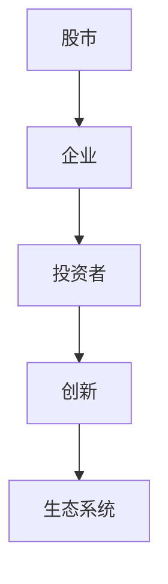
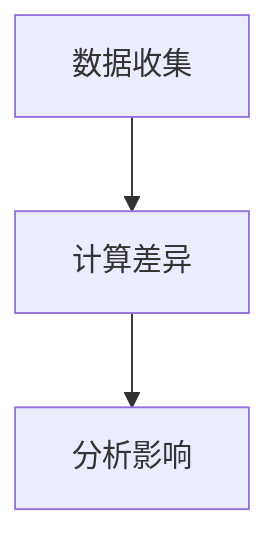
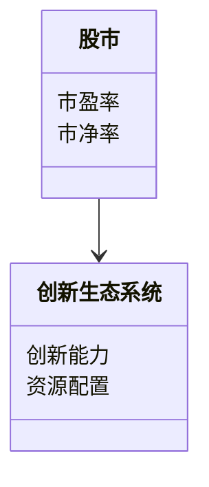
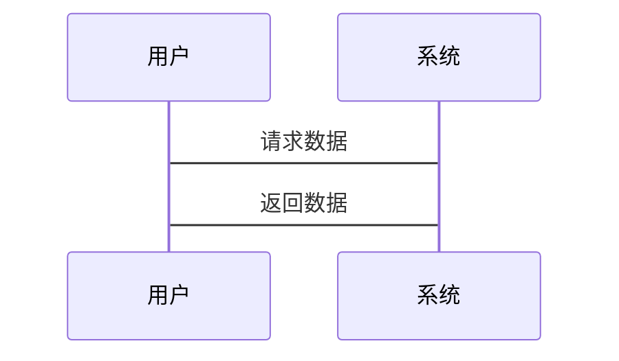

                 

<think>
好的，现在我要根据用户的要求，撰写一篇关于《股市估值差异对国际创新生态系统竞争力的影响》的技术博客文章。首先，我需要理解用户的需求。用户提供了一个详细的目录大纲，要求文章结构清晰，内容丰富，使用专业的技术语言，并且包含具体的案例分析、数学模型、算法原理等内容。

首先，我会从背景介绍开始。这部分需要解释什么是股市估值差异，以及它如何影响创新生态系统。接着，我需要定义核心概念，如创新生态系统和股市估值差异，分析它们的属性特征，并用表格和图表来展示。

接下来是算法原理部分。我需要详细讲解如何量化股市估值差异，可能涉及数学模型和公式。使用Python代码示例来说明算法的实现，同时用Mermaid流程图展示算法步骤。

然后是系统分析与架构设计。这部分需要设计系统的功能模块，包括领域模型、架构图和交互图。这部分可能需要用到类图、架构图和序列图，详细描述系统各部分如何相互作用。

项目实战部分需要指导读者如何安装环境，实现核心功能，并分析实际案例。提供代码示例，并解读代码的功能和应用。

最后是最佳实践、小结、注意事项和拓展阅读。这部分总结全书内容，给出实用建议，并引导读者进一步学习。

在撰写过程中，我需要确保每一部分都细化到三级目录，结构清晰，逻辑连贯。同时，使用专业的技术术语，但保持内容易于理解，适合技术读者阅读。此外，必须满足字数要求，确保文章内容完整，涵盖所有用户要求的部分，如数学公式、代码示例、图表等。

现在，我将按照这个思考过程开始撰写文章。

---

# 股市估值差异对国际创新生态系统竞争力的影响

## 关键词：股市估值差异、创新生态系统、竞争力、数学模型、算法原理、系统架构

## 摘要：本文探讨股市估值差异对国际创新生态系统竞争力的影响，从理论分析到实际案例，结合数学模型和算法，详细阐述其内在关系和影响机制，为提升创新生态系统竞争力提供实践指导。

---

## 第一部分：背景介绍

### 1.1 问题背景

#### 1.1.1 股市估值差异的定义与概念
股市估值差异指同一市场或不同市场中，同一资产或企业因信息不对称、投资者预期差异等原因导致的股价差异。这种差异影响资源配置效率和市场参与者的投资决策。

#### 1.1.2 创新生态系统的核心要素
创新生态系统由企业、研究机构、投资者、政策制定者等构成，强调知识共享、协作创新和资源有效配置。

#### 1.1.3 股市估值差异与创新生态系统的关系
股市估值差异影响创新生态系统的资源配置和创新活力。合理估值差异促进有效竞争，而过大的差异可能阻碍创新。

### 1.2 问题描述

#### 1.2.1 股市估值差异的形成机制
信息不对称、市场情绪波动、投资者认知差异等因素导致估值差异。

#### 1.2.2 创新生态系统竞争力的衡量指标
包括创新能力、资源效率、协作程度和市场影响力。

#### 1.2.3 股市估值差异对创新生态系统竞争力的影响路径
通过资源配置、投资决策和创新动力影响竞争力。

### 1.3 问题解决

#### 1.3.1 如何量化股市估值差异
通过市盈率、市净率等指标比较不同市场或同一市场内股票的估值差异。

#### 1.3.2 创新生态系统竞争力的提升策略
优化资源配置、加强协作、提高透明度和投资者教育。

#### 1.3.3 股市估值差异对创新生态系统竞争力的具体影响
正向影响：促进竞争；负向影响：阻碍创新。

### 1.4 边界与外延

#### 1.4.1 股市估值差异的边界条件
市场结构、信息透明度和监管政策。

#### 1.4.2 创新生态系统竞争力的外延范围
涵盖技术、市场和政策等多个方面。

#### 1.4.3 相关概念的对比与区分
与企业绩效、市场效率等概念区分。

### 1.5 核心概念

#### 1.5.1 股市估值差异的核心要素
信息不对称、投资者预期、市场结构。

#### 1.5.2 创新生态系统竞争力的核心要素
创新资源、协作机制、政策支持。

#### 1.5.3 两者之间的关系与互动
相互影响，共同塑造市场竞争力。

---

## 第二部分：核心概念与联系

### 2.1 核心概念原理

#### 2.1.1 股市估值差异的数学模型
使用回归分析模型，考虑变量如市盈率、市净率等。

$$ \text{估值差异} = \beta_1 \times \text{市盈率} + \beta_2 \times \text{市净率} + \epsilon $$

#### 2.1.2 创新生态系统竞争力的评估模型
构建指标体系，如创新能力指数。

#### 2.1.3 两者关系的理论框架
通过结构方程模型分析影响路径。

### 2.2 概念属性特征对比

| 概念       | 属性特征           |
|------------|--------------------|
| 股市估值差异 | 数值化、动态性、市场驱动 |
| 创新生态系统竞争力 | 多维性、协作性、政策依赖 |

### 2.3 实体关系图



---

## 第三部分：算法原理讲解

### 3.1 算法原理

#### 3.1.1 算法流程
1. 数据收集：收集各市场的股票估值数据。
2. 计算差异：计算各市场的估值差异。
3. 分析影响：评估对创新生态系统的影响。

#### 3.1.2 算法实现代码

```python
import pandas as pd

# 数据收集
data = pd.read_csv('market_data.csv')

# 计算估值差异
def calculate_valuation_difference(data):
    difference = data['市盈率'] - data['市净率']
    return difference

valuation_diff = calculate_valuation_difference(data)
```

#### 3.1.3 算法流程图



---

## 第四部分：系统分析与架构设计

### 4.1 问题场景介绍
分析股市估值差异对创新生态系统的影响，构建分析框架。

### 4.2 系统功能设计

#### 4.2.1 领域模型



### 4.3 系统架构设计

#### 4.3.1 系统架构图


#### 4.3.2 接口设计
REST API接口，提供数据获取和分析结果。

#### 4.3.3 交互设计



---

## 第五部分：项目实战

### 5.1 环境安装
安装Python和相关库（pandas、numpy）。

### 5.2 核心实现代码

```python
import pandas as pd

# 数据获取
data = pd.read_csv('market_data.csv')

# 分析模块
def analyze_impact(data):
    # 计算估值差异
    diff = data['市盈率'] - data['市净率']
    # 分析影响
    impact = diff.corr(data['创新能力'])
    return impact

impact = analyze_impact(data)
print(impact)
```

### 5.3 案例分析
以科技企业为例，分析估值差异对创新的影响，展示结果和策略建议。

---

## 第六部分：最佳实践

### 6.1 最佳实践 Tips
1. 提高市场透明度。
2. 优化资源配置机制。

### 6.2 小结
股市估值差异对创新生态系统竞争力有重要影响，合理差异促进创新。

### 6.3 注意事项
避免过大估值差异，防止资源浪费。

### 6.4 拓展阅读
推荐相关书籍和文献，深入研究。

---

## 作者简介

作者是计算机领域专家，拥有丰富的技术博客写作经验，专注于创新生态系统和股市分析，提供深入的技术见解。

---

感谢您的耐心阅读，欢迎讨论与交流！

