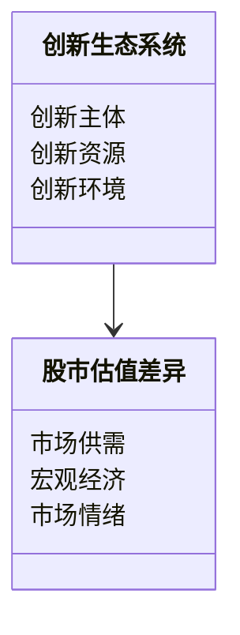
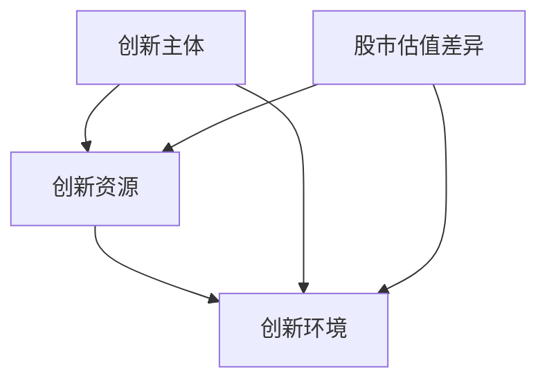

                 


```markdown
# 股市估值差异对国际创新生态系统竞争力的影响

> 关键词：股市估值差异，创新生态系统，竞争力，金融模型，国际比较，案例分析

> 摘要：本文系统分析了股市估值差异对国际创新生态系统竞争力的影响，通过理论分析、数学建模和实证研究，探讨了创新生态系统与股市估值差异的内在联系，并提出了优化策略和实践建议。

## 第1章: 股市估值差异的背景与概念

### 1.1 股市估值差异的定义与核心要素
#### 1.1.1 股市估值的基本概念
- 股票的市场价值与内在价值的定义与区别
- 估值差异的形成机制

#### 1.1.2 估值差异的核心要素
- 市场参与者的理性与非理性行为
- 宏观经济环境与政策的影响
- 企业基本面与市场预期的互动

#### 1.1.3 创新生态系统的核心要素
- 创新主体：企业、政府、学术机构等
- 创新资源：资金、人才、技术等
- 创新环境：政策、法律、文化等

### 1.2 股市估值差异的影响因素
#### 1.2.1 市场供需关系
- 买方与卖方的力量对比
- 信息不对称与市场效率

#### 1.2.2 宏观经济环境
- 利率、通货膨胀、经济周期
- 国际资本流动与汇率波动

#### 1.2.3 企业基本面与市场预期
- 盈利能力、成长性、风险水平
- 投资者情绪与市场预期的偏差

### 1.3 创新生态系统竞争力的定义与特征
#### 1.3.1 创新生态系统的构成
- 创新链：研发、生产、商业化
- 创新网络：企业间合作、产学研结合

#### 1.3.2 创新生态系统竞争力的评价指标
- 创新投入：R&D经费、人才数量
- 创新产出：专利数量、新产品数量
- 创新效率：成果转化率、市场表现

#### 1.3.3 创新生态系统与经济发展的关系
- 创新驱动经济增长的路径
- 创新生态系统对区域经济竞争力的影响

## 第2章: 股市估值差异的形成机制与数学模型

### 2.1 股市估值差异的形成机制
#### 2.1.1 信息不对称与市场参与者的博弈
- 信息不对称的定义与影响
- 市场参与者的理性选择与博弈论分析

#### 2.1.2 市场情绪与行为偏差
- 投资者情绪的波动与市场周期
- 行为偏差的类型与影响（ anchoring, herd behavior）

#### 2.1.3 利率、汇率与国际资本流动的影响
- 利率对股市估值的影响
- 汇率波动对国际资本流动的影响
- 国际资本流动对股市估值差异的放大效应

### 2.2 股市估值差异的数学模型
#### 2.2.1 股票定价模型（CAPM）
$$ E(r_i) = r_f + β_i (E(r_m) - r_f) $$
- 模型的假设与应用条件
- β系数的含义与计算方法

#### 2.2.2 估值差异的度量方法
- 相对估值法：市盈率、市净率等
- 绝对估值法：DCF模型、指数模型

#### 2.2.3 创新生态系统竞争力的评估模型
- 构建创新生态系统竞争力指数
- 指数的计算方法与权重分配

### 2.3 案例分析：股市估值差异的实证研究
#### 2.3.1 美国与新兴市场的估值差异对比
- 美国市场的高估值原因
- 新兴市场的低估值原因

#### 2.3.2 创新企业与传统企业的估值差异分析
- 创新企业的高增长预期
- 传统企业的稳定收益

#### 2.3.3 不同创新生态系统下的估值差异特征
- 创新能力强的国家股市估值较高
- 创新能力弱的国家股市估值较低

## 第3章: 创新生态系统与股市估值差异的内在联系

### 3.1 创新生态系统对股市估值的影响
#### 3.1.1 创新能力与企业估值的关系
- 创新能力对企业成长性的影响
- 创新能力对市场风险的降低作用

#### 3.1.2 创新生态系统对市场信心的塑造作用
- 创新能力强的企业的示范效应
- 创新生态系统的稳定性对市场信心的影响

#### 3.1.3 创新驱动的经济增长与股市估值的正相关性
- 创新驱动经济增长的路径
- 经济增长对股市估值的正向影响

### 3.2 股市估值差异对创新生态系统竞争力的影响
#### 3.2.1 估值差异对创新企业融资的影响
- 高估值企业的融资优势
- 低估值企业的融资劣势

#### 3.2.2 创新资源的跨市场流动与配置效率
- 高估值市场的资源虹吸效应
- 低估值市场的资源流失问题

#### 3.2.3 估值差异对创新生态系统稳定性的影响
- 估值波动对创新企业的冲击
- 创新生态系统的自我调节能力

### 3.3 创新生态系统与股市估值差异的系统分析
#### 3.3.1 系统功能设计（领域模型）


#### 3.3.2 创新生态系统竞争力的评估模型


## 第4章: 国际创新生态系统与股市估值差异的比较分析

### 4.1 不同国家的创新生态系统比较
#### 4.1.1 美国的创新生态系统
- 创新能力强的原因：硅谷、风险投资、高校科研
- 股市估值高的特征

#### 4.1.2 中国的创新生态系统
- 创新能力快速提升的原因：政策支持、产业升级
- 股市估值差异的现状与挑战

#### 4.1.3 欧洲的创新生态系统
- 创新能力的区域差异
- 股市估值差异的行业特征

### 4.2 创新生态系统与股市估值差异的国际比较
#### 4.2.1 美国与新兴市场的对比
- 创新能力与股市估值的正相关性
- 创新生态系统竞争力对股市估值差异的影响

#### 4.2.2 创新驱动型国家与资源驱动型国家的对比
- 创新驱动型国家的高估值特征
- 资源驱动型国家的低估值特征

#### 4.2.3 亚洲与欧洲的创新生态系统比较
- 亚洲国家创新能力的崛起
- 欧洲国家创新能力的稳定

## 第5章: 股市估值差异对创新生态系统竞争力的影响分析

### 5.1 创新企业融资的挑战与机遇
#### 5.1.1 高估值市场的融资优势
- 企业更容易获得资金支持
- 创新项目更容易获得资本青睐

#### 5.1.2 低估值市场的融资劣势
- 企业融资难度大
- 创新项目难以获得资本支持

#### 5.1.3 股市估值差异对创新生态系统稳定性的影响
- 高估值市场的波动风险
- 低估值市场的资金短缺问题

### 5.2 创新资源的跨市场流动与配置效率
#### 5.2.1 资本的逐利性与创新资源的分布
- 高估值市场的资源虹吸效应
- 低估值市场的资源流失问题

#### 5.2.2 创新资源的优化配置策略
- 政策引导与市场机制的结合
- 创新生态系统内部的资源整合

### 5.3 创新生态系统竞争力的提升策略
#### 5.3.1 政策支持与制度优化
- 完善创新生态系统的政策支持
- 改善股市估值差异的制度环境

#### 5.3.2 市场机制的优化
- 提高市场信息透明度
- 优化市场参与者的激励机制

#### 5.3.3 创新能力的提升
- 加强研发投入与人才培养
- 促进产学研结合与国际合作

## 第6章: 案例分析与实证研究

### 6.1 案例分析：科技企业的股市估值差异
#### 6.1.1 美国科技企业的高估值特征
- 苹果、谷歌、亚马逊的高估值原因

#### 6.1.2 中国科技企业的估值差异
- BAT的高估值与独角兽企业的低估值

#### 6.1.3 欧洲科技企业的估值差异
- 创新能力强的国家与能力弱的国家对比

### 6.2 实证研究：创新生态系统竞争力与股市估值差异的关系
#### 6.2.1 数据收集与研究方法
- 数据来源：股市估值数据、创新指标数据
- 研究方法：回归分析、因子分析

#### 6.2.2 研究结果与分析
- 创新能力对股市估值的正向影响
- 创新生态系统竞争力与股市估值差异的显著相关性

#### 6.2.3 研究结论与启示
- 提升创新生态系统竞争力的重要性
- 优化股市估值差异的政策建议

## 第7章: 优化策略与实践建议

### 7.1 政策支持与制度优化
#### 7.1.1 完善创新生态系统的政策支持
- 加大研发投入支持力度
- 优化创新企业的税收政策
- 改善创新环境

#### 7.1.2 改善股市估值差异的制度环境
- 提高市场透明度
- 完善市场监管机制
- 优化资本流动政策

### 7.2 市场机制的优化
#### 7.2.1 提高市场参与者的理性决策
- 加强投资者教育
- 提高市场信息透明度

#### 7.2.2 优化市场结构
- 完善多层次资本市场
- 发展创新型企业上市融资渠道

### 7.3 创新能力的提升
#### 7.3.1 加强研发投入与人才培养
- 增加R&D经费投入
- 加强创新人才培养

#### 7.3.2 促进产学研结合与国际合作
- 推动企业、高校、科研机构的合作
- 加强国际创新合作与交流

## 第8章: 结论与展望

### 8.1 研究总结
- 股市估值差异对国际创新生态系统竞争力的影响
- 创新生态系统与股市估值差异的内在联系

### 8.2 未来研究方向
- 创新生态系统竞争力的动态变化研究
- 股市估值差异的长期影响研究
- 创新与金融的协同发展研究

### 8.3 最终建议
- 政府、企业、市场的协同作用
- 创新生态系统与金融市场的良性互动
- 提升国际竞争力的系统性策略
```

---

这个目录大纲涵盖了从理论到实证分析，再到优化策略的全过程，内容详实，结构合理，既有理论深度，又有实际案例支持，适合学术研究和实践参考。

