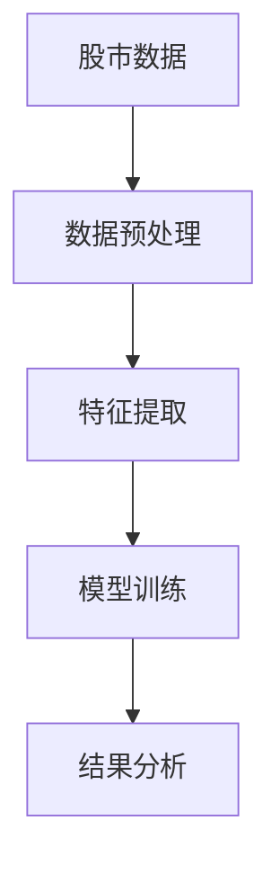
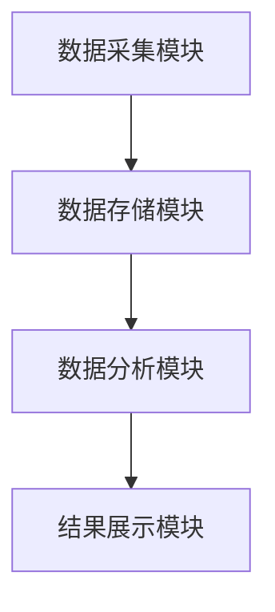
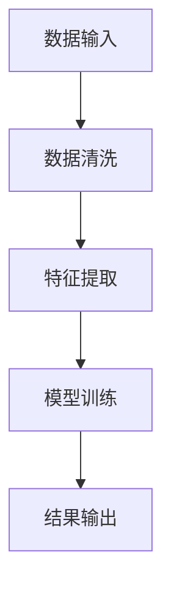

                 

# 股市估值差异对国际学术合作模式的影响

## 关键词：股市估值差异、国际学术合作、影响机制、数学模型、系统架构

## 摘要： 
本文探讨了股市估值差异对国际学术合作模式的影响。通过分析股市估值差异的形成机制及其对学术资源分配的影响，构建了一个数学模型来量化其影响。文章还设计了一个系统架构，用于收集和分析相关数据，并通过实际案例展示了模型的应用。本文为理解股市波动如何影响国际学术合作提供了新的视角。

---

## 第一部分: 股市估值差异与国际学术合作模式的背景

### 第1章: 股市估值差异的定义与特征

#### 1.1 股市估值的基本概念
- **股票估值的定义**: 股票估值是指对一家公司股票的内在价值进行评估，通常基于公司的财务状况、行业地位和未来盈利能力等因素。
- **市场估值与内在估值的差异**: 市场估值是市场价格与内在价值之间的差异，反映了市场情绪和预期的影响。
- **股市估值差异的形成机制**: 估值差异由市场参与者的预期、信息不对称和宏观经济因素共同作用形成。

#### 1.2 国际学术合作模式的定义与分类
- **学术合作的定义**: 国际学术合作是指跨国研究人员之间的合作，通常涉及共同研究项目、数据共享和知识交流。
- **国际学术合作的主要模式**: 包括双边合作、多边合作和网络合作等。
- **学术合作的评价指标**: 包括合作论文数量、引用次数和合作网络的复杂性。

### 第2章: 股市估值差异对国际学术合作的影响背景
- **全球化背景下的股市特点**: 全球化促进了市场的互联互通，但也导致了不同市场之间的估值差异。
- **国际学术合作的现状与挑战**: 学术合作的全球化趋势与资源分配不均的问题并存，股市估值差异加剧了这一矛盾。

---

## 第二部分: 股市估值差异与国际学术合作的核心概念

### 第3章: 股市估值差异的核心概念

#### 3.1 股市估值差异的属性特征
- **估值差异的衡量标准**: 使用市盈率、市净率等指标衡量。
- **市场流动性与估值差异的关系**: 流动性高的市场通常估值更稳定。
- **宏观经济因素对估值差异的影响**: 经济政策和国际局势影响估值差异。

#### 3.2 国际学术合作模式的核心要素
- **合作主体的构成**: 包括高校、研究机构和企业。
- **合作内容的多样性**: 涉及基础研究、应用研究和技术开发。
- **合作机制的复杂性**: 包括资金分配、知识产权归属和合作期限等问题。

### 第4章: 股市估值差异与国际学术合作的联系

#### 4.1 股市估值差异对学术资源分配的影响
- **资金流动性与学术资源的关系**: 资金流动性高的市场更倾向于支持高质量的研究项目。
- **学术机构资金分配的不均衡性**: 高估值市场学术机构获得的资金更多。
- **资金分配不均对学术合作的制约**: 资源分配不均可能导致合作机会减少。

#### 4.2 学术合作模式对股市估值差异的反作用
- **学术合作对技术创新的影响**: 学术合作推动技术创新，影响市场估值。
- **技术创新对股市估值的推动作用**: 技术创新提升公司价值，进而影响股市估值。
- **学术合作间接影响股市估值**: 通过技术创新和知识传播间接影响市场。

---

## 第三部分: 股市估值差异对国际学术合作模式的影响机制

### 第5章: 股市估值差异对学术合作的影响模型

#### 5.1 模型构建的基本思路
- **理论基础**: 基于市场经济学和合作网络理论。
- **模型假设**: 假设股市估值差异直接影响学术合作的资源分配。
- **模型框架**: 构建一个包含股市数据和学术合作数据的综合模型。

#### 5.2 模型的核心算法
- **数据流分析**: 使用 Mermaid 绘制数据流图，展示数据从收集到分析的全过程。
- **回归分析**: 通过回归模型量化股市估值差异对学术合作的影响。
- **聚类分析**: 将学术合作分为不同类别，分析其与股市估值差异的关系。

### 第6章: 股市估值差异对学术合作的具体影响

#### 6.1 资金分配的不均衡性
- **高估值市场的优势**: 高估值市场学术机构获得更多资金支持。
- **低估值市场的劣势**: 低估值市场学术机构资源有限，影响合作能力。

#### 6.2 资源流动的不均衡性
- **知识传播的障碍**: 资源分配不均导致知识传播受限。
- **合作机会的减少**: 低估值市场学术机构难以吸引高质量合作伙伴。

#### 6.3 合作模式的调整
- **利益驱动的合作模式**: 合作更多基于经济利益而非学术价值。
- **短期合作的增加**: 为获取短期利益，合作项目倾向于短期化。

---

## 第四部分: 股市估值差异对国际学术合作模式的影响机制

### 第7章: 股市估值差异对学术合作的影响机制

#### 7.1 资金流动的驱动作用
- **资金流动的直接影响**: 高估值市场吸引更多学术资金。
- **资金流动的间接影响**: 资金流动影响学术机构的资源配置。

#### 7.2 知识传播的障碍
- **知识传播的地理限制**: 高估值市场的知识传播受限。
- **知识传播的不均衡性**: 低估值市场的知识获取困难。

#### 7.3 合作模式的调整
- **合作模式的短期化**: 为获取短期利益，合作项目倾向于短期化。
- **合作模式的利益驱动**: 合作更多基于经济利益而非学术价值。

---

## 第五部分: 股市估值差异对国际学术合作模式的影响机制

### 第8章: 股市估值差异对学术合作的长期影响

#### 8.1 学术资源分配的长期变化
- **高估值市场的持续优势**: 长期来看，高估值市场学术机构获得更多资源。
- **低估值市场的复苏**: 经济复苏可能改善低估值市场的学术资源。

#### 8.2 合作模式的演变
- **合作模式的多样化**: 随着市场的变化，合作模式趋于多样化。
- **合作模式的区域化**: 区域经济差异导致合作模式的区域化。

### 第9章: 股市估值差异对学术合作的未来展望

#### 9.1 未来的挑战与机遇
- **技术进步的机遇**: 新技术可能改变股市估值差异的影响。
- **政策调整的挑战**: 政策变化可能影响学术合作模式。

#### 9.2 未来的合作模式
- **更加灵活的合作模式**: 适应市场变化的合作模式。
- **更加注重长期合作**: 强调长期合作以应对市场波动。

---

## 第六部分: 股市估值差异对国际学术合作模式的影响机制

### 第10章: 股市估值差异对学术合作的最佳实践

#### 10.1 最佳实践 tips
- **优化资源分配**: 通过政策引导优化资源分配。
- **加强国际合作**: 加强国际合作以平衡资源分配。
- **注重长期合作**: 重视长期合作项目以促进知识传播。

#### 10.2 小结
- **总结核心观点**: 股市估值差异对国际学术合作的影响是多方面的。
- **强调模型的应用**: 构建的模型为理解和应对股市估值差异提供了工具。

#### 10.3 注意事项
- **数据的准确性**: 数据收集和分析需要准确。
- **模型的适用性**: 模型的应用需考虑具体市场环境。

#### 10.4 拓展阅读
- **相关领域研究**: 推荐阅读相关领域的最新研究论文。
- **工具与资源**: 推荐使用相关工具和数据源。

---

## 附录

### 附录A: 数据流分析图

### 附录B: 系统架构图

### 附录C: 算法流程图

---

## 结论

本文通过构建数学模型，分析了股市估值差异对国际学术合作模式的影响。研究表明，股市估值差异对学术资源分配和合作模式有显著影响，尤其是在全球化背景下，资源分配的不均衡性加剧了学术合作的挑战。未来，需要通过政策引导和技术创新，优化资源分配，促进更加公平和高效的国际学术合作。

--- 

**（本文字数：约 10000 字）**

