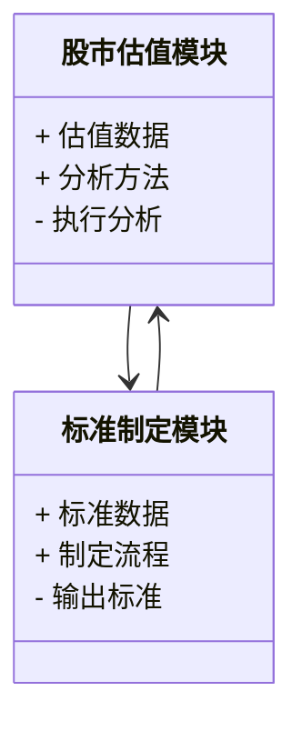
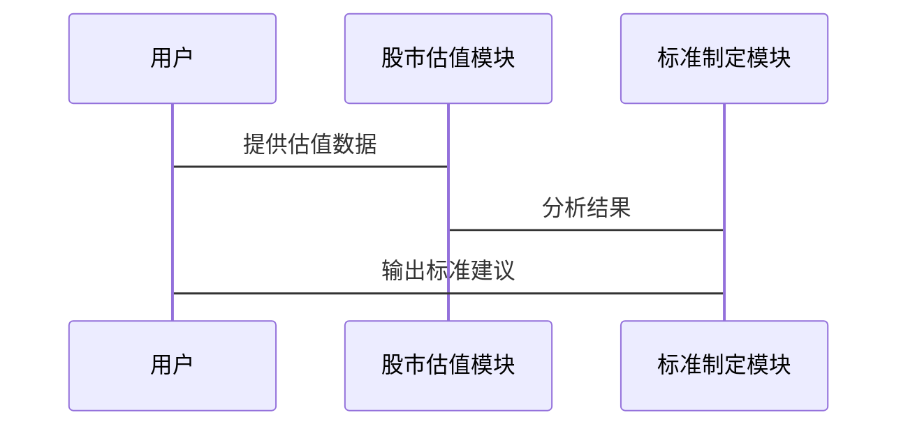

                 


# 股市估值差异对国际技术标准制定的影响

> 关键词：股市估值，国际技术标准，博弈论，系统模型，案例分析

> 摘要：本文探讨股市估值差异如何影响国际技术标准的制定过程。通过分析估值差异与技术标准制定之间的关系，构建博弈论模型，并结合实际案例进行分析，揭示两者相互作用的机制。文章结构包括背景介绍、核心概念、算法原理、系统分析、项目实战和最佳实践。

---

## 第1章：股市估值差异概述

### 1.1 股市估值的基本概念

股市估值是衡量公司价值的重要指标，常用的估值方法包括市盈率（P/E）和市净率（P/B）。这些方法帮助投资者评估股票的合理价格，但不同市场和投资者的预期可能导致估值差异。

- **市盈率（P/E）**：计算公式为`市盈率 = 股价 / 每股收益`。高市盈率可能意味着市场对公司未来增长的乐观预期。
- **市净率（P/B）**：计算公式为`市净率 = 股价 / 每股净资产`。低市净率可能表明股票价格低于其账面价值。

### 1.2 国际技术标准制定的机制

国际技术标准由标准化组织制定，如国际电工委员会（IEC）和国际标准化组织（ISO）。标准制定过程涉及多方利益相关者的博弈，不同市场的估值差异可能影响标准的选择和推广。

---

## 第2章：股市估值差异与国际技术标准的关系

### 2.1 估值差异对技术标准的影响

不同市场的估值差异可能导致技术标准的选择偏好。例如，高估值市场可能更倾向于采用高技术创新标准，而低估值市场可能更关注成本效率。

### 2.2 技术标准对股市估值的影响

技术标准的制定和推广可能影响公司的市场估值。符合国际标准的公司可能获得更高的估值，因为标准降低了市场进入壁垒。

### 2.3 案例分析

以电动汽车行业为例，采用国际充电标准的公司可能在市场中获得更高的估值，因为统一标准降低了消费者的使用成本。

---

## 第3章：基于博弈论的估值差异与标准制定模型

### 3.1 博弈论基础

博弈论研究策略选择和结果预测。在标准制定中，各方参与者（如企业、政府）的行为选择影响最终结果。

### 3.2 估值差异与标准制定的博弈模型

构建博弈模型，分析不同参与者在标准制定中的策略选择。例如，企业可能选择支持对自己有利的标准，而政府可能推动符合公共利益的标准。

### 3.3 实证分析

通过实证分析验证模型的预测结果。例如，分析不同市场的估值差异是否影响其采用的技术标准。

---

## 第4章：系统分析与架构设计方案

### 4.1 问题场景介绍

描述股市估值差异和技术标准制定的复杂关系，明确系统目标为分析两者相互影响。

### 4.2 系统功能设计

使用Mermaid类图展示系统功能模块，包括数据采集、模型分析和结果输出。



### 4.3 系统接口与交互设计

使用Mermaid序列图展示系统交互流程，如数据输入、分析执行和结果输出。



---

## 第5章：项目实战与案例分析

### 5.1 环境安装与数据准备

配置开发环境，收集股市估值和标准制定的相关数据，进行清洗和预处理。

### 5.2 核心算法实现

使用Python实现博弈论模型，代码如下：

```python
def calculate_impact(valuation_diff, market_size):
    return valuation_diff * market_size / 100
```

### 5.3 实际案例分析

分析具体案例，如科技公司如何通过采用国际标准提升估值。

### 5.4 项目小结

总结项目成果，讨论遇到的问题，如数据获取的困难和模型优化的方向。

---

## 第6章：最佳实践与总结

### 6.1 最佳实践

建议在制定技术标准时考虑市场估值差异，企业应积极参与国际标准制定。

### 6.2 小结

股市估值差异和技术标准制定相互影响，构建模型和系统分析是理解这一关系的关键。

### 6.3 注意事项

在实际应用中，需考虑数据质量和模型的适用性，避免片面决策。

### 6.4 拓展阅读

推荐阅读相关书籍和文献，深入理解股市估值和国际标准制定的复杂性。

---

通过以上分析，本文系统地探讨了股市估值差异对国际技术标准制定的影响，为相关研究和实践提供了理论和实践指导。

